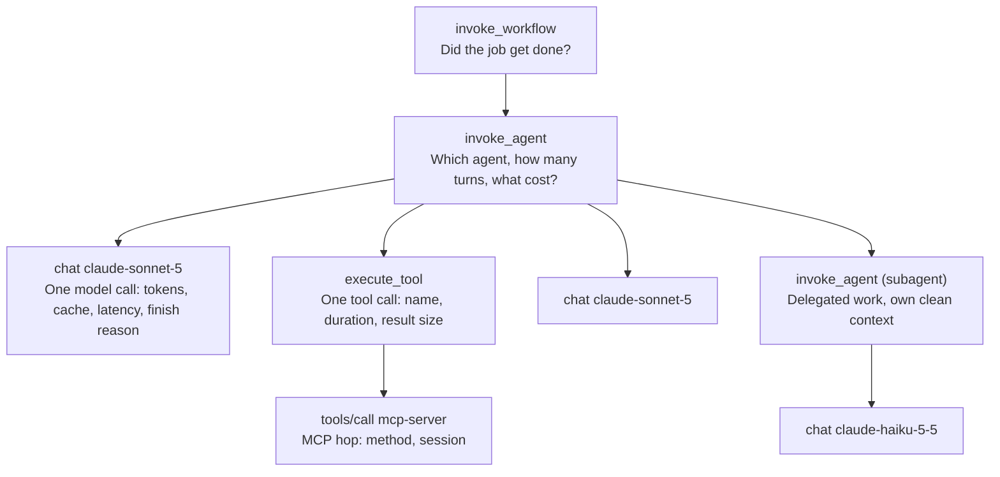

<LevelBadge level="advanced" />

The first time an agent does something inexplicable in production, you will try to reproduce it. You will re-run the same prompt against the same tools and get a different, perfectly reasonable answer — and the bug will be gone, un-fixed, waiting.

That moment is the whole argument for this page. A traditional service is deterministic enough that logs are a convenience: given the inputs, you can re-derive the behavior. An agent run is a **non-deterministic distributed trace** — sampled token by token, branching on tool results that have since changed, spread across your process, the model provider, and however many MCP servers. You cannot re-derive it. Either you recorded it, or it is gone.

So agent observability is not "add a dashboard later." It is the thing that decides whether your incidents are debuggable at all. The good news is that in 2026 there is finally a shared vocabulary for it. The bad news — and the reason most teams' first attempt has to be rebuilt — is that the vocabulary is **not stable yet**, and almost nobody tells you that before you wire 40 panels to attribute names that are explicitly allowed to change.

<Callout type="objectives" items={[
  "Know the four span types an agent run should produce, and what goes on each one",
  "Understand why every gen_ai.* attribute still carries OpenTelemetry's 'Development' badge — and how to build dashboards that survive it",
  "Turn on Claude Code's OpenTelemetry export with the exact variable names, and read the metrics and events it emits",
  "Capture the request-id that is the only identifier Anthropic support can look up",
  "Avoid the three privacy traps: identity is not redacted, content gating is per-signal, and your collector endpoint is an exfiltration path",
  "Choose a cardinality budget before your metrics bill arrives"
]} />

## Why re-running it is not debugging

Four properties of an agent run each break a normal debugging reflex:

| Property | The reflex it breaks |
| --- | --- |
| **Sampling is stochastic** | "Run it again with the same input." The same input is not the same run. |
| **Tool results are live** | Even at temperature 0, a tool reading a database, a clock, or the web returns something new. The trajectory diverges at step 2. |
| **The decision is in the context, not the code** | Your stack trace shows `callModel()`. It does not show the 180 KB of accumulated history that made the model pick the wrong tool. |
| **Failure is often silent** | A broken agent rarely throws. It returns a confident wrong answer with HTTP 200. There is no exception to catch. |

The last one deserves emphasis because it inverts normal instrumentation priorities. In a typical service you instrument errors first. In an agent, **the interesting failures are successes** — turns that completed, cost money, and did the wrong thing. If you only record spans that ended in `error.type`, you have recorded the easy half of your problems.

## The four spans of an agent run

OpenTelemetry's GenAI semantic conventions define the shapes. The useful mental model is four nested levels, each answering a different question.

The naming rules are specified, and following them is what makes your traces readable in a tool you did not write:

- **Inference span** — `gen_ai.operation.name` is `chat` (or `embeddings`, `text_completion`, `generate_content`); span name is `{gen_ai.operation.name} {gen_ai.request.model}`, so `chat claude-sonnet-5`. Span kind `CLIENT`.
- **Agent spans** — `create_agent {gen_ai.agent.name}` and `invoke_agent {gen_ai.agent.name}`, falling back to bare `invoke_agent` when the name is not available. There is both a client and an internal variant, which is how a hosted agent and your own loop end up distinguishable.
- **Workflow span** — `invoke_workflow {gen_ai.workflow.name}`, for the multi-agent orchestration above the agents.
- **Tool span** — `execute_tool`, for the actual tool execution.
- **MCP spans** — a separate convention: span name `{mcp.method.name} {target}` (or just `{mcp.method.name}` when there is no low-cardinality target), with `mcp.method.name` required and `mcp.session.id` recommended. Setting `gen_ai.operation.name` on an MCP tool-call span as well is explicitly recommended, so consumers can treat MCP tool calls like any other tool call.

The per-call attributes worth the bytes: `gen_ai.provider.name`, `gen_ai.request.model`, `gen_ai.response.model` (these two differ when the provider pins a snapshot), `gen_ai.usage.input_tokens`, `gen_ai.usage.output_tokens`, `gen_ai.usage.cache_read.input_tokens`, `gen_ai.usage.cache_write.input_tokens`, `gen_ai.usage.reasoning.output_tokens`, `gen_ai.response.finish_reasons`, and for streaming, `gen_ai.response.time_to_first_chunk`.

For Anthropic specifically there is a provider convention that overrides the generic one: `gen_ai.provider.name` MUST be `"anthropic"`, and it SHOULD be set **at span creation time** rather than patched on at the end. That detail matters more than it looks — tail-based sampling and provider-scoped routing rules can only act on attributes that exist when the span starts.

<VerifyNote lastVerified="2026-10-09" source="https://github.com/open-telemetry/semantic-conventions-genai">
Span names, operation names, and attribute names above are from the OpenTelemetry GenAI semantic conventions repository (`docs/gen-ai/gen-ai-spans.md`, `gen-ai-agent-spans.md`, `anthropic.md`, `mcp.md`). Every document in it is marked **Status: Development**. Re-check before relying on any specific name.
</VerifyNote>

## The part nobody warns you about: the conventions are not stable

Here is the fact that should shape your design, and that you will not find on a vendor's observability landing page.

**Every single `gen_ai.*` attribute, span, metric, and event is marked "Development"** — OpenTelemetry's term for what used to be called experimental. Not one is Stable. And in 2026 the conventions physically moved: the GenAI material left the main `open-telemetry/semantic-conventions` repository for a dedicated `open-telemetry/semantic-conventions-genai` repository, which **has no tagged release at all** — zero tags, zero releases, with commits landing daily.

Read the attribute tables in that repo and the asymmetry is almost funny. On a GenAI inference span, the attributes carrying a green **Stable** badge are `error.type`, `server.address`, and `server.port` — the three that have nothing to do with GenAI. Everything that makes the span *about an LLM* is Development.

So: do not read this as "don't use the conventions." Use them — a shared vocabulary that might change still beats a bespoke one that definitely won't travel. Read it as **don't couple anything expensive directly to those names.** Three habits make that cheap:

<Steps items={[
  {
    "title": "Emit via a mapping layer, not inline string literals",
    "body": "One module that owns every attribute key your app writes. When `gen_ai.usage.reasoning.output_tokens` gets renamed, you change one constant, not 60 call sites. This is a twenty-line file and it is the single highest-return thing on this page."
  },
  {
    "title": "Record the convention version as a resource attribute",
    "body": "Stamp every span with the semconv revision you emitted against — a commit SHA works, since there are no tags to cite. Six months from now, the only way to interpret an old trace correctly is to know which spelling it used. Without this, a rename silently splits one metric into two and you average across both."
  },
  {
    "title": "Alert on derived values, not raw attribute names",
    "body": "Define `cost_per_completed_task`, `cache_hit_ratio`, `tool_error_rate` once, in the query layer or a recording rule, and point every dashboard and alert at those. A rename then breaks one definition loudly instead of forty panels quietly."
  },
  {
    "title": "Keep the provider's own identifier alongside the standard ones",
    "body": "The conventions may churn; `request-id` will not. See the next section — this is your escape hatch when a trace needs to be reconciled against the provider."
  }
]} />

## The identifier that actually resolves incidents: `request-id`

Every Claude API response carries a `request-id` response header, with a value like `req_018EeWyXxfu5pfWkrYcMdjWG`. The same value appears as the `request_id` field in error response bodies. It is the identifier Anthropic support asks for, and the only one that lets someone on the other side look at your specific call.

Put it on the span. It costs 30 bytes and it is the difference between "the agent failed at 03:12 UTC, here are 900 candidate requests" and one lookup.

<PromptCard title="Capture the Anthropic request ID onto the current span (Python)">
{`import anthropic
from opentelemetry import trace

client = anthropic.Anthropic()
span = trace.get_current_span()

message = client.messages.create(
    model="claude-sonnet-5",
    max_tokens=1024,
    messages=[{"role": "user", "content": "Hello, Claude"}],
)

# The Python and TypeScript SDKs expose it directly on the response object.
span.set_attribute("anthropic.request_id", message._request_id)
span.set_attribute("gen_ai.usage.input_tokens", message.usage.input_tokens)
span.set_attribute("gen_ai.usage.output_tokens", message.usage.output_tokens)`}
</PromptCard>

Three wrinkles worth knowing before you need them:

- **Python and TypeScript** expose it as `_request_id` on top-level response objects. **C#, Go, Java, and PHP** expose it through their raw-response accessors (`with_raw_response` / `.withResponse()` / `.withRawResponse()` / `WithRawResponse` / `option.WithResponseInto` / `->raw`). **Ruby** needs per-request middleware, because the SDK does not surface it on the object.
- **Errors still carry it.** When a call fails, `request_id` is in the JSON error body — so the correlation survives exactly the case you most need it for.
- **On Claude Platform on AWS there are two IDs, and the primary one is not Anthropic's.** `x-amzn-requestid` is the primary ID and the one indexed in CloudTrail; `request-id` is secondary. Use the AWS one for CloudTrail lookups and the Anthropic one for Anthropic support tickets. Record both, labeled, or you will spend an afternoon searching the wrong system.

<VerifyNote lastVerified="2026-10-09" source="https://platform.claude.com/docs/en/api/errors">
The `request-id` header, the `request_id` error-body field, the per-SDK accessors, and the dual-ID behavior on Claude Platform on AWS are all documented on the Claude API errors page. Header and field names are stable API surface; the per-SDK ergonomics change with SDK versions.
</VerifyNote>

## Claude Code: the one agent that already exports everything

If your agent *is* Claude Code — running in CI, in a fleet, or across a team — you do not have to instrument anything. It ships an OpenTelemetry exporter. Most teams running it at scale have never turned this on, which is a shame, because it answers "what is this costing us and is it working" directly.

<PromptCard title="Enable Claude Code telemetry against a local OTLP collector">
{`export CLAUDE_CODE_ENABLE_TELEMETRY=1
export OTEL_METRICS_EXPORTER=otlp
export OTEL_LOGS_EXPORTER=otlp
export OTEL_EXPORTER_OTLP_PROTOCOL=grpc
export OTEL_EXPORTER_OTLP_ENDPOINT=http://localhost:4317
export OTEL_EXPORTER_OTLP_HEADERS="Authorization=Bearer your-token"
claude`}
</PromptCard>

`CLAUDE_CODE_ENABLE_TELEMETRY=1` is the master switch — without it, nothing is exported no matter what else you set. Then pick exporters per signal: `OTEL_METRICS_EXPORTER` accepts `otlp`, `prometheus`, `console`, or `none`; `OTEL_LOGS_EXPORTER` accepts `otlp`, `console`, `none`. **Traces are separate and beta-gated**: set `CLAUDE_CODE_ENHANCED_TELEMETRY_BETA=1` as well, then `OTEL_TRACES_EXPORTER`. Export intervals default to 60,000 ms for metrics and 5,000 ms for logs.

The metrics are the part worth building a dashboard on, because the cost ones are attributed finely enough to answer real questions:

| Metric | What it answers |
| --- | --- |
| `claude_code.cost.usage` (USD) | Spend, attributable by model and by query source — main agent vs subagent vs auxiliary |
| `claude_code.token.usage` (tokens) | The same shape in tokens, which is what you actually optimize |
| `claude_code.session.count` | Adoption. Flat sessions with rising cost is a different story from both rising. |
| `claude_code.active_time.total` (s) | Engaged time, as opposed to a terminal left open |
| `claude_code.lines_of_code.count` | Volume of change — a denominator, never a goal |
| `claude_code.code_edit_tool.decision` | **The quality signal.** Accept/reject on edit tools. Rising rejections mean the agent is proposing worse work. |
| `claude_code.commit.count`, `claude_code.pull_request.count` | Output that actually left the machine |

The events (exported as logs) are the per-action record: `claude_code.user_prompt`, `claude_code.assistant_response`, `claude_code.tool_result`, `claude_code.tool_decision`, `claude_code.api_request`, `claude_code.api_error`, `claude_code.api_refusal`, `claude_code.api_retries_exhausted`, `claude_code.permission_mode_changed`, `claude_code.mcp_server_connection`, `claude_code.skill_activated`, `claude_code.plugin_installed`, `claude_code.plugin_loaded`, `claude_code.at_mention`, `claude_code.auth`, `claude_code.hook_registered`, `claude_code.managed_settings_resolved`, `claude_code.internal_error`, plus `claude_code.api_request_body` / `claude_code.api_response_body` for raw payloads.

Two of those deserve a saved query on day one. `claude_code.api_retries_exhausted` is the shape of an outage reaching your developers — it fires after the SDK's backoff gave up. And `claude_code.permission_mode_changed` is an audit trail: it is how you find out that the fleet has been running in a looser mode than your policy says, without reading anyone's transcript.

<VerifyNote lastVerified="2026-10-09" source="https://code.claude.com/docs/en/monitoring-usage">
Variable names, exporter options, metric names, event names, and the beta gate on traces are from the Claude Code monitoring docs. Claude Code ships frequently and this surface grows — confirm names against the official page before building alerts on them.
</VerifyNote>

### Multi-team attribution, cheaply

One variable does the work of a whole tagging strategy. `OTEL_RESOURCE_ATTRIBUTES` is exported as metric labels (controlled by `OTEL_METRICS_INCLUDE_RESOURCE_ATTRIBUTES`, default on), so cost-center attribution is a one-liner in whatever provisions your developer environments:

<PromptCard title="Attribute agent spend to a team and cost center">
{`export OTEL_RESOURCE_ATTRIBUTES="department=engineering,team.id=platform,cost_center=eng-123"`}
</PromptCard>

## The three privacy traps

This is where well-intentioned telemetry rollouts go wrong, and all three are avoidable if you know about them before the collector is live.

**1. Content is redacted by default. Identity is not.** Claude Code's defaults are genuinely conservative about *content*: prompts, assistant responses, tool parameters and tool output are all redacted unless you opt in per signal (`OTEL_LOG_USER_PROMPTS`, `OTEL_LOG_ASSISTANT_RESPONSES`, `OTEL_LOG_TOOL_DETAILS`, `OTEL_LOG_TOOL_CONTENT`, `OTEL_LOG_RAW_API_BODIES`), and third-party plugin names show as a `"third-party"` placeholder until `OTEL_LOG_TOOL_DETAILS=1`. But `user.email` — the real address from sign-in, or from a cloud session's own credentials — is included when available, and `organization.id` is always present when authenticated. So the default posture is *"we don't know what they typed, we do know exactly who they are."*

That is the right default for most enterprises and the wrong one for some. Worth distinguishing from its neighbor: `user.id` is a random anonymous identifier generated on first run and persisted in `~/.claude.json` — it is documented as containing no personal information and as not being derived from your Claude account. `user.account_uuid` and `user.account_id` are the account-linked ones, and they are opt-out via `OTEL_METRICS_INCLUDE_ACCOUNT_UUID`. Decide deliberately which of those three your collector should hold, and tell your developers which one it is.

**2. Turning on content capture moves your secrets into a second system.** `OTEL_LOG_TOOL_CONTENT=1` is a reasonable thing to want — tool output is where most agent bugs are visible. It also means every file your agent read, every command output, and anything a `.env` happened to contain is now in your observability backend, under its retention policy and its access controls rather than your repo's. Treat enabling it as granting your observability vendor the same clearance as your source control, because that is what it is. If you only need it during an incident, enable it for the incident.

**3. Your collector endpoint is an exfiltration channel.** This is the trap with teeth. Telemetry is configured by environment variables, and in cloud environments those are readable by all users — so a developer-set `OTEL_EXPORTER_OTLP_ENDPOINT` can point a whole session's telemetry at a host you have never heard of. The docs' own guidance is the fix: put credentials and endpoints in server-managed settings rather than ambient environment variables, where managed credentials can remove developer-set variables precisely to prevent export to unauthorized collectors. If you have enabled any content capture, this stops being a hygiene item and becomes the control that matters.

For rotating credentials there is a dynamic-headers hook rather than a static token: point `otelHeadersHelper` at a script that prints JSON, and it runs at startup and roughly every 29 minutes thereafter (tunable via `CLAUDE_CODE_OTEL_HEADERS_HELPER_DEBOUNCE_MS`). It works on `http/protobuf` and `http/json`, not on `grpc` — a detail that will otherwise cost you an hour, since the quickstart uses grpc.

## Cardinality: pick a budget before the bill

Agent telemetry is unusually good at generating high-cardinality labels, because the natural identifiers are per-run. A session ID is unique per session by definition; attach it to a metric and you have manufactured one time series per session.

Claude Code exposes the trade-off explicitly rather than hiding it, and the defaults tell you how the designers weigh it:

| Variable | Default | Adds |
| --- | --- | --- |
| `OTEL_METRICS_INCLUDE_SESSION_ID` | `true` | `session.id`, `ccr.session.id` — **highest cardinality of the set** |
| `OTEL_METRICS_INCLUDE_ACCOUNT_UUID` | `true` | `user.account_uuid`, `user.account_id` |
| `OTEL_METRICS_INCLUDE_RESOURCE_ATTRIBUTES` | `true` | whatever you put in `OTEL_RESOURCE_ATTRIBUTES` |
| `OTEL_METRICS_INCLUDE_VERSION` | `false` | `app.version` |
| `OTEL_METRICS_INCLUDE_ENTRYPOINT` | `false` | `app.entrypoint` |
| `OTEL_METRICS_INCLUDE_REPOSITORY` | `false` | `vcs.*` repository attributes |

The portable rule, beyond Claude Code: **per-run identifiers belong on spans and events, not on metric labels.** Spans are already one-per-run, so a session ID there is free and makes the trace joinable. On a counter or histogram it multiplies your series count by your traffic. If a number is only meaningful for one run, it is not a metric.

Session ID defaults to on because joining metrics to traces is genuinely useful. If your backend bills per series, that is the first switch to flip — and the first thing to check when the invoice surprises you.

## A starting instrumentation plan

Not a maturity model. The order below is chosen so each step is useful on its own, and so you stop at whatever point matches how much your agents can cost you.

<Steps items={[
  {
    "title": "Record every turn's token counts, cache split, model, and request-id",
    "body": "Before any dashboard. Input, output, cache read, cache write, reasoning tokens, requested model, responded model, and the provider request ID. This single record answers most cost questions and makes every incident reconcilable with the provider. If you do nothing else on this page, do this."
  },
  {
    "title": "Span the loop, not just the call",
    "body": "One span per agent invocation wrapping one span per model call and one per tool call. The expensive agent bug is almost never inside a single call — it is a loop that took eleven turns to do a two-turn job, and you cannot see that without the parent span."
  },
  {
    "title": "Add one quality signal per surface",
    "body": "Cost without a quality denominator optimizes toward doing less. On Claude Code, claude_code.code_edit_tool.decision is handed to you. On your own agent, pick whatever your users already implicitly accept or reject and record it as a span attribute from day one."
  },
  {
    "title": "Alert on derived ratios, and put the budget alert first",
    "body": "cost_per_completed_task, cache_hit_ratio, tool_error_rate, turns_per_task. An agent that silently went from 3 turns to 30 is invisible on absolute cost during a slow week and obvious on a ratio. Pair this with a real spend cap — telemetry tells you it happened, it never stops it."
  },
  {
    "title": "Decide content capture deliberately, and write the decision down",
    "body": "Default off, on for incidents, documented either way — including which identity attributes your collector holds. The team deserves to know; a year from now, so will you."
  }
]} />

## Common mistakes

- **Instrumenting the model call and not the loop.** The call-level data looks fine right up until you notice you are paying for 30 turns. Without a parent span there is no `turns_per_task` to notice it with.
- **Only keeping failed spans.** Agents fail with HTTP 200. Sample successes too, or your trace store contains only the bugs that were already easy.
- **Hard-coding `gen_ai.*` names into dashboards.** They are all Development, in a repo with no tagged release, with commits landing daily. One mapping module, one semconv-version resource attribute.
- **Putting session or run IDs on metric labels.** One series per run. Put them on spans, where they are free and more useful.
- **Measuring cost with no quality signal.** Every lever that reduces cost also reduces work done. A ratio is a target; a raw cost number is a trap.
- **Discarding `request-id`.** It is 30 bytes and it is the only identifier that crosses the boundary into the provider's systems.
- **Logging tool content "for now."** The retention is immediate and real, and "for now" has no end date. Decide, enable for the incident, disable after.
- **Assuming the quickstart's transport supports everything.** Dynamic auth headers work on `http/protobuf` and `http/json` — not on the `grpc` the quickstart hands you.
- **Treating cost telemetry as a control.** `claude_code.cost.usage` increments *after* each request completes. It is an excellent observation and it has never blocked anything.

## Cross-provider reality check

The conventions are provider-neutral by design — `semantic-conventions-genai` carries dedicated documents for Anthropic, OpenAI, AWS Bedrock, and Azure AI Inference alongside the generic ones, which is what makes a mixed fleet tractable at all. Two things remain yours to normalize:

**Token accounting does not mean the same thing everywhere.** Cached input, reasoning tokens, and multimodal tokens are priced and sometimes counted differently per provider, so `gen_ai.usage.input_tokens` summed across providers is a number without a meaning. Convert to money at the edge, using each provider's own rate, and aggregate the money. Cost is the only unit that is actually comparable.

**The provider's own request identifier has no standard attribute.** Each provider has one, each calls it something different, and the conventions do not mandate where it lands. Pick one key — `provider.request_id` is as good as any — and write every provider's into it, with `gen_ai.provider.name` already on the span to disambiguate.

<Quiz questions={[
  {
    "q": "Why is 'reproduce it locally' not a viable debugging strategy for an agent run?",
    "options": [
      "Local machines are too slow to run frontier models",
      "Sampling is stochastic and tool results are live, so the trajectory diverges within a couple of steps even at temperature 0",
      "Agent frameworks encrypt their traces",
      "The provider refuses repeated identical requests"
    ],
    "answer": 1,
    "explain": "An agent run is a non-deterministic distributed trace. Sampling varies, and tools reading a database, a clock, or the web return something new, so the trajectory diverges early. The run cannot be re-derived from its inputs — either it was recorded or it is gone."
  },
  {
    "q": "On a GenAI inference span, which attributes carry OpenTelemetry's 'Stable' badge?",
    "options": [
      "gen_ai.request.model and gen_ai.usage.input_tokens",
      "gen_ai.provider.name only",
      "error.type, server.address and server.port — the generic ones that aren't GenAI-specific",
      "All of them, since semconv v1.42.0"
    ],
    "answer": 2,
    "explain": "Every gen_ai.* attribute, span, metric and event is marked Development. The Stable badges on a GenAI span belong to the generic attributes — error.type, server.address, server.port. That is the asymmetry to design around: route expensive dashboards through a mapping layer and derived metrics rather than raw gen_ai.* names."
  },
  {
    "q": "You enable Claude Code telemetry with the documented defaults. What does your collector hold?",
    "options": [
      "Full prompts and tool output, but no identity",
      "Nothing until you also set CLAUDE_CODE_ENHANCED_TELEMETRY_BETA=1",
      "Metrics and events with user.email and organization.id, but prompts, responses and tool content redacted",
      "Only aggregate counts with no attributes at all"
    ],
    "answer": 2,
    "explain": "Content is redacted by default — prompts, responses, tool details and tool content each need their own opt-in variable. Identity is not: user.email is included when available and organization.id is always present when authenticated. The beta gate applies to traces specifically, not to metrics and events."
  },
  {
    "q": "Where does a per-session identifier belong?",
    "options": [
      "On metric labels, so you can group spend by session",
      "On spans and events, never on metric labels",
      "Nowhere — it is always personal data",
      "Only in the raw API request body logs"
    ],
    "answer": 1,
    "explain": "A span already represents one run, so a session ID there costs nothing and makes the trace joinable. On a counter or histogram it creates one time series per session and multiplies your series count by your traffic. Claude Code defaults OTEL_METRICS_INCLUDE_SESSION_ID to true because the join is useful — it is the first switch to flip if your backend bills per series."
  }
]} />

<Flashcards cards={[
  { "front": "Why agent runs need recording, not reproduction", "back": "Stochastic sampling + live tool results + the decision living in accumulated context + silent HTTP 200 failures. The trajectory diverges within steps, so the run cannot be re-derived from its inputs." },
  { "front": "GenAI inference span name", "back": "{gen_ai.operation.name} {gen_ai.request.model} — e.g. 'chat claude-sonnet-5'. Span kind CLIENT. Operation names include chat, embeddings, text_completion, generate_content." },
  { "front": "Agent and workflow span names", "back": "create_agent {gen_ai.agent.name} · invoke_agent {gen_ai.agent.name} (bare 'invoke_agent' if no name; client and internal variants exist) · invoke_workflow {gen_ai.workflow.name} · execute_tool for tool execution." },
  { "front": "MCP span convention", "back": "Span name {mcp.method.name} {target}, or just {mcp.method.name} with no low-cardinality target. mcp.method.name Required, mcp.session.id Recommended. Also setting gen_ai.operation.name is recommended so MCP tool calls group with other tool calls." },
  { "front": "Anthropic provider convention", "back": "gen_ai.provider.name MUST be \"anthropic\" and SHOULD be set at span creation time — not patched on at the end, so sampling and routing rules can act on it." },
  { "front": "Stability status of gen_ai.* (Oct 2026)", "back": "All Development, none Stable. The conventions moved to open-telemetry/semantic-conventions-genai, which has zero tags and zero releases while taking daily commits. Only error.type, server.address and server.port are Stable on a GenAI span." },
  { "front": "Surviving unstable conventions", "back": "1) One mapping module owns every attribute key. 2) Stamp each span with the semconv commit you emitted against. 3) Alert on derived ratios, not raw names. 4) Keep the provider's own request ID alongside." },
  { "front": "Anthropic request-id", "back": "request-id response header (e.g. req_018EeWyXxfu5pfWkrYcMdjWG); same value as request_id in error bodies. _request_id on Python/TS response objects; raw-response accessors elsewhere; middleware in Ruby. The only ID Anthropic support can look up." },
  { "front": "Claude Platform on AWS — two request IDs", "back": "x-amzn-requestid is primary and indexed in CloudTrail; Anthropic's request-id is secondary. AWS ID for CloudTrail lookups, Anthropic ID for Anthropic support. Record both, labeled." },
  { "front": "Claude Code telemetry master switch", "back": "CLAUDE_CODE_ENABLE_TELEMETRY=1, then OTEL_METRICS_EXPORTER (otlp/prometheus/console/none) and OTEL_LOGS_EXPORTER (otlp/console/none). Traces need CLAUDE_CODE_ENHANCED_TELEMETRY_BETA=1 as well, then OTEL_TRACES_EXPORTER." },
  { "front": "Claude Code's quality metric", "back": "claude_code.code_edit_tool.decision — accept/reject on edit tools. The one metric that gives cost a denominator: rising rejections mean the agent is proposing worse work even if spend is flat." },
  { "front": "Two Claude Code events to query on day one", "back": "claude_code.api_retries_exhausted (an outage reaching your developers, after backoff gave up) and claude_code.permission_mode_changed (audit trail for a fleet running looser than policy, without reading transcripts)." },
  { "front": "Content vs identity defaults", "back": "Content redacted by default (OTEL_LOG_USER_PROMPTS / _ASSISTANT_RESPONSES / _TOOL_DETAILS / _TOOL_CONTENT / _RAW_API_BODIES each opt in). Identity is not: user.email when available, organization.id always when authenticated." },
  { "front": "user.id vs user.account_uuid in Claude Code", "back": "user.id is a random anonymous identifier generated on first run in ~/.claude.json — documented as containing no personal information and not derived from the account. user.account_uuid / user.account_id are account-linked and opt-out via OTEL_METRICS_INCLUDE_ACCOUNT_UUID." },
  { "front": "Telemetry config as an exfiltration channel", "back": "Env vars in cloud environments are readable by all users, so a developer-set OTEL_EXPORTER_OTLP_ENDPOINT can redirect a session's telemetry. Put endpoints and credentials in server-managed settings, where managed credentials remove developer-set variables." },
  { "front": "Dynamic OTel auth headers", "back": "otelHeadersHelper points at a script printing JSON; runs at startup and ~every 29 minutes (CLAUDE_CODE_OTEL_HEADERS_HELPER_DEBOUNCE_MS). Works on http/protobuf and http/json — NOT on grpc, which is what the quickstart uses." },
  { "front": "Cardinality rule for agents", "back": "Per-run identifiers go on spans and events, never on metric labels — a session ID on a counter means one time series per session. If a number is only meaningful for one run, it is not a metric." },
  { "front": "Why cross-provider token sums are meaningless", "back": "Cached input, reasoning tokens and multimodal tokens are counted and priced differently per provider. Convert to money at the edge using each provider's own rate, then aggregate the money — cost is the only comparable unit." }
]} />

<Callout type="takeaways" items={[
  "You cannot reproduce an agent run, so observability is not optional tooling — it is the only record that will exist.",
  "Record the interesting successes, not just the errors. Agents fail with HTTP 200 and a confident wrong answer.",
  "Every gen_ai.* name is 'Development', in a repo with no tagged release. Use the conventions; route dashboards through a mapping layer and derived metrics.",
  "Span the loop, not just the call. The expensive bug is eleven turns doing a two-turn job, and it is invisible at call level.",
  "Put request-id on every span. It is 30 bytes and the only identifier that crosses into the provider's systems.",
  "Claude Code already exports all of this — one env var. claude_code.code_edit_tool.decision is the quality denominator most teams lack.",
  "Content is redacted by default; identity is not. Know which of user.id, user.email and user.account_uuid your collector holds, and tell your team.",
  "Your OTLP endpoint is an exfiltration path. Manage it server-side, especially once any content capture is on.",
  "Per-run IDs on spans, never on metric labels. Cost telemetry observes; it has never blocked a single request."
]} />

## Next

- [Cache diagnostics](/docs/api/cache-diagnostics) — the per-request fields that explain *why* a cache read you were counting on did not happen
- [Hard spend caps](/docs/models/hard-spend-caps) — the enforcement layer this page only observes: which providers actually block the request
- [Evaluating agents](/docs/playbooks/evaluating-agents) — turning the quality signals you just started recording into a repeatable judgement

## Sources & further reading

- [OpenTelemetry GenAI semantic conventions](https://github.com/open-telemetry/semantic-conventions-genai) — the dedicated repository the GenAI conventions moved to: span and agent-span documents, provider documents for Anthropic / OpenAI / Bedrock / Azure, the MCP conventions, and the Development status badges on all of them
- [Generative AI semantic conventions — OpenTelemetry](https://opentelemetry.io/docs/specs/semconv/gen-ai/) — the relocation notice ("This page has moved and is no longer maintained in this repository")
- [Monitoring usage — Claude Code](https://code.claude.com/docs/en/monitoring-usage) — the telemetry variables, exporters, metric and event names, content-gating and cardinality switches, dynamic headers, and the server-managed-settings guidance for credentials
- [Claude API errors — Anthropic](https://platform.claude.com/docs/en/api/errors) — the `request-id` header and `request_id` error field, the per-SDK accessors, and the dual request IDs on Claude Platform on AWS
- [Model Context Protocol specification](https://modelcontextprotocol.io/specification/2025-06-18/basic/transports) — session management, which `mcp.session.id` identifies
- Related: [Errors and rate limits](/docs/api/errors-and-rate-limits) · [Building agents](/docs/api/building-agents) · [MCP token cost](/docs/claude-code/mcp-token-cost) · [Long-running agent harnesses](/docs/frontiers/long-running-agent-harnesses) · [What your agent uploads](/docs/security/what-your-agent-uploads) · [AI gateways](/docs/models/ai-gateways-litellm-openrouter-portkey)
