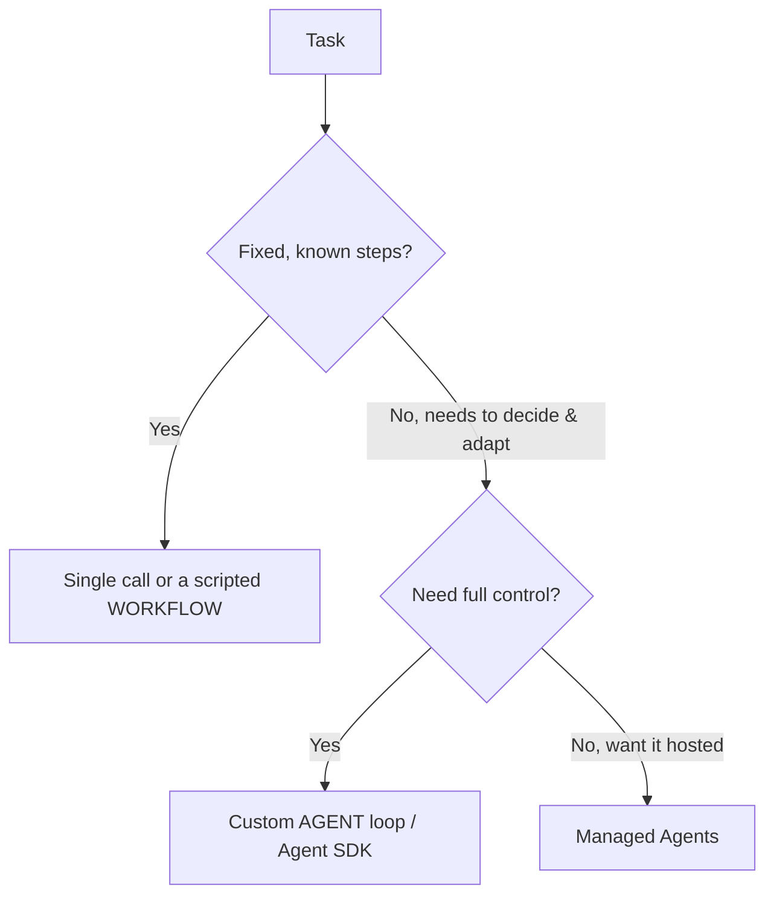

<LevelBadge level="advanced" />

<VerifyNote lastVerified="2026-06-20" source="https://docs.anthropic.com/en/docs/agents-and-tools">
Agent tooling (the Agent SDK, managed options) evolves quickly — confirm current options in the official docs.
</VerifyNote>

An **agent** is a model running in a loop: it pursues a goal by calling [tools](/docs/api/tool-use), observing results, and deciding the next step until done. Before you build one, pick the *simplest thing that works*.

## The decision test (don't over-build)

- **Single call** — one prompt answers it. Most tasks. Cheapest, most reliable.
- **Workflow** — you orchestrate a fixed sequence of calls in code (deterministic control flow). Use when steps are known.
- **Agent** — the model decides the steps dynamically. Use only when the path genuinely can't be hardcoded.

> Reach for an agent when adaptivity is the point — not because it sounds impressive. A workflow you control is easier to test and debug.

## Designing the loop

A minimal custom agent:

1. **System prompt**: the goal, constraints, and available tools.
2. **Loop**: send messages → if `tool_use`, run the tool, append `tool_result`, repeat → until a final answer or a stop condition.
3. **Guardrails**: a max-iterations cap, a token/cost budget, and validation of tool inputs.
4. **Context management**: summarize/trim as the history grows (same idea as [Context Management](/docs/claude-code/context-management)).

The **[Claude Agent SDK](/docs/claude-code/headless-and-agent-sdk)** gives you this loop — tools, permissions, context handling — batteries included, so you don't hand-roll it.

## Make it robust

- **Bound everything**: iterations, time, cost. Agents can loop.
- **Handle tool failures** gracefully (return the error as a result).
- **Least privilege + human-in-the-loop** for risky actions — see [Securing Agents](/docs/security/securing-agents).
- **Evaluate** it on real cases before trusting it — see [Evals](/docs/foundations/evals).

## Next

- [Tool Use](/docs/api/tool-use) · [Headless & Agent SDK](/docs/claude-code/headless-and-agent-sdk)
- [Managed Agents](/docs/api/managed-agents) · [Cowork & Agent Teams](/docs/api/cowork-and-agent-teams)
- [Securing Agents & Tools](/docs/security/securing-agents)
