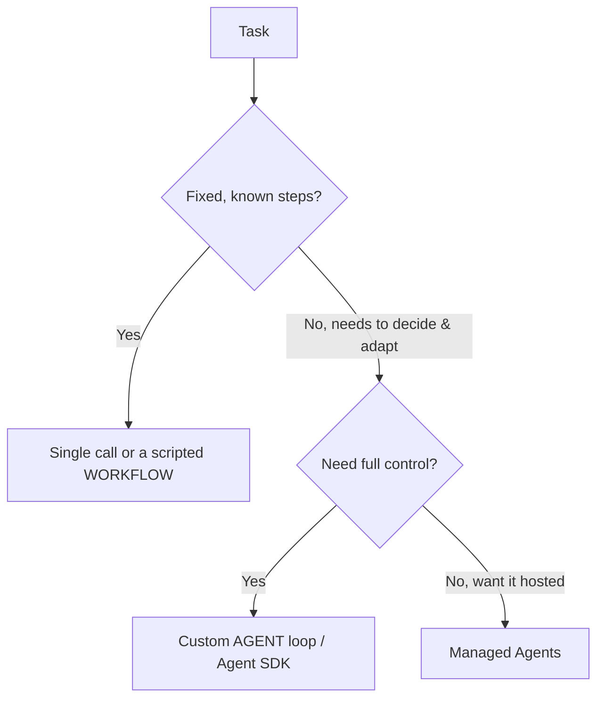

<LevelBadge level="advanced" />

<VerifyNote lastVerified="2026-06-20" source="https://platform.claude.com/docs/en/docs/agents-and-tools">
Agent tooling (the Agent SDK, managed options) evolves quickly — confirm current options in the official docs.
</VerifyNote>

<Callout type="objectives" items={["Define what an agent actually is: a model running in a loop", "Apply the decision test to choose single call vs workflow vs agent", "Design a minimal agent loop with the right guardrails", "Know when to reach for the Claude Agent SDK instead of hand-rolling", "Make an agent robust: bound it, handle failures, restrict privilege, evaluate it"]} />

An **agent** is a model running in a loop: it pursues a goal by calling [tools](/docs/api/tool-use), observing results, and deciding the next step until done. Before you build one, pick the *simplest thing that works*.

## The decision test (don't over-build)

Not every task needs an agent. Walk this tree first — most tasks stop at the top.

Three options, simplest first:

- **Single call** — one prompt answers it. Most tasks. Cheapest, most reliable.
- **Workflow** — you orchestrate a fixed sequence of calls in code (deterministic control flow). Use when steps are known.
- **Agent** — the model decides the steps dynamically. Use only when the path genuinely can't be hardcoded.

<Callout type="warning">
Reach for an agent when adaptivity is the point — not because it sounds impressive. A workflow you control is easier to test and debug.
</Callout>

## Designing the loop

A minimal custom agent is just four moving parts. Build them in this order:

<Steps items={[
  {title: "System prompt", body: "State the goal, the constraints, and the available tools. This is what the model reasons against on every turn."},
  {title: "The loop", body: "Send messages → if the response is a tool_use, run the tool, append a tool_result, and repeat → until a final answer or a stop condition."},
  {title: "Guardrails", body: "Add a max-iterations cap, a token/cost budget, and validation of tool inputs before anything runs."},
  {title: "Context management", body: "Summarize or trim as the history grows — the same idea covered in Context Management (/docs/claude-code/context-management)."}
]} />

The **[Claude Agent SDK](/docs/claude-code/headless-and-agent-sdk)** gives you this loop — tools, permissions, context handling — batteries included, so you don't hand-roll it.

<Callout type="tip">
Before writing your own loop, ask whether the Agent SDK already covers it. It ships the loop, permissions, and context handling so you can focus on the tools and the goal.
</Callout>

## Make it robust

A loop that can call tools can also misbehave. Four habits keep an agent trustworthy:

- **Bound everything**: iterations, time, cost. Agents can loop.
- **Handle tool failures** gracefully (return the error as a result).
- **Least privilege + human-in-the-loop** for risky actions — see [Securing Agents](/docs/security/securing-agents).
- **Evaluate** it on real cases before trusting it — see [Evals](/docs/foundations/evals).

<Callout type="takeaways" items={["An agent is a model in a loop calling tools toward a goal — use one only when the path can't be hardcoded", "Decision order: single call → workflow → agent → managed agents; prefer the simplest that works", "A minimal loop = system prompt + tool_use/tool_result loop + guardrails + context management", "The Claude Agent SDK ships the loop, tools, permissions, and context handling for you", "Robustness = bound iterations/time/cost, handle tool failures, least privilege + human-in-the-loop, and evaluate before trusting"]} />

## Check yourself

<Quiz title="Check yourself" questions={[
  {
    q: "What best describes an agent in this context?",
    options: [
      "A single prompt that returns a complete answer",
      "A model running in a loop, calling tools and deciding the next step until done",
      "A fixed sequence of API calls you orchestrate in code",
      "A hosted service that requires no configuration"
    ],
    answer: 1,
    explain: "An agent is a model running in a loop: it pursues a goal by calling tools, observing results, and deciding the next step until done."
  },
  {
    q: "The task has fixed, known steps. What should you reach for?",
    options: [
      "A custom agent loop, for maximum control",
      "Managed Agents, so it's hosted",
      "A single call or a scripted workflow",
      "A multi-agent team"
    ],
    answer: 2,
    explain: "When steps are fixed and known, a single call or a scripted workflow (deterministic control flow) is the right, simplest choice."
  },
  {
    q: "When is a custom agent actually justified?",
    options: [
      "Whenever it sounds more impressive than a workflow",
      "When adaptivity is the point and the path genuinely can't be hardcoded",
      "For every task that calls more than one tool",
      "Only when you cannot use the Agent SDK"
    ],
    answer: 1,
    explain: "Reach for an agent when adaptivity is the point — not because it sounds impressive. A workflow you control is easier to test and debug."
  },
  {
    q: "In the loop, what happens when the model responds with a tool_use?",
    options: [
      "You stop the loop and return the partial answer",
      "You run the tool, append a tool_result, and repeat",
      "You discard the message and re-send the system prompt",
      "You summarize the history immediately"
    ],
    answer: 1,
    explain: "The loop: send messages → if tool_use, run the tool, append tool_result, repeat → until a final answer or a stop condition."
  },
  {
    q: "Which is NOT one of the guardrails for making an agent robust?",
    options: [
      "A max-iterations cap and a token/cost budget",
      "Handling tool failures by returning the error as a result",
      "Granting the agent full privileges so it never gets blocked",
      "Least privilege plus human-in-the-loop for risky actions"
    ],
    answer: 2,
    explain: "Robust agents use least privilege plus human-in-the-loop for risky actions — the opposite of granting full privileges. You also bound iterations/time/cost, handle tool failures gracefully, and evaluate before trusting."
  }
]} />

## Next

- [Tool Use](/docs/api/tool-use) · [Headless & Agent SDK](/docs/claude-code/headless-and-agent-sdk)
- [Managed Agents](/docs/api/managed-agents) · [Cowork & Agent Teams](/docs/api/cowork-and-agent-teams)
- [Securing Agents & Tools](/docs/security/securing-agents)
