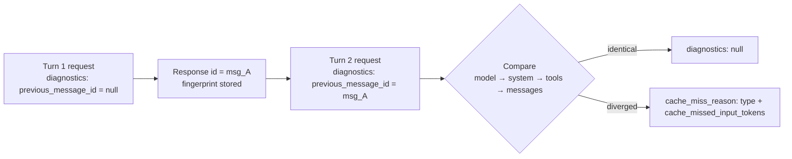

<LevelBadge level="advanced" />

<Callout type="objectives" items={[
  "Diagnose a prompt-cache miss from the API response instead of diffing prompt bytes by hand",
  "Wire the diagnostics object into a request and thread previous_message_id through a conversation loop",
  "Read all six cache_miss_reason types and apply the specific fix each one implies",
  "Tell a real bug apart from an expired cache entry by pairing diagnostics with usage",
  "Avoid the three ways this tool quietly misleads you: earliest-divergence-only, pending comparisons, and a token count that is not a billing number"
]} />

You set up [prompt caching](/docs/api/prompt-caching), shipped it, and `cache_read_input_tokens` is **zero**. Something in your prefix changed — but the response gives you no clue what. The traditional fix is grim: serialize two consecutive requests to disk, diff them byte by byte, and hunt for a timestamp somebody interpolated into a system prompt six months ago.

**Cache diagnostics replaces that.** Pass the `id` of your previous response, and the API compares the two requests and names the first place they diverged — the model, the system prompt, the tools, or the message history — plus an estimate of how much cacheable prefix you lost.

<VerifyNote lastVerified="2026-09-28" source="https://platform.claude.com/docs/en/build-with-claude/cache-diagnostics">
Cache diagnostics reached **general availability on the Claude API on September 23, 2026**; the `cache-diagnosis-2026-04-07` beta header is no longer required, and requests that still send it work as before. Availability, field names, and the `cache_miss_reason` union are all subject to change — confirm in the official cache diagnostics docs.
</VerifyNote>

## The mental model

The API keeps a small **fingerprint** of each request you opt in on, keyed by that request's response `id`. On your next request you hand back that `id`, the API rebuilds a fingerprint for the new request, compares the two, and reports the **first point of divergence**.



Three things about that diagram matter more than the field names:

1. **The object is the opt-in.** The API stores a fingerprint *only* for requests that include `diagnostics`. Leave it off one turn and the next turn's lookup fails.
2. **Comparison order is prefix order.** Model, then system, then tools, then messages — the same left-to-right order the cache itself is built in.
3. **It reports structure, not cache outcome.** Diagnostics answers *"did my request change?"* — a separate question from *"did the cache hit?"*. You need both readings to act. See [Pair it with usage](#pair-it-with-usage).

<Flashcards title="Cache diagnostics vocabulary" cards={[
  {front:"Fingerprint", back:"A lightweight record the API stores for any request that includes the diagnostics object. Cryptographic hashes and token-count estimates only — never raw prompt text. Keyed by the response id, scoped to your organization and workspace, expires after a short period."},
  {front:"previous_message_id", back:"The id of the response you want the current request compared against. Pass null on the first turn to opt in with nothing to compare yet."},
  {front:"cache_miss_reason", back:"A discriminated union on type. Names the first place the two requests diverged — or explains why no comparison was produced."},
  {front:"cache_missed_input_tokens", back:"Carried by the four *_changed types. An estimate of how many input tokens fell after the divergence point — i.e. how much cacheable prefix you lost."},
  {front:"Earliest divergence only", back:"The response names the first difference and stops. A later divergence can be hidden behind it, so debugging is a fix-and-re-measure loop, not a one-shot readout."}
]} />

## Instrument a conversation

<Steps items={[
  {title: "Add the diagnostics object to every turn", body: "Include diagnostics on each request, not just the one you are debugging. The API only stores a fingerprint for requests that carry the object, so a single turn without it breaks the chain and the next turn reports previous_message_not_found."},
  {title: "Pass null on the first turn", body: "On turn one there is nothing to compare against. Send previous_message_id as null — that opts in and registers the fingerprint. The response's diagnostics field will be null, which is expected, not a failure."},
  {title: "Carry the response id forward", body: "On every subsequent turn, set previous_message_id to the id from the previous response. In a loop this is one variable you reassign after each call."},
  {title: "Read diagnostics off the response", body: "On non-streaming calls it is a top-level diagnostics field on the Message. On streaming calls it arrives on the message_start event and is carried through to the accumulated final message."},
  {title: "Fix the reported cause, then measure again", body: "Only the earliest divergence is reported. After you fix it, re-run — a second cause may have been sitting behind the first one the whole time."}
]} />

The request shape is small. Everything else about the call is unchanged:

<PromptCard title="Turn 2 — compare against the previous response">{`curl https://api.anthropic.com/v1/messages \\
  -H "x-api-key: $ANTHROPIC_API_KEY" \\
  -H "anthropic-version: 2023-06-01" \\
  -H "content-type: application/json" \\
  -d '{
    "model": "claude-opus-5-5",
    "max_tokens": 1024,
    "cache_control": {"type": "ephemeral"},
    "system": "You are an AI assistant analyzing a large document. <document>...</document>",
    "messages": [
      {"role": "user", "content": "Summarize section 1."},
      {"role": "assistant", "content": "Section 1 covers..."},
      {"role": "user", "content": "Now summarize section 2."}
    ],
    "diagnostics": {"previous_message_id": "msg_01Xyz..."}
  }' | jq '{id, usage, diagnostics}'`}</PromptCard>

In a multi-turn loop it collapses to a single reassigned variable — `prev_id` starts as `None` and becomes `r.id` after each call:

```python
messages = []
prev_id = None

for turn, user_message in enumerate(prompts, start=1):
    messages.append({"role": "user", "content": user_message})

    r = client.beta.messages.create(
        model="claude-opus-5-5",
        max_tokens=1024,
        cache_control={"type": "ephemeral"},
        system=SYSTEM,
        messages=messages,
        diagnostics={"previous_message_id": prev_id},
    )

    if r.diagnostics is not None and r.diagnostics.cache_miss_reason is not None:
        print(f"Turn {turn} cache_miss_reason: {r.diagnostics.cache_miss_reason.type}")

    messages.append({"role": "assistant", "content": r.content})
    prev_id = r.id
```

## Read the response

The `diagnostics` field has **three** possible shapes, and conflating the first two is the most common misreading:

| Value | Meaning |
|---|---|
| `null` | Either you did not send the `diagnostics` object, or `previous_message_id` was `null` (first turn), **or** a comparison ran and found no divergence. |
| `cache_miss_reason` is `null` | The comparison was still running when the response was serialized — it can happen when a response starts very fast. Inconclusive; check the next turn. |
| `cache_miss_reason` is an object | A divergence point, or an explanation of why no comparison was produced. |

:::caution `null` is ambiguous on purpose
A `null` diagnostics field means "nothing to report" — which covers both *"your prefix is identical"* and *"you never opted in"*. If you are seeing `null` everywhere and expected a diagnosis, confirm you are actually sending the `diagnostics` object on **both** turns before concluding your prompt is stable.
:::

A populated miss looks like this:

```json
{
  "id": "msg_01Xyz...",
  "type": "message",
  "role": "assistant",
  "usage": {
    "input_tokens": 42,
    "cache_read_input_tokens": 0,
    "cache_creation_input_tokens": 41850,
    "output_tokens": 210
  },
  "diagnostics": {
    "cache_miss_reason": {
      "type": "system_changed",
      "cache_missed_input_tokens": 41850
    }
  }
}
```

## The six reasons, and what to actually change

Four types name a divergence point. Two mean no comparison happened at all — and reading those as "my prompt changed" will send you chasing a bug that does not exist.

| `type` | What diverged | The fix |
|---|---|---|
| `model_changed` | The `model` differs from the previous request. The cache is per-model, so a router, A/B test, or fallback that swapped models mid-conversation throws the whole prefix away. | Hold the model constant for the lifetime of a cached conversation. If you need fallback, treat each model as its own cache lineage. |
| `system_changed` | The `system` parameter differs — almost always a timestamp, request ID, session ID, or user name interpolated into an otherwise stable prompt. | Make the system prompt a byte-stable constant. Move every dynamic value into the first `user` message **after** your cache breakpoint. |
| `tools_changed` | The `tools` array differs: a tool was added, removed, or reordered — or `input_schema` JSON was serialized non-deterministically between turns. | Send the same tool list in a fixed order every turn, and serialize schemas deterministically (sort object keys). |
| `messages_changed` | Model, system and tools all match, but an earlier entry in `messages` was altered, reordered, or removed instead of appended to. Usually history truncation, or assistant turns and `tool_result` blocks re-serialized differently on resend. | Treat history as **append-only**. Echo assistant `content` and tool results back verbatim rather than reconstructing them. |
| `previous_message_not_found` | No stored fingerprint for that `previous_message_id`. **This is not evidence your request changed.** The previous request omitted the `diagnostics` object, ran in a different workspace, or was too long ago. | Send `diagnostics` on every turn, and keep consecutive turns close together in time. |
| `unavailable` | No diagnosis was produced. Covers two distinct cases: a prompt-affecting parameter *other than* model/system/tools differed, or the conversation is long enough that the divergence sits beyond the comparison horizon. | Hold `tool_choice`, `thinking`, `context_management`, `output_config`, `output_format` and your active `anthropic-beta` header set constant too — they all affect the prompt. |

:::tip `unavailable` is the one people misread
It does **not** mean "the feature is broken." Most often it means the four compared surfaces all matched and something else moved — the beta-header set is a favorite culprit, because it is usually set in shared client config far from the call site and nobody thinks of it as part of the prompt.
:::

## Pair it with usage

Diagnostics alone is half a reading. `usage.cache_read_input_tokens` is the other half, and the two together tell you whether you are looking at a bug or at physics.

| Diagnostics | Cache read tokens | What it actually means |
|---|---|---|
| `null` | High | Working as designed. Stable prefix, cache hit. Nothing to do. |
| `null` | Low or zero | **Not your bug.** The requests matched; the cache entry had simply expired. Shorten the gap between turns, or move to the [1-hour cache duration](https://platform.claude.com/docs/en/build-with-claude/prompt-caching#1-hour-cache-duration). |
| A `*_changed` type | Low or zero | **Your bug.** The request changed. Fix the cause the `type` names. |
| A `*_changed` type | High | Rare. Something changed late in the prompt but an earlier `cache_control` breakpoint still hit. Worth fixing, low impact. |

That second row is the one that earns the feature its keep. "Cache reads are zero" used to be indistinguishable from "we have a prefix bug," and teams burned days on the latter when the answer was the former. Read together, diagnostics separates *your* mistake from *the cache's* lifetime.

This matrix applies to turns where you passed a real `previous_message_id`. It does **not** apply on the first turn (`diagnostics` is always `null` and cache reads are normally zero because the cache is being written), nor when `cache_miss_reason` is `null`, `previous_message_not_found`, or `unavailable` — in all of those, no comparison was produced.

## Common mistakes

- **Instrumenting only the failing turn.** The fingerprint lives on the *previous* request. Adding `diagnostics` only to the turn you are debugging guarantees `previous_message_not_found`. Instrument the whole loop.
- **Treating `cache_missed_input_tokens` as a billing number.** It is derived from **byte lengths before tokenization**, so it is a magnitude indicator — "you lost roughly 40k of prefix," not "you were charged for 41,850 tokens." It can differ from, and occasionally exceed, `usage.input_tokens`.
- **Stopping after one fix.** Only the earliest divergence is reported. Fixing `system_changed` can immediately reveal a `tools_changed` that was always there. Re-measure after every fix until diagnostics goes quiet.
- **Debugging across workspaces.** The previous request must have run in the same organization *and* workspace. Compare the `anthropic-workspace-id` response header on both responses before you trust a `previous_message_not_found`.
- **Expecting it on Bedrock or Google Cloud.** Cache diagnostics is **Claude API only**. If you are multi-cloud, instrument the Claude API path, fix the prefix there, and ship the fix everywhere — the prefix-stability rules are identical even where the diagnosis is not available.
- **Reading a pending comparison as a clean bill of health.** `cache_miss_reason: null` means the comparison had not finished when the response was serialized. It is inconclusive, not a pass.

## Is it safe to leave on?

Largely, yes — and that changes how you use it. It is **best-effort by design**: diagnostics never blocks or fails your request; when information is not available you get `unavailable` or a `null` reason instead of an error. The stored fingerprint holds only cryptographic hashes and token-count estimates, never raw prompt text, and the feature is **ZDR eligible (qualified)**.

That makes it reasonable to keep `diagnostics` wired into a staging environment permanently, rather than bolting it on during an incident — which is the only way to catch the slow regression where somebody adds a timestamp to a system prompt and your cache hit rate decays over a week.

<Quiz title="Check yourself" questions={[
  {q:"Your turn-2 response comes back with diagnostics set to null and cache_read_input_tokens at zero. What is the most likely explanation?",options:["A silent invalidator changed your system prompt","The requests matched, but the cache entry had already expired","The diagnostics feature is unavailable on your account"],answer:1,explain:"A null diagnostics with low cache reads means the two requests were identical but the cache entry was no longer available. That is a TTL problem, not a prefix bug — shorten the gap between turns or move to the 1-hour cache duration."},
  {q:"You get previous_message_not_found. What does it tell you about your prompt?",options:["Nothing — it means no fingerprint was stored for that id","That your message history was truncated","That the model changed between turns"],answer:0,explain:"previous_message_not_found is not evidence that your request changed. It means no stored fingerprint exists for that previous_message_id — usually because the previous request omitted the diagnostics object, ran in a different workspace, or was sent too long ago."},
  {q:"You fix the reported system_changed and the next run reports tools_changed. What happened?",options:["Your fix introduced a new bug in the tools array","Only the earliest divergence is reported, so the tools divergence was hidden behind the system one","The comparison horizon was exceeded"],answer:1,explain:"The response reports the earliest divergence only. Fixing the first cause exposes whatever was sitting behind it, which is why cache debugging is a fix-and-re-measure loop rather than a single readout."},
  {q:"How should you treat the cache_missed_input_tokens value?",options:["As the exact number of tokens you were billed for","As a magnitude indicator of how much prefix was lost","As the size of your cache breakpoint"],answer:1,explain:"It is derived from byte lengths before tokenization, so it estimates how much cacheable prefix fell after the divergence point. Treat it as a magnitude indicator, not a billing number — it can differ from and occasionally exceed usage.input_tokens."}
]} />

<Callout type="takeaways" items={[
  "Send the diagnostics object on every turn and carry the previous response id forward — the fingerprint is stored only for requests that opt in.",
  "diagnostics answers 'did my request change?'; usage.cache_read_input_tokens answers 'did the cache hit?'. You need both to tell a prefix bug from an expired entry.",
  "Four *_changed types name a divergence point; previous_message_not_found and unavailable mean no comparison ran and are not evidence of a change.",
  "Only the earliest divergence is reported, so fix, re-measure, and repeat until diagnostics goes quiet.",
  "cache_missed_input_tokens is a byte-derived magnitude estimate, not a billing figure.",
  "Claude API only — not on Amazon Bedrock or Google Cloud — but the prefix-stability rules it teaches apply everywhere."
]} />

## Next

- [Prompt Caching & Cost Optimization](/docs/api/prompt-caching) — set the breakpoint correctly in the first place, so there is less to diagnose.
- [Prompt caching across providers](/docs/models/prompt-caching-across-providers) — the same prefix rules on OpenAI, Gemini and DeepSeek, and the break-even math on when caching is a loss.
- [Tokens, Context & Pricing](/docs/api/tokens-and-pricing) — what the tokens you just stopped wasting actually cost.
