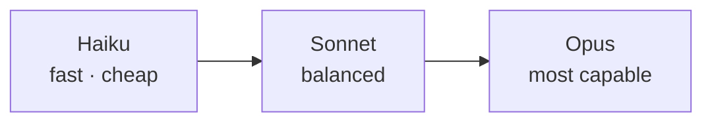

<LevelBadge level="beginner" />

Anthropic offers a family of models at different capability/cost/speed points. Choosing well is mostly about matching the model to the job — and not overpaying for capability you don't need.

<Callout type="objectives" items={[
  "Read the Haiku → Sonnet → Opus ladder as a capability/cost/speed tradeoff",
  "Start from the right default instead of guessing, then move up or down deliberately",
  "Mix tiers in one system — the biggest cost lever most people never pull",
  "Look up the exact model ID the right way, so upgrades stay a one-line change",
]} />

## The current models

<ModelTable />

## Try it: which model fits?

Answer three questions and get a starting recommendation:

<ModelPicker />

## The mental model: a capability ladder

- **Start with Sonnet.** It's the default workhorse — strong reasoning and coding at a sensible cost. Most tasks should begin here.
- **Move up to Opus** only when Sonnet struggles and quality matters more than cost (hard reasoning, tricky agents, gnarly code).
- **Drop to Haiku** for high-volume, latency-sensitive, or simple work (classification, extraction, routing, cheap sub-agents).

## How to actually choose

<Steps items={[
  {title: "Default to Sonnet and ship", body: "It is the balanced workhorse. Starting anywhere else means you are optimizing before you have evidence about your actual task."},
  {title: "Hitting a quality ceiling? Try Opus on the hard subset only", body: "Do not upgrade the whole workload. Find the cases Sonnet fails and route only those to Opus — you buy the quality without paying for it everywhere."},
  {title: "Cost or latency hurting? See if Haiku is good enough for that step", body: "Classification, extraction, routing, and cheap subagents rarely need a bigger model. Test it rather than assuming."},
  {title: "Mix models", body: "Use Haiku for cheap pre/post-processing and Sonnet/Opus for the hard core. This model tiering is one of the biggest cost levers — see Cost & Latency."},
]} />

Model tiering is worth its own read: [Cost & Latency](/docs/foundations/cost-and-latency).

:::tip Don't pick from benchmarks alone
Public benchmarks are a starting hint, not a verdict for *your* task. Run a tiny [eval](/docs/foundations/evals) on a handful of your real inputs across two models — it takes minutes and beats guessing.
:::

## Looking up the exact model ID

Always pass the current API model ID (e.g. in your `messages.create` call). Get it from the [models table above](/docs/whats-new/models-and-pricing) or the official models page — and prefer reading it from config over hard-coding it in many places, so model upgrades are a one-line change.

<Quiz title="Check yourself" questions={[
  {q: "You're building something new and have no data on which model fits. Where do you start?", options: ["Opus, then downgrade if it's too expensive", "Sonnet — the balanced default — then move up or down with evidence", "Haiku, then upgrade whenever output looks weak"], answer: 1, explain: "Sonnet is the workhorse: strong reasoning and coding at sensible cost. Start there and ship, then let real failures tell you whether to reach for Opus or drop to Haiku."},
  {q: "Sonnet handles 90% of your traffic well but fails on a hard 10%. Best move?", options: ["Move everything to Opus", "Route only the hard subset to Opus and leave the rest on Sonnet", "Add more examples and accept the failures"], answer: 1, explain: "Upgrading the whole workload pays Opus prices for cases Sonnet already handles. Routing only the hard subset buys the quality where it's needed — the essence of model tiering."},
  {q: "A benchmark shows model A beating model B. What should you conclude for your app?", options: ["Use model A — benchmarks settle it", "Not much — run a tiny eval on your own real inputs across both", "Use model B, since benchmarks are always gamed"], answer: 1, explain: "Public benchmarks are a hint, not a verdict for your task. A small eval on a handful of your real inputs takes minutes and beats guessing."},
  {q: "Why read the model ID from config instead of hard-coding it across your codebase?", options: ["Hard-coded strings are slower at runtime", "So a model upgrade is a one-line change instead of a hunt through every call site", "The API rejects literal model IDs"], answer: 1, explain: "Model IDs change as the lineup moves. Keeping the current ID in config means an upgrade touches one line, and you always look the value up from the live models table."},
]} />

<Callout type="takeaways" items={[
  "Haiku → Sonnet → Opus is a capability/cost/speed ladder — pick a rung, don't guess a model.",
  "Default to Sonnet and ship; move up or down only with evidence from your own task.",
  "Upgrade the hard subset, not the whole workload — routing beats blanket upgrades.",
  "Mixing tiers in one system is one of the biggest cost levers available to you.",
  "Benchmarks are a hint; a tiny eval on your real inputs is the verdict.",
  "Read the model ID from config and look it up in the live models table — never hard-code model facts.",
]} />

## Next

- [Tokens, Context & Pricing](/docs/api/tokens-and-pricing)
- [Your First API Call](/docs/api/first-call)
- [Current Models & Pricing](/docs/whats-new/models-and-pricing)
