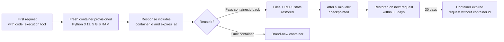

<LevelBadge level="intermediate" />

<Callout type="objectives" items={[
  "Turn the sandbox on with a single tool block and know what Claude does with it — Bash commands, file edits, and (with the newer versions) a persistent Python REPL",
  "Pick the right tool version — code_execution_20250825 vs 20260120 vs 20260521 — and understand exactly what each one unlocks",
  "Get files in and out — upload with container_upload, capture generated files via the OUTPUT_DIR pattern",
  "Reuse a container across requests to keep state alive for up to 30 days, and know when a fresh container is safer",
  "Read pricing correctly — 1,550 free hours per month, then $0.05 per container-hour — and know the one combo that makes it entirely free",
  "Avoid the multi-environment confusion when you provide code execution alongside your own Bash tool"
]} />

<VerifyNote lastVerified="2026-08-25" source="https://platform.claude.com/docs/en/agents-and-tools/tool-use/code-execution-tool">
Tool version strings, model compatibility, resource limits, and pricing tiers move — re-verify field names and free-hour caps against the official reference before you architect around a specific number.
</VerifyNote>

The **code execution tool** is Anthropic's server-side sandbox: add one JSON block to your `tools` array and Claude gains a Bash shell, a file editor, and a Python 3.11 interpreter, all running inside a Linux container the API provisions for you. You never execute commands or send back `tool_result` blocks — the API runs each call and streams the output back in the same response.

This is the primitive underneath a lot of what Anthropic ships next: [programmatic tool calling](/docs/api/programmatic-tool-calling) executes Python inside this same container; the new [web search](https://platform.claude.com/docs/en/agents-and-tools/tool-use/web-search-tool) and [web fetch](https://platform.claude.com/docs/en/agents-and-tools/tool-use/web-fetch-tool) tools use it invisibly for dynamic result filtering. Understanding the sandbox pays off across the whole platform surface.

## When to reach for it

<Callout type="info" items={[
  "Non-trivial math — large numbers, many steps, precision-sensitive results Claude would guess without executing",
  "Data analysis on files you upload — CSV, Excel, JSON, XML, images, PDFs",
  "Generating visualizations, PDFs, or spreadsheets that a human then downloads",
  "Multi-step scripts that need to save intermediate state and iterate — a persistent Python REPL across requests",
  "Any workload that would otherwise round-trip a huge tool result back to the model — the sandbox filters it locally"
]} />

Claude will *not* run code for simple arithmetic, well-known facts, factual/conversational asks, or basic unit conversions. If the request is borderline, ask explicitly: **"run code to verify this"**.

## Three tool versions — what each one adds

There are currently three current versions of the tool. All three return the same block shapes, and none of them requires an `anthropic-beta` header.

| Version                     | What it adds                                                                                                                                                                                                                                              |
| --------------------------- | -------------------------------------------------------------------------------------------------------------------------------------------------------------------------------------------------------------------------------------------------------- |
| `code_execution_20250825`   | Bash commands and file operations (`view`, `create`, `str_replace`). This is what most examples use.                                                                                                                                                     |
| `code_execution_20260120`   | Adds **REPL state persistence** and support for [programmatic tool calling](/docs/api/programmatic-tool-calling) from inside the sandbox. Python interpreter state (variables, imports) survives across requests that reuse the container.               |
| `code_execution_20260521`   | Same runtime as `20260120`. The tool description now discloses the **90-second wall-clock limit per Python cell** in programmatic tool calling, so Claude can budget long-running cells instead of getting cut off mid-computation.                       |

**Two rules of thumb:**

- If you use the current web search or web fetch tools (`web_search_20260209` / `web_fetch_20260209` or later), you **must** be on `code_execution_20260120` or later — that's the required code-execution version for their dynamic filtering.
- Claude Haiku 4.5 accepts the newer type strings but does not actually support programmatic tool calling or REPL persistence; on Haiku, the newer versions behave like `code_execution_20250825`.

## Fire the sandbox in one request

<Steps items={[
  {title: "Add the tool block", body: "Include one entry in tools with type set to the version you want and name set to code_execution. There are no other parameters — both fields are fixed."},
  {title: "Send a message that benefits from computation", body: "Ask Claude to calculate, parse a file, generate a chart, or run a shell command. Claude decides whether the request warrants execution."},
  {title: "Read the interleaved response", body: "The response mixes server_tool_use blocks (the command Claude ran) with matching tool_result blocks (stdout, stderr, return_code, and any captured files), followed by Claude's text answer."},
  {title: "Optionally reuse the container", body: "The response includes a top-level container object with an id. Pass that id back on the next request to keep files and (with the newer tool versions) Python state alive."}
]} />

<PromptCard title="Minimal cURL request — mean and standard deviation">{`curl https://api.anthropic.com/v1/messages \\
  -H "x-api-key: $ANTHROPIC_API_KEY" \\
  -H "anthropic-version: 2023-06-01" \\
  -H "content-type: application/json" \\
  -d '{
    "model": "claude-opus-5",
    "max_tokens": 4096,
    "messages": [{
      "role": "user",
      "content": "Use the code execution tool to calculate the mean and standard deviation of [1, 2, 3, 4, 5, 6, 7, 8, 9, 10]"
    }],
    "tools": [{
      "type": "code_execution_20250825",
      "name": "code_execution"
    }]
  }'`}</PromptCard>

The response interleaves `server_tool_use` blocks with `bash_code_execution_tool_result` (or `text_editor_code_execution_tool_result`) blocks, then Claude's summary text.

## Sub-tools you get for free

Adding the code execution tool silently unlocks two sub-tools Claude may pick between on any turn:

- **`bash_code_execution`** — run any shell command. Result includes `stdout`, `stderr`, `return_code`, and a `content` list of any files the command left in `$OUTPUT_DIR`.
- **`text_editor_code_execution`** — view, create, and edit files (including source code). Supported commands: `view`, `create`, `str_replace`. Diffs come back in unified-diff form (`old_start`, `new_start`, `lines`).

The Python interpreter is not its own sub-tool — Claude writes Python with the file editor and runs it with a Bash command. With `code_execution_20260120` or later plus programmatic tool calling, the *interpreter state* persists across cells that reuse the container.

## Get files into the container

Upload the file with the [Files API](https://platform.claude.com/docs/en/build-with-claude/files), then reference it in the message with a `container_upload` content block. The Python environment can handle CSV, Excel (`.xlsx`, `.xls`), JSON, XML, images (JPEG/PNG/GIF/WebP), and text-based formats.

<PromptCard title="Upload a CSV and ask Claude to analyze it">{`# 1. Upload the file
FILE_ID=$(curl -sS https://api.anthropic.com/v1/files \\
  -H "x-api-key: $ANTHROPIC_API_KEY" \\
  -H "anthropic-version: 2023-06-01" \\
  -F "file=@data.csv" | jq -r '.id')

# 2. Reference it with a container_upload block
curl https://api.anthropic.com/v1/messages \\
  -H "x-api-key: $ANTHROPIC_API_KEY" \\
  -H "anthropic-version: 2023-06-01" \\
  -H "content-type: application/json" \\
  -d '{
    "model": "claude-opus-5",
    "max_tokens": 4096,
    "messages": [{
      "role": "user",
      "content": [
        {"type": "text", "text": "Analyze this CSV data"},
        {"type": "container_upload", "file_id": "'"$FILE_ID"'"}
      ]
    }],
    "tools": [{"type": "code_execution_20250825", "name": "code_execution"}]
  }'`}</PromptCard>

## Get files back out — the `$OUTPUT_DIR` pattern

This is the gotcha nobody documents until it bites: **only files at the top level of `$OUTPUT_DIR` are captured and returned as `file_id` entries.** Every `bash_code_execution` call gets a fresh empty directory available as `$OUTPUT_DIR`; anything Claude writes elsewhere in the container stays there and isn't handed back to your client.

If your application depends on receiving a specific file, be explicit in the prompt and pattern the command like this so `ls` confirms the capture in the same tool result:

```bash
python /tmp/make_report.py && cp /tmp/report.pdf "$OUTPUT_DIR/" && ls "$OUTPUT_DIR"
```

Claude does not see the response `content` list — only your prompt and its own stdout — so the `ls` line is what tells it the copy succeeded.

Once captured, files are downloadable via the Files API (`client.files.download(file_id)`). Files that code execution *creates* through the Files API persist until you delete them, independent of the 30-day container expiry.

## The container lifecycle



- **Containers live 30 days from creation.** The `expires_at` timestamp in each response is a shorter *rolling* value and does not reflect the 30-day hard limit.
- **After ~5 minutes of inactivity** the container is checkpointed. Sending a request with its ID inside the 30-day window restores it.
- **An expired container cannot be reused.** Requests that reference it return an error — send the request again without the `container` parameter to get a fresh one.

## Runtime specs — what the sandbox actually is

| Property           | Value                                                                                                       |
| ------------------ | ----------------------------------------------------------------------------------------------------------- |
| Python version     | 3.11                                                                                                        |
| OS                 | Linux (x86_64 / AMD64)                                                                                      |
| Memory             | 5 GiB RAM                                                                                                   |
| Disk               | 5 GiB workspace                                                                                             |
| CPU                | 1                                                                                                            |
| Execution time     | Whole-tool-invocation cap enforced by the API; with programmatic tool calling, each REPL cell adds a 90-second wall-clock cap |
| Internet           | **Completely disabled** — no outbound network requests                                                        |
| Sandbox isolation  | Full isolation from the host and other containers                                                            |
| Workspace scope    | Containers are scoped to your API key's workspace                                                            |

Pre-installed libraries include the usual data-science stack (pandas, numpy, scipy, scikit-learn, statsmodels), visualization (matplotlib, seaborn), file processing (pyarrow, openpyxl, xlsxwriter, xlrd, pillow, python-pptx, python-docx, pypdf, pdfplumber, pypdfium2, pdf2image, pdfkit, tabula-py, reportlab, Img2pdf), math (sympy, mpmath), utilities (tqdm, python-dateutil, pytz, joblib), plus command-line tools (`unzip`, `unrar`, `7zip`, `bc`, `rg`, `fd`, `sqlite`).

**There is no `pip install`.** With the internet off, Claude cannot fetch additional packages at runtime. Design around what's already there.

## Pricing — and the one combination that makes it free

<VerifyNote lastVerified="2026-08-25" source="https://platform.claude.com/docs/en/agents-and-tools/tool-use/code-execution-tool#usage-and-pricing">
Free-hour caps and per-hour rates can change — always re-check the current pricing section of the official docs before writing a budget alert around these numbers.
</VerifyNote>

**Code execution is free when your request also includes web search or web fetch** (`web_search_20260209` or later, `web_fetch_20260209` or later). There are no additional charges for code execution tool calls in those requests beyond standard token costs — this covers both the dynamic filtering Anthropic runs invisibly and any code Claude writes directly.

Without those tools, code execution is billed by execution time:

- Minimum billed execution time is **5 minutes** per container.
- Each organization gets **1,550 free hours per month**.
- Above the free tier, additional usage is **$0.05 per hour, per container**.
- If files are attached to the request, the container is preloaded — execution time is billed even if Claude never calls the tool.

Track usage in the response's `usage.server_tool_use.code_execution_requests` count.

## The multi-environment trap

If you also expose your own [Bash tool](https://platform.claude.com/docs/en/agents-and-tools/tool-use/bash-tool) or custom REPL, Claude is now looking at *two* execution environments: Anthropic's sandboxed container and your local one. State is not shared between them — Claude will occasionally forget this and reach for the wrong one.

Add explicit guidance to your system prompt when the two co-exist:

<PromptCard title="System-prompt clarifier for multi-environment setups">{`When multiple code execution environments are available, be aware that:
- Variables, files, and state do NOT persist between different execution environments.
- Use the code_execution tool for general-purpose computation in Anthropic's sandboxed environment.
- Use client-provided execution tools (e.g., bash) when you need access to the user's local system, files, or data.
- If you need to pass results between environments, explicitly include outputs in subsequent tool calls rather than assuming shared state.`}</PromptCard>

The same trap fires quietly when you enable web search or web fetch alongside your own shell tool: the automatic code execution provisioned for dynamic filtering counts as a *second* environment, even though you never added it to `tools`.

## Errors you'll actually see

| Tool        | Error code                | Meaning                                                                    |
| ----------- | ------------------------- | -------------------------------------------------------------------------- |
| All         | `unavailable`             | Tool temporarily unavailable — retry with backoff                         |
| All         | `execution_time_exceeded` | The entire tool invocation exceeded its max time — bound your commands    |
| All         | `invalid_tool_input`      | Malformed parameters                                                       |
| All         | `too_many_requests`       | Rate limit — back off before retrying                                     |
| bash        | `output_file_too_large`   | Command output exceeded the cap — chunk it, redirect to a file            |
| text_editor | `file_not_found`          | View or edit target does not exist                                        |

An expired container reference returns an error, not a fresh container — omit the `container` parameter and retry.

Long-running responses may include a `pause_turn` stop reason. Send the response back as-is to let Claude resume, or modify it to interrupt.

## Migration from the legacy Python-only tool

If you're still on the legacy `code_execution_20250522` (Python-only, required the `code-execution-2025-05-22` beta header), the upgrade is a one-line diff:

```diff
- "type": "code_execution_20250522"
+ "type": "code_execution_20250825"
```

The new versions add Bash and file operations on top of what the legacy tool did — no beta header needed. If you parse responses programmatically, the block type changes from `code_execution_result` to `bash_code_execution_result` and `text_editor_code_execution_*_result` shapes.

## Test yourself

<Quiz questions={[
  {
    q: "You provide code_execution_20250825 and web_search_20260209 in the same request. What does the pricing look like?",
    options: [
      "Pay per web search + pay per code-execution container hour",
      "Free code execution (web search is present); still pay standard input/output tokens",
      "Free web search when paired with code execution",
      "Both tools free — Anthropic bundles the pair"
    ],
    answer: 1,
    explain: "When web_search_20260209 (or later) or web_fetch_20260209 (or later) is in your request, code execution tool calls have no additional charge beyond standard token costs — this covers both dynamic filtering and any code Claude runs directly."
  },
  {
    q: "Claude writes /tmp/report.pdf during a bash_code_execution call. Your client extracts file IDs from the response — no PDF appears. Why?",
    options: [
      "The API only captures files under $OUTPUT_DIR at the top level — /tmp is inside the container but not returned",
      "PDFs require the Files API to be enabled separately",
      "You must poll the container endpoint for generated files",
      "Bash cannot produce PDFs — use the text editor sub-tool"
    ],
    answer: 0,
    explain: "Each bash_code_execution call gets an empty directory accessible as $OUTPUT_DIR. Only files at the top level of that directory are captured and returned. A file written to /tmp is still in the container — you can reuse the container and ask Claude to cp it into $OUTPUT_DIR."
  },
  {
    q: "You need REPL state (variable bindings) to persist between requests. Which tool version do you set?",
    options: [
      "code_execution_20250522 (legacy)",
      "code_execution_20250825 — REPL is always persistent",
      "code_execution_20260120 or later, and pass the container.id back on each subsequent request",
      "Any version, as long as you set the anthropic-beta: code-execution-repl header"
    ],
    answer: 2,
    explain: "REPL state persistence and programmatic tool calling arrived in code_execution_20260120 and continue in _20260521. The persistence also requires reusing the container by passing container.id back on the next request. No beta header is needed."
  }
]} />

## Vocabulary

<Flashcards title="Code execution glossary" cards={[
  {front: "$OUTPUT_DIR", back: "Per-command empty directory whose top-level files are automatically captured and returned as file_id entries in the tool result. Files written elsewhere in the container stay in the container."},
  {front: "container_upload", back: "Content block that references a Files-API file ID, making the file available inside the sandbox for that turn."},
  {front: "container.id", back: "Top-level identifier returned with any response that used code execution. Pass it back on the next request to keep files (and, on newer tool versions, Python REPL state) alive for up to 30 days."},
  {front: "server_tool_use", back: "Block type in the response that shows the command Claude asked the API to run — paired with a matching bash_code_execution_tool_result or text_editor_code_execution_tool_result block."},
  {front: "pause_turn", back: "Stop reason indicating the API paused a long-running turn. Resend the response as-is to let Claude continue, or edit it to interrupt."},
  {front: "Dynamic filtering", back: "Automatic use of code execution behind web search / web fetch to shrink or transform results before they hit context. Provisioned by the API — you don't add the tool for it."}
]} />

## Takeaways

<Callout type="takeaways" items={[
  "One tool block, one name — code_execution_20250825 for most cases, 20260120 or 20260521 when you need REPL persistence or programmatic tool calling",
  "Container reuse is the multiplier — pass container.id back to keep files and state alive for up to 30 days",
  "Files in: container_upload with a Files-API id. Files out: only files at the top level of $OUTPUT_DIR are captured",
  "Pair with web search or web fetch to make code execution free above and beyond token costs",
  "No internet, no pip install — design around the preloaded library set",
  "Add multi-environment guidance to your system prompt whenever you also expose your own Bash tool"
]} />

## Next

- [Programmatic tool calling](/docs/api/programmatic-tool-calling) — call your own tools from Python inside the same container
- [Task budgets](/docs/api/task-budgets) — cap total token spend across an agentic loop so long-running code doesn't run away
- [Prompt caching](/docs/api/prompt-caching) — reuse a stable prefix to keep repeat calls cheap
- [Advisor tool](/docs/api/advisor-tool) — pair a fast executor with a higher-intelligence advisor
