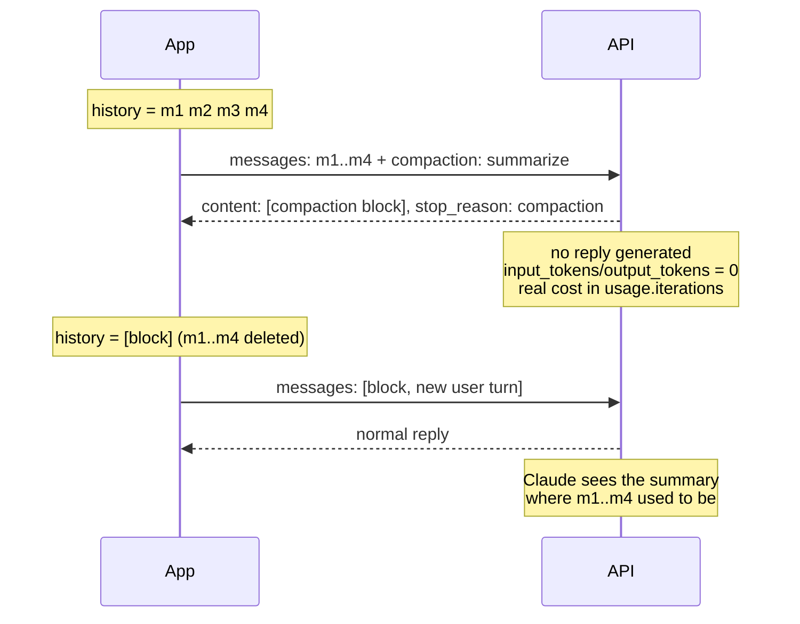

<LevelBadge level="advanced" />

<Callout type="objectives" items={[
  "Tell the four kinds of context shrinking apart — context editing, on-demand compaction, keep-tail, background, and threshold — and pick the right one",
  "Send a compaction request and read the signed compaction block that comes back instead of a reply",
  "Do the swap correctly: block first, summarized messages removed, beta header on every later request",
  "Recognize the two swap mistakes that return HTTP 200 and corrupt the conversation quietly",
  "Handle the case where no summary comes back — five stop reasons, each with a different fix",
  "Count what compaction actually costs (usage.iterations, not the top-level token fields)",
  "Know what a summary can never carry across: images, documents, uploads, fetched URLs, and earlier system instructions"
]} />

<VerifyNote lastVerified="2026-10-02" source="https://platform.claude.com/docs/en/build-with-claude/compaction-on-demand">
On-demand compaction is in **public beta** behind the `compact-2026-09-04` header, launched September 14, 2026. Threshold compaction is a separate beta (`compact-2026-01-12`). Beta headers, field names, error codes, and platform availability are quoted from the official reference and can shift while the feature is in beta — re-verify before shipping. Availability at the time of writing: Claude API, Claude Platform on AWS, Google Cloud, and Microsoft Foundry (all beta); **not available on Amazon Bedrock**. Model support is a per-model capability, not a fixed list — see [Check support at runtime](#check-support-at-runtime) and [Models & pricing](/docs/whats-new/models-and-pricing).
</VerifyNote>

Every long-running agent eventually hits the same wall: the conversation grows until the next request will not fit. You have two honest options — throw old context away, or *compress* it. Compaction is the compression option, done by the model, server-side: you send the conversation with one extra parameter, and instead of a reply you get a **signed summary block** that you send back in place of the messages it replaces.

The signature is the interesting part. The block is not a string you wrote and injected — it is content the API produced and will verify. Edit one character of the summary text and the next request fails with `compaction_signature_invalid`.

## Which shrinking tool is which

Four features overlap here, and teams mix them up constantly. They do different jobs:

| Feature | Who decides | What it does | Where the block lands |
| --- | --- | --- | --- |
| **Context editing** (`clear_tool_uses_20250919`) | You, declaratively | **Deletes** old tool results outright — no summary | No block; see [Memory & context editing](/docs/api/memory-and-context-editing) |
| **On-demand compaction** (`compaction`) | You, per request | Summarizes the messages you send, in a separate call that returns no reply | You put the block **first** and delete what it replaced |
| **Keep-tail compaction** | You, by choosing a cut | Same as on-demand, but the last few turns stay word for word | Block first, kept turns after it |
| **Background compaction** | You, asynchronously | Same as on-demand, but the conversation keeps running while the summary is written | Block replaces exactly the messages you sent; later turns stay |
| **Threshold compaction** (`compact_20260112`) | The API, at a token trigger | Summarizes older context *partway through an ordinary request* | Block **follows** the summarized messages and the API drops them for you |

Two rules worth memorizing before you write any code:

- **Context editing deletes, compaction summarizes.** For very long runs you can layer both — but not in the same request as `compaction` (see [Limits](#limits-and-interactions)).
- **On-demand and threshold compaction pass their blocks back in opposite directions.** On-demand: block goes first, you remove the old messages. Threshold: block comes last, the API removes them. Getting this backwards is the single most common error.

## How the swap works



The compaction request is **off the conversation's path**: it carries your history, it returns a summary, and it generates no assistant turn. Your next real request is the one that continues the conversation.

## Check support at runtime

Model support for compaction is a capability flag, not something to hard-code. Call the Models API with the beta header and read `capabilities.compaction` on each model. That survives model launches and deprecations in a way a copied list never does.

## Fire your first compaction request

<Steps items={[
  {title: "Add the beta header", body: "Send anthropic-beta: compact-2026-09-04 on the compaction request AND on every later request that carries the returned block. Forget it on a later request and you get a confusing validation error saying compaction is not an expected content block type — the message never mentions the header."},
  {title: "Send the conversation as it stands, plus the compaction parameter", body: "Top level: compaction with type 'summarize'. The API summarizes every message in the request, exactly once, and returns the block alone."},
  {title: "Send the same system prompt and tools you use for the rest of the conversation", body: "The summarizer reads them. It never runs a tool. On models with preserved thinking, thinking in any turns you keep after the block stays valid only if system and tools match."},
  {title: "Give max_tokens real room", body: "max_tokens caps the whole summarization call, including any thinking the model does before writing the summary. Several thousand tokens is the right order of magnitude — 4096 in Anthropic's own samples."},
  {title: "Compact BEFORE you outgrow the window", body: "The compaction request itself has to fit the model's context window. A conversation that is already too big to send is too big to compact."},
  {title: "Check stop_reason before you look for the block", body: "A successful compaction ends with stop_reason 'compaction'. Any other stop reason means no summary was produced — and the response is still a 200 with empty content."}
]} />

<PromptCard title="curl — ask for a summary of the conversation so far">{`curl https://api.anthropic.com/v1/messages \\
  -H "x-api-key: $ANTHROPIC_API_KEY" \\
  -H "anthropic-version: 2023-06-01" \\
  -H "anthropic-beta: compact-2026-09-04" \\
  -H "content-type: application/json" \\
  -d '{
    "model": "claude-opus-5-5",
    "max_tokens": 4096,
    "messages": [
      {"role": "user", "content": "I am building a recipe app. Name the main entities."},
      {"role": "assistant", "content": "Recipe, Ingredient, Step, and a RecipeIngredient entry holding quantity and unit."},
      {"role": "user", "content": "Good. Now suggest field names for Recipe."}
    ],
    "compaction": {"type": "summarize"}
  }'`}</PromptCard>

What comes back is one content block and a distinctive stop reason:

```json
{
  "content": [
    {
      "type": "compaction",
      "content": "Summary of the conversation: the user is designing the data model for a recipe app...",
      "signature": "EuYBCkQY..."
    }
  ],
  "stop_reason": "compaction",
  "usage": {
    "input_tokens": 0,
    "output_tokens": 0,
    "iterations": [{"type": "compaction", "input_tokens": 144, "output_tokens": 276}]
  }
}
```

Note the zeros. The top-level token fields are zero *because no reply was generated* — the real cost sits in `usage.iterations`. If your cost dashboard sums top-level fields only, compaction will look free and your bill will disagree.

Streaming works, but there is nothing to stream: you get one `content_block_start` carrying the complete block, then `content_block_stop`, with no delta events in between (`ping` events may arrive around them).

## Continue from the summary

Replace the messages you sent with the returned assistant message, keeping the block **byte-for-byte** as the API returned it — `content`, `signature`, and nothing added.

<PromptCard title="The next request — block first, old messages gone">{`{
  "model": "claude-opus-5-5",
  "max_tokens": 2048,
  "messages": [
    {
      "role": "assistant",
      "content": [
        {
          "type": "compaction",
          "content": "Summary of the conversation: the user is designing the data model...",
          "signature": "EuYBCkQY..."
        }
      ]
    },
    {"role": "user", "content": "Now do the same for Ingredient."}
  ]
}`}</PromptCard>

Three rules govern the swap:

1. **The block goes first in `messages`** — either as an `assistant` message of its own, or as the first content block of the first message (`user` or `assistant`, either is fine).
2. **The summarized messages are removed.** If any of them remain *in front of* the block, you get a 400 with `compaction_block_misplaced`.
3. **Exactly one `compaction` block per request**, on every later request, with the beta header.

Two `assistant` messages in a row are legal here — if a reply arrived while the summary was being written, it simply follows the block.

### The two mistakes that do not raise an error

<Callout type="warning" items={[
  "Summarized messages left AFTER the block: no error. The API happily sends them to Claude again, so you pay for the summary AND the history it was supposed to replace.",
  "Block omitted from a later request: no error. Claude just gets no summary, and the conversation silently loses everything before the swap.",
  "Both failures return HTTP 200. Nothing in the response says you got it wrong — assert on your history shape in tests, not on status codes."
]} />

### Compact again

To compact a conversation that already begins with a block, send `compaction` again. The new block summarizes the old summary *and* everything after it. From then on, send only the newest block.

## Compact in a loop

The decision of *when* is yours. The cheap estimate of "how big will my next request be" is `input_tokens + output_tokens` from the last response — the next request resends that reply, so it counts. With [prompt caching](/docs/api/prompt-caching) on, `input_tokens` covers only the tokens after the last cache breakpoint, so add `cache_read_input_tokens` and `cache_creation_input_tokens` too. Or send the same messages to the token-counting endpoint.

<PromptCard title="Python — compact when the next request would get too big">{`from anthropic.types.beta import BetaMessageParam

client = anthropic.Anthropic()
COMPACT_AT_TOKENS = 120_000   # set this near your real input budget
SYSTEM = "You help design a recipe app's data model. Keep answers short."
QUESTIONS = [...]             # your stream of user turns

history: list[BetaMessageParam] = []
for turn, question in enumerate(QUESTIONS, start=1):
    history.append({"role": "user", "content": question})
    response = client.beta.messages.create(
        model="claude-opus-5-5",
        max_tokens=8192,
        system=SYSTEM,
        betas=["compact-2026-09-04"],
        messages=history,
    )
    history.append({"role": "assistant", "content": response.content})

    # The next request resends this reply too, so count it.
    conversation_tokens = response.usage.input_tokens + response.usage.output_tokens
    if conversation_tokens > COMPACT_AT_TOKENS and turn < len(QUESTIONS):
        summary = client.beta.messages.create(
            model="claude-opus-5-5",
            max_tokens=4096,
            system=SYSTEM,                      # same system prompt and tools
            betas=["compact-2026-09-04"],
            messages=history,
            compaction={"type": "summarize"},
        )
        if summary.stop_reason == "compaction":  # check BEFORE reading content
            history = [{"role": "assistant", "content": summary.content}]`}</PromptCard>

Note the shape of the swap: the history is **replaced**, not appended to. And the `stop_reason` check comes first — when no summary comes back, this loop keeps its full history and tries again after the next turn, which is exactly the right fallback.

In Python, use `client.beta.messages`. If you call `client.messages` and serialize blocks yourself, use `to_dict()` or `model_dump(exclude_none=True)` — a plain `model_dump()` adds `citations: null` and `text: null` to the block, and the API rejects fields it did not return.

The SDK tool runner can do this for you: call `compact_before_next_turn()` (`compactBeforeNextTurn()` in TypeScript, Java, and PHP; `CompactBeforeNextTurn()` in C# and Go) and it sends the compaction request once the current turn and its tool calls finish. Create the runner with the `compact-2026-09-04` beta — the runner does not add it.

## Keep the last few turns word for word

There is **no parameter** for this, which surprises people. Keep-tail compaction is a decision about what you put in the request: you pick a cut point, send only the older messages for summarization, and put the returned block in front of the turns you kept.

<Steps items={[
  {title: "Pick the cut", body: "Messages before it go into the compaction request; messages from it on are kept at full length. The more you keep, the less room you free."},
  {title: "Never split a tool call from its result", body: "Each tool call and its result must land on the same side. If the messages you send end in an assistant turn whose tool call has no result yet, the API rejects the compaction request."},
  {title: "Cut between a reply and the next user message", body: "That boundary also satisfies the condition that keeps preserved thinking valid in the kept turns. A cut at the end of a request you already made works too: compact exactly that request's messages and keep everything since."},
  {title: "Rebuild the history as block + kept turns", body: "Everything in the swap rules above still applies — block first, summarized messages gone, beta header on every request."}
]} />

## Compact in the background

Background (or async) compaction changes two things in the loop: the compaction request runs while the conversation continues on its **full** history, and the swap waits for the block to arrive.

<Steps items={[
  {title: "Record how many messages you sent", body: "Send the compaction request on a copy of the history and remember the count — that is exactly what the block will replace."},
  {title: "Keep talking on the full history", body: "Append new turns, edit nothing already in the history, and do not start a second compaction request while one is pending."},
  {title: "On arrival, replace from the front", body: "When the response comes back with stop_reason 'compaction', drop exactly those N messages from the front and put the returned message in their place. Everything appended since stays after it."},
  {title: "Send the swapped history on the very next request", body: "That keeps thinking produced while the summary was being written valid."},
  {title: "Drain the pending request before you stop", body: "If a compaction request is still in flight when your loop ends, wait for it and do the swap — otherwise a summary you already paid for is lost."}
]} />

While that request runs you have two requests open at once, and the compaction request counts against your rate limits like any other. So start it while the window still has room for the turns that will arrive in the meantime.

## Threshold compaction: let the API decide

Threshold compaction is the automatic flavor. You configure it once as a `context_management` edit on your ordinary requests, and the API summarizes older context partway through a request when input tokens cross your trigger.

| Field | Meaning |
| --- | --- |
| `type` | `"compact_20260112"` |
| `trigger` | `{"type": "input_tokens", "value": N}` — `input_tokens` is the only trigger type; `value` must be at least 50,000 (default 150,000) |
| `pause_after_compaction` | `false` by default — set it to pause after the summary is generated instead of continuing the response |
| `instructions` | Optional custom summarization prompt; when present it replaces the default prompt entirely |

Passing the block back is the easy part and the opposite of on-demand: append the whole response content, block included, and the API drops the blocks *before* it on later requests. The beta header is `compact-2026-01-12`.

Pick threshold compaction when you want "never think about it again" behavior. Pick on-demand when you want compaction to happen at a *semantic* boundary — end of a subtask, after a plan is agreed, before a new file is opened — rather than at a token count. And pick one per request: `compaction` and `context_management` cannot be sent together, threshold compaction cannot run on a request carrying a signed on-demand block, and the tool runner refuses to compact while its `context_management` holds a compaction edit.

## Write your own summarization prompt

Without `instructions`, the API uses its own summarization prompt. A non-blank `instructions` string (up to 16,384 characters) **replaces that prompt entirely** — it is not appended to it.

<PromptCard title="instructions — say what must survive, and forbid tool calls">{`{
  "compaction": {
    "type": "summarize",
    "instructions": "Summarize this design conversation. Preserve every entity and field name agreed so far, every decision marked FINAL, and the user's latest open request. Do not call tools; respond with the summary text only."
  }
}`}</PromptCard>

Two things earn their place in every custom `instructions`: an explicit list of what must be retained, and "do not call tools". A summarizer that calls a tool produces no summary at all (see the next section).

## When no summary comes back

A summary is produced only when the summarization call ends normally, with text and no tool call. Otherwise you get a **200 with empty `content`** — which is why `stop_reason` is the thing to branch on. The call is billed either way and reported in `usage.iterations` (zero usage if no call could be made). In every case you can continue without a summary and compact later.

| `stop_reason` | Cause | Fix |
| --- | --- | --- |
| `"max_tokens"` | The summary was cut off | Resend with a larger `max_tokens` |
| `"model_context_window_exceeded"` | No room for the summarization prompt | Resend with shorter `instructions` or fewer messages |
| `"tool_use"` | The model called a tool instead of summarizing | Resend with `instructions` that forbid tool calls |
| `"refusal"` | The request was declined — `stop_details` names the policy category | Continue without a summary |
| `"end_turn"` | The call returned no text | Continue without a summary |

## Errors

Most 400s carry a message saying what to remove or resend; some also carry an `error.details.error_code` beginning with `compaction_`.

| Error | Cause | Fix |
| --- | --- | --- |
| 529 `overloaded_error` + `compaction_unavailable` | Transient server problem producing or reading a block | Retry |
| 400 `compaction_block_misplaced` | Summarized messages remain in front of the block | Remove them so the block comes first |
| 400 `compaction_signature_invalid` / `compaction_content_mismatch` | The block's `signature` or `content` was changed after it was returned | Send the block exactly as returned |
| 400 `compaction_nothing_to_summarize` | `messages` has no `user` or `assistant` content | Send at least one message |
| 400 (message only) | More than one `compaction` block in the request | Send exactly one — the newest |
| 400 (message only) | Last `assistant` turn ends in a tool call with no result | Send that turn's tool results, then compact |
| 400 (message only) | `stop_sequences`, structured-output `output_config.format`, or `tool_choice` of type `any`/`tool` sent on a compaction request | Remove them — they would do nothing on a summarization call |
| 400 validation error naming an extra field, e.g. `compaction.citations: Extra inputs are not permitted` | The block was re-serialized with fields the API never returned | Serialize with `to_dict()` / `model_dump(exclude_none=True)` |
| 400 "`compaction` requires `anthropic-beta: compact-2026-09-04`" | Beta header missing on the compaction request | Add the header |
| 400 validation error saying `compaction` is not an expected content block type | Beta header missing on a *later* request carrying the block — the message does not mention the header | Add the header to every request carrying the block |

## Limits and interactions

- **One shrinking mechanism per request.** `compaction` and `context_management` cannot be combined.
- **Task budgets.** Do not send `output_config.task_budget.remaining` with `compaction` or on requests carrying the block — that returns a 400. See [Task budgets](/docs/api/task-budgets).
- **Prompt caching.** `cache_control` on the block places a breakpoint right after the summary — usually exactly where you want one, since the summary is now a stable prefix. Sending the block back on later requests adds no compaction cost.
- **Token counting** ignores the `compaction` parameter entirely.
- **Earlier system messages dissolve.** A mid-conversation `role: "system"` message inside the summarized range gets summarized like anything else, so its instructions stop applying once the block replaces them. If an instruction still matters, state it again in a new `role: "system"` message right after your next new `user` turn, and keep it in the history from then on.
- **Some content cannot survive a summary at all.** Images, documents, `container_upload` blocks, and fetched URLs inside the summarized messages are **gone** — the summary is text. Restate or re-upload anything a later turn still needs.

<Callout type="tip" items={["Treat the compaction boundary as a checkpoint you can reason about: log the block's summary text alongside the message count it replaced. When an agent later behaves as if it forgot something, that log tells you in one look whether the fact was summarized away or never captured.","Compaction is a context-window tool, not a cost tool. It reduces the tokens you resend on every later turn, but the summarization call itself is billed — on a short conversation you can easily spend more than you save.","If you also run client-side trimming, decide which layer owns which content: context editing for stale tool results, compaction for the narrative. Two mechanisms fighting over the same messages is how summaries end up describing things the model can no longer see."]} />

## Common mistakes

- **Reading `content[0]` before checking `stop_reason`.** Five different stop reasons return an empty `content` with a 200. This is the number-one source of `IndexError` in compaction code.
- **Summing the top-level token fields.** They are zero on a compaction response. The cost is in `usage.iterations`.
- **Re-serializing the block.** Any field you add that the API did not return (`citations: null` is the classic) is rejected.
- **Compacting too late.** The compaction request must itself fit the context window. "Compact when the request fails" is not a strategy.
- **Keeping a tail that splits a tool call from its result.** Rejected outright — pick cuts at user-message boundaries.
- **Assuming images survive.** They do not. Neither do uploads or fetched pages.

## Check yourself

<Quiz questions={[
  {
    q: "Your compaction request returns HTTP 200, but response.content is an empty list. What happened?",
    options: [
      "The conversation was too short to summarize — nothing to do",
      "No summary was produced; stop_reason tells you which of five causes it was, and you can continue without one",
      "The beta header was missing",
      "The signature failed verification"
    ],
    answer: 1,
    explain: "A summary is produced only when the summarization call ends normally with text and no tool call. Otherwise the response is still a 200 with empty content, and stop_reason is max_tokens, model_context_window_exceeded, tool_use, refusal, or end_turn. Always branch on stop_reason before reading content."
  },
  {
    q: "After an on-demand compaction, where does the block go in messages — and what happens to the messages it summarized?",
    options: [
      "Last, and the API drops the summarized messages for you",
      "First, and you must remove the summarized messages yourself",
      "Anywhere, as long as there is exactly one block",
      "First, and you should keep the summarized messages for auditability"
    ],
    answer: 1,
    explain: "On-demand compaction: the block goes first and you delete what it replaced — leaving summarized messages in front of it returns 400 compaction_block_misplaced, and leaving them after it silently resends them to Claude. Threshold compaction is the one that works the other way around: its block follows the summarized messages and the API drops them for you."
  },
  {
    q: "A conversation included a screenshot the agent keeps referring to. You compact. What must your code do?",
    options: [
      "Nothing — the summary describes the image well enough",
      "Nothing — image blocks are preserved across compaction",
      "Re-upload or restate the image, because images, documents, container_upload blocks, and fetched URLs do not survive a summary",
      "Set instructions to preserve image content"
    ],
    answer: 2,
    explain: "The compaction block is text plus a signature. Images, documents, container_upload blocks, and fetched URLs inside the summarized messages are gone once the block replaces them — restate or re-upload anything a later turn still needs. No instructions string changes that."
  }
]} />

## Vocabulary

<Flashcards title="Compaction glossary" cards={[
  {front: "compaction block", back: "The content block the API returns in place of a reply. Two fields matter: content (the summary text, readable) and signature (verified on every later request). Send it back byte-for-byte."},
  {front: "stop_reason: compaction", back: "The only stop reason that means a summary was produced. Check it before reading content — five other stop reasons return a 200 with empty content."},
  {front: "compact-2026-09-04", back: "Beta header for on-demand compaction. Required on the compaction request AND on every later request that carries the block."},
  {front: "compact_20260112", back: "The context_management edit type for THRESHOLD compaction (header compact-2026-01-12). Triggers on input_tokens, minimum 50,000, default 150,000."},
  {front: "usage.iterations", back: "Where the real cost of a compaction call is reported, as a 'compaction' entry. Top-level input_tokens and output_tokens are zero because no reply was generated."},
  {front: "compaction_block_misplaced", back: "400 error: summarized messages are still in front of the block. The block must come first in messages."},
  {front: "Keep-tail compaction", back: "No parameter — you choose a cut point, send only the older messages for summarization, and put the block in front of the turns you kept. Never split a tool call from its result."},
  {front: "Background compaction", back: "Run the compaction request on a snapshot while the conversation continues on its full history, then replace exactly the messages you sent, keeping everything appended since."}
]} />

## Takeaways

<Callout type="takeaways" items={[
  "Compaction trades a summarization call for a shorter history — the API summarizes the messages you send and returns one SIGNED block to use in their place",
  "On-demand: block first, you delete what it replaced. Threshold: block last, the API deletes for you. Mixing these up is the most common bug",
  "Branch on stop_reason, never on HTTP status — a failed summarization is a 200 with empty content, and so are both swap mistakes",
  "Cost lives in usage.iterations; the top-level token fields are zero. Compaction saves resend tokens, not necessarily money",
  "Compact BEFORE the window is full — the compaction request has to fit too",
  "Images, documents, uploads, fetched URLs, and earlier system instructions do not survive a summary. Restate what still matters",
  "One mechanism per request: compaction and context_management cannot be combined, and a signed block blocks threshold compaction"
]} />

## Next

- [Memory & context editing](/docs/api/memory-and-context-editing) — the delete-based sibling, and how to layer it with compaction
- [Task budgets](/docs/api/task-budgets) — the advisory token ceiling that spans a whole agentic loop, including across compaction
- [Prompt caching](/docs/api/prompt-caching) — why a compaction block makes an unusually good cache breakpoint
- [Context engineering](/docs/frontiers/context-engineering) — compaction, note-taking, and just-in-time retrieval as one discipline
