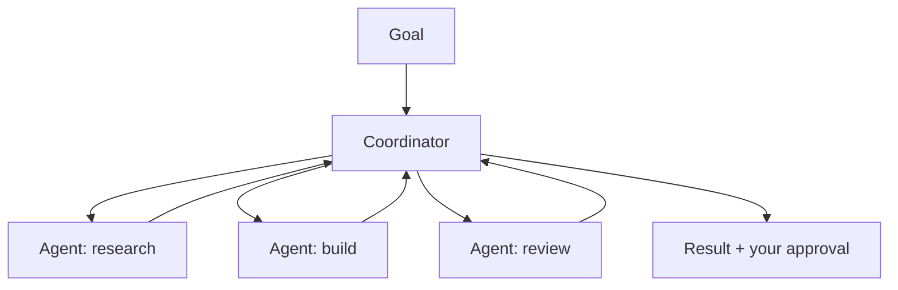

<LevelBadge level="advanced" />

<VerifyNote lastVerified="2026-06-20" source="https://platform.claude.com/docs">
Cowork and Agent Teams are fast-moving 2026 surfaces — names, availability, and capabilities change often. Confirm current details in the official Anthropic docs/announcements.
</VerifyNote>

Beyond a single agent, Anthropic has been shipping **product-level** surfaces for letting agents do sustained, collaborative work: **Cowork** (an agentic desktop workspace) and **Agent Teams** (multiple agents collaborating). This page is a high-level map — verify specifics against the official docs, since these evolve quickly.

## Claude Cowork

Think of it as a **workspace where an agent does real, multi-step work** alongside you — operating over files and tools on a longer horizon than a single chat turn, with you supervising. It's the consumer/pro-facing cousin of building an agent on the API: the loop is provided, you direct the goals.

## Agent Teams

Where one agent isn't enough, **multiple agents collaborate** — dividing a goal, each with a role and tools, coordinating toward a result. Conceptually it mirrors Claude Code's [subagents](/docs/claude-code/subagents), but as a product surface for sustained, multi-agent collaboration rather than a single delegated subtask.

## How this relates to the rest of the site

- Building it yourself, programmatically → [Building Agents](/docs/api/building-agents) + the [Agent SDK](/docs/claude-code/headless-and-agent-sdk).
- Delegation inside a coding session → [Subagents](/docs/claude-code/subagents).
- Hosted loop/state/scheduling → [Managed Agents](/docs/api/managed-agents).

## The constant: supervision

:::warning More autonomy, more care
Multi-agent, long-horizon work amplifies both value *and* risk. Keep humans in the loop on consequential actions, scope tool access tightly, and verify outputs — see [Responsible Use](/docs/security/responsible-use) and [Securing Agents](/docs/security/securing-agents).
:::

## Next

- [Subagents & Parallel Agents](/docs/claude-code/subagents)
- [Managed Agents](/docs/api/managed-agents)
- [Responsible Use, Ethics & Verification](/docs/security/responsible-use)
