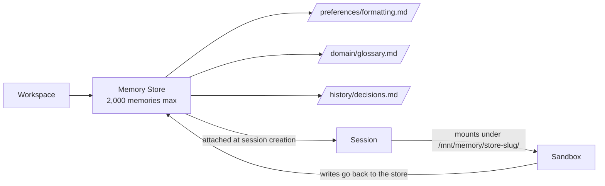

<LevelBadge level="advanced" />

<Callout type="objectives" items={["What a Memory Store is — and how it differs from the older client-side memory tool", "How stores mount into the session sandbox at /mnt/memory/ and how the agent uses them", "The beta-header rule that trips people up (agent-memory-2026-07-22 vs managed-agents-2026-04-01)", "The full lifecycle: create → seed → attach → read/write → audit versions → redact", "The concrete limits: 8 stores per session, 2,000 memories per store, 100 kB per memory"]} />

<VerifyNote lastVerified="2026-07-30" source="https://platform.claude.com/docs/en/managed-agents/memory">
Memory Stores are in **public beta** as of July 22, 2026. Endpoints, header strings, and limits change during beta — confirm against the official reference before shipping.
</VerifyNote>

If you've built with [Managed Agents](/docs/api/managed-agents), you know each session starts with a fresh context by default. When the session ends, whatever the agent learned goes with it. **Memory Stores** are the first-party fix: server-side, versioned collections of text documents that persist across sessions and mount into the agent's sandbox as an ordinary directory it can read and write with its file tools.

## Memory Stores vs the client-side memory tool

There are now **two different "memory" primitives** in the Claude platform. Don't confuse them.

| | **Memory Stores** (this page) | **Client-side memory tool** ([separate page](/docs/api/memory-and-context-editing)) |
|---|---|---|
| **Where memory lives** | Anthropic-hosted, workspace-scoped | Your own storage (Redis, Postgres, files…) |
| **Who runs the loop** | Managed Agents | You (Messages API + tool loop) |
| **Beta header** | `agent-memory-2026-07-22` | `context-management-2025-06-27` (memory tool) |
| **How the agent reads it** | Mounted at `/mnt/memory/` as files | Tool calls (`view`, `str_replace`, `create`…) |
| **Audit trail** | Immutable versions, redact endpoint | Whatever you build |

Same *idea* (persistent state); different *primitive*. Everything below is about **Memory Stores** — the server-side one, for Managed Agents only.

## The mental model

A store is a folder of small Markdown/text files (memories), scoped to your workspace. When you attach it to a session, it appears as a mount inside the sandbox, and Claude reads and writes it with the standard [agent toolset](https://platform.claude.com/docs/en/managed-agents/tools) — the same tools it uses for the rest of the filesystem.

Two important corollaries:

- A **note about each mount** (name, mount path, access mode, description, and any per-session `instructions`) is automatically inserted into the system prompt. The agent knows the mount exists without you telling it.
- Writes **outside** the mount path — anywhere else under `/mnt/memory/` — land in container-local scratch and are lost when the session ends. Only writes to the mount path persist.

## The beta-header rule (the gotcha)

This is where people lose 20 minutes.

<Callout type="warning" items={["Memory store endpoints use anthropic-beta: agent-memory-2026-07-22 — nothing else.", "Session endpoints (including attaching a memory store to a session) still use managed-agents-2026-04-01.", "Sending both on a memory store request returns HTTP 400. If your code sets beta headers explicitly, replace — do not append."]} />

If you use the official SDK it sets the correct header automatically. If you're on raw HTTP, split your call sites:

| Call | Header |
|---|---|
| `POST /v1/memory_stores` (create) | `agent-memory-2026-07-22` |
| `POST /v1/memory_stores/{id}/memories` (create/list/update/delete a memory) | `agent-memory-2026-07-22` |
| `POST /v1/memory_stores/{id}/memory_versions/…/redact` | `agent-memory-2026-07-22` |
| `POST /v1/sessions` — attaching a store in `resources[]` | `managed-agents-2026-04-01` |

## The lifecycle

<Steps items={[{title: "1. Create the store", body: "POST /v1/memory_stores with a name and a description. The description is passed to the agent, so it should read like a brief: 'Per-user preferences and project context'."}, {title: "2. Seed it (optional)", body: "Pre-load reference material with memories.create at paths like /formatting_standards.md. Great for shared read-only knowledge that every session should see."}, {title: "3. Attach at session creation", body: "Put a resources[] entry with type: memory_store, memory_store_id, access, and optional instructions on POST /v1/sessions. Stores can only be attached at session creation — not added or removed mid-session."}, {title: "4. Let the agent read/write it", body: "The store mounts at /mnt/memory/[store-slug]/ (read the exact mount_path from the response). The agent's ordinary file tools do the rest, and their calls show up as agent.tool_use/agent.tool_result events in the stream."}, {title: "5. Audit and redact", body: "Every write creates an immutable memory version. Use memory_versions to inspect history, roll back by writing a prior content back, or scrub sensitive content out of history with the redact endpoint."}]} />

## Create a store and a first memory

The store name and description are what the agent sees — write them like you'd write a folder README.

<PromptCard title="Create the store (curl, raw HTTP)">{`curl -s https://api.anthropic.com/v1/memory_stores \\
  -H "x-api-key: $ANTHROPIC_API_KEY" \\
  -H "anthropic-version: 2023-06-01" \\
  -H "anthropic-beta: agent-memory-2026-07-22" \\
  -H "content-type: application/json" \\
  -d '{"name": "User Preferences", "description": "Per-user preferences and project context."}'
# -> {"id": "memstore_01Hx...", ...}`}</PromptCard>

<PromptCard title="Seed a memory">{`curl -s "https://api.anthropic.com/v1/memory_stores/$store_id/memories" \\
  -H "x-api-key: $ANTHROPIC_API_KEY" \\
  -H "anthropic-version: 2023-06-01" \\
  -H "anthropic-beta: agent-memory-2026-07-22" \\
  -H "content-type: application/json" \\
  -d '{"path": "/formatting_standards.md", "content": "All reports use GAAP formatting. Dates are ISO-8601."}'`}</PromptCard>

## Attach a store to a session

Note the header flips back to `managed-agents-2026-04-01` — session endpoints, including attach, use the Managed Agents header.

<PromptCard title="Attach at session creation (read_write)">{`curl -s https://api.anthropic.com/v1/sessions \\
  -H "x-api-key: $ANTHROPIC_API_KEY" \\
  -H "anthropic-version: 2023-06-01" \\
  -H "anthropic-beta: managed-agents-2026-04-01" \\
  -H "content-type: application/json" \\
  -d '{
    "agent": "$AGENT_ID",
    "environment_id": "$ENVIRONMENT_ID",
    "resources": [{
      "type": "memory_store",
      "memory_store_id": "$STORE_ID",
      "access": "read_write",
      "instructions": "User preferences and project context. Check before starting any task."
    }]
  }'`}</PromptCard>

The `instructions` field is capped at 4,096 characters and shown to the agent alongside the store's `name` and `description`.

## Access modes and the injection risk

`access` defaults to `read_write`. That is the correct choice when the agent should *learn* from the session. It is the **wrong** choice for a store you don't want anyone (or anything) modifying.

<Callout type="warning" items={["A read_write store is downstream of any prompt-injection risk in the session. If the agent processes untrusted input (user prompts, fetched pages, third-party tool output), a successful injection can write malicious content into the store. Later sessions then read it as trusted memory.", "Rule of thumb: shared reference material (standards, glossaries, domain docs) attaches as read_only. Only per-user or per-session state that must grow attaches read_write.", "Attach both if you need to: one read_only reference store plus one read_write scratch store. Up to 8 per session."]} />

## The concrete limits

All from the official docs, all worth memorizing:

| Limit | Value |
|---|---|
| Memory stores per session | **8** |
| Memories per store | **2,000** |
| Bytes per memory | **100 kB** (~25k tokens) |
| `instructions` length (per attach) | **4,096 chars** |
| Version retention | **30 days** (recent versions always kept) |

When a store hits 2,000 memories, further writes — direct API calls *and* the agent's own file writes — start failing. The docs' recommended fix is not "one giant store": use **many small focused stores** (one per user, one for shared reference, one per project), prune stale entries with `memories.delete`, or run a [dreaming session](https://platform.claude.com/docs/en/managed-agents/dreams) to consolidate.

## Audit trail, versions, and rollback

Every write to a memory creates an immutable **memory version** (`memver_...`). Versions belong to the store, not the memory, so they survive even after the memory itself is deleted — the audit trail stays complete.

Handy patterns:

- **Point-in-time inspection:** `GET /v1/memory_stores/{id}/memory_versions?memory_id=…` to see who changed what, newest first.
- **Rollback:** there is no dedicated restore endpoint. Retrieve the version you want and write its `content` back with `memories.update` (or `memories.create` if the parent memory is gone).
- **Safe concurrent edits:** pass a `content_sha256` precondition on `memories.update`. If the head hash no longer matches, your update is rejected and you re-read before retrying — classic optimistic concurrency.

## Compliance: redact a version

When PII, a secret, or a user-deletion request needs the content *gone from history*, use redact. It scrubs the content but preserves the audit trail (who did what, when).

<Callout type="tip" items={["You cannot redact the current head of a live memory. First write a new version (or delete the memory), then redact the old version.", "Because versions outlive their parent memory, deleting the memory does not automatically wipe history — you still redact per version.", "Version retention is 30 days minimum. If you need longer retention for compliance, export versions via the API before they age out."]} />

## Common mistakes

<Callout type="tip" items={["Sending both beta headers on a memory-store call — you get HTTP 400. Replace, don't append.", "Trying to add or remove a store from a running session — not supported. Attach happens at session creation, period.", "Attaching a shared reference store as read_write — one injection later, your standards are corrupted for every future session.", "One giant store instead of many focused ones — you'll hit the 2,000 cap and lock out further writes.", "Writing to /mnt/memory/scratch/ hoping it persists — anything outside the mount path is container-local and evaporates at session end."]} />

## Check yourself

<Quiz title="Check yourself" questions={[{q: "You send a memory-store create request with both anthropic-beta: agent-memory-2026-07-22 and anthropic-beta: managed-agents-2026-04-01. What happens?", options: ["Both headers are accepted", "The request returns HTTP 400 — memory store endpoints must use agent-memory-2026-07-22 alone", "The newer header wins silently", "The SDK strips the older header automatically on raw HTTP too"], answer: 1, explain: "The docs are explicit: don't combine the two on memory-store endpoints — sending both returns a 400. Session endpoints (including attach) still use managed-agents-2026-04-01."}, {q: "Where does a memory store show up inside the session sandbox?", options: ["/etc/memory/[store-id]", "/mnt/memory/[store-slug]/, where the store slug is the display name sanitized", "/tmp/memory-[store-id]", "It doesn't — the agent must call an API to read it"], answer: 1, explain: "The store mounts under /mnt/memory/ at a slug of the store name. Always read the exact mount_path from the session's memory-store resource rather than constructing it."}, {q: "Your agent processes emails from external users. Which access mode is safest for a shared 'standards & glossary' store?", options: ["read_write, so the agent can improve the glossary over time", "read_only, because a prompt injection could otherwise poison shared reference material", "read_write with a strict system prompt", "It doesn't matter — access modes are advisory"], answer: 1, explain: "Access is enforced at the filesystem level. read_only stores reject writes even under a successful prompt injection, protecting shared reference from being poisoned for future sessions."}, {q: "You need to delete a leaked secret from history. Which sequence works?", options: ["Delete the memory — history is deleted with it", "Redact the current head version directly", "Write a new version (or delete the memory), then redact the old version", "Archive the store"], answer: 2, explain: "You cannot redact the current head of a live memory. First write a new version (or delete the memory), then call redact on the old version — versions outlive their parent."}, {q: "What is the per-memory size cap and per-store memory count?", options: ["10 kB per memory, 200 memories per store", "100 kB per memory, 2,000 memories per store", "1 MB per memory, 500 memories per store", "There are no explicit limits during beta"], answer: 1, explain: "100 kB (~25k tokens) per memory and 2,000 memories per store. The docs recommend many small focused files, not a few large ones."}]} />

<Callout type="takeaways" items={["Memory Stores are the server-side persistent-memory primitive for Managed Agents — different from the client-side memory tool.", "The header rule: agent-memory-2026-07-22 on memory-store endpoints, managed-agents-2026-04-01 on session endpoints. Never both.", "Stores attach at session creation and mount at /mnt/memory/[store-slug]/; add/remove mid-session is not supported.", "Default to read_only for shared reference; only per-user or per-session growth should be read_write.", "Every write creates an immutable version; rollback is 'retrieve + write back'; redact scrubs history for compliance."]} />

## Next

- [Managed Agents](/docs/api/managed-agents) — the parent concept: agents, sessions, environments, vaults, deployments
- [Managed Agents Session Budgets](/docs/api/managed-agents-session-budgets) — the August 2026 sibling beta: hard USD caps on a session's spend
- [Building Agents on the API](/docs/api/building-agents) — if you're rolling your own loop
- [Memory Tool & Context Editing (client-side)](/docs/api/memory-and-context-editing) — the *other* memory primitive
- [Prompt Injection](/docs/security/prompt-injection) — why `read_only` matters on shared stores
- [Agent Memory Architectures](/docs/frontiers/agent-memory-architectures) — the design patterns behind persistent-memory systems
