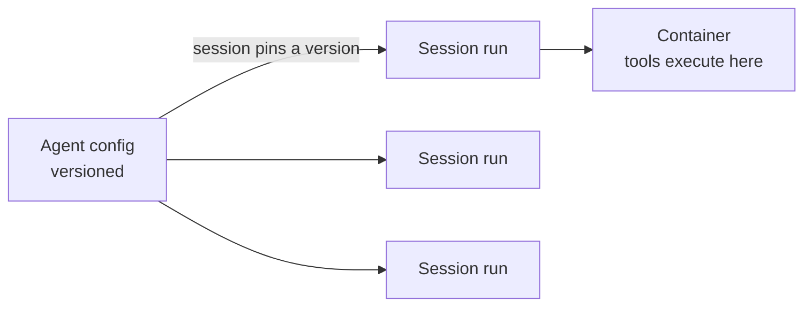

<LevelBadge level="advanced" />

<VerifyNote lastVerified="2026-07-21" source="https://platform.claude.com/docs/en/managed-agents/overview">
Managed agent capabilities and availability change — the API is in beta. Confirm endpoints, field names, and access in the official docs before building on it.
</VerifyNote>

<Callout type="objectives" items={["Understand what a managed (Anthropic-hosted) agent loop hands off for you", "Separate the two core objects: a versioned Agent vs a per-run Session", "Inject secrets safely with Vaults — without the model ever seeing them", "Put an agent on a cron schedule with Scheduled Deployments — no scheduler to host", "Know when managed beats a custom loop, and the guardrails that still apply"]} />

If [building your own agent loop](/docs/api/building-agents) is more infrastructure than you want to own, a **managed** (Anthropic-hosted) agent runs the loop for you — so you focus on the agent's *job*, not on session plumbing, retries, state, and scheduling.

## The two objects: Agent vs Session

This is the mental model everything else hangs off. They are separate on purpose.

- An **Agent** is a *persisted, versioned configuration* — model, system prompt, tools, MCP servers, and skills. You create it once. Every update creates a new immutable version.
- A **Session** is a *runtime instance* — one execution that points at an agent by ID. Configuration lives on the agent, never the session.

<Callout type="tip">
Sessions **pin** to the agent version they were created with: running sessions keep their version, new sessions get the latest. That's how you ship config changes without breaking in-flight work.
</Callout>

## What "managed" buys you

Rather than hand-rolling and hosting the loop, you get hosted building blocks:

- **Sessions** — persistent runs you create per execution and resume; stream events over SSE.
- **Environments** — container infrastructure, either `cloud` (Anthropic-hosted) or `self_hosted` (tools execute in your own VPC). One container per session is the agent's workspace.
- **Memory stores** — persistent state across sessions, with versioning and redaction, without you wiring a database.
- **Vaults** — secrets for MCP auth and other services.
- **Scheduled deployments** — agents that run on a cron schedule, unattended.

<PromptCard title="Create an agent (versioned config), then run a session against it">{`# 1. Create the agent once
POST /v1/agents        -> returns $AGENT_ID
# 2. Each execution is a session pinned to that agent
POST /v1/sessions      { "agent": "$AGENT_ID" }`}</PromptCard>

## Vaults: secrets the model never sees

An autonomous agent often needs an API key — but the *model* should never read it. Vault credentials (`mcp_oauth`, `static_bearer`, `environment_variable`) are substituted at egress: an `environment_variable` credential is injected into the sandbox at execution time and is *never visible* to the model.

<Callout type="warning">
This is the safe pattern for giving an agent powerful access. Don't paste keys into the system prompt or a message — they become part of the context the model (and your logs) can see. Put them in a vault.
</Callout>

## Scheduled deployments: an agent on a cron

A **deployment** attaches a cron schedule to an agent. When the schedule fires, it starts a fresh session and completes its task — no scheduler for you to build or host. Good for a nightly data sync, a weekly compliance scan, or a daily digest.

<Steps items={[
  {title: "Define the schedule", body: "POST /v1/deployments with agent, environment_id, initial_events (must include a user.message), and a schedule: a POSIX cron expression plus an IANA timezone."},
  {title: "Each fire = a run", body: "Every trigger attempt creates a run record (drun_ prefix). Success carries a session_id; failure carries an error.type (e.g. environment_archived, session_rate_limited). List runs via GET /v1/deployment_runs?deployment_id=..."},
  {title: "Control the lifecycle", body: "Pause suppresses future triggers (manual runs still work); unpause resumes at the next occurrence and does NOT backfill missed triggers; archive is terminal."},
  {title: "Trigger on demand", body: "POST /v1/deployments/{id}/run starts a session immediately — even while paused — with trigger_context.type: manual."}
]} />

<PromptCard title="A weekly compliance scan, Fridays at 20:00 New York time">{`POST /v1/deployments
{
  "name": "Weekly compliance scan",
  "agent": "$AGENT_ID",
  "environment_id": "$ENVIRONMENT_ID",
  "initial_events": [
    {"type": "user.message", "content": [{"type": "text", "text": "Run the compliance scan and summarize findings."}]}
  ],
  "schedule": {"type": "cron", "expression": "0 20 * * 5", "timezone": "America/New_York"}
}`}</PromptCard>

<Callout type="tip">
Cron is `minute hour day-of-month month day-of-week`, minute-level granularity. DST uses wall-clock semantics: a time that doesn't exist on spring-forward is skipped; a time that occurs twice on fall-back fires twice. Pick a timezone and an hour that avoids those edges for anything sensitive.
</Callout>

## When to choose managed vs custom

| Choose **managed** when… | Choose a **custom loop / SDK** when… |
|---|---|
| You want hosting, state, scheduling, and secrets handled | You need full control over the loop and tools |
| You're prototyping quickly | You have strict custom infra/compliance needs |
| Ops simplicity matters more than control | You're embedding deeply in your own stack |

It's a spectrum — single call → workflow → custom agent (SDK) → managed. Start as simple as the task allows; move up only when you need to.

## Same guardrails apply

Hosted or not, an autonomous agent still takes actions. Keep **least privilege**, **bounded cost/iterations**, and **human approval for risky steps** — see [Securing Agents](/docs/security/securing-agents) and [Hardening Autonomous Runs](/docs/security/hardening-autonomous-runs).

<Callout type="takeaways" items={["Managed agents hand off the loop, sessions, environments, memory, vaults, and scheduling so you focus on the job", "An Agent is versioned config; a Session is one run that pins to a version — config lives on the agent, not the session", "Vault environment_variable credentials are injected at execution and never visible to the model — the safe way to give an agent secrets", "A scheduled deployment is a cron expression + IANA timezone; each fire creates a run, and unpause does not backfill missed triggers", "Managed sits at the hosted end of single call -> workflow -> custom -> managed; the autonomy guardrails still apply"]} />

## Check yourself

<Quiz title="Check yourself" questions={[
  {
    q: "What is the difference between an Agent and a Session?",
    options: [
      "They are two names for the same object",
      "An Agent is versioned configuration; a Session is one runtime execution that pins to an agent version",
      "A Session holds the model and system prompt; an Agent is just an ID",
      "An Agent runs the tools; a Session stores secrets"
    ],
    answer: 1,
    explain: "An Agent is the persisted, versioned config (model, prompt, tools, MCP, skills). A Session is a per-execution instance that references the agent and pins to its version at creation."
  },
  {
    q: "How should you give a managed agent an API key it needs?",
    options: [
      "Put it in the system prompt so the agent can read it",
      "Pass it in the first user message of the session",
      "Store it as a vault credential, injected at execution and never visible to the model",
      "Hard-code it into the tool definition"
    ],
    answer: 2,
    explain: "Vault credentials (e.g. an environment_variable type) are substituted at egress and never visible to the model — keys in the prompt or a message become part of the visible context."
  },
  {
    q: "A scheduled deployment was paused for two days and then unpaused. What happens to the triggers that would have fired while paused?",
    options: [
      "They are backfilled — every missed run executes on unpause",
      "They are not backfilled; the deployment simply resumes at the next scheduled occurrence",
      "The deployment is archived automatically",
      "All missed runs are queued and run one minute apart"
    ],
    answer: 1,
    explain: "Unpause resumes at the next occurrence and does not backfill missed triggers. (You can still force a run any time with the manual trigger, even while paused.)"
  }
]} />

## Next

- [Effort tuning on Managed Agents (July 2026 update)](/docs/api/effort-tuning) — pass `effort` inside the agent's `model` object at creation; sessions inherit it via the pinned version
- [Building Agents on the API](/docs/api/building-agents)
- [Cowork & Agent Teams](/docs/api/cowork-and-agent-teams)
- [Headless Mode & the Agent SDK](/docs/claude-code/headless-and-agent-sdk)
- [Securing Agents](/docs/security/securing-agents)
