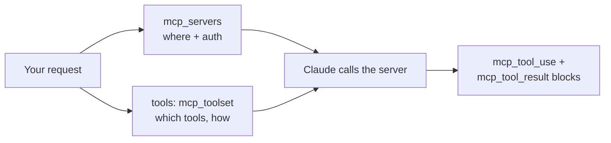

<LevelBadge level="advanced" />

The **Model Context Protocol (MCP)** is the open standard for connecting AI to external tools and data. On the API you don't have to run an MCP client at all: the **MCP connector** lets you name a remote server in your request and Claude calls its tools inside the normal agent loop. Two request fields replace an entire integration layer.

<Callout type="objectives" items={[
  "When the MCP connector beats hand-defining tools — and when it doesn't",
  "The exact request shape: mcp_servers for the connection, mcp_toolset for the policy",
  "Allowlist, denylist, and per-tool config — and how the three config layers merge",
  "The response blocks you have to handle: mcp_tool_use and mcp_tool_result",
  "The real limits: HTTPS-only, tools-only, platform gaps, and no ZDR coverage",
]} />

<VerifyNote lastVerified="2026-07-20" source="https://platform.claude.com/docs/en/agents-and-tools/mcp-connector">
The connector is in beta and the header has already changed once: the current version is `mcp-client-2025-11-20`, and `mcp-client-2025-04-04` is **deprecated**. Field names, platform availability, and beta status move — confirm against the official page and [modelcontextprotocol.io](https://modelcontextprotocol.io) before you ship.
</VerifyNote>

## MCP vs hand-defined tools

| | [Tool use](/docs/api/tool-use) (custom) | MCP connector |
|---|---|---|
| You define | Each tool's schema, and you execute it | A connection to a server that *publishes* tools |
| Who runs the tool | Your code, in your loop | Anthropic's side calls the remote server |
| Best for | A few bespoke functions in your app | Reusing existing integrations (GitHub, DBs, browsers, SaaS) |
| Auth | Your code | An OAuth bearer token you supply per server |

They coexist. Define your app-specific tools directly, and pull in ready-made capability via MCP.



## The request shape

Two pieces, and they are deliberately separate: **`mcp_servers`** says *where the server is and how to authenticate*; the **`mcp_toolset`** entry in the `tools` array says *which of its tools you're willing to expose and how*.

<Steps items={[
  {title: "Send the beta header", body: "anthropic-beta: mcp-client-2025-11-20 — without it the mcp_servers field is not accepted. In the SDKs this is the betas list on a beta.messages.create call."},
  {title: "Declare the server in mcp_servers", body: "Give it type url, an https url, and a unique name. Add authorization_token if the server requires OAuth — you run the OAuth flow yourself and pass the resulting access token."},
  {title: "Add a matching mcp_toolset to tools", body: "Set mcp_server_name to the name you just used. With no further config, every tool on that server is enabled with defaults."},
  {title: "Handle the new response blocks", body: "Claude's reply can contain mcp_tool_use and mcp_tool_result content blocks. Render or log them like tool blocks — do not assume the response is plain text."},
]} />

<PromptCard title="Minimal MCP connector call (cURL)">{`curl https://api.anthropic.com/v1/messages \\
  -H "Content-Type: application/json" \\
  -H "X-API-Key: $ANTHROPIC_API_KEY" \\
  -H "anthropic-version: 2023-06-01" \\
  -H "anthropic-beta: mcp-client-2025-11-20" \\
  -d '{
    "model": "MODEL_ID",
    "max_tokens": 1000,
    "messages": [{"role": "user", "content": "What tools do you have available?"}],
    "mcp_servers": [
      {"type": "url", "url": "https://example.com/sse", "name": "example-mcp", "authorization_token": "YOUR_TOKEN"}
    ],
    "tools": [
      {"type": "mcp_toolset", "mcp_server_name": "example-mcp"}
    ]
  }'`}</PromptCard>

:::tip Never hard-code the model
`MODEL_ID` above is a placeholder on purpose. Read the current ID from [Current Models & Pricing](/docs/whats-new/models-and-pricing) and keep it in config, so a model upgrade is a one-line change.
:::

The API enforces a strict pairing: every server in `mcp_servers` must be referenced by **exactly one** toolset, and every toolset's `mcp_server_name` must match a declared server. Mismatches are validation errors, not silent no-ops.

## Choose what Claude can actually do

This is the part most integrations get wrong. A toolset takes a `default_config` applied to every tool, plus `configs` with per-tool overrides. Precedence, highest first: **per-tool `configs` → set-level `default_config` → system defaults**.

**Denylist** — enable everything, then switch off the dangerous ones. Reasonable when you want breadth but no destructive writes:

```json
{
  "type": "mcp_toolset",
  "mcp_server_name": "calendar-mcp",
  "configs": {
    "delete_all_events": { "enabled": false },
    "share_calendar_publicly": { "enabled": false }
  }
}
```

**Allowlist** — disable by default, then name the survivors. This is the least-privilege posture, and the one to reach for by default:

```json
{
  "type": "mcp_toolset",
  "mcp_server_name": "calendar-mcp",
  "default_config": { "enabled": false },
  "configs": {
    "search_events": { "enabled": true },
    "create_event": { "enabled": true }
  }
}
```

:::warning A denylist only blocks what you thought of
Servers can add tools. A denylist silently grants every tool shipped after you wrote it; an allowlist silently *ignores* them. For anything touching customer data or money, allowlist. Note too that naming a tool in `configs` that doesn't exist on the server logs a backend warning but does **not** error — so a typo in an allowlist quietly disables the tool you meant to enable. Verify against the server's live tool list.
:::

## Keep the schemas out of your context

Every enabled tool's description is sent with the request, so a fat catalog taxes every turn. The connector's answer is `defer_loading: true`: the description stays out of the initial context, and Claude pulls it in on demand via the Tool Search Tool.

```json
{
  "type": "mcp_toolset",
  "mcp_server_name": "calendar-mcp",
  "default_config": { "defer_loading": true },
  "configs": {
    "search_events": { "defer_loading": false }
  }
}
```

Read that as: *defer everything except the one tool this task starts with*. A toolset also accepts `cache_control`, so a stable catalog can sit behind a [prompt caching](/docs/api/prompt-caching) breakpoint instead of being re-billed every turn. For the numbers behind this — and why deferring tools *raised* selection accuracy rather than lowering it — see [The MCP Token Tax](/docs/claude-code/mcp-token-cost). When it's the *results* rather than the definitions flooding your context, reach for [Programmatic Tool Calling](/docs/api/programmatic-tool-calling) instead.

## What comes back

Two content-block types you must handle:

```json
{ "type": "mcp_tool_use", "id": "mcptoolu_...", "name": "echo",
  "server_name": "example-mcp", "input": { "param1": "value1" } }

{ "type": "mcp_tool_result", "tool_use_id": "mcptoolu_...", "is_error": false,
  "content": [ { "type": "text", "text": "Hello" } ] }
```

Note `server_name` on the use block: with several servers connected, that's how you attribute a call — essential for logging and for debugging which integration misbehaved. And `is_error` is a field, not an exception: a failing MCP tool comes back as a *result*, so your loop must inspect it rather than assume success.

## The limits that bite

<Callout type="warning" items={[
  "Tools only. Of the MCP spec, the connector currently supports tool calls — not prompts or resources. Need those? Run your own client and use the SDK MCP helpers instead.",
  "Remote HTTPS only. The server must be publicly reachable over HTTP (Streamable HTTP or SSE transports). A local stdio server cannot be connected this way — that is what Claude Code and the desktop apps do.",
  "Platform gaps. Available on the Claude API, Claude Platform on AWS, and Microsoft Foundry (Hosted-on-Anthropic deployments). Not currently on Amazon Bedrock or Google Cloud.",
  "No zero-data-retention. Data exchanged with MCP servers — tool definitions and execution results — falls under standard retention, not ZDR.",
  "You own the OAuth. The API takes an authorization_token; obtaining it and refreshing it before expiry is your job.",
]} />

## Same standard, three surfaces

- **API** (this page) — remote servers by URL, via the connector.
- **[Claude Code](/docs/claude-code/mcp)** — local and remote servers in your dev sessions.
- **[The apps](/docs/claude-app/connectors)** — MCP powers Connectors.

Learn the protocol once; it transfers. Only the wiring differs.

## Trust

:::warning An MCP server is code plus access
Only connect servers you trust, scope them to least privilege with an allowlist, and remember that content a server returns is untrusted input that can carry [prompt injection](/docs/security/prompt-injection). Review third-party servers before you wire them in — [Reviewing Third-Party Code](/docs/security/reviewing-third-party-code) and [Securing MCP Servers](/docs/security/securing-mcp-servers).
:::

<Flashcards title="MCP connector vocabulary" cards={[
  {front: "MCP connector", back: "Calling a remote MCP server directly from the Messages API, with no MCP client of your own."},
  {front: "mcp_servers", back: "Request field holding the connection: type, https url, unique name, optional authorization_token."},
  {front: "mcp_toolset", back: "An entry in the tools array that says which of a server's tools are enabled and how. Points at a server via mcp_server_name."},
  {front: "default_config vs configs", back: "Set-wide defaults vs per-tool overrides. configs wins over default_config, which wins over system defaults."},
  {front: "defer_loading", back: "Keeps a tool's description out of the initial context until Claude searches for it — the fix for a bloated tool catalog."},
  {front: "is_error on a tool result", back: "A failing MCP tool returns a result block with is_error true — not an exception. Inspect it in your loop."},
]} />

<Quiz title="Check yourself" questions={[
  {q: "You want Claude to use only search_events and create_event from a calendar server. What's the correct toolset shape?", options: ["List them in an allowed_tools array on the server definition", "Set default_config.enabled to false, then enable those two in configs", "Set defer_loading true on every other tool"], answer: 1, explain: "allowed_tools belongs to the deprecated mcp-client-2025-04-04 header. In the current version you allowlist by disabling by default in default_config and enabling specific tools in configs. defer_loading affects context cost, not permission."},
  {q: "An MCP tool call fails. Where does that show up?", options: ["As an HTTP error on the Messages request", "As an mcp_tool_result content block with is_error set to true", "The response silently omits the tool call"], answer: 1, explain: "Failures come back inside the response as a result block with is_error true. Code that assumes success will happily render a failed call as a fact."},
  {q: "You need Claude to read MCP resources from a local stdio server. Can the connector do it?", options: ["Yes — set type to stdio in mcp_servers", "No — the connector is remote-HTTPS and tool-calls only; run your own client with the SDK MCP helpers", "Yes, but only on Bedrock"], answer: 1, explain: "The connector supports tool calls against publicly reachable HTTPS servers. Local stdio servers, MCP prompts, and MCP resources need a client of your own, which the SDKs provide helpers for."},
  {q: "Your tool catalog spans four servers and dominates the context window every turn. Cheapest first move?", options: ["Switch to a bigger-context model", "Set default_config.defer_loading true and un-defer only the tools a task starts with", "Split the work across four separate requests"], answer: 1, explain: "Deferred loading keeps descriptions out of context until Claude searches for them. It cuts the per-turn schema tax without dropping any capability — and tends to improve tool selection, because fewer tools crowd the context."},
]} />

<Callout type="takeaways" items={[
  "The connector replaces an MCP client with two request fields — but only for remote HTTPS servers, and only for tool calls.",
  "mcp_servers is the connection; the mcp_toolset in tools is the policy. Each server must pair with exactly one toolset.",
  "Allowlist (default_config.enabled false, plus explicit configs) beats denylist: tools added to the server later are ignored, not granted.",
  "defer_loading and cache_control are your levers when tool schemas start eating the context window.",
  "Handle mcp_tool_use and mcp_tool_result blocks — including is_error, which is a field, not an exception.",
  "Check the beta header before shipping: mcp-client-2025-11-20 is current, mcp-client-2025-04-04 is deprecated.",
]} />

## Sources & further reading

- [MCP connector — Anthropic docs](https://platform.claude.com/docs/en/agents-and-tools/mcp-connector) — the authoritative field reference and migration guide.
- [Model Context Protocol specification](https://modelcontextprotocol.io) — the open standard itself, including authorization.

## Next

- [Tool Use / Function Calling](/docs/api/tool-use)
- [Building Agents on the API](/docs/api/building-agents)
- [The MCP Token Tax](/docs/claude-code/mcp-token-cost)
- [Build & Wire Your First MCP Server](/docs/walkthroughs/first-mcp-server)
- [MCP Config Builder](/docs/tools/mcp-config-builder)
