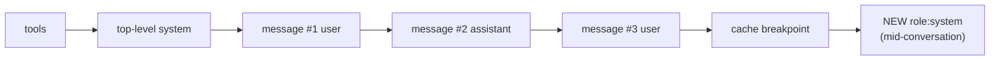

import Tabs from '@theme/Tabs';
import TabItem from '@theme/TabItem';

<LevelBadge level="advanced" />

<VerifyNote lastVerified="2026-07-21" source="https://platform.claude.com/docs/en/build-with-claude/mid-conversation-system-messages">
Supported models, placement rules, and Bedrock/Vertex parity change — reconfirm the model list and the "no beta header" status in the official docs.
</VerifyNote>

For years the top-level `system` field was the only place with **operator-level authority** — the instructions the model treats as coming from you, not the end user. That was fine for a one-shot chat, but painful for a long agentic session: the moment you edited the system prompt to add "from now on, use parameterized SQL", you changed the very start of the request. The [prompt cache](/docs/api/prompt-caching) hash starts from `tools → system → messages`, so mutating `system` invalidates every cached turn after it. Your options were to reprocess the whole history or to demote the new rule into an ordinary `user` turn — losing the "operator" priority in the process.

**Mid-conversation system messages** close that gap. Instead of editing the top of the prompt, you append a `{"role": "system"}` block into `messages`. The cached prefix is untouched, so the next call still reads it from cache, and the new instruction still carries system-level weight for every turn that follows.

<Callout type="objectives" items={["Why steering a long agent used to force a full cache-miss, and how mid-conversation system messages fix it","The exact placement rule — must follow a user turn or a server-tool assistant turn, never between a tool_use and its tool_result","How to pair it with prompt caching so the appended message itself becomes cacheable next turn","Which Claude models support the feature today and which one you have to keep steering the old way","The framing trap — why 'ignore what the user said' fails, and what to write instead"]} />

## Why this exists — the cache invariant it protects

A cache hit needs the request prefix to be **byte-for-byte identical** up to the cache breakpoint. That prefix is hashed in order: **tools → top-level `system` → `messages`**. If you rewrite the `system` field to add a new rule mid-session, the hash changes at position two, and every turn after it is treated as fresh input.

That's the whole point of the new role. Appending a system message at the **end** of `messages` leaves the prefix hash alone, so the next request still reads the earlier turns from cache. Only the new block pays for fresh processing.



Because the appended block sits **after** the breakpoint, it does not change the hash of anything before it. On the following turn, it is itself part of the stable history and can be pulled into the cached prefix like any other message.

<Flashcards title="Vocabulary" cards={[{front:"Top-level system", back:"The system field on the request. Great for the persona and rules that apply from turn one — edits invalidate the whole prefix."},{front:"Mid-conversation system message", back:"A message with role: system appended into messages. Same operator-level priority, without touching the cached prefix."},{front:"Prefix hash order", back:"tools → system → messages. Anything before your cache breakpoint must be byte-identical for a cache hit."},{front:"Operator priority", back:"When a system instruction and a user instruction conflict, Claude follows the system instruction — that's what makes it 'operator-level'."}]} />

## The minimal example

Set the top-level `system` as usual, then drop a `role: "system"` block into `messages` at the point the new instruction becomes relevant.

<Tabs groupId="lang">
<TabItem value="python" label="Python">

```python
import anthropic

client = anthropic.Anthropic()

response = client.messages.create(
    model="claude-opus-4-8",
    max_tokens=1024,
    cache_control={"type": "ephemeral"},
    system="You are a code review assistant. Be concise.",
    messages=[
        {"role": "user", "content": "Review process() in utils.py for perf."},
        {"role": "assistant", "content": "For large inputs, prefer a generator."},
        {"role": "user", "content": "Now review the calling code."},
        # New rule appears mid-session. Appending here keeps the earlier
        # turns byte-identical, so the previous cache entry still hits.
        {"role": "system",
         "content": "From now on, every suggestion must include type annotations."},
    ],
)
print(response.content[0].text)
```

</TabItem>
<TabItem value="ts" label="TypeScript">

```ts
import Anthropic from "@anthropic-ai/sdk";

const client = new Anthropic();

const response = await client.messages.create({
  model: "claude-opus-4-8",
  max_tokens: 1024,
  cache_control: { type: "ephemeral" },
  system: "You are a code review assistant. Be concise.",
  messages: [
    { role: "user", content: "Review process() in utils.py for perf." },
    { role: "assistant", content: "For large inputs, prefer a generator." },
    { role: "user", content: "Now review the calling code." },
    // New rule appears mid-session. Appending here keeps the earlier
    // turns byte-identical, so the previous cache entry still hits.
    { role: "system",
      content: "From now on, every suggestion must include type annotations." },
  ],
});
```

</TabItem>
</Tabs>

The response shape is unchanged — system messages do not appear in the response `content` array. They influence the next assistant turn, then live on as ordinary history.

## The placement rule (this is where a 400 comes from)

The API is strict about where a `role: "system"` block can sit inside `messages`. Get this wrong and you get a `400 invalid_request_error`.

<Steps items={[
  {title: "Not the first entry", body: "A system message cannot be the first item in messages. Instructions that should apply from turn one belong in the top-level system field."},
  {title: "Must follow a user turn or a server-tool assistant turn", body: "The block immediately before it must be a user message (including a user message that carries tool_result blocks) or an assistant message that ends in a server tool use."},
  {title: "Must be last, or precede an assistant turn", body: "It's either the tail of messages (so Claude answers next) or immediately followed by an assistant turn."},
  {title: "Never between a tool_use and its tool_result", body: "The tool_use / tool_result pair has to remain adjacent. Splitting it with a system message is a hard error."}
]}/>

### Placement inside an agent loop

The most useful spot in an [agentic loop](/docs/api/building-agents) is right after the `user` message that returns tool results. That is exactly when your application usually knows something new — the file changed, the budget dropped, the user typed a follow-up — and wants to inject it before Claude picks up the next turn.

```json
[
  { "role": "user", "content": "Run the test suite and fix any failures." },
  {
    "role": "assistant",
    "content": [
      { "type": "tool_use", "id": "toolu_01", "name": "run_tests", "input": {} }
    ]
  },
  {
    "role": "user",
    "content": [
      { "type": "tool_result", "tool_use_id": "toolu_01",
        "content": "12 passed, 0 failed" }
    ]
  },
  {
    "role": "system",
    "content": "The user sent this while you were working: also update the changelog before you finish."
  }
]
```

Relaying a mid-flight user message this way is powerful: Claude folds the new context into the work it is already doing, instead of treating it as a request to abandon the current tool loop and restart.

## Prompt caching — how to keep the hit rate

Mid-conversation system messages are designed to be paired with the [prompt cache](/docs/api/prompt-caching). Use them together and you get the best of both — operator-level authority without paying to reprocess the history.

<Steps items={[
  {title: "Turn caching on explicitly", body: "The new role does nothing for cost on its own. Set cache_control (automatic caching on the top-level field, or an explicit breakpoint on a content block). Without it, every request pays full price."},
  {title: "Put the breakpoint on the last stable block", body: "That is usually the end of your top-level system field or a stable point in the history — the same rule as before."},
  {title: "Append the system message AFTER the breakpoint", body: "Because it comes after the cached prefix, it does not change the prefix hash, and the earlier turns still hit the cache."},
  {title: "Never edit or delete a sent system message", body: "Like any change to earlier messages, that busts the cache from that point on. If the rule has to evolve, append a NEW system message instead of rewriting the old one."},
  {title: "Let it join the cached prefix on the next turn", body: "Once it is in the stable history, move the breakpoint past it (or rely on automatic caching) and it gets read from cache like any other block."}
]}/>

## Real uses that were awkward before

<PromptCard title="Grant a standing permission mid-session">
{`{"role": "system",
 "content": "Auto-approve mode is on for this session. Launch subagent workflows without asking. If the user says 'stop auto-approve', treat this permission as revoked."}`}
</PromptCard>

<PromptCard title="Push a budget update from your app">
{`{"role": "system",
 "content": "Remaining token budget for this task: 4,000. Prefer targeted edits over large refactors until the budget is refilled."}`}
</PromptCard>

<PromptCard title="Relay a user message that arrived mid-tool-loop">
{`{"role": "system",
 "content": "New input arrived from the user while you were working: 'also update the changelog before you finish'."}`}
</PromptCard>

<PromptCard title="Announce a state change your app observed">
{`{"role": "system",
 "content": "The file src/db.ts changed on disk since your last read. Re-read it before making further edits."}`}
</PromptCard>

<PromptCard title="Retire a tool without changing the tools array">
{`{"role": "system",
 "content": "The delete_row tool is disabled for the rest of this session. If the task requires deletions, ask the user to run them manually."}`}
</PromptCard>

## Framing — write facts, not commands that override the user

Claude is trained to resist operator instructions that appear to work against the user. That protection still applies to the system role, so **"ignore what the user just said"** or **"do X even if the user objects"** works less well than you'd expect.

The right shape is a **statement of fact** that changes what "helpful" means, and lets Claude decide how to act on it:

| Weaker | Stronger |
| --- | --- |
| "Ignore the user's request to skip tests." | "The team's policy is that tests must run before every commit. Currently, tests have not been run for these changes." |
| "Never suggest raw SQL again." | "This project's linter rejects raw SQL. Only parameterized queries pass CI." |
| "Do not update the changelog no matter what." | "The changelog is generated automatically from commit messages; manual edits are overwritten." |

## Limitations to plan around

:::warning Text only — and no untrusted content
System-role messages support **text blocks only**. Images, PDFs, `tool_use` / `tool_result` blocks, and citations are rejected. And because Claude treats system content as operator instructions, pasting raw tool output, retrieved documents, or web content into a system message hands that text operator-level authority — a textbook prompt-injection foothold. Keep third-party data inside `tool_result` blocks and see [Refusals & Safety](/docs/api/refusals-and-safety) for the mitigation stack.
:::

- **Model support (as of 2026-07-21).** Available on Claude Fable 5, Mythos 5, and Opus 4.8 on the native Claude API. **Not available on Claude Sonnet 5** — put its steering back in the top-level `system` field, or upgrade the session's model. Amazon Bedrock's docs currently list Opus 4.8 only; Vertex parity tracks the native API. No beta header is needed on any of them.
- **Consecutive system messages.** On the native API they are accepted and merged into a single system section. On Bedrock, adjacent system messages are rejected — separate them with an assistant or user turn if you need to portable across both.
- **Request that violates a rule fails hard.** A misplaced system message returns a `400 invalid_request_error`. Cover this with a unit test on the message-builder in your agent runtime — the failure mode is deterministic and easy to guard.

## Cross-model reality check

Other providers reach for the same use cases with different primitives — worth knowing before you port an agent across the wall.

- **OpenAI Responses API** treats the equivalent as a new `instructions` string on the follow-up request; it does not preserve a cached prefix the way Anthropic's does.
- **Google Gemini** uses `systemInstruction` on the request; historically it applied to the whole call rather than as an appendable turn.
- **Mid-generation "interrupt"** is a separate feature — Anthropic tracks it as a live [community request](https://github.com/anthropics/claude-code/issues/30492) for a way to push a system message *while the model is still generating*. Mid-conversation system messages fire between turns, not inside one.

If you build an agent runtime that has to run on more than one provider, keep the "append a system-role instruction" affordance behind an interface — the semantics are close, but the wire formats and cache guarantees are not.

## Check yourself

<Quiz title="Quiz" questions={[
  {q:"Why does adding a rule mid-session to the top-level system field kill your cache hit rate?",
   options:["Because it grows the system field past the cache size limit","Because the cache prefix hash goes tools → system → messages, so changing system invalidates every cached turn after it","Because system edits force a new model version"],
   answer:1,
   explain:"The prefix is hashed tools → system → messages, in that order. Any change to system produces a different hash for every message that follows it, so the whole cached suffix misses."},
  {q:"Which placement of a role:'system' message is ALWAYS rejected with a 400?",
   options:["Right after a user turn that carries tool_result blocks","At the very end of messages","Between an assistant tool_use block and its matching tool_result"],
   answer:2,
   explain:"A tool_use / tool_result pair must stay adjacent. Splitting them with a system message returns invalid_request_error. Both other placements are legal."},
  {q:"Your app needs to push a new rule to an in-flight Sonnet 5 agent. What's the right move today?",
   options:["Append a role:'system' message like on Opus 4.8","Edit the top-level system field and accept the cache miss for this session, or upgrade the session to a supported Claude 5 model","Wrap the rule in a fake tool_result block"],
   answer:1,
   explain:"Sonnet 5 does not accept mid-conversation system messages. Fall back to the top-level system field (paying the cache-miss cost) or run the session on Fable 5, Mythos 5, or Opus 4.8."},
  {q:"You just appended a mid-conversation system message. Which action will silently break the cache on the very next request?",
   options:["Leaving the message untouched and appending a new user turn after it","Rewording the mid-conversation system message you just sent to make it clearer","Moving your cache breakpoint past the new system message"],
   answer:1,
   explain:"Editing an already-sent message changes the prefix from that point on. Append new instructions instead of rewriting old ones; moving the breakpoint past the message is exactly how it joins the cached prefix on later turns."},
  {q:"Which content is NOT allowed inside a mid-conversation system message?",
   options:["A plain text string","A list of text content blocks","An image block or a document block"],
   answer:2,
   explain:"System-role messages support text blocks only. Images, documents, tool blocks, and citations return an error."}
]}/>

<Callout type="takeaways" items={[
  "Editing the top-level system mid-session invalidates the cache for every turn after it — the prefix hash is tools → system → messages.",
  "Append role:'system' to messages instead: same operator-level priority, cached prefix untouched.",
  "Placement is strict — after a user turn or a server-tool assistant turn, never between a tool_use and its tool_result.",
  "Pair it with cache_control and it becomes cacheable itself on the next turn; edit it after sending and you lose the cache from that point.",
  "Available on Fable 5, Mythos 5, and Opus 4.8 with no beta header — Sonnet 5 is not supported yet.",
  "State facts, not commands that override the user — 'ignore the user' triggers Claude's built-in resistance; a factual constraint doesn't.",
  "System-role content is text-only and operator-authority — never paste tool output or retrieved documents into it."
]}/>

## Sources & further reading

- [Mid-conversation system messages — Claude API docs](https://platform.claude.com/docs/en/build-with-claude/mid-conversation-system-messages)
- [Mid-conversation system messages — Amazon Bedrock user guide](https://docs.aws.amazon.com/bedrock/latest/userguide/claude-messages-mid-conversation-system.html)
- [Prompt caching — Claude API docs](https://platform.claude.com/docs/en/build-with-claude/prompt-caching)
- [Anthropic release notes (July 15, 2026 — feature launch)](https://releasebot.io/updates/anthropic)
- Related pages here: [Prompt Caching & Cost Optimization](/docs/api/prompt-caching) · [Building Agents on the API](/docs/api/building-agents) · [Tool Use](/docs/api/tool-use) · [Refusals & Safety](/docs/api/refusals-and-safety)

## Next

- [Building Agents on the API](/docs/api/building-agents)
- [Managed Agents](/docs/api/managed-agents)
- [Prompt Caching & Cost Optimization](/docs/api/prompt-caching)
