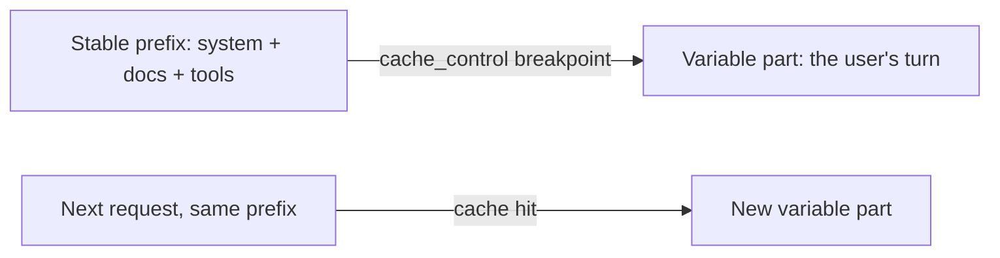

import Tabs from '@theme/Tabs';
import TabItem from '@theme/TabItem';

<LevelBadge level="advanced" />

<VerifyNote lastVerified="2026-07-01" source="https://platform.claude.com/docs/en/build-with-claude/prompt-caching">
Cache mechanics, eligibility, and pricing of cached vs fresh tokens change — confirm in the official prompt-caching docs.
</VerifyNote>

If many of your requests share a large, unchanging chunk — a long system prompt, a big document, a tool catalog — **prompt caching** lets the API reuse the processed prefix instead of re-reading it every call. That cuts both **cost** and **latency** on the cached part.

<Callout type="objectives" items={["The mental model: a cache breakpoint after a stable prefix, reused across calls","How to mark the breakpoint in Python and TypeScript with cache_control","The one invariant that makes or breaks it — the prefix must be byte-for-byte identical","How to read usage fields to confirm you are actually getting cache hits","Where caching pays off most, and how to pair it with batching and right-sizing"]} />

## How it works (the mental model)

You mark a **cache breakpoint** after the stable prefix. On the first call it's processed and cached; subsequent calls that share the **exact same prefix** hit the cache and pay much less for it.



<Flashcards title="Caching vocabulary" cards={[{front:"Cache breakpoint","back":"The cache_control marker placed after the stable prefix. Everything up to and including the marked block is cached."},{front:"Cache write","back":"The first call's small premium to populate the cache."},{front:"Cache read","back":"Every later call with the same prefix reads it back at a fraction of the input price."},{front:"Silent invalidator","back":"A changing value near the top of the prompt (timestamp, user name, reordered tool list) that changes the prefix and quietly drops the hit rate to zero."}]} />

## Mark the breakpoint (copy-paste)

Add `cache_control` to the **last stable block** — here, a large system prompt. The user's turn comes after it and varies freely; everything up to and including the marked block is cached.

<Steps items={[{title: "Identify the stable prefix", body: "Find the large, unchanging chunk — a long system prompt, a big document, or a tool catalog reused across many requests."},{title: "Attach cache_control to its last block", body: "Mark the last stable block with cache_control of type ephemeral, so the prefix up to and including it is cached."},{title: "Let the variable part follow", body: "Put the user's turn after the marked block — it varies freely on every call and is billed at full price."},{title: "Confirm the hit", body: "Read cache_read_input_tokens from the response usage. Greater than zero means you got a cache hit."}]} />

<Tabs groupId="lang">
<TabItem value="python" label="Python">

```python
import anthropic

client = anthropic.Anthropic()

message = client.messages.create(
    model="claude-sonnet-5",
    max_tokens=1024,
    system=[
        {
            "type": "text",
            "text": LARGE_STABLE_PROMPT,  # long, unchanging — the cached prefix
            "cache_control": {"type": "ephemeral"},
        }
    ],
    messages=[{"role": "user", "content": "Summarize the key points."}],  # varies per call
)

print(message.usage.cache_read_input_tokens)  # > 0 means you got a hit
```

</TabItem>
<TabItem value="ts" label="TypeScript">

```ts
import Anthropic from "@anthropic-ai/sdk";

const client = new Anthropic();

const message = await client.messages.create({
  model: "claude-sonnet-5",
  max_tokens: 1024,
  system: [
    {
      type: "text",
      text: LARGE_STABLE_PROMPT, // long, unchanging — the cached prefix
      cache_control: { type: "ephemeral" },
    },
  ],
  messages: [{ role: "user", content: "Summarize the key points." }], // varies per call
});

console.log(message.usage.cache_read_input_tokens); // > 0 means you got a hit
```

</TabItem>
</Tabs>

The first call pays a small **write** premium to populate the cache; every later call with the same prefix reads it back at a fraction of the input price. The prefix must be long enough to be eligible — a few thousand tokens, model-dependent — or it silently won't cache.

## The invariant that makes or breaks it

:::warning Caching is prefix-exact
A cache hit requires the cached prefix to be **byte-for-byte identical**. The most common bug: a *silent invalidator* near the top of the prompt — a timestamp, a changing user name, a reordered tool list — that changes the prefix and quietly drops your hit rate to zero.
:::

**Put everything stable first, everything variable last,** and keep the prefix truly constant.

## Check that it's actually working

Don't assume — read it back from the response `usage`:

- **`cache_creation_input_tokens`** — tokens written to the cache this call (the first request).
- **`cache_read_input_tokens`** — tokens served from the cache (the savings).
- **`input_tokens`** — the uncached remainder, billed at full price.

If `cache_read_input_tokens` stays **zero** across repeated requests that should share a prefix, a silent invalidator is at work — diff the rendered prompt bytes between two calls to find it.

## Where it pays off most

- Long **system prompts** reused across users.
- **RAG / document Q&A** where the same source text is queried repeatedly.
- **Agents** with a fixed tool catalog and instructions over many turns.

Pair caching with **batching** for offline workloads, and with right-sizing the model ([Choosing a Model](/docs/api/choosing-a-model)) for the biggest combined savings — see [Cost & Latency](/docs/foundations/cost-and-latency).

<Quiz title="Check yourself" questions={[{q:"What does a cache hit require of the cached prefix?",options:["It must be at least one token long","It must be byte-for-byte identical to the prior prefix","It must come after the user's turn"],answer:1,explain:"A cache hit requires the cached prefix to be byte-for-byte identical. Any change — a timestamp, a reordered tool list — invalidates it."},{q:"Which usage field tells you tokens were served from the cache (your savings)?",options:["input_tokens","cache_creation_input_tokens","cache_read_input_tokens"],answer:2,explain:"cache_read_input_tokens is the tokens served from the cache. cache_creation_input_tokens is what was written on the first call; input_tokens is the uncached remainder billed at full price."},{q:"Where should the variable, per-call content go relative to the cache breakpoint?",options:["Before the stable prefix","Last — after the marked block","Interleaved throughout the system prompt"],answer:1,explain:"Put everything stable first and everything variable last. The user's turn comes after the marked block and varies freely on each call."}]} />

<Callout type="takeaways" items={["Mark a cache breakpoint after the stable prefix; the first call writes it, later calls read it back cheaply.","A cache hit needs a byte-for-byte identical prefix — keep stable content first, variable content last.","Silent invalidators near the top of the prompt (timestamps, names, reordered tools) quietly drop hit rate to zero.","Verify with usage: cache_read_input_tokens > 0 means a hit; zero across repeated requests means an invalidator is at work.","Caching pays off most for reused system prompts, RAG, and agents; combine it with batching and model right-sizing."]} />

## Next

- [Mid-Conversation System Messages](/docs/api/mid-conversation-system-messages) — steer a long agent without busting the cached prefix.
- [Tokens, Context & Pricing](/docs/api/tokens-and-pricing)
- [Streaming & Multi-Turn](/docs/api/streaming)
- [Building Agents on the API](/docs/api/building-agents)
