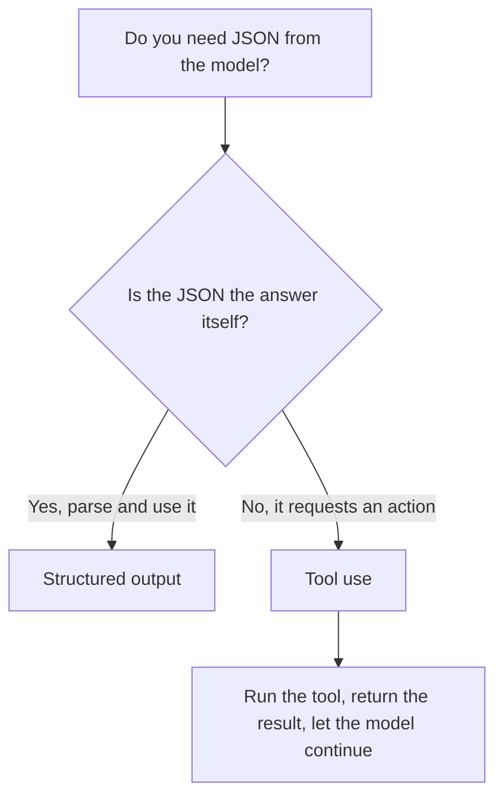

<LevelBadge level="intermediate" />

<VerifyNote lastVerified="2026-06-20" source="https://docs.anthropic.com/en/docs/build-with-claude/structured-outputs">
The exact mechanism for enforcing a schema evolves — confirm the current approach (output config / parse helpers) in the official docs.
</VerifyNote>

When Claude's output feeds other software, you need **reliable structure** — valid JSON matching a known shape, every time. Don't rely on "respond in JSON" and hope; use the platform's structured-output support.

## The reliable way

Provide a **JSON Schema** for the output and let the API/SDK enforce it, then parse into a typed object (e.g. Pydantic in Python, Zod in TypeScript). The SDK parse helpers hand you a typed result instead of a string you have to `JSON.parse` and validate yourself.

```python
# Conceptual shape — see the official docs for the current API surface.
from pydantic import BaseModel

class Ticket(BaseModel):
    title: str
    priority: str   # "low" | "medium" | "high"
    tags: list[str]

# Request the model to return data conforming to Ticket's JSON schema,
# then parse the response into a Ticket instance.
```

## Why not just prompt for JSON?

You *can* ask for JSON in the prompt, and for simple cases it works — but it can drift: stray prose, a trailing comma, a missing field. Schema-enforced output removes that class of bug, which matters the moment a downstream system depends on it.

## Structured output vs. tool use

Both features hand the model a **JSON Schema**, so they look alike — and people pick the wrong one. The difference is *intent*, not mechanism:

| | **Structured output** | **[Tool use](/docs/api/tool-use)** |
|---|---|---|
| What you want | The **final answer**, in a fixed shape | The model to **invoke a capability** (call a function, fetch data, take an action) |
| Who consumes it | Your code, directly | Your code runs the tool, then feeds the result back to the model |
| Turn shape | One response, done | A loop: model asks, you execute, model continues |
| Typical use | Extraction, classification, parsing | Agents, live lookups, side effects |

A quick rule of thumb:



If the JSON *is* the deliverable, use structured output. If the JSON is the model asking your code to *do* something, that's tool use. Agents often use both: tools to act, structured output to return a clean final result.

## Tips

- **Keep schemas tight.** Use enums for fixed choices; mark required fields.
- **Describe fields.** Field descriptions guide the model like mini-prompts.
- **Validate anyway** at the boundary — defensive parsing is cheap insurance.
- For **extraction** tasks, structured output + a clear schema beats freeform every time.

## Next

- [Tool Use / Function Calling](/docs/api/tool-use) — tools also use JSON schemas
- [Your First API Call](/docs/api/first-call)
- [Reusable Prompt Templates](/docs/templates/prompts)
