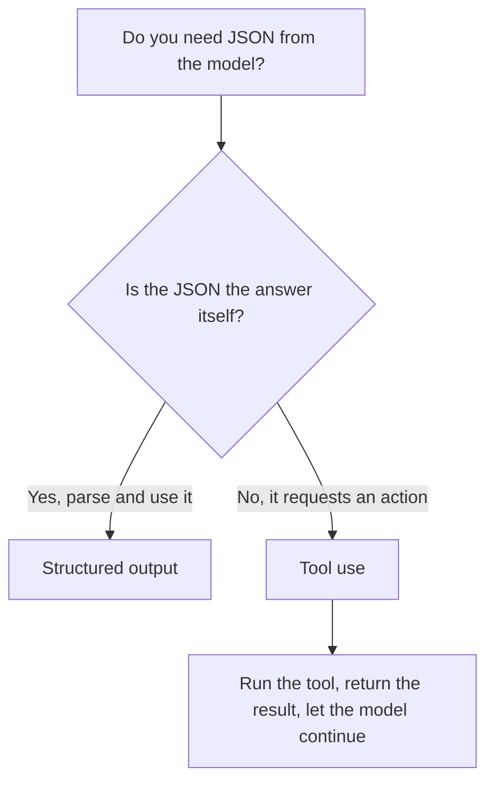

<LevelBadge level="intermediate" />

<VerifyNote lastVerified="2026-06-20" source="https://docs.anthropic.com/en/docs/build-with-claude/structured-outputs">
The exact mechanism for enforcing a schema evolves — confirm the current approach (output config / parse helpers) in the official docs.
</VerifyNote>

<Callout type="objectives" items={["Explain why schema-enforced output beats prompting for JSON and hoping", "Provide a JSON Schema and parse the response into a typed object (Pydantic / Zod)", "Tell structured output apart from tool use by intent, not by mechanism", "Apply the four tips for tight, reliable schemas", "Pick the right tool with a one-question rule of thumb"]} />

When Claude's output feeds other software, you need **reliable structure** — valid JSON matching a known shape, every time. Don't rely on "respond in JSON" and hope; use the platform's structured-output support.

This lesson walks you from *why prompt-and-pray fails* to *how to enforce a schema and parse it into a typed object* — and how to tell structured output apart from tool use when they look identical. Work through it top to bottom, then test yourself with the quiz near the end.

## The reliable way

Provide a **JSON Schema** for the output and let the API/SDK enforce it, then parse into a typed object (e.g. Pydantic in Python, Zod in TypeScript). The SDK parse helpers hand you a typed result instead of a string you have to `JSON.parse` and validate yourself.

<Steps items={[
  {title: "Define the shape", body: "Model the output you need as a JSON Schema — in Python via a Pydantic BaseModel, in TypeScript via a Zod schema."},
  {title: "Request schema-conforming output", body: "Ask the model to return data that conforms to that schema, so the API/SDK enforces it rather than leaving it to chance."},
  {title: "Parse into a typed object", body: "Use the SDK parse helpers to get a typed result directly — no manual JSON.parse plus hand-rolled validation."}
]} />

```python
# Conceptual shape — see the official docs for the current API surface.
from pydantic import BaseModel

class Ticket(BaseModel):
    title: str
    priority: str   # "low" | "medium" | "high"
    tags: list[str]

# Request the model to return data conforming to Ticket's JSON schema,
# then parse the response into a Ticket instance.
```

Want a concrete request to adapt? Here is the shape of what you hand the model — replace the model with your own schema.

<PromptCard title="Ask for schema-conforming output">{`Return the data conforming to this JSON Schema:

{
  "title": "string",
  "priority": "low | medium | high",
  "tags": ["string"]
}

Do not include any prose outside the JSON.`}</PromptCard>

## Why not just prompt for JSON?

You *can* ask for JSON in the prompt, and for simple cases it works — but it can drift: stray prose, a trailing comma, a missing field. Schema-enforced output removes that class of bug, which matters the moment a downstream system depends on it.

<Callout type="warning" items={["Prompted JSON works in demos and breaks in production: the failure shows up only when a downstream system parses it.", "Three classic drifts to watch for: stray prose around the JSON, a trailing comma, a missing required field."]} />

## Structured output vs. tool use

Both features hand the model a **JSON Schema**, so they look alike — and people pick the wrong one. The difference is *intent*, not mechanism:

| | **Structured output** | **[Tool use](/docs/api/tool-use)** |
|---|---|---|
| What you want | The **final answer**, in a fixed shape | The model to **invoke a capability** (call a function, fetch data, take an action) |
| Who consumes it | Your code, directly | Your code runs the tool, then feeds the result back to the model |
| Turn shape | One response, done | A loop: model asks, you execute, model continues |
| Typical use | Extraction, classification, parsing | Agents, live lookups, side effects |

A quick rule of thumb:



If the JSON *is* the deliverable, use structured output. If the JSON is the model asking your code to *do* something, that's tool use. Agents often use both: tools to act, structured output to return a clean final result.

## Tips

<Callout type="tip" items={["Keep schemas tight — use enums for fixed choices; mark required fields.", "Describe fields — field descriptions guide the model like mini-prompts.", "Validate anyway at the boundary — defensive parsing is cheap insurance.", "For extraction tasks, structured output + a clear schema beats freeform every time."]} />

<Callout type="takeaways" items={["Hand the API/SDK a JSON Schema and parse into a typed object — don't prompt-and-pray.", "Prompting for JSON can drift (stray prose, trailing comma, missing field); schema enforcement removes that bug class.", "Structured output vs. tool use differ by intent: the JSON IS the answer vs. the JSON requests an action.", "Tight schemas, described fields, and boundary validation make extraction and classification reliable."]} />

## Lock in the terms

<Flashcards cards={[
  {front: "Structured output", back: "You hand the API/SDK a JSON Schema for the final answer and parse the response into a typed object (Pydantic / Zod). The JSON IS the deliverable."},
  {front: "Tool use", back: "You hand the model a JSON Schema so it can invoke a capability. Your code runs the tool, then feeds the result back — a loop, not a one-shot answer."},
  {front: "JSON Schema", back: "The shape both features rely on. In Python you model it with a Pydantic BaseModel; in TypeScript with a Zod schema."},
  {front: "Parse helpers", back: "SDK helpers that return a typed result directly, so you skip manual JSON.parse plus hand-rolled validation."},
  {front: "One-question rule of thumb", back: "Is the JSON the answer itself? Yes → structured output. No, it requests an action → tool use."}
]} />

<Quiz title="Check yourself" questions={[
  {
    q: "What is the reliable way to get structured JSON from Claude?",
    options: [
      "Ask 'respond in JSON' in the prompt and retry on failures",
      "Provide a JSON Schema, let the API/SDK enforce it, then parse into a typed object",
      "Generate free text and write a regex to extract the fields"
    ],
    answer: 1,
    explain: "Provide a JSON Schema and let the API/SDK enforce it, then parse into a typed object like Pydantic (Python) or Zod (TypeScript)."
  },
  {
    q: "Why is prompting for JSON risky once a downstream system depends on it?",
    options: [
      "It is slower than schema enforcement",
      "It can drift — stray prose, a trailing comma, or a missing field",
      "It costs more tokens than tool use"
    ],
    answer: 1,
    explain: "Prompted JSON works for simple cases but can drift; schema-enforced output removes that class of bug."
  },
  {
    q: "What actually distinguishes structured output from tool use?",
    options: [
      "Structured output uses JSON Schema; tool use does not",
      "Intent: structured output is the final answer in a fixed shape, tool use invokes a capability",
      "Tool use is for Python and structured output is for TypeScript"
    ],
    answer: 1,
    explain: "Both hand the model a JSON Schema, so they look alike. The difference is intent, not mechanism — the final answer vs. invoking a capability."
  },
  {
    q: "Which is sound advice for designing schemas?",
    options: [
      "Leave fields optional and skip enums for flexibility",
      "Use enums for fixed choices, mark required fields, and validate anyway at the boundary",
      "Trust the schema and never validate the parsed output"
    ],
    answer: 1,
    explain: "Keep schemas tight (enums, required fields), describe fields like mini-prompts, and still validate at the boundary as cheap insurance."
  }
]} />

## Next

- [Tool Use / Function Calling](/docs/api/tool-use) — tools also use JSON schemas
- [Your First API Call](/docs/api/first-call)
- [Reusable Prompt Templates](/docs/templates/prompts)
