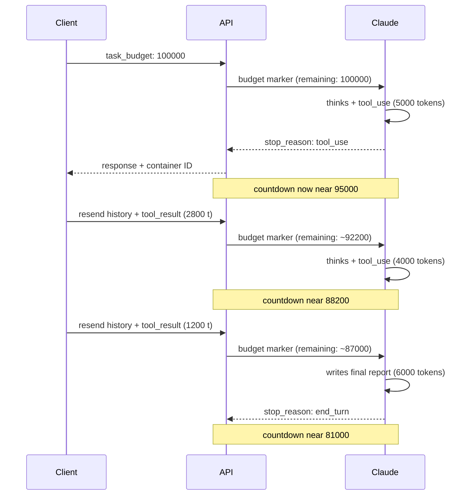

<LevelBadge level="advanced" />

<Callout type="objectives" items={[
  "Understand what a task budget is — an advisory, model-visible token countdown across an entire agentic loop",
  "Configure task_budget correctly — inside output_config, with the task-budgets-2026-03-13 beta header, on a supported model",
  "Read what actually counts against the budget (tokens Claude sees this turn) versus what does not (repeated payload from resent history)",
  "Choose a budget size that helps rather than triggers refusal-like behavior — measure first, then set generously",
  "Carry a budget across compaction with the remaining field, and avoid the prompt-caching invalidation trap",
  "Tell task budgets, session budgets, effort, and max_tokens apart — four levers, four different jobs"
]} />

<VerifyNote lastVerified="2026-08-25" source="https://platform.claude.com/docs/en/build-with-claude/task-budgets">
Task budgets are in **public beta** — the beta header (`task-budgets-2026-03-13`), the supported-model list, the 20,000-token minimum, and the exact field names on `output_config.task_budget` are quoted from the official reference and may shift while the feature is in beta. Re-verify before shipping.
</VerifyNote>

Long-horizon agents burn through tokens in ways that are hard to predict from the outside. A single request that expands into a dozen thinking-plus-tool-call rounds can quietly cost 10× what your typical turn does. **Task budgets** are Anthropic's answer: hand Claude an advisory token ceiling for the whole agentic loop and let the model *self-regulate* — pace its thinking, prioritize actions, and wrap up with a summary as the budget runs out, instead of getting cut off mid-tool-call by `max_tokens`.

Two things make task budgets different from every other cost lever you might already know:

- **The countdown is model-visible.** Claude sees a running "tokens remaining" marker injected server-side and adjusts behavior on it. Your client never sees the marker in a usage field.
- **It's advisory, not enforced.** Task budgets are a soft hint; the hard cap is still `max_tokens`. This is a feature — Claude can occasionally spill over the budget if interrupting an in-flight action would be more disruptive than finishing it.

## How the budget countdown works

The countdown reflects tokens **Claude has processed this loop** — thinking, tool calls, tool results, and output — not the size of your request payload. When your client resends the full conversation on every turn, the *payload* grows monotonically but the *budget* only decrements by what's new to Claude this turn.

<Callout type="warning" items={[
  "The countdown is visible only to the model. API responses do not include a remaining-budget field — no task_budget entry in usage, no SDK accessor for it. To track spend client-side, sum output_tokens across the requests in your loop.",
  "If your client sends the full history on every follow-up AND decrements remaining while doing so, the model sees an under-reported budget and wraps up earlier than the budget actually allows. Set a generous budget and let the model self-regulate against the server-side countdown."
]} />

## Fire your first budgeted request

<Steps items={[
  {title: "Include the beta header", body: "Add anthropic-beta: task-budgets-2026-03-13 to the request. Without it, output_config.task_budget is ignored."},
  {title: "Pick a supported model", body: "Currently: Claude Opus 5, Fable 5, Mythos 5, Opus 4.8, Opus 4.7. Sonnet 5, Sonnet 4.6, Haiku 4.5, and older Opus 4.6 are NOT supported."},
  {title: "Set task_budget inside output_config", body: "The object has three fields — type (always tokens), total (the ceiling in tokens), and remaining (optional, for carrying a budget across compaction). Minimum total is 20,000 tokens; below that returns a 400 error."},
  {title: "Keep max_tokens generous", body: "task_budget spans the full agentic loop; max_tokens is the hard per-request cap. At high or xhigh effort, keep max_tokens at 64k or more so Claude has room to think and act per request."}
]} />

<PromptCard title="Minimal request — budget a codebase-review agent to 64k tokens">{`curl https://api.anthropic.com/v1/messages \\
  -H "x-api-key: $ANTHROPIC_API_KEY" \\
  -H "anthropic-version: 2023-06-01" \\
  -H "anthropic-beta: task-budgets-2026-03-13" \\
  -H "content-type: application/json" \\
  -d '{
    "model": "claude-opus-5",
    "max_tokens": 128000,
    "stream": true,
    "messages": [{
      "role": "user",
      "content": "Review the codebase and propose a refactor plan."
    }],
    "output_config": {
      "effort": "high",
      "task_budget": {"type": "tokens", "total": 64000}
    }
  }'`}</PromptCard>

## Which models actually support it

| Model             | Support                                                    |
| ----------------- | ---------------------------------------------------------- |
| Claude Opus 5     | Beta — set `task-budgets-2026-03-13`                       |
| Claude Fable 5    | Beta — set `task-budgets-2026-03-13`                       |
| Claude Mythos 5   | Beta — set `task-budgets-2026-03-13`                       |
| Claude Sonnet 5   | Not supported                                              |
| Claude Opus 4.8   | Beta — set `task-budgets-2026-03-13`                       |
| Claude Opus 4.7   | Beta — set `task-budgets-2026-03-13`                       |
| Claude Opus 4.6   | Not supported                                              |
| Claude Sonnet 4.6 | Not supported                                              |
| Claude Haiku 4.5  | Not supported                                              |

Task budgets are **not** supported on [Claude Code](/docs/claude-code/what-is-claude-code) or Cowork surfaces — use them directly through the Messages API on one of the supported models. If you need a hard dollar cap on a Managed Agents session instead, that's a separate feature: [Managed Agents Session Budgets](/docs/api/managed-agents-session-budgets).

## Choose a budget — measure first, don't guess

The right budget depends on how much work your loop currently does. Anthropic's own recommendation: **measure first, then tune.**

<Steps items={[
  {title: "Run a representative sample WITHOUT task_budget", body: "For each task in the sample, sum usage.output_tokens across every request in the loop, plus the token size of any tool results you appended between requests. That's the total the model saw."},
  {title: "Take the p99 of your per-task distribution", body: "Start there. The goal is to give Claude enough headroom that budgeted runs do not suddenly under-perform your current baseline."},
  {title: "Tune up or down from the p99", body: "If Claude routinely wraps up too early, raise the budget. If tasks consistently spend well under it, cap it lower to enforce discipline. Never go below the 20,000-token minimum — the API returns a 400 error."}
]} />

<Callout type="warning" items={[
  "A budget that is too small for the task can cause refusal-like behavior. When Claude sees a budget clearly insufficient for the work (say, 20,000 tokens for a multi-hour agentic coding task), it may decline to attempt the task, scope it down aggressively, or stop early with a partial result — rather than starting work it cannot finish.",
  "If you observe unexpected refusals or premature stops after adding a budget, raise the budget before debugging other parameters. Size against your actual task-length distribution, not a fixed default."
]} />

## Carrying a budget across compaction

If your loop compacts or rewrites context between requests — for example, summarizing earlier turns to shrink the payload — the server has **no memory of budget spent before compaction**. Pass `remaining` on the next request so the countdown continues from where you left off:

<PromptCard title="Python — carry remaining across compaction">{`# Tokens spent before compaction, tracked client-side
tokens_spent_so_far = 45000

output_config = {
    "effort": "high",
    "task_budget": {
        "type": "tokens",
        "total": 128000,
        "remaining": 128000 - tokens_spent_so_far,
    },
}`}</PromptCard>

**For loops that resend the full uncompacted history on every turn, omit `remaining`** and let the server track the countdown. Setting it manually when you don't need to invites drift between what your client thinks was spent and what Claude actually saw.

## Interactions with other parameters

| Interacts with       | How it interacts                                                                                                                                                                                                                                                                                                              |
| -------------------- | ------------------------------------------------------------------------------------------------------------------------------------------------------------------------------------------------------------------------------------------------------------------------------------------------------------------------------ |
| `max_tokens`         | **Orthogonal.** `max_tokens` is a hard per-request cap; `task_budget` is an advisory cap across the full loop. Neither is required to be at or below the other. Combine them: `task_budget` gives Claude a target to pace against, `max_tokens` prevents runaway generation on any single request.                            |
| [Effort](/docs/api/effort-tuning) | **Complementary.** Effort controls how deeply Claude reasons per step (breadth of thinking). Task budgets control how much total work the loop can do (breadth of iteration). Tune both together.                                                                                                                             |
| [Adaptive thinking](https://platform.claude.com/docs/en/build-with-claude/thinking) | Task budgets **include** thinking tokens in the count, so adaptive thinking naturally scales down as the budget depletes.                                                                                                                                                                                                     |
| [Prompt caching](/docs/api/prompt-caching) | **Cache invalidation trap.** The budget-countdown marker is injected per turn and does not match across requests. If your client decrements `task_budget.remaining` on each follow-up, the changed value invalidates any cache prefix that contains it. Set the budget once on the initial request and let the model self-regulate. |

## Task budget vs the other budgets

Ailmanac already covers three "budget"-shaped features. They are not interchangeable.

| Feature                                                                          | Denomination    | Scope                               | Enforcement                                | Header needed                                  |
| -------------------------------------------------------------------------------- | --------------- | ----------------------------------- | ------------------------------------------ | ---------------------------------------------- |
| **Task budgets** (this page)                                                     | Tokens          | One agentic loop (possibly many requests) | **Advisory** — soft hint to the model | `anthropic-beta: task-budgets-2026-03-13`      |
| **`max_tokens`**                                                                 | Tokens          | One request                         | **Hard** — truncates with `stop_reason: max_tokens` | None                                           |
| **`output_config.effort`**                                                       | Effort level    | Depth per step                      | Advisory (model-controlled)                | None                                           |
| [**Managed Agents Session Budgets**](/docs/api/managed-agents-session-budgets)   | US cents        | A whole Managed Agents session      | **Hard** — server pauses at `budget_reached` | Managed Agents beta headers                    |

Think of it this way: `max_tokens` is a fuse (blows at a fixed point), task budget is a coach whispering the score to Claude (adjusts play), effort is the play style, and session budget is the accountant enforcing the payroll cap. Use all four together when you need bounded, self-regulating, dollar-capped agents.

## Test yourself

<Quiz questions={[
  {
    q: "You set task_budget.total to 100000 on a codebase-audit agent. During the run, your client's cumulative payload grows to 250000 tokens across requests because you resend the full history each turn. What is the countdown Claude sees at the end doing?",
    options: [
      "It went to zero and the run was cut off — you exceeded the budget",
      "It decrements only by what Claude actually processes this turn, not by the size of the resent payload — the full history counts once",
      "It matches your payload size — 250000 exceeds 100000 so Claude refused",
      "It only decrements on output tokens, so it barely moved"
    ],
    answer: 1,
    explain: "The task budget counts what Claude sees each turn — thinking, tool calls, tool results, and text — not the size of the request payload. Repeated history on follow-up requests is counted once; new content (like fresh tool results) counts against the budget as it appears."
  },
  {
    q: "You compact context between requests. To make sure the countdown does not reset, what do you do?",
    options: [
      "Nothing — the server tracks budget automatically across compaction",
      "Increase max_tokens on the follow-up request",
      "Pass task_budget.remaining on the next request, set to total minus what you have already tracked client-side",
      "Set a new task_budget.total equal to the remaining amount"
    ],
    answer: 2,
    explain: "When you compact or rewrite context, the server has no memory of pre-compaction budget spend. Pass the remaining field on the next request set to (total - tokens_spent_so_far), tracked client-side."
  },
  {
    q: "You set task_budget.total to 20000 for a long agentic coding task, and Claude suddenly refuses or stops early with a partial result. What's the fix?",
    options: [
      "Add anthropic-beta: task-budgets-strict-2026-03-13 to force compliance",
      "Raise the budget — 20k is the minimum accepted value, and a budget that is clearly insufficient for the task can cause refusal-like behavior",
      "Lower max_tokens to match the budget",
      "Switch to Sonnet 5, which handles small budgets better"
    ],
    answer: 1,
    explain: "A budget too small for the task triggers refusal-like behavior — Claude may decline to attempt work it cannot finish. Raise the budget first; measure your actual task-length distribution and size against p99 rather than a fixed default. (Also: Sonnet 5 does not support task budgets at all.)"
  }
]} />

## Vocabulary

<Flashcards title="Task-budget glossary" cards={[
  {front: "task_budget", back: "Object inside output_config with fields type ('tokens'), total (ceiling), and optional remaining (for carrying across compaction). Minimum total is 20,000."},
  {front: "task-budgets-2026-03-13", back: "The anthropic-beta header required to opt in. Without it, output_config.task_budget is ignored."},
  {front: "Countdown marker", back: "Server-side injected marker Claude sees each turn showing tokens remaining in the current agentic loop. Never surfaced in the response usage object."},
  {front: "Advisory not enforced", back: "Task budgets are a soft hint — Claude may occasionally spill over to avoid interrupting an in-flight action. The hard cap is still max_tokens."},
  {front: "remaining", back: "Optional field to carry a budget across compaction. Omit on loops that resend the full uncompacted history — let the server track."},
  {front: "Refusal-like behavior", back: "When Claude sees a budget clearly too small for the task, it may decline, scope down, or stop early. Fix by raising the budget before debugging other parameters."}
]} />

## Takeaways

<Callout type="takeaways" items={[
  "Task budgets are a MODEL-VISIBLE, ADVISORY token countdown across the whole agentic loop — Claude self-regulates against it",
  "Opt in with the task-budgets-2026-03-13 beta header on a supported model — Opus 5, Fable 5, Mythos 5, Opus 4.8, or Opus 4.7. Sonnet, Haiku, and Claude Code do not support it",
  "The countdown counts tokens CLAUDE SEES this turn — not the size of the resent payload — so repeated history does not double-charge",
  "Measure first (p99 of your per-task token distribution), then set generously. Under-sized budgets cause refusal-like behavior",
  "Use remaining to carry budget across compaction; omit it when you resend uncompacted history and let the server track",
  "Pair with max_tokens for a hard fuse and with effort to tune depth-per-step — four levers doing four different jobs"
]} />

## Next

- [Effort tuning](/docs/api/effort-tuning) — the five effort levels and how they interact with task budgets
- [Managed Agents Session Budgets](/docs/api/managed-agents-session-budgets) — hard dollar caps on a session, enforced by the platform
- [Prompt caching](/docs/api/prompt-caching) — how the cache-invalidation trap plays out with mutating budget values
- [Code execution tool](/docs/api/code-execution) — the sandboxed runtime that long-running agents often lean on
- [Building agents on Claude](/docs/api/building-agents) — the full agentic-loop lifecycle these budgets shape
