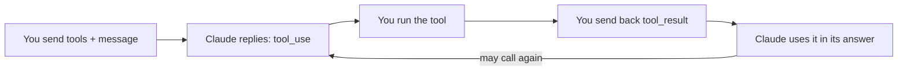

import Tabs from '@theme/Tabs';
import TabItem from '@theme/TabItem';

<LevelBadge level="intermediate" />

<VerifyNote lastVerified="2026-06-20" source="https://docs.anthropic.com/en/docs/build-with-claude/tool-use">
Tool-use request/response shapes are stable but evolve — confirm fields in the official tool-use docs.
</VerifyNote>

**Tool use** lets Claude call functions *you* define — search, a calculator, your database, any API — and use the results. It's the foundation of every [agent](/docs/api/building-agents).

## The loop



1. You include a list of **tool definitions** (name, description, JSON-Schema input).
2. If Claude decides to use one, it returns a `tool_use` block (with arguments) and stops.
3. **You execute** the tool and send the output back as a `tool_result`.
4. Claude continues, possibly calling more tools, until it answers.

## Defining a tool (Python)

```python
tools = [{
    "name": "get_weather",
    "description": "Get current weather for a city.",
    "input_schema": {
        "type": "object",
        "properties": {"city": {"type": "string"}},
        "required": ["city"],
    },
}]

msg = client.messages.create(
    model="claude-sonnet-4-6", max_tokens=1024,
    tools=tools,
    messages=[{"role": "user", "content": "What's the weather in Rome?"}],
)
# If msg.stop_reason == "tool_use": run the tool, then send a tool_result back.
```

## Tips

- **Descriptions are prompts.** A clear tool `description` and parameter docs hugely improve when/how Claude calls it.
- **Validate inputs** you receive before executing — never trust them blindly.
- **Return errors as results.** If a tool fails, send a `tool_result` describing the error so Claude can recover.
- **Server-side tools.** Anthropic also offers built-in tools (e.g. web search, code execution, computer use) — check the docs for the current menu.

:::warning Tools = actions = risk
A tool that takes real actions inherits a security model. Apply least privilege and keep a human in the loop for risky calls — see [Securing Agents & Tools](/docs/security/securing-agents).
:::

## Next

- [Building Agents on the API](/docs/api/building-agents)
- [Structured Output](/docs/api/structured-output)
- [MCP & Connecting to Tools](/docs/api/mcp)
