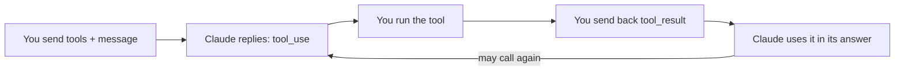

import Tabs from '@theme/Tabs';
import TabItem from '@theme/TabItem';

<LevelBadge level="intermediate" />

<VerifyNote lastVerified="2026-07-01" source="https://platform.claude.com/docs/en/docs/build-with-claude/tool-use">
Tool-use request/response shapes are stable but evolve — confirm fields in the official tool-use docs.
</VerifyNote>

**Tool use** lets Claude call functions *you* define — search, a calculator, your database, any API — and use the results. It's the foundation of every [agent](/docs/api/building-agents).

<Callout type="objectives" items={["How the four-step agentic loop works, from tool definitions to final answer","How to define a tool in Python with name, description, and JSON-Schema input","Why tool descriptions act as prompts that shape when and how Claude calls them","How to validate inputs, return errors as results, and use server-side tools safely"]} />

## The loop

Tool use is a conversation, not a single call. You hand Claude a menu of tools; Claude picks one and pauses; you run it and report back; Claude folds the result into its answer — repeating as needed.

<Steps items={[{title: "Send the menu", body: "You include a list of tool definitions — each with a name, a description, and a JSON-Schema input."}, {title: "Claude picks a tool", body: "If Claude decides to use one, it returns a tool_use block with arguments and stops."}, {title: "You execute", body: "You run the tool yourself and send the output back as a tool_result."}, {title: "Claude continues", body: "Claude continues, possibly calling more tools, until it answers."}]} />

## Defining a tool (Python)

A tool definition is just a name, a plain-language description, and a JSON-Schema for the input. Pass it in `tools`, then check `stop_reason` to know when Claude wants to act.

<PromptCard title="get_weather tool + first call">{`tools = [{
    "name": "get_weather",
    "description": "Get current weather for a city.",
    "input_schema": {
        "type": "object",
        "properties": {"city": {"type": "string"}},
        "required": ["city"],
    },
}]

msg = client.messages.create(
    model="claude-sonnet-5", max_tokens=1024,
    tools=tools,
    messages=[{"role": "user", "content": "What's the weather in Rome?"}],
)
# If msg.stop_reason == "tool_use": run the tool, then send a tool_result back.`}</PromptCard>

## Tips

Small choices in how you define and handle tools make a large difference in reliability.

- **Descriptions are prompts.** A clear tool `description` and parameter docs hugely improve when/how Claude calls it.
- **Validate inputs** you receive before executing — never trust them blindly.
- **Return errors as results.** If a tool fails, send a `tool_result` describing the error so Claude can recover.
- **Server-side tools.** Anthropic also offers built-in tools (e.g. web search, code execution, computer use) — check the docs for the current menu.

:::warning Tools = actions = risk
A tool that takes real actions inherits a security model. Apply least privilege and keep a human in the loop for risky calls — see [Securing Agents & Tools](/docs/security/securing-agents).
:::

<Flashcards title="Tool-use vocabulary" cards={[{front: "tool_use block", back: "What Claude returns when it decides to call a tool — includes the arguments — after which it stops and waits for you."}, {front: "tool_result", back: "The message you send back carrying the tool's output (or an error description so Claude can recover)."}, {front: "input_schema", back: "The JSON-Schema describing a tool's inputs: types, properties, and which fields are required."}, {front: "Server-side tools", back: "Built-in tools Anthropic offers, e.g. web search, code execution, computer use — check the docs for the current menu."}]} />

<Quiz title="Check yourself" questions={[{q: "After Claude returns a tool_use block, who runs the tool?", options: ["Claude runs it automatically on Anthropic's servers", "You execute it and send the output back as a tool_result", "The JSON-Schema executes it"], answer: 1, explain: "Claude returns a tool_use block and stops; you execute the tool and send the result back as a tool_result."}, {q: "A tool you defined fails at runtime. What's the recommended move?", options: ["Silently retry until it succeeds", "Send a tool_result describing the error so Claude can recover", "Stop the conversation"], answer: 1, explain: "Return errors as results — a tool_result describing the failure lets Claude recover."}, {q: "Why does a clear tool description matter so much?", options: ["It is only for documentation and Claude ignores it", "Descriptions are prompts — they shape when and how Claude calls the tool", "It changes the JSON-Schema validation rules"], answer: 1, explain: "Descriptions are prompts: a clear description and parameter docs hugely improve when and how Claude calls a tool."}]} />

<Callout type="takeaways" items={["Tool use is a loop: send tool definitions, Claude returns a tool_use block and stops, you execute and return a tool_result, Claude continues until it answers.","A tool definition is a name, a description, and a JSON-Schema input — pass it in tools and check stop_reason == tool_use.","Descriptions are prompts; validate inputs before executing; return failures as tool_result errors so Claude can recover.","Anthropic also offers server-side tools, and any tool that takes real actions needs least privilege plus a human in the loop."]} />

## Next

- [Programmatic Tool Calling](/docs/api/programmatic-tool-calling) — let Claude call these same tools from Python inside a sandbox, cutting round-trips and keeping intermediate results out of context
- [Building Agents on the API](/docs/api/building-agents)
- [Structured Output](/docs/api/structured-output)
- [MCP & Connecting to Tools](/docs/api/mcp)
