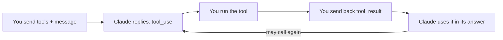

<LevelBadge level="intermediate" />

**Tool use** lets Claude call functions *you* define — search, a calculator, your database, any API — and use the results. It's the foundation of every [agent](/docs/api/building-agents).

Most tool-use tutorials stop after the four-step loop. The loop is the easy part. What actually breaks production integrations is narrower and less discussed: the message shapes that return `400`, the error field that lets Claude recover instead of apologizing, and the fact that **forcing a tool call no longer works on the newest Claude models**. This page covers all of it.

<Callout type="objectives" items={["How the four-step agentic loop works, from tool definitions to final answer","How to write a tool definition — and descriptions that actually steer when Claude calls it","The three message-shape rules that return a 400, and the error text that tells you which one you broke","Why tool_choice \"any\" and \"tool\" now fail on the newest models, and the two replacements","How to guarantee schema-valid tool inputs with strict: true","Why tool results are the single most likely place a prompt injection reaches your agent"]} />

<VerifyNote lastVerified="2026-09-29" source="https://platform.claude.com/docs/en/agents-and-tools/tool-use/define-tools">
Tool definition fields, the `tool_choice` support matrix, `tool_result` formatting rules, `is_error`
behavior and `strict: true` semantics verified on 29 September 2026 against Anthropic's "Define
tools", "Handle tool calls" and "Strict tool use" pages. Model support for forced tool use changes
with each release — re-check the support matrix on the Define tools page before relying on it, and
see [Current Models & Pricing](/docs/whats-new/models-and-pricing) for the current lineup.
</VerifyNote>

## The loop

Tool use is a conversation, not a single call. You hand Claude a menu of tools; Claude picks one and pauses; you run it and report back; Claude folds the result into its answer — repeating as needed.


```mermaid
flowchart LR
  A[You send tools + message] --> B[Claude replies: tool_use]
  B --> C[You run the tool]
  C --> D[You send back tool_result]
  D --> E[Claude uses it in its answer]
  E -->|may call again| B
```

<Steps items={[{title: "Send the menu", body: "You include a list of tool definitions — each with a name, a description, and a JSON-Schema input."}, {title: "Claude picks a tool", body: "If Claude decides to use one, the response comes back with stop_reason \"tool_use\" and one or more tool_use blocks, each carrying an id, a name, and an input object."}, {title: "You execute", body: "You run the tool yourself and send the output back as a tool_result that references the tool_use id."}, {title: "Claude continues", body: "Claude continues, possibly calling more tools, until it answers with a normal stop_reason."}]} />

Note the plural in step 2: Claude can return **several `tool_use` blocks in one response**. Dispatch on each block's `type` field rather than assuming `content[0]` — a response usually opens with a `text` block, and on the newest models it can open with `thinking` blocks instead.

## Defining a tool

A tool definition is a name, a plain-language description, and a JSON Schema for the input.

| Field | Required | Notes |
| --- | --- | --- |
| `name` | yes | Must match the regex `^[a-zA-Z0-9_-]{1,128}$` |
| `description` | yes | What it does, when to use it, when *not* to. Aim for 3–4 sentences minimum |
| `input_schema` | yes | A JSON Schema object describing the parameters |
| `input_examples` | no | An array of example input objects, each valid against the schema |
| `strict` | no | Set `true` to force schema-valid inputs — see below |
| `cache_control` | no | Cache the definition across turns (see [Prompt Caching](/docs/api/prompt-caching)) |

<PromptCard title="get_weather tool + first call (Python)">{`tools = [{
    "name": "get_weather",
    "description": (
        "Get the current weather for a city. Use this when the user asks about "
        "present conditions or temperature in a named place. Returns temperature "
        "in the requested unit plus a one-word sky condition. It does NOT return "
        "forecasts — use get_forecast for anything in the future."
    ),
    "input_schema": {
        "type": "object",
        "properties": {
            "city": {"type": "string", "description": "City and region, e.g. 'Rome, IT'"},
            "unit": {"type": "string", "enum": ["celsius", "fahrenheit"]},
        },
        "required": ["city"],
        "additionalProperties": False,
    },
}]

msg = client.messages.create(
    model="claude-opus-5-5", max_tokens=1024,
    tools=tools,
    messages=[{"role": "user", "content": "What's the weather in Rome?"}],
)

if msg.stop_reason == "tool_use":
    for block in msg.content:            # iterate — never index content[0]
        if block.type == "tool_use":
            result = run_tool(block.name, block.input)
            # send back a tool_result carrying block.id`}</PromptCard>

### Descriptions are prompts

The `description` field is by far the strongest lever on tool-use quality — it is read by the model, not by your teammates. Anthropic's own guidance is unambiguous about what separates a good one:

- **Say when *not* to use it.** Most mis-selections are a tool being called for a job an adjacent tool owns.
- **Consolidate rather than multiply.** Instead of `create_pr`, `review_pr`, `merge_pr`, ship one tool with an `action` parameter. Fewer, broader tools reduce selection ambiguity.
- **Namespace across services.** `github_list_prs` and `slack_send_message` beat `list_prs` and `send_message` once your tool surface grows.
- **Return high-signal results.** Stable, semantic identifiers (slugs, UUIDs) and only the fields Claude needs to pick its next step. Bloated tool output burns context and buries the signal.
- **For fiddly inputs, add `input_examples`.** Schema-validated examples cost roughly 20–50 tokens each for simple objects and 100–200 for complex nested ones, and an invalid example returns a 400.

## Handling the response: the three rules that return 400

This is where working code usually breaks. A `tool_result` is an ordinary `user` message, but three placement rules are enforced by the API.

<Steps items={[{title: "Results must immediately follow their tool_use", body: "No message may sit between the assistant's tool_use message and your tool_result message. Break this and the API reports: tool_use ids were found without tool_result blocks immediately after."}, {title: "tool_result blocks come FIRST in the content array", body: "Any text you add must come AFTER every tool_result. A text block before a tool_result is a 400."}, {title: "If a server tool call is still unresolved, send ONLY tool_result blocks", body: "When the same assistant turn also called a server tool that has no result yet, adding trailing text ends the turn early and the request fails with a 400 naming the unresolved server tool."}]} />

```json
// ❌ 400 — text before tool_result
{"role": "user", "content": [
  {"type": "text", "text": "Here are the results:"},
  {"type": "tool_result", "tool_use_id": "toolu_01", "content": "15 degrees"}
]}

// ✅ correct — results first, text after (client tools only)
{"role": "user", "content": [
  {"type": "tool_result", "tool_use_id": "toolu_01", "content": "15 degrees"},
  {"type": "text", "text": "What should I do next?"}
]}
```

A `tool_result`'s `content` can be a plain string, or a list of `text`, `image`, `document`, or `search_result` blocks. It can also be omitted entirely for a tool that returns nothing.

### Return failures as results, not exceptions

When a tool throws, don't abort the loop — hand the failure back with `is_error`:

```json
{"role": "user", "content": [{
  "type": "tool_result",
  "tool_use_id": "toolu_01A09q90qw90lq917835lq9",
  "content": "Rate limit exceeded. Retry after 60 seconds.",
  "is_error": true
}]}
```

Write the message for a reader who has to decide what to do next. `"failed"` tells Claude nothing; `"Rate limit exceeded. Retry after 60 seconds."` tells it to wait rather than retry immediately. When a tool call is invalid or missing a parameter, Claude will typically retry two to three times with corrections before giving up and apologizing to the user — so an instructive error is often the difference between recovery and a dead end.

## Guaranteeing schema-valid inputs: `strict: true`

Setting `strict: true` on a tool definition constrains the model's token sampling to schema-valid output (grammar-constrained sampling). The `input` in every `tool_use` block then provably matches your `input_schema`, and the `name` is always a real tool — no `"2"` where you needed `2`, no missing required field, no validate-and-retry layer.

<PromptCard title="Strict tool definition">{`{
  "name": "search_flights",
  "description": "Search bookable flights for a route and date.",
  "strict": true,
  "input_schema": {
    "type": "object",
    "properties": {
      "destination": {"type": "string"},
      "departure_date": {"type": "string", "format": "date"},
      "passengers": {"type": "integer", "enum": [1, 2, 3, 4, 5, 6]}
    },
    "required": ["destination", "departure_date"],
    "additionalProperties": false
  }
}`}</PromptCard>

Three caveats worth knowing before you turn it on everywhere:

- The schema must stay inside the supported JSON Schema subset — the same one [Structured Output](/docs/api/structured-output) uses.
- The computer use and browser use **toolset** entries reject `strict: true`; a request that sets it on either is rejected.
- Compiled schemas are cached separately from message content for up to 24 hours. Anthropic's guidance is explicit: **do not put protected health information in schemas** — not in property names, `enum` values, `const` values, or `pattern` regexes. PHI belongs in message content, which carries the HIPAA safeguards that cached schemas do not.

## `tool_choice` — and why forcing a tool now fails

`tool_choice` controls whether Claude *may*, *must*, or *may not* call a tool. It takes four values:

| Value | Meaning |
| --- | --- |
| `auto` | Claude decides. The default whenever `tools` is present |
| `any` | Claude must call one of your tools, but picks which |
| `tool` | Claude must call the named tool |
| `none` | Claude may not call any tool. The default when no `tools` are present |

Here is the part every other tool-use guide is currently missing. **`any` and `tool` are not universally supported, and on the newest models they return a 400.**

| Model or setting | Restriction | Use instead |
| --- | --- | --- |
| Manual extended thinking (`thinking` type `enabled`) | `any` and `tool` error | `auto` or `none`. Adaptive thinking on its own does *not* block forced tool use |
| Claude Opus 5.5, Sonnet 5.5, Fable 5.1, Mythos 5.1 | `any` and `tool` return a 400, regardless of thinking settings | `auto` plus `strict: true`, or [Structured Output](/docs/api/structured-output). `none` still works |

The error is explicit:

```text
tool_choice: type "tool" and "any" are not supported for this model.
```

The same validation applies to the token-counting endpoint, so a request that passes token counting will not surprise you later.

### What to do instead

Teasing the two motivations apart makes the migration obvious, because forced tool use was doing two unrelated jobs:

- **"I need schema-valid JSON."** That was never really about forcing a call. Keep `tool_choice` at `auto` and set `strict: true`, or move the schema to [Structured Output](/docs/api/structured-output) if you want a response rather than a call.
- **"I need it to call the tool, not chat at me."** Say so in the prompt. Naming when the tool applies — "Use `get_weather` for any question about present conditions" — still steers which tool `auto` picks.

There's a bonus in giving up forced tool use: `any` and `tool` worked by prefilling the assistant message, which suppressed any natural-language preamble before the `tool_use` blocks. Under `auto`, Claude can explain what it's about to do — which is usually what you want in a user-facing agent.

:::tip Caching gotcha
Changing `tool_choice` mid-conversation **invalidates cached message blocks**. Tool definitions and system prompts stay cached, but message content has to be reprocessed. If you were toggling `tool_choice` per turn, that was quietly costing you — see [Prompt Caching](/docs/api/prompt-caching).
:::

## Client tools vs. server tools

Not every tool needs a handler in your codebase.

- **Client tools** — yours. You define the schema, you execute, you return a `tool_result`. The loop above.
- **Anthropic-schema client tools** — bash, text editor, memory. The schema is predefined, but *your* app still executes them.
- **Server tools** — web search, web fetch, code execution, tool search. They run on Anthropic's infrastructure with no handler code on your side, and errors are handled transparently: you never return `is_error` for a server tool.
- **Client toolsets** — computer use and browser use are a single entry with no `name` that declares a fixed set of member tools. Their `tool_use` blocks carry an extra `toolset_name` field (`"computer"` or `"browser"`), and the `name` is the member being called, like `screenshot` or `navigate`. **Dispatch on both fields**, and echo `toolset_name` back on the result — a member result that omits it is rejected.

## Common mistakes

- **Indexing `content[0]`** instead of iterating and switching on `type`. Responses commonly lead with a `text` block, and on the newest models with `thinking` blocks.
- **Handling only one `tool_use` per response.** Claude can call several tools in a turn; a loop that answers the first and drops the rest leaves `tool_use` ids without results, which is a 400 on the next request.
- **Putting your commentary before the results.** `tool_result` blocks come first, always.
- **Swallowing tool exceptions.** An exception in your handler ends the loop; an `is_error` result lets Claude adapt.
- **Reaching for `tool_choice: "any"` out of habit.** On the current flagship models it's a 400 — and `strict: true` was the better answer anyway.
- **Treating tool output as trusted.** See below.

:::warning Tool results are your agent's biggest injection surface
Tool results routinely carry content you don't control: web pages, inbound email, user uploads, third-party APIs. An attacker who can influence any of it can embed instructions aimed at your model — indirect prompt injection. Keep untrusted content **inside `tool_result` blocks**, never spliced into the `system` prompt or a plain user `text` block, and read [Prompt Injection](/docs/security/prompt-injection) and [Securing Agents & Tools](/docs/security/securing-agents). A tool that takes real actions also inherits a security model: least privilege, and a human in the loop for anything irreversible.
:::

<Flashcards title="Tool-use vocabulary" cards={[{front: "tool_use block", back: "What Claude returns when it decides to call a tool — carries id, name and input — after which it stops and waits for you. A response can contain several."}, {front: "tool_result", back: "A user-message block carrying a tool's output, keyed to the tool_use id. Must come first in the content array, immediately after the assistant's tool_use message."}, {front: "is_error", back: "Optional boolean on a tool_result marking the call as failed. Claude reads the message and adapts — usually retrying two to three times before apologizing."}, {front: "strict: true", back: "Grammar-constrained sampling on a tool definition: the tool input provably matches your input_schema. Requires additionalProperties false; rejected on computer/browser toolset entries; keep PHI out of the schema."}, {front: "tool_choice", back: "auto | any | tool | none. auto is the default with tools present; none without. any and tool return a 400 on Opus 5.5, Sonnet 5.5, Fable 5.1 and Mythos 5.1."}, {front: "toolset_name", back: "Extra field on computer use and browser use member blocks (\"computer\" or \"browser\"). Dispatch on it alongside name, and echo it back on the result or the result is rejected."}]} />

<Quiz title="Check yourself" questions={[{q: "You set tool_choice to {\"type\": \"tool\", \"name\": \"get_weather\"} on claude-opus-5-5. What happens?", options: ["Claude is forced to call get_weather", "The request returns a 400 — forced tool use is not supported on that model", "Claude ignores tool_choice and answers in text"], answer: 1, explain: "On Opus 5.5, Sonnet 5.5, Fable 5.1 and Mythos 5.1, tool_choice types \"any\" and \"tool\" return a 400 regardless of thinking settings. Use auto with strict: true, or structured output."}, {q: "Your user message contains a text block explaining the results, followed by two tool_result blocks. What does the API do?", options: ["Accepts it — order doesn't matter", "Returns a 400: tool_result blocks must come first, text after", "Silently drops the text block"], answer: 1, explain: "tool_result blocks must come FIRST in the content array; any text must come after all of them."}, {q: "A tool you defined throws a connection error at runtime. What's the recommended move?", options: ["Raise the exception and end the conversation", "Retry silently until it succeeds", "Send a tool_result with is_error true and an instructive message like 'Rate limit exceeded. Retry after 60 seconds.'"], answer: 2, explain: "Return the failure as a tool_result with is_error true. An instructive message tells Claude what to do next; a generic 'failed' tells it nothing."}, {q: "Why should untrusted web content stay inside a tool_result block rather than being pasted into the system prompt?", options: ["tool_result blocks are cheaper in tokens", "It limits indirect prompt injection — content in a tool_result is framed as data, not as instructions", "The system prompt has a length limit"], answer: 1, explain: "Tool results carry content you don't control. Keeping it in tool_result blocks rather than the system prompt or plain user text is Anthropic's recommended containment for indirect prompt injection."}]} />

<Callout type="takeaways" items={["Tool use is a loop: send tool definitions, Claude returns one or more tool_use blocks and stops, you execute and return tool_results, Claude continues. Iterate over content blocks by type — never index content[0].","Three placement rules cause most 400s: results must immediately follow their tool_use, tool_result blocks come first in the content array, and an unresolved server tool call means results-only.","Forced tool use is gone on the newest models: tool_choice \"any\" and \"tool\" return a 400 on Opus 5.5, Sonnet 5.5, Fable 5.1 and Mythos 5.1. Use auto with strict: true, or structured output, and steer tool selection from the prompt.","strict: true guarantees schema-valid inputs via grammar-constrained sampling — but keep PHI out of schemas and don't set it on computer/browser toolset entries.","Return failures as tool_results with is_error and an instructive message so Claude can adapt instead of apologizing.","Tool results are the most likely path for an indirect prompt injection to reach your agent — keep untrusted content inside them, apply least privilege, and gate irreversible actions on a human."]} />

## Next

- [Programmatic Tool Calling](/docs/api/programmatic-tool-calling) — let Claude call these same tools from Python inside a sandbox, cutting round-trips and keeping intermediate results out of context
- [Structured Output](/docs/api/structured-output) — the other half of the forced-tool-use replacement, when you want a JSON response rather than a call
- [Building Agents on the API](/docs/api/building-agents) — wrap the loop in a real agent
- [Claude Opus 5.5: The Field Guide](/docs/models/opus-5-5-field-guide) — the full migration story behind the forced-tool-use removal
- [MCP & Connecting to Tools](/docs/api/mcp) — get tools from a server instead of defining them yourself
