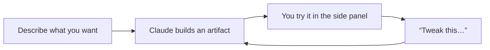

<LevelBadge level="beginner" />

<VerifyNote lastVerified="2026-06-20" source="https://www.anthropic.com">
Artifact capabilities (interactivity, persistence, what they can call) evolve quickly — confirm current behavior in the app/help center.
</VerifyNote>

**Artifacts** are outputs Claude renders in a **side panel** next to the chat — a document, a chart, a working app, a diagram — that you can see, use, and iterate on, separate from the conversation text.

## What you can make

- **Mini web apps & tools** — a calculator, a quiz, a form, a small interactive demo.
- **Documents** — structured write-ups you can refine and export.
- **Visuals** — charts, diagrams, and simple data dashboards.
- **Code** you can read and run.

## Why it's powerful for non-developers

You can build something *usable* — "make me a tip calculator for a group dinner," "a dashboard from this CSV" — by describing it, then refine it conversationally ("add a service-charge field," "make the buttons bigger"). It's the clearest example of **building with AI without writing code yourself**.

## How to work with Artifacts

1. **Ask for the thing**, with specifics (purpose, inputs, look).
2. **Iterate in plain language** — Claude updates the same artifact.
3. **Use it** in the panel; **export/share** where supported.

## Tips

- **Be concrete** about inputs/outputs and audience — same as good [prompting](/docs/prompting/basics).
- **Iterate small.** One change at a time is easier to get right.
- **Verify any logic/numbers** an artifact computes for important uses ([Hallucinations](/docs/foundations/hallucinations)).

## Next

- [Generating Real Files (docx/pptx/xlsx/pdf)](/docs/claude-app/generating-files)
- [Getting Started with Claude.ai](/docs/claude-app/getting-started)
- [Data Analysis playbook](/docs/playbooks/data-analysis)
