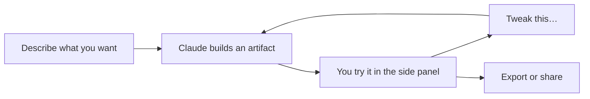

<LevelBadge level="beginner" />

<VerifyNote lastVerified="2026-09-25" source="https://support.claude.com/en/articles/17153992-what-are-artifacts-and-how-do-i-use-them">
Artifacts are available on **Free, Pro, Max, Team and Enterprise**. The three *templates* — **Claude Docs**, **Claude Slides** and **Claude Design** — are **in beta on paid plans only**: on by default on Pro, Max and Team, and off on Enterprise until an owner turns each one on. Capabilities here move fast — confirm current behavior in the Help Center.
</VerifyNote>

**Artifacts** are outputs Claude renders in a **side panel** next to the chat — a document, a deck, a chart, a working app — that you can see, use, and iterate on, separate from the conversation text.

Since the [September 2026 merge](/docs/claude-app/one-claude-docs-and-slides), the panel is also where the three **templates** live. That makes "artifact" the container and "template" the starting shape.

<Callout type="objectives" items={[
  "Know what the artifact panel can produce, and which outputs are plain artifacts versus beta templates",
  "Pick between a Doc, a deck, a design, a runnable app, and a downloadable file — without trial and error",
  "Iterate on an artifact in plain language instead of re-asking from scratch",
  "Know which artifacts you can export, in which formats, and on which plans"
]} />

## What you can make

| Output | What it is | Plan |
| --- | --- | --- |
| **Mini web apps & tools** | A calculator, a quiz, a form, a small interactive demo | All plans |
| **Charts & diagrams** | Visuals and simple data dashboards | All plans |
| **Code** | Something you can read and run | All plans |
| **Claude Docs** | A living, multi-tab document you co-edit with Claude and your team | Paid, beta |
| **Claude Slides** | A deck built from your notes or the conversation, presentable in place | Paid, beta |
| **Claude Design** | Visuals, mockups, prototypes and landing pages against your design system | Paid, beta |

Exports differ by type: Docs go to **Word, PDF, Markdown and Google Docs**; Slides to **PowerPoint and PDF**; Designs as a **.zip, PDF, PowerPoint or standalone HTML**.

## Why it's powerful for non-developers

You can build something *usable* — "make me a tip calculator for a group dinner," "a dashboard from this CSV" — by describing it, then refine it conversationally ("add a service-charge field," "make the buttons bigger"). It's the clearest example of **building with AI without writing code yourself**.

## How to work with artifacts

<Steps items={[
  {title: "Ask for the thing, with specifics", body: "State the purpose, the inputs, the audience and the look. Vagueness is the main reason a first artifact misses — the same rule as ordinary prompting."},
  {title: "Or choose the shape yourself", body: "Select Output in the message box and pick a template, or start one from the Artifacts tab. Do this when Claude keeps producing a different shape than you had in mind."},
  {title: "Iterate in plain language", body: "Claude updates the same artifact rather than making a new one. One change at a time is far easier to get right than a list of five."},
  {title: "Use it, then export or share", body: "Try it in the panel. Docs, Slides and Designs each have their own export formats; sharing rules depend on your plan."}
]} />

```mermaid
flowchart LR
  A[Describe what you want] --> B[Claude builds an artifact]
  B --> C[You try it in the side panel]
  C --> D["Tweak this…"] --> B
  C --> E[Export or share]
```

<PromptCard title="A specific artifact brief beats a vague one">{`Build me an interactive artifact: a tip calculator for a group dinner.

Inputs: bill total, number of people, tip percentage (slider, 0-30%,
default 18), and a toggle for "service charge already included".
Output: tip amount, total, and per-person share, updating live.

Audience: my friends on their phones — big tap targets, works at
375px wide, no explanation text.`}</PromptCard>

## Tips

- **Be concrete** about inputs/outputs and audience — same as good [prompting](/docs/prompting/basics).
- **Iterate small.** One change at a time is easier to get right.
- **Verify any logic/numbers** an artifact computes for important uses ([Hallucinations](/docs/foundations/hallucinations)).
- **Charts inside a Doc don't refresh themselves.** Change the data and the chart keeps the old values until you ask Claude to rebuild it.

## Quiz

<Quiz questions={[
  {q: "You're on the Free plan and ask Claude to turn a conversation into a shareable multi-tab document. What do you get?", options: ["A Claude Doc — artifacts are on every plan", "A Claude Doc, but view-only", "Not a Claude Doc — the templates are beta on paid plans only; you can still get a plain artifact or a downloadable file", "Nothing, artifacts require a paid plan"], answer: 2, explain: "Artifacts themselves are available on Free, Pro, Max, Team and Enterprise. The three templates — Docs, Slides and Design — are in beta on paid plans only. On Free you can still get plain artifacts and generated files."},
  {q: "Claude built an artifact that's close but the buttons are too small. What's the efficient move?", options: ["Start a new conversation with a fuller spec", "Ask for the change in plain language — Claude updates the same artifact", "Export it and edit it by hand", "Ask for five fixes at once to save turns"], answer: 1, explain: "Iterating conversationally updates the same artifact, which is the whole point of the panel. And one change at a time lands more reliably than a batch of five."}
]} />

<Callout type="takeaways" items={[
  "Artifact = the side panel container; template = the starting shape (Docs, Slides, Design).",
  "Plain artifacts work on every plan; the three templates are beta on paid plans, and off by default on Enterprise.",
  "Iterate in plain language on the same artifact — don't restart the conversation.",
  "Always verify computed numbers, and rebuild charts after the data changes."
]} />

## Next

- [One Claude: The Merge, Claude Docs & Claude Slides](/docs/claude-app/one-claude-docs-and-slides) — the templates in depth, and their limits
- [Generating Real Files (docx/pptx/xlsx/pdf)](/docs/claude-app/generating-files) — when you want a download instead
- [Data Analysis playbook](/docs/playbooks/data-analysis)
