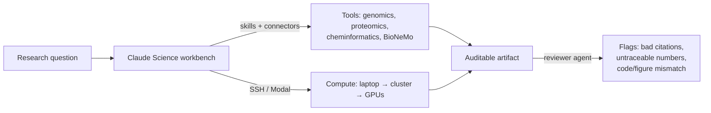

<LevelBadge level="advanced" />

<VerifyNote lastVerified="2026-07-13" source="https://www.anthropic.com/news/claude-science-ai-workbench">
Claude Science is in beta. Bundled skills, connected models, compute options, and plan availability change fast — confirm current specifics in the app and the official announcement before you rely on them.
</VerifyNote>

<Callout type="objectives" items={["Understand what Claude Science is — and the specific problem it solves that a chat window can't", "Learn its three pillars: integrated tools, auditable artifacts, and managed compute", "See how the reviewer agent catches untraceable numbers and mismatched figures automatically", "Know when to reach for Claude Science versus plain Claude or Claude Code", "Place it in the wider AI-for-science landscape without overselling what a model can verify"]} />

Most scientific work with a general chatbot breaks at the same seam: the model reasons well, but the *tools, data, and compute* live somewhere else — a cluster, a notebook, a genome browser, a folding model. You copy results back and forth by hand, and nobody can later reconstruct exactly how a figure was made. **Claude Science** (beta, launched **June 30, 2026**) is Anthropic's attempt to close that seam: an AI *workbench* where the reasoning, the tools, the compute, and the provenance all live in one place.

It is a distinct app — not a prompt you paste into chat. Think of it as [Claude Code](/docs/claude-code/what-is-claude-code) pointed at wet-lab and computational-biology workflows instead of software repos.

## The problem it targets

A researcher running, say, a single-cell RNA pipeline juggles: a data source, a QC tool, a plotting library, a folding model on a GPU, and a citation manager — plus the mental overhead of remembering which version of which script produced which figure three weeks ago. General assistants help with *one* step and lose the thread on the rest.

<Callout type="tip">
The unit of value in science isn't a good answer — it's a **reproducible** answer. Claude Science is built around that: its outputs are designed so a reviewer (human or agent) can trace every number back to the code and environment that produced it.
</Callout>

## The three pillars

### 1. Integrated tools — the environment comes pre-wired

Claude Science ships with **over 60 curated skills and connectors** pre-configured for genomics, single-cell, proteomics, structural biology, and cheminformatics. Crucially, it connects natively to **NVIDIA BioNeMo** models — including **Evo 2** (genomic foundation model), **Boltz-2** (structure/affinity prediction), and **OpenFold3** (protein folding) — so folding or affinity prediction is a step in your workflow, not a separate portal.

This is the same [skills-and-connectors](/docs/claude-code/skills) machinery you may know from Claude Code, curated for a scientific stack instead of a software one.

### 2. Auditable artifacts — provenance is the default, not an afterthought

Every output carries its full lineage:

- the **exact code and environment** that produced it,
- a **plain-language description** of how it was created, and
- the **full message history** behind it.

On top of that, a **reviewer agent** automatically flags **incorrect citations, untraceable numbers, and figures that don't match their underlying code**. That last one is the non-obvious safeguard: a plausible-looking chart whose data doesn't actually come from the code in the artifact gets caught.

<Callout type="warning">
The reviewer agent reduces a class of errors — it does not make outputs *correct*. It flags citations it can't verify and numbers it can't trace; it cannot vouch for experimental design, biological validity, or whether the right question was asked. Provenance ≠ truth. You still own the science.
</Callout>

### 3. Managed compute — from your laptop to hundreds of GPUs

Claude Science **manages compute on your laptop, your cluster, or GPUs on demand**, scaling **from a single GPU to hundreds as needed**. It works with existing infrastructure — HPC clusters over **SSH**, or **Modal** accounts — so heavy jobs run where your data and allocations already are, without you hand-writing the orchestration.

## Native scientific visualization

Results render **in the interface**, not as files you download and open elsewhere: **3D protein structures, genome browser tracks, and chemical structures** display natively. You inspect a fold or a locus where you reasoned about it — the [artifact](/docs/claude-app/artifacts) idea, extended to scientific objects.

## A typical workflow

<Steps items={[{title: "Frame the question", body: "State the biological question and point Claude Science at your data source via a connector."}, {title: "Let it assemble the pipeline", body: "It selects skills (QC, alignment, folding) and proposes steps — review before heavy compute runs."}, {title: "Run where the data lives", body: "Offload the expensive step to your HPC cluster over SSH or to on-demand GPUs; light steps stay local."}, {title: "Inspect natively", body: "View the 3D structure, genome track, or chemical structure inline rather than exporting first."}, {title: "Ship an auditable artifact", body: "The output bundles code, environment, plain-language method, and message history — and the reviewer agent flags anything untraceable."}]} />

<PromptCard title="A first, concrete ask inside Claude Science">{`Load the connected single-cell dataset, run standard QC (filter low-count cells and high-mito), and show a UMAP colored by cluster. Keep every step in an auditable artifact I can hand to a reviewer.`}</PromptCard>

<PromptCard title="Push the heavy step to real compute">{`Predict the structure of this sequence with the connected folding model, run it on my HPC cluster over SSH, and render the 3D structure inline when it finishes.`}</PromptCard>

## When to use it (and when not to)

| Use Claude Science when… | Reach for something else when… |
|---|---|
| You need reproducible, reviewable scientific outputs | You want a quick one-off answer → plain [Claude](/docs/claude-app/getting-started) |
| Your work spans genomics / proteomics / cheminformatics tools | You're building software → [Claude Code](/docs/claude-code/what-is-claude-code) |
| Heavy compute must run on your cluster or on-demand GPUs | You have no data connectors or compute to wire up |
| Provenance (code + env + history) actually matters for review | You're on Free, or on Windows (see availability) |

## Availability and limits

- **Plans:** Beta for **Claude Pro, Max, Team, and Enterprise** users. (No Free tier.)
- **Platforms:** **macOS and Linux** — note there's no Windows client at launch.
- **Status:** Beta — expect the bundled skill list, connected models, and compute options to shift.

<Callout type="tip">
Claude Science is Claude-specific, but the *pattern* is industry-wide: assistants are growing tool-integration, provenance, and compute layers so they can do real work, not just describe it. Watch for equivalent "workbench" moves from other AI labs — the reproducibility bar Claude Science sets is a good yardstick to judge them by.
</Callout>

<Flashcards title="Claude Science vocabulary" cards={[{front: "Claude Science", back: "Anthropic's beta AI workbench for scientists: integrated research tools, auditable artifacts, native visualization, and managed compute in one app."}, {front: "Auditable artifact", back: "An output bundled with the exact code, its environment, a plain-language method, and the full message history — so any result can be traced back to how it was made."}, {front: "Reviewer agent", back: "An automatic check that flags incorrect citations, untraceable numbers, and figures that don't match their underlying code. Reduces error; does not guarantee correctness."}, {front: "BioNeMo", back: "NVIDIA's collection of biology foundation models. Claude Science connects natively to Evo 2, Boltz-2, and OpenFold3."}, {front: "Managed compute", back: "Claude Science runs jobs on your laptop, HPC cluster (via SSH), or on-demand GPUs (e.g. Modal), scaling from one GPU to hundreds."}, {front: "Cheminformatics", back: "Computational analysis of chemical structures and properties — one of the domains Claude Science pre-wires skills for, alongside genomics, single-cell, proteomics, and structural biology."}]} />

<Quiz title="Check yourself" questions={[{q: "What is the single most distinctive design goal of Claude Science compared to a general chatbot?", options: ["Faster responses", "Reproducibility — every result traces back to the code and environment that produced it", "A larger context window"], answer: 1, explain: "Its outputs are auditable artifacts (code + environment + plain-language method + message history), built so a reviewer can trace every number. That provenance-first design is the core differentiator."}, {q: "The reviewer agent flags a figure whose numbers don't match the code in the artifact. What has it proven?", options: ["That the science is wrong", "That the result is correct", "That the figure is untraceable — a provenance problem, not a verdict on the biology"], answer: 2, explain: "The reviewer catches untraceable numbers, bad citations, and code/figure mismatches. It reduces a class of errors but cannot confirm the underlying science is valid — provenance is not truth."}, {q: "You need to fold a protein on your lab's HPC allocation from inside the workbench. Claude Science can…", options: ["Only run on Anthropic's cloud", "Run the job on your cluster over SSH (or on-demand GPUs), scaling as needed", "Not do compute at all"], answer: 1, explain: "Claude Science manages compute on your laptop, cluster (via SSH), or GPUs on demand (e.g. Modal), from a single GPU to hundreds."}, {q: "Which user cannot use Claude Science at launch?", options: ["A Max user on macOS", "An Enterprise user on Linux", "A Free-plan user on Windows"], answer: 2, explain: "It's beta for Pro, Max, Team, and Enterprise (no Free tier) and ships on macOS and Linux only — so a Free/Windows user is excluded on both counts."}]} />

<Callout type="takeaways" items={["Claude Science is a distinct beta app — an AI workbench for scientists, not a prompt you paste into chat.", "Its three pillars: pre-wired tools (60+ skills, native BioNeMo — Evo 2, Boltz-2, OpenFold3), auditable artifacts, and managed compute.", "Auditable artifacts bundle code + environment + method + message history; a reviewer agent flags untraceable numbers, bad citations, and code/figure mismatches.", "Compute runs where your data lives: laptop, HPC over SSH, or on-demand GPUs, scaling one → hundreds.", "Beta for Pro/Max/Team/Enterprise on macOS and Linux only; provenance reduces error but never certifies the science is correct."]} />

## Sources & further reading

- [Claude Science, an AI workbench for scientists — Anthropic](https://www.anthropic.com/news/claude-science-ai-workbench) — the launch announcement (June 30, 2026); source for the 60+ skills, BioNeMo connections, auditable-artifact structure, reviewer agent, compute options, and availability.
- [NVIDIA BioNeMo](https://www.nvidia.com/en-us/clara/bionemo/) — the biology foundation-model platform behind Evo 2, Boltz-2, and OpenFold3.
- [Modal](https://modal.com/) — one of the on-demand compute backends Claude Science can use.
- Related on AILmanac: [Claude Code](/docs/claude-code/what-is-claude-code), [Skills](/docs/claude-code/skills), [Artifacts](/docs/claude-app/artifacts), and [Managed Agents](/docs/api/managed-agents).
