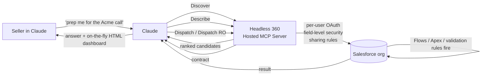

<LevelBadge level="intermediate" />

<VerifyNote lastVerified="2026-09-01" source="https://www.salesforce.com/news/press-releases/2026/08/26/salesforce-and-anthropic-announce-claudeforce/">
Claudeforce was announced **Aug 26, 2026**; **Salesforce in Claude** is in **select-pilot** now with **open beta scheduled for September 2026**. The 4-tool Headless 360 MCP surface is Salesforce-published API (Beta, July 2026). Skill counts, pricing, and the exact scope of the Slack/Agentforce strands are moving weekly — confirm against the linked Salesforce Developers docs before you commit an org to it.
</VerifyNote>

On **Aug 26, 2026** Salesforce and Anthropic co-announced **Claudeforce**, a four-strand partnership. The first shipping piece is **Salesforce in Claude** — a plugin that lets a Claude conversation reason over live CRM data and take governed action, with **37 prebuilt sales skills** (only ~8 named publicly at launch), an open beta scheduled for September 2026, and — this is the part press coverage skips — a **surprisingly small MCP surface** underneath.

Most of the write-ups are re-cut press releases. This page is the practical field guide: the architecture that makes 37 skills possible from just **4 MCP tools**, the **two very different auth models** the plugin ships with, and the **governance traps** that will bite RevOps if you treat it like another Chrome extension.

<Callout type="objectives" items={[
  "Understand what actually ships in the September 2026 open beta — the four Claudeforce strands, and which one is 'Salesforce in Claude'",
  "See why the plugin needs only 4 MCP tools (Discover / Describe / Dispatch / Dispatch Read-Only) to expose the whole Salesforce API surface",
  "Tell the two auth routes apart — per-user OAuth (Claude) vs client-credentials integration user (Slack) — and pick correctly for your org",
  "Classify the 37 skills by authority level (read-only / recommend / write) before you turn any of them on",
  "Avoid the four traps: over-provisioned profiles, forgotten automation side effects, the Winter '27 upgrade collision, and shadow-IT MCP servers"
]} />

## What Claudeforce actually is (and isn't)

Claudeforce is a four-strand partnership, not a product. Only one strand — **Salesforce in Claude** — is opening in September 2026. Conflating the strands is how RevOps teams end up scoping the wrong pilot.

<Steps items={[
  {title: "Strand 1 — Salesforce in Claude (Sept 2026 open beta)", body: "A Salesforce plugin that runs INSIDE the Claude app. Sellers stay in Claude; Claude reaches into their org via Salesforce's Hosted MCP. This is the strand this page is about."},
  {title: "Strand 2 — Claude inside Salesforce products", body: "The reverse direction: Anthropic's models available as first-class citizens across Agentforce (Atlas Reasoning Engine, Agentforce Vibes, Agentforce Coworker, Agent Builder). Different UX, different admin surface, different rollout schedule."},
  {title: "Strand 3 — Claude as the default model in Slack", body: "Slack AI features (huddles summaries, channel recaps, message drafting) start using Claude as the default backing model. Governed differently — see the Slack auth route below."},
  {title: "Strand 4 — Commercial cross-adoption", body: "Salesforce becomes a large Anthropic customer; Anthropic becomes a large Salesforce customer. Interesting for procurement, irrelevant for the technical setup."}
]} />

The rest of this page is strand 1: **Salesforce in Claude**.

## The 4-tool architecture that scales to 37 skills

The single non-obvious thing about Claudeforce is that the plugin does **not** register a tool per capability. Salesforce's **[Headless 360 Hosted MCP Server](https://developer.salesforce.com/docs/platform/hosted-mcp-servers/guide/headless-360-mcp.html)** (Beta, July 2026) exposes exactly **four MCP tools**, and Claude reaches every skill by composing them.

<Steps items={[
  {title: "Discover", body: "Semantic search across a vector index of every API and skill in the connected org. Claude passes its interpretation of your request; Discover returns a ranked list of candidate operations. This is the reason 'find me the deal-health thing for this account' doesn't require 200 pre-registered tools cluttering context."},
  {title: "Describe", body: "For a chosen candidate, Describe returns the technical contract: parameters, dependencies, ordered steps, side effects. Claude uses it to verify Discover surfaced the right thing before it commits to running anything."},
  {title: "Dispatch", body: "Runs the chosen operation. Routes to the right endpoint. Enforces user access guards before the call reaches Salesforce. This is the write path — validation rules, Flows, Apex triggers, and CPU governor limits all fire as normal downstream of Dispatch."},
  {title: "Dispatch Read-Only", body: "GET-only variant. Same discovery flow, same access checks, but the tool physically cannot mutate. This is the pilot-safe default and the tool the read-only skills bind to."}
]} />

Two implications most launch posts miss:

- **The tool surface stays small and stable**, but the **catalog of skills grows independently** on Salesforce's side — Claude doesn't need a new tool registration to reach a new skill.
- **Field-level security, object permissions, and sharing rules apply to every tool call** — enforcement happens in the org, not in Claude. If a user can't see a field in the Salesforce UI, Discover won't surface it and Dispatch would deny it anyway.

## The two auth routes — and why the difference matters

Claudeforce ships with **two OAuth models** stapled to the same-looking plugin, and they have very different security postures. Getting this wrong is how you accidentally give every rep in the org the effective permissions of one integration user.

<Steps items={[
  {title: "Route A — Salesforce in Claude (per-user OAuth)", body: "Uses Salesforce External Client Apps with the mcp_api scope. A single admin does the one-time org-level connect; each seller then authorizes as themselves. Every Claude tool call runs as the requesting individual, with THEIR profile, permission sets, sharing rules and field-level security. This is the correct posture for anything user-visible."},
  {title: "Route B — Claude in Slack (client credentials)", body: "Uses OAuth 2.0 client credentials flow with a dedicated integration user. Access bundles share ONE agent credential across users. Every request runs as the same integration user — meaning that user's permissions become the effective ceiling for everyone touching it. Convenient, but the wrong shape for anything with per-user data isolation requirements."}
]} />

<Callout type="warning" items={[
  "If you provision the Slack integration user with a wide sales-ops profile so 'it just works,' every Slack user routed through it inherits that effective access. Restrict the integration user's profile to the narrowest scope Slack actually needs, then add capability with permission sets — same principle as any shared service account."
]} />

## The 37 skills, classified by authority level

Salesforce named only a handful of skills at launch; more will drop through late 2026. What you can plan for right now is that every skill lands in one of **three authority levels**, and the interface makes them look identical. It's on you to classify.

| Named skill (Aug 2026) | Authority level | Rough Dispatch route |
| --- | --- | --- |
| Daily briefing | Read-only | Dispatch RO |
| Pipeline review | Read-only | Dispatch RO |
| Forecast narrative | Read-only | Dispatch RO |
| Meeting preparation | Read-only | Dispatch RO |
| Deal-health review | Read-only | Dispatch RO |
| Win/loss analysis | Read-only | Dispatch RO |
| Salesforce hygiene | Recommend | Dispatch RO → drafts |
| Activity logging | Write | Dispatch (POST/PATCH) |

The remaining ~29 skills are unpublished at launch; the same triage applies as they land:

<Steps items={[
  {title: "Read-only (Dispatch RO only)", body: "Analyzes, summarizes, retrieves. Cannot mutate. Enable freely for the pilot cohort. Failure mode is 'wrong answer,' not 'wrong write.'"},
  {title: "Recommend (Dispatch RO + drafts)", body: "Analyzes AND proposes changes, but leaves the actual mutation as a draft for a human. Enable after the read-only tier is behaving. Failure mode is a bad draft that a seller might approve without reading — measure correction rate, not just speed."},
  {title: "Write (Dispatch POST/PATCH/DELETE)", body: "Directly mutates CRM data. Every write goes through the org's validation rules, Flows, Apex triggers, and CPU governor limits, EXACTLY as if a human clicked Save. Enable last, per-skill, with per-user profile scoping, and only after you've measured recommend-tier accuracy for at least 4 weeks."}
]} />

## Setting up a pilot — the RevOps checklist

<Steps items={[
  {title: "1. Audit the profiles you're about to expose", body: "Any over-provisioned profile that was harmless behind a slow UI becomes genuinely risky behind a fast agent. Before piloting, run a permissions audit on the users you'll invite: which objects, which fields, which record-type sharing. The plugin will faithfully enforce whatever those profiles say — including whatever historical over-provisioning nobody noticed."},
  {title: "2. Bind pilot users to a locked-down permission set", body: "Create a Claudeforce Pilot permission set: specific objects, specific fields, read-only to start. Assign it in addition to their normal profile so you can remove it cleanly at the end of the pilot without touching baseline access."},
  {title: "3. Start with Dispatch Read-Only everywhere", body: "Enable only read-only skills for the first two sprints. This lets you measure accuracy without a rollback surface. Watch for hallucinated field names or wrong record lookups — those are the failure modes that survive into the write tier."},
  {title: "4. Pick THREE workflows across the three authority levels for the write-tier pilot", body: "One read-only, one recommend, one write. Different risk profiles surface different governance gaps, and one pilot per tier is cheaper than one pilot per skill."},
  {title: "5. Version your API baseline", body: "Salesforce in Claude requires API v67.0+; Winter '27 introduces v68.0. If your org auto-upgrades to Winter '27 during the beta window (Sept–Oct 2026), lock the plugin's API version explicitly so a platform upgrade doesn't shift semantics on you mid-pilot."},
  {title: "6. Ban team-owned MCP connections during the beta", body: "If individual teams stand up their own Hosted MCP Servers to 'move faster,' you've reinvented shadow IT with cleaner packaging. Centralize MCP governance under the same admins who own connected apps and profiles."}
]} />

<PromptCard title="Seller prompt template: safe Monday pipeline briefing (read-only tier)">{`You are preparing my Monday pipeline briefing from Salesforce.

Every Monday at 07:00 local:

1. Use the "Pipeline review" skill on my named accounts (owner = me,
   stage != Closed Lost, close date in current quarter).
2. Use the "Deal-health review" skill on the top 10 by amount.
3. Use the "Meeting preparation" skill for accounts I have a meeting
   with in the next 5 business days.

Constraints (do NOT violate):
- Read-only pass only. If any skill proposes a write (update stage,
  log activity, change amount) STOP and surface it as a draft in
  the output — do NOT dispatch it.
- Do not log activities on my behalf. Do not update fields.
- If a skill returns a field you cannot see under my profile, do
  not guess the value — flag it as "hidden by permissions".

Produce a single briefing:
- 3-bullet TL;DR
- "Pipeline movement since last Monday" (opportunity-level, cite
  the Salesforce record IDs)
- "Deals I should touch this week" (with why, from deal-health)
- "Meetings this week" (with prep pack from meeting-preparation)
- "Proposed writes (NOT DISPATCHED)" — every draft change the agent
  wanted to make, so I can review in one place.`}</PromptCard>

Two things this prompt does that most 'copy this template' posts don't:

- It **pins the pilot to read-only** with an explicit "if the skill proposes a write, STOP" invariant. In a scheduled or long-running Claude session you can't answer a follow-up 'are you sure?' — invariants have to live in the prompt.
- It asks the model to **surface every write it wanted to make in one place**, so you can measure the recommend-tier accuracy of a skill before you promote it to write-tier. This is the cheapest way to earn the promotion.

## The four traps that will bite you

<Steps items={[
  {title: "1. Over-provisioned profiles become live blast radius", body: "The same permission set that was mostly-fine behind a UI is genuinely dangerous behind an agent that can Dispatch 30 writes/minute. Fix: profile audit BEFORE pilot, not after."},
  {title: "2. Automation side effects fire on every Dispatch write", body: "Dispatch PATCH is a normal Salesforce write. Every validation rule, Flow, Process Builder, Apex trigger, and CPU-time governor limit fires just like a human click. A well-meaning skill running in a loop can trip CPU limits or fan out unwanted Flow-driven emails. Fix: instrument your automation on the pilot org before turning on write-tier skills."},
  {title: "3. Winter '27 lands during open beta", body: "Winter '27 production upgrades (Sept–Oct 2026) collide with the Claudeforce open beta. If a skill breaks in the middle of the window, you'll be debugging TWO simultaneous platform changes. Fix: pin API version on the plugin, and schedule the pilot cohort's Winter '27 upgrade OUTSIDE the beta window if you can."},
  {title: "4. Slack route ≠ Claude route", body: "Because Slack uses client-credentials with an integration user, giving 'Slack access to Claudeforce' is not the same governance shape as giving individual users the plugin in Claude. Treat them as two separate rollouts with two separate audit trails."}
]} />

## Where Claudeforce sits relative to Agentforce

Salesforce has been shipping **Agentforce** since 2024 and Claude has been ONE of its foundation models since late 2025. Claudeforce doesn't replace Agentforce — it adds a **new surface** (the Claude app) and **formalizes** Claude across four Agentforce layers (Atlas Reasoning Engine, Agentforce Vibes, Agentforce Coworker, Agent Builder). Model optionality stays: Agent Builder still offers Amazon Nova alongside Claude.

Rough decision table for teams staring at both:

| You want to... | Reach for |
| --- | --- |
| Give sellers a chat interface that reasons over live CRM | Salesforce in Claude (the plugin) |
| Embed AI features INTO your Salesforce UI (records, list views, buttons) | Agentforce |
| Build a custom agent with tools, memory, escalation policies | Agent Builder (inside Salesforce) |
| Automate repeatable back-office CRM work end-to-end | Agentforce Coworker |
| Use Claude to write Salesforce code (Apex, LWC) | Agentforce Vibes |

If more than one row applies, the wrong choice is to pick one and force it — Claudeforce is designed so the plugin, Agentforce, and Agent Builder are complementary, and users can move between them within the same org.

## When NOT to use Salesforce in Claude

- **You need a machine-to-machine integration.** The plugin is a human-in-the-loop chat surface. For unattended CRM writes at scale, wire the [Headless 360 MCP Server](https://developer.salesforce.com/docs/platform/hosted-mcp-servers/guide/headless-360-mcp.html) into [Managed Agents](/docs/api/managed-agents) directly, without the Claude app in the middle.
- **You already ship an Agentforce experience your sellers know.** Adding a second surface fragments your training and doubles governance work. Pick the one your team lives in.
- **You have zero Salesforce admins to govern this.** The plugin makes the org more powerful and more reachable — that's a bad combo without someone owning profiles, permission sets, and MCP connections.
- **Your compliance posture forbids inference over customer data.** Even though the plugin routes inference through Amazon Bedrock inside the Salesforce Trust Boundary, prompt content and returned data still leave the storage layer. Read your DPA before piloting.

## Quiz

<Quiz questions={[
  {q: "How many MCP tools does the Headless 360 server expose to Claude, regardless of how many 'skills' are in the catalog?", options: ["37 — one per prebuilt skill", "Hundreds — one per Salesforce API operation", "4 — Discover, Describe, Dispatch, Dispatch Read-Only", "1 — a generic 'salesforce' tool"], answer: 2, explain: "Salesforce deliberately keeps the MCP surface tiny and stable at four tools (Discover / Describe / Dispatch / Dispatch RO). New skills land in the catalog behind those four tools; the model doesn't need a new tool registration for each. That's what lets the same plugin scale from 37 skills at launch to hundreds later without polluting Claude's context window."},
  {q: "You give a seller a permission set with edit access on Opportunity.Amount and enable a write-tier skill. The seller asks Claude to bump three opps by 10%. What fires on the org side?", options: ["Only the raw UPDATE — Claude bypasses org automation for speed", "The UPDATE plus any validation rules, Flows, and Apex triggers on Opportunity, exactly as a UI click would", "Nothing — writes are queued and applied in a nightly batch", "Automation is disabled by default when the caller is an agent"], answer: 1, explain: "Dispatch PATCH is a normal Salesforce write. Validation rules, Flows, Process Builder, Apex triggers, and CPU governor limits all fire. This is why 'audit the automation' is on the pre-pilot checklist — an agent making 30 writes/minute can quietly trip a governor limit or fan out a Flow-driven email you didn't expect."},
  {q: "Your CFO asks 'is the Slack Claude integration governed the same way as Salesforce in Claude?' What's the correct answer?", options: ["Yes — same OAuth, same per-user enforcement", "No — Slack uses client credentials with an integration user, so every request runs as that one user, not per-seller", "Yes — both route through Salesforce Trust Boundary so it doesn't matter", "No — Slack has no auth, it's read-only"], answer: 1, explain: "Salesforce in Claude uses per-user OAuth via External Client Apps (mcp_api scope) — each call runs as the requesting individual. The Slack route uses OAuth 2.0 client credentials with a dedicated integration user, so every request through Slack runs as that integration user. That's a different governance shape and needs a separate rollout and audit trail."},
  {q: "You're planning your Claudeforce pilot for early October 2026. What's the specific platform-timing hazard to plan around?", options: ["A hard deadline where the pilot must end", "Winter '27 production upgrades land during Sept–Oct 2026, potentially shifting API semantics mid-pilot", "Anthropic sunsetting Claude Opus 4.8", "A pricing change on Sonnet 5 taking effect Sept 1"], answer: 1, explain: "Winter '27 upgrades (Sept–Oct 2026) collide with the open beta window. Pin the plugin's API version explicitly and, if you can, schedule the pilot cohort's Winter '27 upgrade outside the beta window — otherwise a broken skill will have two potential root causes to disambiguate. (The Sonnet 5 Sept 1 price change was CANCELLED; $2/$10 is now permanent.)"}
]} />

## Sources & further reading

- Salesforce — [Salesforce and Anthropic Announce Claudeforce](https://www.salesforce.com/news/press-releases/2026/08/26/salesforce-and-anthropic-announce-claudeforce/) (launch press release, Aug 26 2026)
- Salesforce Developers — [Headless 360 (Beta) — Hosted MCP Servers reference](https://developer.salesforce.com/docs/platform/hosted-mcp-servers/guide/headless-360-mcp.html) (canonical 4-tool architecture)
- Salesforce Developers — [Standard Servers reference](https://developer.salesforce.com/docs/platform/hosted-mcp-servers/guide/servers-reference.html) (per-user auth, field-level security enforcement)
- Salesforce Developers Blog — [Announcing the Headless 360 MCP Server Beta](https://developer.salesforce.com/blogs/2026/07/announcing-the-headless-360-mcp-server-beta) (July 2026 architecture launch)
- Anthropic — [Claude Sonnet 5 permanent pricing](https://www.anthropic.com/news/claude-sonnet-5) (Aug 10 2026, $2/$10 confirmed permanent — the Sept 1 increase was cancelled)
- Related on AILmanac: [Connectors (MCP) in the Apps](/docs/claude-app/connectors) · [Cowork Scheduled Tasks](/docs/claude-app/cowork-scheduled-tasks) · [Skill.md Open Standard](/docs/models/skill-md-open-standard) · [Managed Agents](/docs/api/managed-agents) · [Managed Agents Domain Restrictions](/docs/api/managed-agents-domain-restrictions) · [Securing MCP Servers](/docs/security/securing-mcp-servers) · [MCP Tool Poisoning & Rug Pulls](/docs/security/mcp-tool-poisoning-and-rug-pulls)

## Next

- [Connectors (MCP) in the Apps](/docs/claude-app/connectors) — the general concept this plugin specializes
- [Securing MCP Servers](/docs/security/securing-mcp-servers) — the security patterns you should apply before opening the pilot
- [Managed Agents](/docs/api/managed-agents) — the API-side alternative when you need this without the Claude app in the loop
