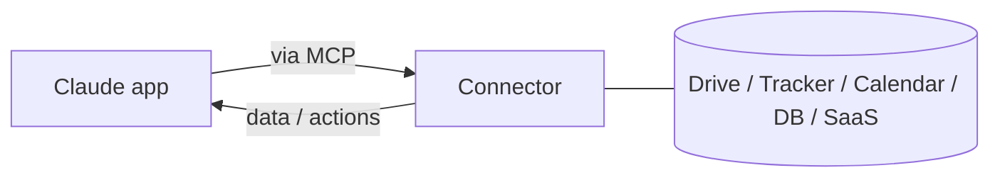

<LevelBadge level="intermediate" />

<VerifyNote lastVerified="2026-06-20" source="https://platform.claude.com/docs">
Which connectors exist, and availability by plan, change frequently — confirm current options in the app/help center.
</VerifyNote>

**Connectors** let the Claude apps reach **outside the chat** — into your tools and data (drives, issue trackers, calendars, databases, and more) — so Claude can answer from, and act on, real systems. Under the hood they're powered by the open **[Model Context Protocol (MCP)](/docs/claude-code/mcp)**.

## What they do

Without connectors, Claude only knows what's in the conversation. With a connector, it can (with your permission) pull relevant info from a connected service — e.g. find a document, read recent issues, check a calendar — and use it in its answer.

## Same standard, everywhere

Connectors are the **app-facing** form of MCP. The very same protocol powers [MCP in Claude Code](/docs/claude-code/mcp) and [on the API](/docs/api/mcp). Learn the concept once; it applies across surfaces.

## Set up & use

1. **Connect** the service (authorize via OAuth, where supported).
2. **Grant least privilege** — only the access the task needs.
3. **Ask naturally** — "find my Q3 planning doc and summarize the risks."

## Safety

:::warning A connector is access + (sometimes) actions
- Authorize only services and scopes you trust.
- Content pulled from external sources can carry [prompt injection](/docs/security/prompt-injection) — be cautious when a connector reads untrusted material.
- Review what a third-party connector can do before enabling it ([Reviewing Third-Party Code](/docs/security/reviewing-third-party-code)).
:::

## Next

- [MCP Servers in Claude Code](/docs/claude-code/mcp)
- [MCP & Connecting to Tools (API)](/docs/api/mcp)
- [AI in Your Existing Tools](/docs/claude-app/ai-in-your-tools)
