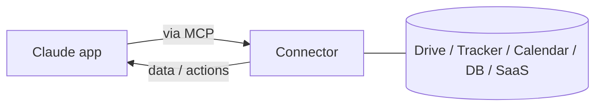

<LevelBadge level="intermediate" />

<Callout type="objectives" items={[
  "Understand what a connector adds that the chat alone cannot do",
  "See why connectors, Claude Code MCP servers and API MCP are the same standard wearing three hats",
  "Set one up with least privilege, in three steps",
  "Know the two risks you are accepting: access, and untrusted content arriving through it"
]} />

<VerifyNote lastVerified="2026-08-02" source="https://platform.claude.com/docs">
Which connectors exist, and availability by plan, change frequently — confirm current options in the app/help center.
</VerifyNote>

**Connectors** let the Claude apps reach **outside the chat** — into your tools and data (drives, issue trackers, calendars, databases, and more) — so Claude can answer from, and act on, real systems. Under the hood they're powered by the open **[Model Context Protocol (MCP)](/docs/claude-code/mcp)**.

## What they do

Without connectors, Claude only knows what's in the conversation. With a connector, it can (with your permission) pull relevant info from a connected service — e.g. find a document, read recent issues, check a calendar — and use it in its answer.

```mermaid
flowchart LR
  C[Claude app] -->|via MCP| K[Connector]
  K --- S[(Drive / Tracker / Calendar / DB / SaaS)]
  K -->|data / actions| C
```

## Same standard, everywhere

Connectors are the **app-facing** form of MCP. The very same protocol powers [MCP in Claude Code](/docs/claude-code/mcp) and [on the API](/docs/api/mcp). Learn the concept once; it applies across surfaces.

## Set up & use

<Steps items={[
  {
    title: "Connect the service",
    body: "Authorize via OAuth, where supported. This is the step that creates the trust relationship — everything after it inherits whatever you grant here."
  },
  {
    title: "Grant least privilege",
    body: "Only the access the task needs. A connector that only has to find documents does not need write scopes, and a read-only grant is the cheapest safety control available to you."
  },
  {
    title: "Ask naturally",
    body: "You don't call the connector; you describe the goal. \"Find my Q3 planning doc and summarize the risks\" — Claude decides which tool to reach for."
  }
]} />

<PromptCard title="Ask across a connected service">
{`Find my Q3 planning doc and summarize the risks.`}
</PromptCard>

## Safety

:::warning A connector is access + (sometimes) actions
- Authorize only services and scopes you trust.
- Content pulled from external sources can carry [prompt injection](/docs/security/prompt-injection) — be cautious when a connector reads untrusted material.
- Review what a third-party connector can do before enabling it ([Reviewing Third-Party Code](/docs/security/reviewing-third-party-code)).
:::

<Quiz questions={[
  {
    q: "A connector pulls in a shared document that someone outside your team wrote. What is the specific risk that creates?",
    options: [
      "The document counts against your plan's storage limit",
      "Prompt injection — untrusted content arriving through the connector can carry instructions",
      "The connector will automatically gain write access to the document",
      "Claude cannot read documents it did not create"
    ],
    answer: 1,
    explain: "Content pulled from external sources can carry prompt injection. The connector is the delivery path for material you did not write, which is exactly why the safety note warns about untrusted material."
  },
  {
    q: "You only need Claude to find and read documents. What scope should you grant?",
    options: [
      "Full access, so you never have to re-authorize",
      "Only the access the task needs — least privilege",
      "Whatever the connector requests by default",
      "No scope; connectors work without authorization"
    ],
    answer: 1,
    explain: "Least privilege. A connector that only has to find documents does not need write scopes, and the grant you make at setup is inherited by everything the connector does afterward."
  },
  {
    q: "What is the relationship between app connectors, MCP servers in Claude Code, and MCP on the API?",
    options: [
      "Three unrelated integration systems that happen to share a name",
      "Three surfaces of the same open protocol — learn the concept once",
      "Connectors are a legacy format that MCP replaced",
      "Only the API version is real MCP; the others are simplified"
    ],
    answer: 1,
    explain: "Connectors are the app-facing form of MCP. The same protocol powers Claude Code MCP servers and MCP on the API, so the concept transfers across all three surfaces."
  }
]} />

<Callout type="takeaways" items={[
  "Without a connector Claude knows only what's in the conversation; with one it can read from and act on real systems, with your permission.",
  "Connectors are MCP wearing its app-facing hat — the same protocol as Claude Code MCP servers and API MCP.",
  "Setup is three steps: connect, grant least privilege, then just describe the goal.",
  "You are accepting two risks: the access you granted, and untrusted content arriving through it. Scope narrowly and treat external material as untrusted."
]} />

## Next

- [MCP Servers in Claude Code](/docs/claude-code/mcp)
- [MCP & Connecting to Tools (API)](/docs/api/mcp)
- [AI in Your Existing Tools](/docs/claude-app/ai-in-your-tools)
- [Claudeforce: Salesforce in Claude](/docs/claude-app/claudeforce-salesforce-in-claude) — a real-world plugin that turns the 4-tool MCP pattern into 37 sales skills
