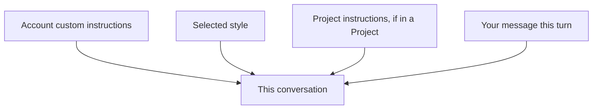

<LevelBadge level="beginner" />

<VerifyNote lastVerified="2026-06-20" source="https://www.anthropic.com">
The exact names and locations of custom instructions and styles in the Claude apps change — confirm in the app/help center.
</VerifyNote>

Tired of repeating "be concise" or "I'm a nurse, explain accordingly" every chat? **Custom instructions** and **styles** let you set your defaults once and have them apply everywhere.

## Custom instructions = your personal system prompt

Set standing facts and preferences — who you are, what you do, how you like answers — and Claude applies them across conversations. It's the consumer-app version of a [system prompt](/docs/foundations/roles) (and the cousin of [CLAUDE.md](/docs/claude-code/claude-md) for developers).

Good things to include:
- **Context about you** ("I run a small bakery"; "I code in Python").
- **Output preferences** ("default to short bullet answers"; "always show your reasoning").
- **Hard rules** ("never use emoji"; "metric units").

## Styles = presentation presets

**Styles** change tone/format (concise, formal, explanatory, etc.) and can be switched per conversation. Use a style when you want a *different voice for this chat* without rewriting your standing instructions.

## How they stack

More specific/later context tends to win when there's a conflict — so a [Project's](/docs/claude-app/projects) instructions or an explicit ask in your message can override your global defaults. Keep them consistent to avoid surprises.

## Tips

- **Keep instructions short and true** — like CLAUDE.md, bloat and stale rules hurt.
- **Don't put secrets** in custom instructions.
- **Revisit them** occasionally as your needs change.

## Next

- [System, User & Assistant Roles](/docs/foundations/roles)
- [Projects: Persistent Workspaces](/docs/claude-app/projects)
- [CLAUDE.md & Memory Files](/docs/claude-code/claude-md)
