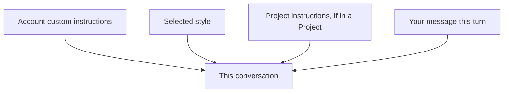

<LevelBadge level="beginner" />

<Callout type="objectives" items={[
  "Tell custom instructions apart from styles — and know which one to reach for",
  "Write a first set of standing instructions in three lines that are worth keeping",
  "Understand the stacking order when four layers of instruction disagree",
  "Avoid the two mistakes that make standing instructions worse than none",
]} />

<VerifyNote lastVerified="2026-08-02" source="https://www.anthropic.com">
The exact names and locations of custom instructions and styles in the Claude apps change — confirm in the app/help center.
</VerifyNote>

Tired of repeating "be concise" or "I'm a nurse, explain accordingly" every chat? **Custom instructions** and **styles** let you set your defaults once and have them apply everywhere.

## Custom instructions = your personal system prompt

Set standing facts and preferences — who you are, what you do, how you like answers — and Claude applies them across conversations. It's the consumer-app version of a [system prompt](/docs/foundations/roles) (and the cousin of [CLAUDE.md](/docs/claude-code/claude-md) for developers).

Good things to include:
- **Context about you** ("I run a small bakery"; "I code in Python").
- **Output preferences** ("default to short bullet answers"; "always show your reasoning").
- **Hard rules** ("never use emoji"; "metric units").

<Steps items={[
  {title: "Write the one sentence about you that you keep retyping", body: "Role, domain, and anything that changes the right answer — \"I'm a district nurse in the UK\" or \"I write Python 3.12 services\"."},
  {title: "Add your default output shape", body: "One line: short bullets, no preamble, metric units. This is the part that pays off every single turn."},
  {title: "Add at most two hard rules", body: "Rules you would enforce every time, like \"never use emoji\". A long rulebook is harder for Claude to honour than a short one."},
  {title: "Stop there and use it for a week", body: "Add a rule only when you catch yourself typing the same correction twice. Instructions you cannot remember are instructions you cannot debug."},
]} />

<PromptCard title="A starter set of custom instructions">{`I'm a district nurse in the UK. I read fast and act on summaries.

Default to short bullet answers with no preamble. Metric units. Flag anything
that is clinical guidance I should confirm against current NHS sources.

Never use emoji.`}</PromptCard>

## Styles = presentation presets

**Styles** change tone/format (concise, formal, explanatory, etc.) and can be switched per conversation. Use a style when you want a *different voice for this chat* without rewriting your standing instructions.

## How they stack

```mermaid
flowchart TD
  A[Account custom instructions] --> C[This conversation]
  B[Selected style] --> C
  D[Project instructions, if in a Project] --> C
  E[Your message this turn] --> C
```

More specific/later context tends to win when there's a conflict — so a [Project's](/docs/claude-app/projects) instructions or an explicit ask in your message can override your global defaults. Keep them consistent to avoid surprises.

## Tips

- **Keep instructions short and true** — like CLAUDE.md, bloat and stale rules hurt.
- **Don't put secrets** in custom instructions.
- **Revisit them** occasionally as your needs change.

<Flashcards title="Four layers, four jobs" cards={[
  {front: "Custom instructions", back: "Account-wide standing facts and preferences. Apply to every conversation. The consumer-app equivalent of a system prompt."},
  {front: "Styles", back: "Presentation presets — tone and format — switchable per conversation. Use one when you want a different voice for this chat only."},
  {front: "Project instructions", back: "Instructions scoped to one Project workspace, alongside its files. More specific than your account defaults, so they tend to win."},
  {front: "CLAUDE.md", back: "The developer cousin: a file of standing project instructions that Claude Code reads. Same discipline — short, true, maintained."},
  {front: "The stacking rule", back: "More specific or later context tends to win a conflict. Keep the layers consistent so you never have to guess which one applied."},
]} />

<Quiz title="Check yourself" questions={[
  {q: "You want a formal tone for one conversation only, without touching your defaults. What do you use?", options: ["Custom instructions", "A style", "Project instructions", "CLAUDE.md"], answer: 1, explain: "Styles change tone and format and can be switched per conversation — exactly the case for a different voice in one chat."},
  {q: "Your account instructions say \"always use bullets\" but a Project's instructions ask for prose. What tends to happen in that Project?", options: ["The account instructions win because they are global", "The Project instructions tend to win because they are more specific", "Claude refuses and asks you to choose", "Both are ignored"], answer: 1, explain: "More specific or later context tends to win, so a Project's instructions can override your global defaults — which is why keeping the layers consistent matters."},
  {q: "Which of these does NOT belong in custom instructions?", options: ["Your role and domain", "Your default output shape", "An API key you reuse often", "A hard rule like \"metric units\""], answer: 2, explain: "Don't put secrets in custom instructions — they travel with every conversation."},
]} />

<Callout type="takeaways" items={[
  "Custom instructions are standing defaults; styles are a per-chat voice. Reach for the narrower one.",
  "Three lines — who you are, your default output shape, one or two hard rules — beats a long rulebook.",
  "Four layers feed each conversation: account instructions, style, Project instructions, this turn's message.",
  "More specific or later context tends to win a conflict, so keep the layers consistent.",
  "Never put secrets in standing instructions, and prune stale rules as your needs change.",
]} />

## Next

- [System, User & Assistant Roles](/docs/foundations/roles)
- [Projects: Persistent Workspaces](/docs/claude-app/projects)
- [CLAUDE.md & Memory Files](/docs/claude-code/claude-md)
