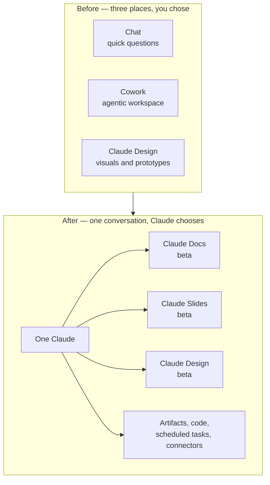

<LevelBadge level="beginner" />

<VerifyNote lastVerified="2026-09-25" source="https://claude.com/blog/cowork-is-now-claude">
Announced **September 16, 2026**. The merged experience is rolling out **gradually, starting with Pro and Max** on web, desktop and mobile, then Team and Free; Enterprise organizations get **at least 30 days' notice**. Claude Docs, Claude Slides and Claude Design are **in beta on paid plans**. Because the rollout is staged, two accounts on the same plan can see different things on the same day — check the [Help Center article](https://support.claude.com/en/articles/16761823-claude-cowork-and-chat-are-one-claude) for current status before relying on anything here.
</VerifyNote>

On **September 16, 2026**, Anthropic collapsed three products into one. Chat, **Cowork** (the agentic workspace) and **Claude Design** stopped being separate places you had to choose between. There is now one conversation box, and Claude decides what the task needs.

The official framing is short: *"Ask Claude for what you need, and it can decide which tool to use."* The practical consequence is longer, and it is what this page is about — because a merge like this moves settings, retires habits, and ships two new document tools whose limits are not obvious until you hit them.

<Callout type="objectives" items={[
  "Understand what actually merged on September 16, 2026 — and why 'no mode to choose' changes how you open a task",
  "Find every setting that moved: global instructions, web search, research, and file storage",
  "Pick correctly between Claude Docs, Claude Slides, Claude Design, a plain artifact, and a downloaded .docx/.pptx",
  "Use Claude Docs the way it's designed: tabs, inline comments, @Claude edits, and real-time co-authoring",
  "Know the eight limits that will bite you — no version history, no comment-only role, charts that don't refresh, and the compliance configurations where Docs is simply unavailable",
  "Predict the usage-limit cost of agentic work now that everything runs in one conversation"
]} />

## What merged, in one picture

Nothing you had is thrown away. Per Anthropic: *"Existing Cowork tasks, projects, connectors, skills, artifacts, and files carry over, and those Cowork tasks open as they did before, so you can continue them."*

What changes is the **entry point**. Previously you decided the shape of the work before you described it — chat for a question, Cowork for a project. Now you describe the work and Claude picks the machinery, with the same context, skills and connectors available from any conversation.

## Where everything moved

This is the part that generates the most "where did my button go" confusion, and it is the part no third-party write-up covers. Four things relocated:

| What you used | Where it is now |
| --- | --- |
| Global instructions | **Settings → General** |
| Web search toggle | **Gone — it's automatic.** Claude decides when to search |
| Research | Type **`/deep-research`**, or use the **`+`** button |
| Your files | **Settings → Storage folder** |

<Callout type="warning" items={[
  "The web-search toggle is not hidden, it is removed. If your workflow depended on forcing search off for a private or offline-reasoning task, that lever no longer exists in the UI — say it in the prompt instead ('answer from the conversation only; do not search the web')."
]} />

## The three templates: which one do you actually want?

The merge shipped **Claude Docs** and **Claude Slides** as new tools, and moved **Claude Design** inside conversations. All three are *templates* — a starting shape for an artifact, not a separate app.

<Steps items={[
  {title: "Claude Docs — living documents", body: "Rich-text documents saved to your Claude account, with headings, tables and other formatting, and more than one tab (like sections of a notebook). You and Claude and your colleagues all write in the same document, at the same time. Exports to Word (.docx), PDF, Markdown (.md) and Google Docs. Reach for it when the document itself is the deliverable and it will keep changing."},
  {title: "Claude Slides — presentations", body: "Decks built from your notes, a report, or the work already in the conversation. You can edit any slide directly, present without leaving Claude, and export to PowerPoint and PDF. Reach for it when you need a deck out of material you already produced."},
  {title: "Claude Design — visuals and prototypes", body: "Visuals, mockups, prototypes, one-pagers and landing pages, built against your design system. Exports as a .zip, PDF, PowerPoint, or standalone HTML. Reach for it when the output is visual or needs to match a brand."},
  {title: "A plain artifact — code, apps, charts", body: "Still there, unchanged, on every plan including Free. A runnable mini-app, a chart, a diagram, a script. Reach for it when the thing needs to execute rather than be read. See Artifacts."},
  {title: "A generated file — .docx / .pptx / .xlsx / .pdf", body: "A one-shot file Claude builds and you download. No live editing surface, no sharing, no comments. Reach for it when you need a file to hand off and never touch inside Claude again. See Generating Real Files."}
]} />

The distinction that matters most is the last two: **a Claude Doc is a living document with a URL, collaborators and comments; a generated `.docx` is a download.** If you asked for "a Word doc" pre-merge and got a file, asking the same way now may get you a Doc you then export — which is usually what you wanted, but it is a different object with different sharing rules.

### Three ways to create one

<Steps items={[
  {title: "Ask in any conversation", body: "Plain language is enough — 'turn the plan we just worked through into a product spec I can share with the team.' Claude asks a few questions before it starts, then drafts the doc on screen."},
  {title: "Choose a template explicitly", body: "Select Output in the message box and choose a template. Use this when Claude keeps picking a different shape than you want."},
  {title: "Start from the Artifacts tab", body: "Pick a template from the gallery, then brief Claude. Useful when the document, not the conversation, is the thing you came for."}
]} />

<PromptCard title="Brief a Claude Doc so the first draft is close">{`Create a Claude Doc: a one-page product spec for the export feature
we just designed.

Structure it in four tabs:
  1. Summary — problem, proposed solution, who it's for
  2. Requirements — numbered, testable, each with a rationale
  3. Open questions — things I still need to decide, with your
     recommendation and the tradeoff for each
  4. Rejected alternatives — what we considered and why not

Rules:
- Pull the decisions from this conversation. Do not invent
  requirements I did not state.
- Where I was vague, leave a comment asking me the question
  instead of guessing.
- Add a table comparing the three export formats we discussed.

Ask me anything you need before you start drafting.`}</PromptCard>

## Claude Docs in depth

### Editing, comments, and @Claude

Three editing paths coexist, which is the point of the tool:

- **You type.** Click into the doc and type. Changes save automatically.
- **You ask.** Request a change conversationally; Claude edits and explains what it did and why.
- **You comment.** Select text and leave a comment for your collaborators — and **mention `@Claude` in a comment to have Claude make that edit in place.** Claude replies in the thread, makes the change, and explains it.

Claude also **leaves its own comments while drafting**, to explain a choice or ask you a question. This is the behavior worth designing your prompt around: telling Claude to *ask in a comment rather than guess* (as in the prompt card above) converts silent hallucination risk into a visible question you can answer.

You can also ask Claude to **add a chart, diagram, graph or timeline** to a doc.

### Collaboration and sharing

People with edit access work on the same doc at the same time as you and Claude, and everyone's edits appear in real time.

| | Viewer | Editor |
| --- | --- | --- |
| Read | ✅ | ✅ |
| Edit | ❌ | ✅ |
| Comment | ❌ | ✅ |
| Export | ❌ | ✅ |

Sharing rules differ sharply by plan:

- **Pro / Max** — share with anyone who has the link.
- **Team / Enterprise** — invite specific people or a group, or share with everyone in your organization. **Docs cannot be shared outside your organization**, by link or by email invitation.
- **Either way** — opening a shared doc requires a Claude account, and **only the owner can rename or delete a doc.**

### Where you can use it

Docs work on **web, desktop, Claude Code, and mobile** — but the **iOS and Android apps are view-only**: no editing and no template selection from a phone. Plan around that if your review loop is mobile.

## The limits that will bite you

Every one of these is documented, and every one surprises somebody in week one.

<Steps items={[
  {title: "No version history yet", body: "There is no way to see or restore an earlier state of a doc. Anyone with edit access can overwrite anything, and your only recovery is an export you took earlier. For a document that matters, export to Markdown at each milestone until history ships."},
  {title: "No comment-only access level", body: "The roles are viewer and editor, nothing between. A reviewer who should comment but not edit does not exist as a permission — grant edit and rely on trust, or grant view and collect feedback elsewhere."},
  {title: "Charts and diagrams don't update automatically", body: "A chart Claude added is a snapshot. Change the underlying numbers in the doc and the chart keeps showing the old ones until you ask Claude to regenerate it. Treat every visual as stale until re-asked."},
  {title: "Team and Enterprise cannot share externally", body: "No link sharing, no email invitation outside the organization. If you need to send a doc to a client, export it (Word, PDF, Markdown, Google Docs) and send the export."},
  {title: "Mobile is view-only", body: "iOS and Android can read a doc. They cannot edit one or pick a template."},
  {title: "Unavailable under CMEK, ZDR and HIPAA", body: "Claude Docs is not available for organizations configured with customer-managed encryption keys, zero data retention, or HIPAA. This is the single most important fact for regulated teams, and it is not a rollout delay — it is an exclusion."},
  {title: "Not in the Compliance API yet", body: "Activity inside a doc is not recorded in the Compliance API. If your audit posture depends on that export, doc activity is currently a blind spot."},
  {title: "Enterprise starts off", body: "On Enterprise plans the templates are off until an owner turns each one on in organization settings. On Pro, Max and Team they are on by default."}
]} />

### Also not supported yet in the merged experience

The unified experience does not yet support **GitHub integration ("Add from GitHub")**, **conversation branching**, **search across older Cowork tasks**, **Dispatch** (existing users only), or **incognito chats for file and code creation**. If your workflow leans on branching or on searching your Cowork history, that capability is temporarily gone — not moved.

## What this costs you

There is no separate price. The relevant sentence is about *usage limits*: *"Everything you do with Claude counts toward your plan's usage limits. Longer agentic tasks that search the web, run code, or create files generally use more than a quick question."* Claude Docs counts the same way.

The merge makes this sharper than it sounds. Previously, opening Cowork was a deliberate act — you knew you were starting expensive work. Now a casually-phrased request in the same box can trigger a long agentic run that searches, executes code and writes files. **The cost signal moved from the door to the prompt.** If you are on a plan where limits matter, say what you want explicitly:

<PromptCard title="Keep a request cheap when you only want an answer">{`Answer from this conversation only. Do not search the web, do not
run code, and do not create any files or artifacts. Two paragraphs.`}</PromptCard>

And the inverse, when you do want the full machinery:

<PromptCard title="Ask for the expensive version on purpose">{`Take this as a full task, not a chat answer.

Research the three vendors below, check their current pricing pages,
build a comparison spreadsheet, and turn the recommendation into a
Claude Doc I can share with the team. Cite every figure with a link
and the date you read it.

Vendors: [A], [B], [C]`}</PromptCard>

## Migrating your own habits

<Steps items={[
  {title: "Re-home your global instructions", body: "They moved to Settings → General. Open them once and re-read them: instructions written for chat-only Claude ('you cannot browse the web', 'ask before doing anything long') can now actively fight the merged behavior."},
  {title: "Stop reaching for the web-search toggle", body: "It's gone. Put search intent in the prompt — either 'check current sources' or 'do not search'."},
  {title: "Relearn research", body: "Type /deep-research or use the + button. It is a command now, not a mode."},
  {title: "Audit anything that assumed Cowork was separate", body: "Scheduled tasks, connectors and skills carried over, but prompts that said 'this is a Cowork task' as a signal to work harder no longer signal anything. Replace that framing with explicit scope, as in the prompt cards above."},
  {title: "Decide your Docs export cadence", body: "Until version history ships, pick a milestone rhythm — export to Markdown whenever the doc reaches a state you would be upset to lose."}
]} />

## Terms worth knowing

<Flashcards cards={[
  {front: "One Claude", back: "The September 16, 2026 merge of chat, Cowork and Claude Design into a single conversation experience with no mode to choose. Claude decides which tools a task needs."},
  {front: "Template (Docs / Slides / Design)", back: "A starting shape for an artifact, not a separate app. In beta on paid plans; on by default on Pro, Max and Team; off until an owner enables it on Enterprise."},
  {front: "Claude Doc", back: "A rich-text, multi-tab living document saved to your Claude account, co-edited in real time by you, Claude and collaborators. Exports to Word, PDF, Markdown and Google Docs."},
  {front: "Tab (in a Doc)", back: "A section of a doc, like a section of a notebook. One doc can hold several — useful for splitting a spec into summary, requirements and open questions."},
  {front: "@Claude comment", back: "Mentioning Claude in a doc comment so it makes that edit in place, replies in the thread, and explains what it changed."},
  {front: "Viewer vs Editor", back: "The only two access levels. Viewers read. Editors read, edit, comment and export. There is no comment-only role."},
  {front: "Output button", back: "The control in the message box for choosing a template explicitly, when you don't want Claude to pick the shape for you."},
  {front: "Doc vs generated file", back: "A Doc is a living document with a URL, collaborators and comments. A generated .docx/.pptx/.xlsx is a one-shot download with none of those."}
]} />

## Quiz

<Quiz questions={[
  {q: "Your organization runs Claude on Enterprise with zero data retention (ZDR). Your team wants to start drafting specs in Claude Docs. What happens?", options: ["It works once an owner enables the template in organization settings", "It works but documents are deleted after 30 days", "Claude Docs is unavailable — ZDR, CMEK and HIPAA configurations are excluded", "It works in view-only mode"], answer: 2, explain: "Claude Docs is unavailable for organizations using CMEK, ZDR or HIPAA configurations. This is an exclusion, not a rollout delay, so no admin toggle fixes it. Teams under those configurations need a different drafting surface."},
  {q: "You added a chart to a Claude Doc from a table of Q3 numbers. A colleague then corrects two figures in the table. What does the chart show?", options: ["The corrected figures, updated live", "The corrected figures after you reload the doc", "The old figures, until you ask Claude to regenerate the chart", "An error state flagging the mismatch"], answer: 2, explain: "Charts and diagrams don't update automatically — each one is a snapshot taken when it was created. Treat every visual in a doc as stale until you explicitly ask Claude to rebuild it from the current data."},
  {q: "You're on a Team plan and need to send a finished spec to an external client. What's the supported path?", options: ["Share the doc link — link sharing works on every paid plan", "Invite the client by email from the doc's Share dialog", "Export the doc to Word, PDF, Markdown or Google Docs and send the export", "Move the doc to a Pro account first"], answer: 2, explain: "On Team and Enterprise plans, docs cannot be shared outside your organization by link or by email invitation. Link-to-anyone sharing is a Pro/Max behavior. The supported route for an external recipient is to export."},
  {q: "Since the merge, which statement about web search is true?", options: ["The toggle moved to Settings → General", "The toggle moved behind the + button", "The toggle is removed — search is automatic, so you steer it in the prompt", "Search is now off by default on all plans"], answer: 2, explain: "The web search toggle was removed rather than relocated; Claude decides when to search. Global instructions moved to Settings → General and research moved to /deep-research or the + button, but search is now steered in the prompt ('check current sources' or 'do not search')."}
]} />

<Callout type="takeaways" items={[
  "One conversation, no mode to choose: the cost signal moved from the door (opening Cowork) to the prompt. Say explicitly when you want a cheap answer and when you want the full agentic run.",
  "Four things moved: global instructions → Settings → General; web search → automatic, steer in the prompt; research → /deep-research or +; files → Settings → Storage folder.",
  "A Claude Doc is a living document with collaborators and comments; a generated .docx is a download. Choose deliberately — they share rules differ completely.",
  "Design your prompt around Claude's comments: tell it to ask in a comment rather than guess, and you convert invention into a visible question.",
  "Two limits deserve a workaround today: no version history (export to Markdown at milestones) and charts that never refresh (regenerate after every data change).",
  "Regulated teams: Claude Docs is unavailable under CMEK, ZDR and HIPAA, and doc activity is not in the Compliance API yet."
]} />

## Sources & further reading

- Anthropic — [Claude Cowork and chat are now one Claude](https://claude.com/blog/cowork-is-now-claude) (announcement, September 16, 2026)
- Anthropic Help Center — [Claude Cowork and chat are one Claude](https://support.claude.com/en/articles/16761823-claude-cowork-and-chat-are-one-claude) (rollout, relocations, what carried over, current gaps)
- Anthropic Help Center — [Get started with Claude Docs](https://support.claude.com/en/articles/16923645-get-started-with-claude-docs) (creation, tabs, comments, sharing matrix, exports, limits)
- Anthropic Help Center — [What are artifacts and how do I use them?](https://support.claude.com/en/articles/17153992-what-are-artifacts-and-how-do-i-use-them) (the three templates and their plan availability)
- Related on AILmanac: [Artifacts](/docs/claude-app/artifacts) · [Cowork Scheduled Tasks](/docs/claude-app/cowork-scheduled-tasks) · [Generating Real Files](/docs/claude-app/generating-files) · [Projects](/docs/claude-app/projects) · [Plans, Limits & Billing](/docs/claude-app/plans-and-billing)

## Next

- [Artifacts: Live, Runnable Outputs](/docs/claude-app/artifacts) — the container all three templates render into
- [Cowork Scheduled Tasks](/docs/claude-app/cowork-scheduled-tasks) — the recurring-task machinery that carried over intact
- [Generating Real Files (docx/pptx/xlsx/pdf)](/docs/claude-app/generating-files) — when you want a download, not a living document
