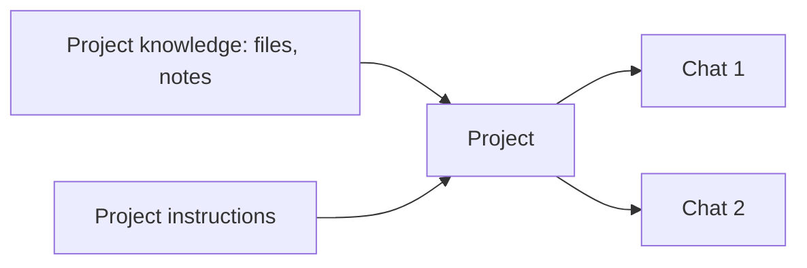

<LevelBadge level="beginner" />

<VerifyNote lastVerified="2026-06-20" source="https://www.anthropic.com">
Project features and limits vary by plan and change — confirm current behavior in the app/help center.
</VerifyNote>

A **Project** is a dedicated workspace in Claude.ai that bundles **its own files, knowledge, and instructions**. Instead of re-uploading the same documents and re-explaining context every chat, you set it up once — and every conversation in the Project starts already informed.

## Why use a Project

- **Grounded answers.** Add your documents (a handbook, specs, notes) and Claude answers *from them* — a built-in, no-code flavor of [RAG](/docs/foundations/rag).
- **Persistent context.** Project instructions act like a scoped [system prompt](/docs/foundations/roles) for everything inside it.
- **Organized.** All the chats about one topic/client/initiative live together.

## Set one up

1. **Create a Project** and give it a clear purpose.
2. **Add knowledge** — the files/text it should always know.
3. **Write project instructions** — role, conventions, what to do/avoid.
4. **Start chatting** — every conversation inherits the knowledge + instructions.

## Great use cases

- A **client/account** workspace (their docs + your notes).
- A **codebase or product** knowledge base for Q&A.
- A **writing project** with your style guide and past pieces (so drafts match your voice).
- **Study** for a course, with the syllabus and materials loaded.

## Tips

- **Curate the knowledge** — relevant, current files beat dumping everything (noise hurts retrieval).
- **Keep instructions tight and true** (same rule as [custom instructions](/docs/claude-app/custom-instructions)).
- **Don't add sensitive data** you're not comfortable storing — see [Privacy](/docs/foundations/privacy).

## Next

- [Custom Instructions & Styles](/docs/claude-app/custom-instructions)
- [Memory Across Chats](/docs/claude-app/memory)
- [Retrieval-Augmented Generation (RAG)](/docs/foundations/rag)
