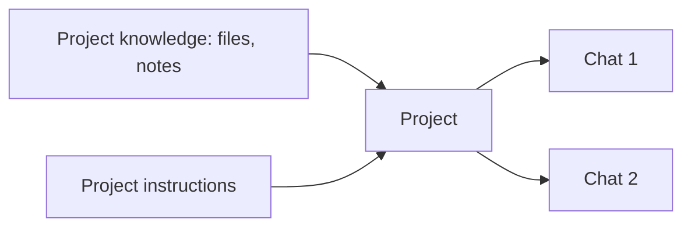

<LevelBadge level="beginner" />

<VerifyNote lastVerified="2026-09-23" source="https://claude.com/blog/projects-redesigned">
Project features and limits vary by plan and change — confirm current behavior in the app or help center. A **redesigned Projects** (a coordinator that delegates to parallel threads) entered beta in Claude Code on September 17, 2026 and is planned to reach the rest of Claude and Team/Enterprise plans later. This page describes the knowledge-base Project most accounts still have.
</VerifyNote>

A **Project** is a dedicated workspace in Claude.ai that bundles **its own files, knowledge, and instructions**. Instead of re-uploading the same documents and re-explaining context every chat, you set it up once — and every conversation in the Project starts already informed.

<Callout type="objectives" items={[
  "What a Project bundles, and why that beats re-pasting context every chat",
  "The four-step setup, and the one step people skip",
  "How to curate project knowledge so retrieval stays sharp",
  "How this Project differs from the coordinator-and-threads Projects in Claude Code"
]} />

## Why use a Project

- **Grounded answers.** Add your documents (a handbook, specs, notes) and Claude answers *from them* — a built-in, no-code flavor of [RAG](/docs/foundations/rag).
- **Persistent context.** Project instructions act like a scoped [system prompt](/docs/foundations/roles) for everything inside it.
- **Organized.** All the chats about one topic/client/initiative live together.

## Set one up

<Steps items={[
  {title: "Create a Project with a clear purpose", body: "One Project per topic, client, or initiative. A Project that covers three unrelated things retrieves badly for all three."},
  {title: "Add knowledge", body: "The files and text it should always know — the handbook, the spec, the style guide. This is what Claude answers from."},
  {title: "Write project instructions", body: "The step people skip. Role, conventions, what to do and what to avoid. Without it, you have a search index rather than a colleague."},
  {title: "Start chatting", body: "Every conversation inside the Project inherits the knowledge and the instructions automatically."}
]} />

```mermaid
flowchart LR
  K[Project knowledge: files, notes] --> P[Project]
  I[Project instructions] --> P
  P --> C1[Chat 1]
  P --> C2[Chat 2]
```

## Great use cases

- A **client/account** workspace (their docs + your notes).
- A **codebase or product** knowledge base for Q&A.
- A **writing project** with your style guide and past pieces (so drafts match your voice).
- **Study** for a course, with the syllabus and materials loaded.

## A starting point for project instructions

<PromptCard title="Project instructions skeleton">{`You are helping with [project/client name].

Context: [what this project is, who it serves, current stage]

Always:
- Answer from the project knowledge first; say so when you are going beyond it.
- Use [our terminology: list the 3-5 terms that matter].
- Match the tone in [named file in the knowledge base].

Never:
- Invent figures, dates, or quotes. If it is not in the knowledge, say it is not in the knowledge.
- [Project-specific constraint: e.g. reference the deprecated v1 API.]`}</PromptCard>

## Tips

- **Curate the knowledge** — relevant, current files beat dumping everything (noise hurts retrieval).
- **Keep instructions tight and true** (same rule as [custom instructions](/docs/claude-app/custom-instructions)).
- **Prune when things change.** A superseded spec left in the knowledge base is worse than no spec, because Claude has no way to know it lost an argument with the new one.
- **Don't add sensitive data** you're not comfortable storing — see [Privacy](/docs/foundations/privacy).

## Two things called "Projects"

They are genuinely different products, and the names overlap during the rollout:

| | This Project (Claude.ai) | [Claude Code Projects](/docs/claude-code/projects-coordinator-threads) |
|---|---|---|
| What it is | A workspace with knowledge + instructions | A coordinator that delegates to parallel threads |
| What it does | Grounds *your* chats in *your* files | Scopes, splits, and executes work for you |
| Runs code? | No | Yes — each thread is a cloud session on its own branch |
| Who has it | Broadly available | Beta, select Pro/Max Claude Code users at launch |

If you are reading about coordinators, threads, and pull requests, that is the Claude Code one.

<Quiz questions={[
  {
    q: "What do project instructions act like?",
    options: [
      "A one-time message in the first chat",
      "A scoped system prompt applied to every chat in the Project",
      "A filter that hides files from Claude",
      "A summary Claude writes for itself"
    ],
    answer: 1,
    explain: "Project instructions behave like a system prompt scoped to the Project, so every conversation inside it inherits the same role and conventions without you restating them."
  },
  {
    q: "Why does dumping every available file into project knowledge hurt?",
    options: [
      "Claude charges per file",
      "Files expire after a set number of chats",
      "Irrelevant and outdated material adds noise that degrades retrieval",
      "Only the first file is ever read"
    ],
    answer: 2,
    explain: "Project knowledge is retrieved from, so relevance matters more than volume. Superseded documents are the worst case — Claude cannot tell that a newer file overrules an older one unless you remove or label it."
  }
]} />

<Callout type="takeaways" items={[
  "A Project bundles knowledge plus instructions so every chat inside it starts informed.",
  "Instructions are the step people skip — without them you have search, not a colleague.",
  "Curate and prune: superseded files actively mislead, they do not just add noise.",
  "The coordinator-and-threads Projects in Claude Code is a different product that shares the name."
]} />

## Next

- [Custom Instructions & Styles](/docs/claude-app/custom-instructions)
- [Memory Across Chats](/docs/claude-app/memory)
- [Retrieval-Augmented Generation (RAG)](/docs/foundations/rag)
