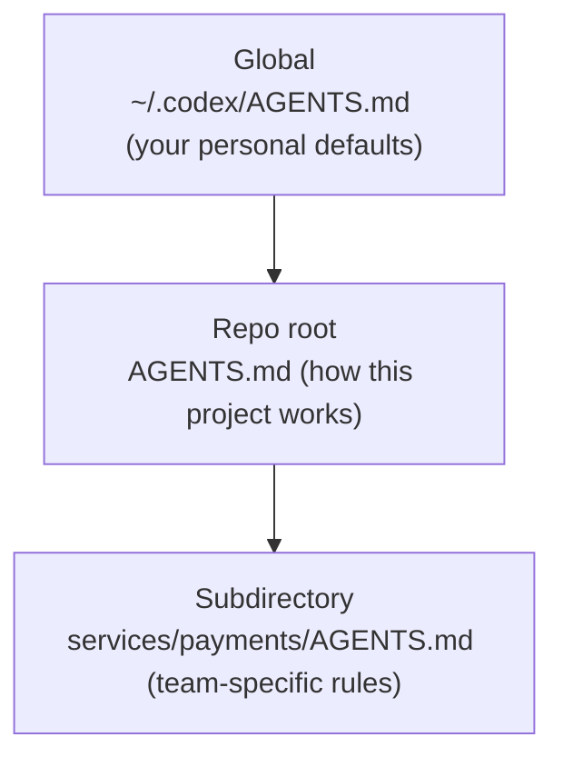

<LevelBadge level="intermediate" />

<VerifyNote lastVerified="2026-06-27" source="https://agents.md/">
The AGENTS.md adopter list and Claude Code's import/symlink behavior evolve quickly — confirm specifics against the official AGENTS.md site and the Claude Code memory docs.
</VerifyNote>

You already know [CLAUDE.md](/docs/claude-code/claude-md) — Claude Code's project briefing. But your repo is probably touched by *more* than one agent: a teammate runs Codex, CI uses a coding bot, someone opens the repo in Cursor. `AGENTS.md` is the open standard those tools agree to read, so you write your project's instructions **once** instead of maintaining a different file per tool.

<Callout type="objectives" items={["What AGENTS.md is and who stewards it", "Why Claude Code reads CLAUDE.md and not AGENTS.md", "Three reliable ways to keep one source of truth across tools", "How nested and global AGENTS.md files merge", "What belongs in the file — and what to keep out"]} />

## What AGENTS.md is

`AGENTS.md` is a plain Markdown file at the root of your repo — think of it as a **README written for agents instead of humans**. It tells a coding agent how to build, test, and contribute to the project. The format has no required fields: agents simply read the prose.

It's an open standard stewarded by the **Agentic AI Foundation (AAIF) under the Linux Foundation**, and as of mid-2026 it's used by 60k+ open-source projects and read by 30+ tools — including OpenAI Codex, Google's Jules and Gemini CLI, Cursor, Windsurf, Devin, Zed, Warp, Aider, goose, Amp, and GitHub Copilot's coding agent.

<Callout type="info" items={["AGENTS.md is a convention, not a runtime: each tool decides how it discovers, merges, and injects the file.", "No schema is enforced — clear prose beats rigid structure.", "It complements your README; it does not replace it."]} />

## The Claude Code catch

Here's the part people trip on: **Claude Code reads `CLAUDE.md`, not `AGENTS.md`.** If your repo only has an `AGENTS.md`, Claude Code ignores it by default. That's not a bug — it predates the standard — but it means a multi-tool repo needs a deliberate sync strategy, or your instructions silently drift apart.

<Callout type="warning" items={["Do not assume Claude Code falls back to AGENTS.md — it does not read it automatically.", "Two hand-maintained files (CLAUDE.md and AGENTS.md) will drift. Pick one source of truth.", "Verify current behavior in the official memory docs before relying on any fallback claim."]} />

## Keep one source of truth

Three patterns keep CLAUDE.md and AGENTS.md in sync without duplicating content. Pick by your team's platform.

<Steps items={[{title: "Symlink (simplest)", body: "Make CLAUDE.md a symlink to AGENTS.md. Claude Code follows symlinks and reads the target byte-for-byte — one real file, zero merge logic. Caveat: on Windows, creating a symlink needs Developer Mode or admin rights, so cross-platform teams may prefer the import method."}, {title: "@import (cross-platform)", body: "Keep a tiny CLAUDE.md whose only job is to pull in the standard file with an @AGENTS.md import. Claude Code expands the imported file into context at launch, so AGENTS.md stays the single source and there's no symlink to break on Windows."}, {title: "/init (migration)", body: "Bootstrapping Claude Code in a repo that already has an AGENTS.md (or .cursorrules / .windsurfrules)? Run /init — it reads those files and folds the relevant parts into a generated CLAUDE.md."}]} />

<PromptCard title="Symlink CLAUDE.md to the shared standard (macOS / Linux)">{`ln -s AGENTS.md CLAUDE.md`}</PromptCard>

<PromptCard title="Or keep a one-line CLAUDE.md that imports it">{`@AGENTS.md`}</PromptCard>

<Callout type="tip" items={["Symlink when your whole team is on macOS/Linux — it's the least to maintain.", "Use @import when Windows contributors are in the mix.", "Commit whichever you choose so the whole team gets the same behavior."]} />

## How nested and global files merge

The richer agents treat AGENTS.md hierarchically — the same mental model as the [CLAUDE.md memory hierarchy](/docs/claude-code/claude-md). Codex, for example, walks from a global file in your home directory down through the Git root to your current folder, concatenating as it goes:

Files closer to the work win, because they're concatenated **last** and override earlier guidance. So a `services/payments/AGENTS.md` inherits the repo-root instructions and adds rules that apply only inside that service — drop specialized guidance as close to the specialized code as possible.

<Flashcards title="Interop at a glance" cards={[{front: "Who reads AGENTS.md?", back: "30+ tools — Codex, Cursor, Windsurf, Devin, Zed, Gemini CLI, Copilot's coding agent, and more. Not Claude Code by default."}, {front: "Who reads CLAUDE.md?", back: "Claude Code — and only Claude Code. It does not read AGENTS.md automatically."}, {front: "Best sync for a Mac/Linux team", back: "Symlink CLAUDE.md → AGENTS.md. One real file, no drift."}, {front: "Best sync with Windows contributors", back: "A one-line CLAUDE.md containing @AGENTS.md — no symlink needed."}, {front: "Merge order for nested files", back: "Global → repo root → subdirectory. Closer-to-the-work files override, because they're concatenated last."}]} />

## What to put in it

The same discipline as a good CLAUDE.md — the standard just suggests a few common sections:

- **Project overview** — what this is, in two sentences.
- **Build & test commands** — how to run, test, and lint.
- **Code style** — conventions an agent can't infer.
- **Testing instructions** — what "done" means.
- **Security considerations** — what never to touch or commit.
- **Commit / PR guidelines** — message format, branch rules.

<Callout type="warning" items={["Agents follow the file literally — stale or aspirational instructions actively hurt, exactly like CLAUDE.md.", "Keep it short and true; describe how the project works today.", "Never commit secrets; reference big docs instead of pasting them."]} />

## Check yourself

<Quiz title="Check yourself" questions={[{q: "Does Claude Code read AGENTS.md automatically?", options: ["Yes, it falls back to AGENTS.md", "No — it reads CLAUDE.md only", "Only on Windows"], answer: 1, explain: "Claude Code reads CLAUDE.md and ignores a standalone AGENTS.md by default, so multi-tool repos need a deliberate sync strategy."}, {q: "Your team is fully on macOS and Linux. What's the lowest-maintenance way to share one instruction file across Claude Code and Codex?", options: ["Maintain CLAUDE.md and AGENTS.md by hand", "Symlink CLAUDE.md to AGENTS.md", "Paste AGENTS.md into a comment"], answer: 1, explain: "Symlinking CLAUDE.md → AGENTS.md gives you one real file; Claude Code follows the symlink and reads the target byte-for-byte."}, {q: "When agents merge a global, a repo-root, and a subdirectory AGENTS.md, which one wins on conflicts?", options: ["The global file", "The repo-root file", "The subdirectory file closest to the work"], answer: 2, explain: "Files are concatenated global → root → subdir, so the file closest to the work appears last and overrides earlier guidance."}]} />

<Callout type="takeaways" items={["AGENTS.md is the open, Linux-Foundation-stewarded standard 30+ coding agents read — a README for agents.", "Claude Code reads CLAUDE.md, not AGENTS.md, so multi-tool repos must keep them in sync.", "Symlink CLAUDE.md → AGENTS.md on Mac/Linux, or use a one-line @AGENTS.md import for cross-platform teams.", "Nested files merge global → root → subdirectory, with the closest file winning.", "Fill it like a great CLAUDE.md: overview, build/test commands, conventions, security, and guardrails — short and true."]} />

## Next

- [CLAUDE.md & Memory Files](/docs/claude-code/claude-md) — the Claude Code side of the same idea
- [CLAUDE.md Templates](/docs/templates/claude-md) — ready-made starters you can reuse as AGENTS.md
- [Slash Commands](/docs/claude-code/slash-commands) — including /init for migrating existing instruction files

## Sources & further reading

- [AGENTS.md — official site & spec](https://agents.md/)
- [OpenAI Codex — Custom instructions with AGENTS.md](https://developers.openai.com/codex/guides/agents-md)
- [Claude Code memory documentation](https://code.claude.com/docs/en/memory)
