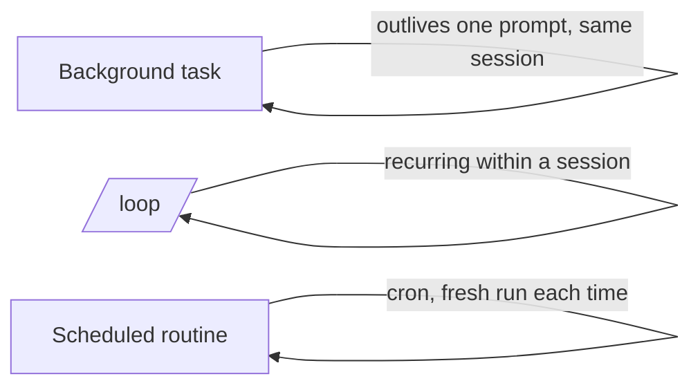

<LevelBadge level="advanced" />

<VerifyNote lastVerified="2026-06-20" source="https://code.claude.com/docs/en">
The exact commands and availability of background tasks, /loop, and scheduling change between releases — confirm in the official docs.
</VerifyNote>

Not everything is a quick edit. Claude Code can run work that **outlives a single prompt**: long commands in the background, recurring loops, and scheduled runs.

## Background tasks

Kick off a long-running command (a dev server, a test watcher, a build) **without blocking** the session. Claude keeps working and is notified when the task produces output or finishes. Use it for anything you'd normally background with `&` — but managed, so Claude can read the output later.

:::tip Don't busy-wait
Start the task in the background and continue; let the completion notification bring you back, rather than polling in a tight loop.
:::

## Recurring loops (`/loop`)

`/loop` runs a prompt or command on a **recurring interval** within a session — e.g. "every 5 minutes, check the deploy status." Give it an interval, or let Claude self-pace. Great for babysitting a CI run or polling an external job that the harness can't otherwise notify you about.

## Scheduled cloud agents

For work that should happen **on a clock, ongoing** — "every morning summarize new issues," "hourly, check for news and update the docs" — use **scheduled tasks / routines** (cron-style). Each run starts fresh, so its instructions must be **self-contained**.

## Choosing between them

| Need | Use |
|---|---|
| Run a long command, keep working | Background task |
| Poll something every N minutes this session | `/loop` |
| Do something on a schedule, indefinitely | Scheduled routine |

:::warning Autonomy needs guardrails
Anything that acts unattended on a schedule should be tightly scoped and reversible. Pair it with strict [permissions](/docs/claude-code/permissions) and read [Hardening Autonomous Runs](/docs/security/hardening-autonomous-runs).
:::

## Next

- [Headless Mode & the Agent SDK](/docs/claude-code/headless-and-agent-sdk)
- [Permissions & Modes](/docs/claude-code/permissions)
- [Hardening Autonomous Runs](/docs/security/hardening-autonomous-runs)
