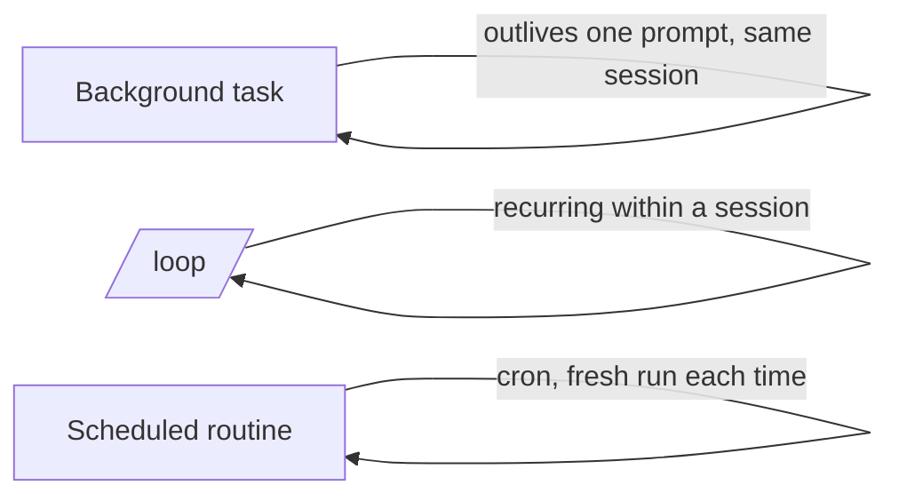

<LevelBadge level="advanced" />

<VerifyNote lastVerified="2026-07-15" source="https://code.claude.com/docs/en">
The exact commands and availability of background tasks, /loop, and scheduling change between releases — confirm in the official docs.
</VerifyNote>

Not everything is a quick edit. Claude Code can run work that **outlives a single prompt**: long commands in the background, recurring loops, and scheduled runs.

<Callout type="objectives" items={[
  "Tell the three mechanisms apart: background tasks, /loop, and scheduled routines",
  "Start a long command without blocking the session — and know why polling it in a tight loop is the wrong move",
  "Pick the right one from a single question: does the work outlive the prompt, the session, or neither?",
  "Write instructions for a scheduled run that are self-contained, because each run starts fresh",
  "Put guardrails under anything that acts unattended"
]} />

## Background tasks

Kick off a long-running command (a dev server, a test watcher, a build) **without blocking** the session. Claude keeps working and is notified when the task produces output or finishes. Use it for anything you'd normally background with `&` — but managed, so Claude can read the output later.

:::tip Don't busy-wait
Start the task in the background and continue; let the completion notification bring you back, rather than polling in a tight loop.
:::

## Recurring loops (`/loop`)

`/loop` runs a prompt or command on a **recurring interval** within a session — e.g. "every 5 minutes, check the deploy status." Give it an interval, or let Claude self-pace. Great for babysitting a CI run or polling an external job that the harness can't otherwise notify you about.

<PromptCard title="Poll a deploy every five minutes, in-session">
{`/loop 5m check the deploy status and tell me the moment it goes green or fails`}
</PromptCard>

Omit the interval and Claude paces itself instead of running on your clock.

## Scheduled cloud agents

For work that should happen **on a clock, ongoing** — "every morning summarize new issues," "hourly, check for news and update the docs" — use **scheduled tasks / routines** (cron-style). Each run starts fresh, so its instructions must be **self-contained**.

```mermaid
flowchart LR
  A[Background task] -->|outlives one prompt, same session| A
  B[/loop/] -->|recurring within a session| B
  C[Scheduled routine] -->|cron, fresh run each time| C
```

## Choosing between them

| Need | Use |
|---|---|
| Run a long command, keep working | Background task |
| Poll something every N minutes this session | `/loop` |
| Do something on a schedule, indefinitely | Scheduled routine |

<Steps items={[
  {
    "title": "Ask what the work has to outlive",
    "body": "One prompt, but not the session? Background task. The prompt, repeatedly, inside this session? /loop. The session itself, on a clock, indefinitely? Scheduled routine."
  },
  {
    "title": "Start it without blocking",
    "body": "Kick off the long command in the background and keep working. Claude is notified when the task produces output or finishes — don't poll it in a tight loop."
  },
  {
    "title": "Make a scheduled run self-contained",
    "body": "Each scheduled run starts fresh, so its instructions carry all the context it needs. Nothing from the session where you set it up comes along."
  },
  {
    "title": "Scope and bound anything unattended",
    "body": "Tightly scoped, reversible work only, paired with strict permissions. Autonomy without guardrails is the failure mode this feature makes easy to reach."
  }
]} />

:::warning Autonomy needs guardrails
Anything that acts unattended on a schedule should be tightly scoped and reversible. Pair it with strict [permissions](/docs/claude-code/permissions) and read [Hardening Autonomous Runs](/docs/security/hardening-autonomous-runs).
:::

<Quiz questions={[
  {
    "q": "You want a summary of new issues every morning, ongoing. Which mechanism fits?",
    "options": [
      "A background task",
      "/loop with a 24h interval",
      "A scheduled routine",
      "A long-running command started with &"
    ],
    "answer": 2,
    "explain": "Work that should happen on a clock, indefinitely, is what scheduled tasks / routines are for — they run cron-style and outlive any session. /loop recurs only within a session, so it stops when the session does."
  },
  {
    "q": "Why must a scheduled routine's instructions be self-contained?",
    "options": [
      "Because scheduled runs have a smaller context window",
      "Because each run starts fresh, with none of the setup session's context",
      "Because cron syntax can't express long prompts",
      "Because permissions are reset to read-only on every run"
    ],
    "answer": 1,
    "explain": "Each run starts fresh, so anything the run needs has to be in its own instructions. Context from the session where you created the routine does not carry over."
  },
  {
    "q": "You've started a long test watcher in the background. What should you NOT do next?",
    "options": [
      "Continue with other work in the same session",
      "Wait for the completion notification to bring you back",
      "Poll the task in a tight loop until it finishes",
      "Read the task's output later when it has produced some"
    ],
    "answer": 2,
    "explain": "Busy-waiting defeats the point. The task is managed, so Claude is notified when it produces output or finishes — start it, keep working, and let the notification bring you back."
  }
]} />

<Callout type="takeaways" items={[
  "Three mechanisms, one question: does the work outlive the prompt (background task), repeat inside the session (/loop), or outlive the session entirely (scheduled routine)?",
  "Background tasks are managed, not just backgrounded with & — Claude can read the output later and is notified when they finish.",
  "Don't busy-wait. Start it, continue, let the completion notification return you to it.",
  "/loop takes an interval, or self-paces if you leave the interval off.",
  "Every scheduled run starts fresh, so its instructions must stand alone.",
  "Unattended autonomy needs strict permissions and reversible scope — that pairing is not optional."
]} />

## Next

- [Auto-Commit Background Agents: Draft-PR Handoff](/docs/claude-code/auto-commit-background-agents) — what happens when a background session finishes
- [Headless Mode & the Agent SDK](/docs/claude-code/headless-and-agent-sdk)
- [Permissions & Modes](/docs/claude-code/permissions)
- [Hardening Autonomous Runs](/docs/security/hardening-autonomous-runs)
