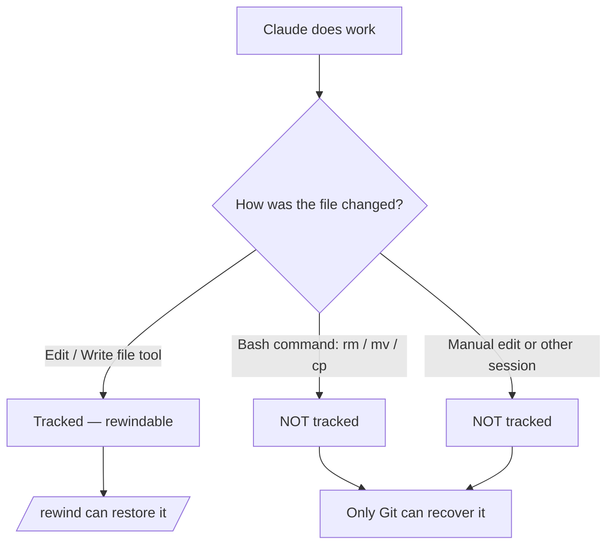

<LevelBadge level="intermediate" />

<Callout type="objectives" items={["Understand what a checkpoint captures — and what it silently does not", "Open the rewind menu two ways and pick the right restore action every time", "Tell 'restore' (undo state) apart from 'summarize' (compress context)", "Know exactly why checkpoints complement Git but never replace it"]} />

<VerifyNote lastVerified="2026-07-09" source="https://code.claude.com/docs/en/checkpointing">
Checkpoint behavior, the rewind menu actions, retention, and version requirements (e.g. resuming past a `/clear` needs Claude Code v2.1.191+) change between releases — confirm in the official docs.
</VerifyNote>

## The big idea

When you turn Claude loose on an ambitious, wide-scale change, the scariest question is "what if it goes wrong three edits deep?" **Checkpointing** is the answer: Claude Code automatically snapshots your code before each edit, so you can rewind to any earlier state instead of untangling a half-finished refactor by hand.

Think of it as a **local undo for the whole session** — a safety net that lets you say "yes, try the bold approach" without fear.

## How checkpoints are created

You don't create checkpoints — they happen automatically.

<Steps items={[{title: "Every prompt = a checkpoint", body: "Each user prompt captures the state of your code before Claude's file-editing tools run. No command, no config, no ceremony."}, {title: "They persist across sessions", body: "Checkpoints survive quitting and resuming a conversation, so you can rewind in a resumed session, not just the live one."}, {title: "They clean themselves up", body: "Checkpoints are removed alongside their session after 30 days (configurable). They are session-level recovery, not an archive."}]} />

## Opening the rewind menu

There are two ways in:

<Steps items={[{title: "Run /rewind", body: "Type the slash command from the prompt. Always works."}, {title: "Press Esc twice — but only on an empty input", body: "Double-Esc opens the rewind menu when the prompt box is empty. If there's text in it, double-Esc clears that text instead (the cleared text is saved to input history, so press Up to get it back afterward)."}]} />

<PromptCard title="Open the rewind menu">{`/rewind`}</PromptCard>

The menu lists **every prompt you sent this session**. Pick the point you want to act on, then choose one action.

## Restore vs. summarize: the key distinction

This is where people get confused. The menu offers two *kinds* of action:

- **Restore** actions change state on disk and/or in the conversation — they undo.
- **Summarize** actions never touch your files — they compress conversation to free up context window space.

<Callout type="warning" items={["Restore = undo (reverts code, conversation, or both). Summarize = compress context (files on disk are untouched).", "Reach for restore when an edit broke something. Reach for summarize when the session is bloated but the code is fine."]} />

### The restore actions

<Steps items={[{title: "Restore code and conversation", body: "Revert both your files and the chat history to the selected point — a clean 'rewind time' to that moment."}, {title: "Restore conversation", body: "Rewind the chat to that message but keep your current code. Useful to re-ask a question without losing edits you want to keep."}, {title: "Restore code", body: "Revert file changes but keep the conversation. Undo the edits, keep the discussion about them."}]} />

After restoring the conversation (or choosing "Summarize from here"), the original prompt from the selected message is dropped back into the input field so you can re-send or edit it.

### The summarize actions

Both compress part of the conversation into an AI-generated summary — like a **targeted `/compact`** where you choose which side of the selected message to squeeze.

<Steps items={[{title: "Summarize from here", body: "Messages BEFORE the selected message stay intact. The selected message and everything after it become a summary. Use it to discard a side discussion while keeping early context in full detail."}, {title: "Summarize up to here", body: "Messages BEFORE the selected message become a summary; the selected message and everything after stay intact. You remain at the end of the conversation. Use it to compress early setup chatter while keeping recent work verbatim."}]} />

The original messages stay in the session transcript either way, so Claude can still reference the details. You can type optional instructions to steer what the summary focuses on.

For the whole flow, see [Context Management](/docs/claude-code/context-management) — `/rewind`'s summarize actions are a scalpel where `/compact` is a broad brush.

## Rewinding past a `/clear`

If you ran `/clear` earlier in the same Claude Code process, the rewind menu shows an extra entry at the top: `/resume <session-id> (previous session)`. Select it to jump back to the conversation that was active before `/clear`.

<VerifyNote lastVerified="2026-07-09" source="https://code.claude.com/docs/en/checkpointing">
Resuming past a `/clear` from the rewind menu requires Claude Code v2.1.191 or later. On earlier versions, run `/resume` and pick the previous session from the list instead.
</VerifyNote>

## Where checkpoints stop — the limits that bite

Checkpoints feel magical until they don't. Three gaps matter:

<Steps items={[{title: "Bash changes are invisible", body: "Files touched by shell commands Claude runs — rm, mv, cp, code generators, formatters — are NOT tracked. Only direct edits through Claude's file-editing tools are checkpointed. A deleted file from rm is gone as far as rewind is concerned."}, {title: "External and concurrent changes are invisible", body: "Manual edits you make outside Claude Code, and edits from other concurrent sessions, are normally not captured — unless they happen to touch the same files the current session edited."}, {title: "It is session-level, not history", body: "Checkpoints are quick, local recovery. They are not commits, not branches, and not shareable with your team."}]} />

## Checkpoints vs. Git: use both

They solve different problems, so pair them.

| | Checkpoints (`/rewind`) | Git |
|---|---|---|
| Scope | One session | Whole project history |
| Granularity | Per prompt, automatic | Per commit, deliberate |
| Tracks bash-made changes? | No | Yes (once staged/committed) |
| Lifespan | ~30 days, then gone | Permanent |
| Shareable / collaborative | No | Yes |
| Mental model | "Local undo" | "Permanent history" |

<Callout type="tip" items={["Commit working states with Git before a risky, wide-scale run — that's your durable floor.", "Use /rewind for fast in-session recovery between commits without polluting your Git history.", "If Claude will run destructive bash (rm/mv) or generators, lean on Git — rewind won't save those files."]} />

## When to reach for it

<Steps items={[{title: "Exploring alternatives", body: "Try a bold implementation, and if you don't like it, restore code and conversation to the fork point and try another."}, {title: "Recovering from a bad edit", body: "An edit introduced a bug three prompts ago? Restore code to just before it instead of debugging the debris."}, {title: "Iterating on a feature", body: "Experiment with variations, always knowing a known-good state is one /rewind away."}, {title: "Freeing context space", body: "A verbose debugging detour ate your context window? Summarize from the midpoint forward and keep your original instructions in full detail."}]} />

<Quiz title="Check yourself" questions={[{q: "Claude ran `rm config.old.json` via a bash command and you want it back. Can `/rewind` restore it?", options: ["Yes — every change Claude makes is checkpointed", "No — bash-made changes are not tracked; only direct file-tool edits are", "Only if you run /rewind within 30 seconds"], answer: 1, explain: "Checkpointing only captures edits made through Claude's file-editing tools. Files changed by bash commands (rm, mv, cp) are not tracked — that's exactly what Git is for."}, {q: "Your code is fine, but a long debugging tangent has filled the context window. Which action fits?", options: ["Restore code and conversation to before the tangent", "Restore code", "Summarize from here at the start of the tangent"], answer: 2, explain: "Summarize actions compress conversation without touching files. 'Summarize from here' turns the tangent into a summary while keeping your earlier context intact — freeing context space with zero code changes."}, {q: "How is a checkpoint created?", options: ["You run /checkpoint manually", "Automatically, before each edit — every prompt makes one", "Only when you commit in Git"], answer: 1, explain: "Checkpointing is automatic: every user prompt captures the pre-edit state of your code. There's no manual step."}]} />

<Flashcards title="Checkpoints & rewind vocabulary" cards={[{front: "Checkpoint", back: "An automatic snapshot of your code taken before each edit, once per prompt. Session-scoped, kept ~30 days."}, {front: "/rewind", back: "Opens the rewind menu listing every prompt this session, so you can restore or summarize from any point. Also reachable via double-Esc on an empty input."}, {front: "Restore action", back: "Reverts state — code, conversation, or both — to the selected point. This is 'undo'."}, {front: "Summarize action", back: "Compresses part of the conversation into an AI summary to free context. Files on disk are never touched."}, {front: "Bash blind spot", back: "Files changed by shell commands (rm/mv/cp) are NOT checkpointed — only direct file-tool edits are. Use Git for those."}]} />

<Callout type="takeaways" items={["Checkpoints are automatic, per-prompt snapshots of your code — a local undo for the whole session, kept about 30 days.", "Open the rewind menu with /rewind or double-Esc on an empty input; it lists every prompt you sent.", "Restore actions undo state (code, conversation, or both); summarize actions compress context and never touch files.", "Bash-made, external, and concurrent changes are NOT tracked — only direct file-tool edits are.", "Checkpoints complement Git, they don't replace it: think 'local undo' vs. 'permanent, shareable history'."]} />

## Next

- [Context Management](/docs/claude-code/context-management) — `/compact`, `/clear`, and how summarize fits the bigger picture
- [Plan Mode](/docs/claude-code/plan-mode) — investigate and approve a plan before edits run, so you rewind less often
- [Permissions](/docs/claude-code/permissions) — the other half of running ambitious tasks safely
