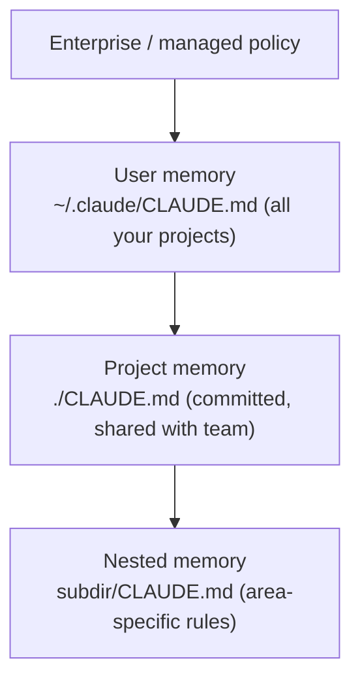

<LevelBadge level="beginner" />

<VerifyNote lastVerified="2026-06-20" source="https://code.claude.com/docs/en/memory">
Memory file locations and import syntax can change — confirm specifics in the official Claude Code memory docs.
</VerifyNote>

If you do **one** thing to make [Claude Code](/docs/claude-code/what-is-claude-code) better, do this. `CLAUDE.md` is a plain-text file Claude reads at the start of every session — your project's permanent briefing.

<Callout type="objectives" items={["Why CLAUDE.md is the single highest-leverage Claude Code setting", "How the memory hierarchy merges from global to project-specific", "How to generate a starting file with /init and trim it down", "What belongs in CLAUDE.md — and what to keep out", "How @imports let you reference docs without duplicating them"]} />

## Why it's the highest-leverage setting

Without it, you re-explain your project every session ("we use pnpm, tests are in `__tests__`, don't touch `/generated`…"). With it, Claude already knows. Good instructions here improve *every* future interaction at once.

## The memory hierarchy

Claude Code reads memory from several places and merges them, roughly most-global to most-specific:

- **User memory** — your personal preferences across every project.
- **Project memory** (`./CLAUDE.md`, committed) — how *this* repo works. Shared with your team.
- **Nested** — drop a `CLAUDE.md` in a subfolder for rules that only apply there.

<Flashcards title="Know your memory layers" cards={[{front: "User memory", back: "~/.claude/CLAUDE.md — your personal preferences that apply across every project."}, {front: "Project memory", back: "./CLAUDE.md — committed and shared with the team; describes how this repo works."}, {front: "Nested memory", back: "subdir/CLAUDE.md — area-specific rules that apply only inside that subfolder."}, {front: "Enterprise / managed policy", back: "The most global layer; org-level policy that sits above your user memory."}]} />

## Generate a starting point

<Steps items={[{title: "Run /init in the project", body: "Claude inspects the code and drafts a CLAUDE.md for you automatically."}, {title: "Edit it down", body: "The draft is a starting point, not the finish line. Trim it to what is true and useful."}, {title: "Borrow a template", body: "Grab a ready-made starter from the CLAUDE.md Templates page and adapt it to your repo."}]} />

<PromptCard title="Generate a draft CLAUDE.md">{`/init`}</PromptCard>

Grab a ready-made starter from [CLAUDE.md Templates](/docs/templates/claude-md).

## What to put in it

- What the project is, in two sentences.
- Tech stack and how to **run / test / lint**.
- Conventions Claude can't infer (naming, structure, commit style).
- **Guardrails**: "run tests before declaring done", "never edit `/vendor`", "never commit secrets".

## What NOT to put in it

<Callout type="warning" items={["Claude follows CLAUDE.md literally — stale, vague, or wishful instructions actively hurt.", "Describe how the project actually works today; short and true beats long and aspirational.", "Avoid giant pasted docs (use @imports instead), secrets, and rules you don't actually follow.", "Review it periodically so it stays accurate as the project evolves."]} />

## Imports

Pull in existing docs instead of duplicating them — e.g. reference your style guide with an `@path/to/file` import so there's one source of truth. See the [official memory docs](https://code.claude.com/docs/en/memory) for the exact syntax.

<Callout type="tip" items={["One source of truth: reference a file with @imports rather than pasting its contents into CLAUDE.md.", "If a doc already exists, link it — don't copy it. Copies drift out of date."]} />

## Check yourself

<Quiz title="Check yourself" questions={[{q: "Which file does Claude Code read at the start of every session as your project's permanent briefing?", options: ["README.md", "CLAUDE.md", "package.json"], answer: 1, explain: "CLAUDE.md is the plain-text memory file Claude reads at the start of every session."}, {q: "What does running /init do in a project?", options: ["It commits CLAUDE.md to your team's repo", "It drafts a CLAUDE.md by inspecting the code, which you then edit down", "It deletes stale memory files"], answer: 1, explain: "/init drafts a starting CLAUDE.md from the code — the draft is a starting point, so you edit it down afterward."}, {q: "What is the recommended way to include a large existing doc like a style guide?", options: ["Paste the whole document into CLAUDE.md", "Reference it with an @path/to/file import", "Store it as a secret"], answer: 1, explain: "Use @imports to point at the file so there is one source of truth instead of a duplicated, drifting copy."}]} />

<Callout type="takeaways" items={["CLAUDE.md is the highest-leverage setting: it improves every future session at once.", "Memory merges from global to specific: enterprise policy, then user, project, and nested CLAUDE.md files.", "Start with /init, then edit the draft down to what is actually true.", "Include the project summary, run/test/lint commands, conventions, and guardrails.", "Keep it short and true — use @imports for big docs, and never commit secrets."]} />

## Next

- [AGENTS.md & Cross-Tool Interop](/docs/claude-code/agents-md) — share one instruction file across every coding agent
- [Plan Mode](/docs/claude-code/plan-mode) — safe first changes
- [Permissions & Modes](/docs/claude-code/permissions) — what Claude may do unattended
- [Walkthrough: Customize Claude Code for a real repo](/docs/walkthroughs/customize-claude-code)
