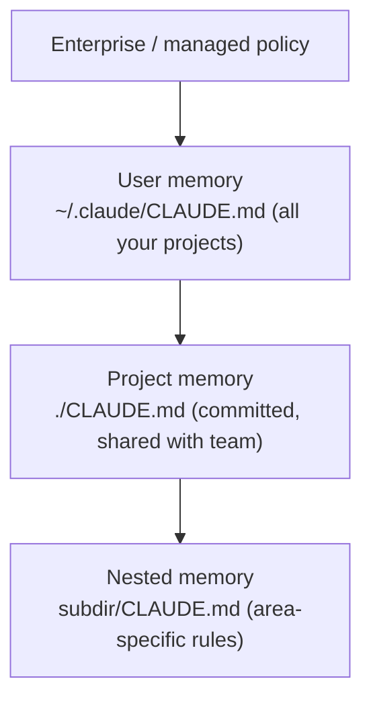

<LevelBadge level="beginner" />

<VerifyNote lastVerified="2026-06-20" source="https://code.claude.com/docs/en/memory">
Memory file locations and import syntax can change — confirm specifics in the official Claude Code memory docs.
</VerifyNote>

If you do **one** thing to make [Claude Code](/docs/claude-code/what-is-claude-code) better, do this. `CLAUDE.md` is a plain-text file Claude reads at the start of every session — your project's permanent briefing.

## Why it's the highest-leverage setting

Without it, you re-explain your project every session ("we use pnpm, tests are in `__tests__`, don't touch `/generated`…"). With it, Claude already knows. Good instructions here improve *every* future interaction at once.

## The memory hierarchy

Claude Code reads memory from several places and merges them, roughly most-global to most-specific:

- **User memory** — your personal preferences across every project.
- **Project memory** (`./CLAUDE.md`, committed) — how *this* repo works. Shared with your team.
- **Nested** — drop a `CLAUDE.md` in a subfolder for rules that only apply there.

## Generate a starting point

Run `/init` in a project and Claude drafts a `CLAUDE.md` by inspecting the code. Then **edit it down** — the draft is a starting point, not the finish line.

## What to put in it

- What the project is, in two sentences.
- Tech stack and how to **run / test / lint**.
- Conventions Claude can't infer (naming, structure, commit style).
- **Guardrails**: "run tests before declaring done", "never edit `/vendor`", "never commit secrets".

Grab a ready-made starter from [CLAUDE.md Templates](/docs/templates/claude-md).

## What NOT to put in it

:::warning Short and true beats long and aspirational
Claude follows `CLAUDE.md` *literally*. Stale, vague, or wishful instructions actively hurt. Describe how the project **actually** works today, keep it tight, and review it periodically.
:::

Avoid: giant pasted docs (use `@imports` to reference files instead), secrets, and rules you don't actually follow.

## Imports

Pull in existing docs instead of duplicating them — e.g. reference your style guide with an `@path/to/file` import so there's one source of truth. See the [official memory docs](https://code.claude.com/docs/en/memory) for the exact syntax.

## Next

- [Plan Mode](/docs/claude-code/plan-mode) — safe first changes
- [Permissions & Modes](/docs/claude-code/permissions) — what Claude may do unattended
- [Walkthrough: Customize Claude Code for a real repo](/docs/walkthroughs/customize-claude-code)
