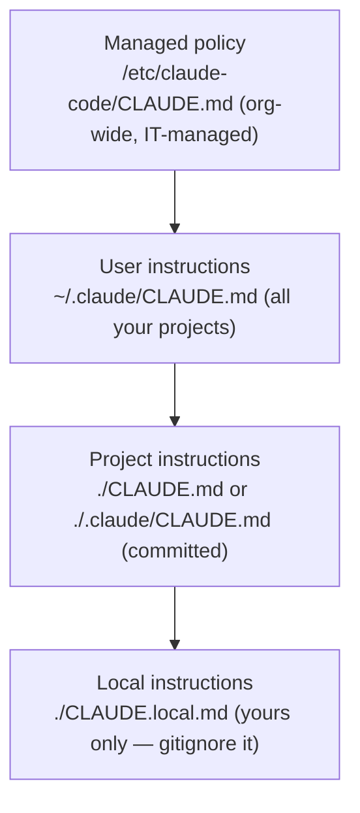

<LevelBadge level="beginner" />

<VerifyNote lastVerified="2026-10-06" source="https://code.claude.com/docs/en/memory">
Locations, load order and import syntax are from the official memory docs ("How Claude remembers your project"), which now describe **two** mechanisms: CLAUDE.md files you write and **auto memory** Claude writes itself. Imports resolve to a maximum depth of four hops. Confirm specifics there — these details change.
</VerifyNote>

If you do **one** thing to make [Claude Code](/docs/claude-code/what-is-claude-code) better, do this. `CLAUDE.md` is a plain-text file Claude reads at the start of every session — your project's permanent briefing.

<Callout type="objectives" items={["Why CLAUDE.md is the single highest-leverage Claude Code setting", "How the memory hierarchy loads, from managed policy down to CLAUDE.local.md", "How auto memory differs from the CLAUDE.md you write", "How to generate a starting file with /init and trim it down", "What belongs in CLAUDE.md — and what to keep out", "How @imports let you reference docs without duplicating them"]} />

## Why it's the highest-leverage setting

Without it, you re-explain your project every session ("we use pnpm, tests are in `__tests__`, don't touch `/generated`…"). With it, Claude already knows. Good instructions here improve *every* future interaction at once.

## The memory hierarchy

Claude Code loads memory from several locations and merges them in load order, broadest scope first — so a project instruction lands in context *after* a user instruction:

```mermaid
flowchart TD
  A["Managed policy<br/>/etc/claude-code/CLAUDE.md (org-wide, IT-managed)"] --> B["User instructions<br/>~/.claude/CLAUDE.md (all your projects)"]
  B --> C["Project instructions<br/>./CLAUDE.md or ./.claude/CLAUDE.md (committed)"]
  C --> D["Local instructions<br/>./CLAUDE.local.md (yours only — gitignore it)"]
```

- **Managed policy** — org-wide instructions your IT/DevOps team ships. Path is per-OS: `/Library/Application Support/ClaudeCode/CLAUDE.md` on macOS, `/etc/claude-code/CLAUDE.md` on Linux and WSL, `C:\Program Files\ClaudeCode\CLAUDE.md` on Windows.
- **User instructions** (`~/.claude/CLAUDE.md`) — your personal preferences across every project.
- **Project instructions** (`./CLAUDE.md` *or* `./.claude/CLAUDE.md`, committed) — how *this* repo works. Shared with your team. If your repo uses [`AGENTS.md`](/docs/claude-code/agents-md), that can load instead of or alongside these.
- **Local instructions** (`./CLAUDE.local.md`) — project-specific notes just for you, like a sandbox URL. Add it to `.gitignore`.

Files in the directory hierarchy *above* your working directory load at launch; files in **subdirectories load on demand**, when Claude touches something in that area.

<Callout type="tip" items={["Outgrown one file? Split instructions into .claude/rules/*.md — one topic per file, discovered recursively. Rules without paths frontmatter load at launch with the same priority as .claude/CLAUDE.md; add paths frontmatter to load a rule only when Claude works on matching files, which saves context."]} />

<Flashcards title="Know your memory layers" cards={[{front: "Managed policy", back: "Org-wide, IT-managed CLAUDE.md — the broadest layer, loaded before user and project instructions."}, {front: "User instructions", back: "~/.claude/CLAUDE.md — your personal preferences that apply across every project."}, {front: "Project instructions", back: "./CLAUDE.md or ./.claude/CLAUDE.md — committed and shared with the team; describes how this repo works."}, {front: "Local instructions", back: "./CLAUDE.local.md — personal project-specific preferences. Gitignore it."}, {front: ".claude/rules/*.md", back: "Topic-per-file instructions for larger projects. With paths frontmatter they load only for matching files."}, {front: "Subdirectory CLAUDE.md", back: "Loads on demand — when Claude works in that part of the tree — not at launch."}]} />

## The other half: auto memory

CLAUDE.md is the half of memory *you* write. Claude Code also keeps **auto memory** — notes Claude writes itself from your corrections and preferences, stored per repository and loaded into every session alongside your CLAUDE.md files.

| | CLAUDE.md files | Auto memory |
| --- | --- | --- |
| **Who writes it** | You | Claude |
| **What it holds** | Instructions and rules | Learnings and patterns |
| **Scope** | Project, user, or org | Per repository, shared across worktrees |

Both are *context*, not enforcement: Claude treats them as guidance it can weigh, not as configuration it must obey. To hard-block an action regardless of what Claude decides, use a [PreToolUse hook](/docs/claude-code/hooks) instead.

<Callout type="warning" items={["Auto memory loads only its first 200 lines or 25 KB — a bloated MEMORY.md silently truncates. See Context Budget Audit for the full startup cost breakdown."]} />

## Generate a starting point

<Steps items={[{title: "Run /init in the project", body: "Claude inspects the code and drafts a CLAUDE.md for you automatically."}, {title: "Edit it down", body: "The draft is a starting point, not the finish line. Trim it to what is true and useful."}, {title: "Borrow a template", body: "Grab a ready-made starter from the CLAUDE.md Templates page and adapt it to your repo."}]} />

<PromptCard title="Generate a draft CLAUDE.md">{`/init`}</PromptCard>

Grab a ready-made starter from [CLAUDE.md Templates](/docs/templates/claude-md).

## What to put in it

- What the project is, in two sentences.
- Tech stack and how to **run / test / lint**.
- Conventions Claude can't infer (naming, structure, commit style).
- **Guardrails**: "run tests before declaring done", "never edit `/vendor`", "never commit secrets".

## What NOT to put in it

<Callout type="warning" items={["Claude follows CLAUDE.md literally — stale, vague, or wishful instructions actively hurt.", "Describe how the project actually works today; short and true beats long and aspirational.", "Avoid giant pasted docs (use @imports instead), secrets, and rules you don't actually follow.", "Review it periodically so it stays accurate as the project evolves."]} />

## Imports

Pull in existing docs instead of duplicating them — e.g. reference your style guide with an `@path/to/file` import so there's one source of truth. Relative and absolute paths both work; relative paths resolve against the file containing the import, **not** your working directory. Imported files can import others, to a maximum depth of **four hops**.

Two syntax traps worth knowing before they bite:

- **Spaces need backslashes.** `@Design\ Docs/api-conventions.md` works; without the backslash the path stops at the first space. Wrapping it in quotes doesn't import the file at all.
- **Backticks opt out.** Import parsing skips code spans and fenced blocks, so `` `@README` `` stays literal text while `@README` on its own imports the file. That's how you *mention* a path without loading it.

See the [official memory docs](https://code.claude.com/docs/en/memory) for the full reference.

<Callout type="tip" items={["One source of truth: reference a file with @imports rather than pasting its contents into CLAUDE.md.", "If a doc already exists, link it — don't copy it. Copies drift out of date."]} />

## Check yourself

<Quiz title="Check yourself" questions={[{q: "Which file does Claude Code read at the start of every session as your project's permanent briefing?", options: ["README.md", "CLAUDE.md", "package.json"], answer: 1, explain: "CLAUDE.md is the plain-text memory file Claude reads at the start of every session."}, {q: "What does running /init do in a project?", options: ["It commits CLAUDE.md to your team's repo", "It drafts a CLAUDE.md by inspecting the code, which you then edit down", "It deletes stale memory files"], answer: 1, explain: "/init drafts a starting CLAUDE.md from the code — the draft is a starting point, so you edit it down afterward."}, {q: "What is the recommended way to include a large existing doc like a style guide?", options: ["Paste the whole document into CLAUDE.md", "Reference it with an @path/to/file import", "Store it as a secret"], answer: 1, explain: "Use @imports to point at the file so there is one source of truth instead of a duplicated, drifting copy."}, {q: "Where do personal, project-specific notes go — the ones you don't want committed?", options: ["~/.claude/CLAUDE.md", "./CLAUDE.local.md", "./.claude/CLAUDE.md"], answer: 1, explain: "./CLAUDE.local.md is the local layer: project-specific but yours alone. Gitignore it. ~/.claude/CLAUDE.md applies to all your projects, and ./.claude/CLAUDE.md is committed team instructions."}, {q: "Who writes auto memory?", options: ["You, by hand", "Claude, from your corrections and preferences", "Your IT administrator"], answer: 1, explain: "Auto memory is the half Claude writes itself — learnings and patterns, stored per repository. CLAUDE.md is the half you write."}, {q: "A CLAUDE.md in a subdirectory loads when?", options: ["At launch, with every other memory file", "On demand, when Claude works in that part of the tree", "Only if you @import it"], answer: 1, explain: "Files above your working directory load at launch; files in subdirectories load on demand, when Claude touches something in that area."}]} />

<Callout type="takeaways" items={["CLAUDE.md is the highest-leverage setting: it improves every future session at once.", "Memory loads broadest-first: managed policy, then user (~/.claude/CLAUDE.md), project (./CLAUDE.md or ./.claude/CLAUDE.md), then local (./CLAUDE.local.md). Subdirectory files load on demand.", "Auto memory is the other half — Claude's own notes, per repository, loaded every session. Both are context, not enforcement: use a hook to hard-block something.", "Outgrown one file? Split it into .claude/rules/*.md and scope rules with paths frontmatter.", "Start with /init, then edit the draft down to what is actually true.", "Keep it short and true — use @imports (max four hops) for big docs, and never commit secrets."]} />

## Next

- [AGENTS.md & Cross-Tool Interop](/docs/claude-code/agents-md) — share one instruction file across every coding agent
- [Plan Mode](/docs/claude-code/plan-mode) — safe first changes
- [Permissions & Modes](/docs/claude-code/permissions) — what Claude may do unattended
- [Walkthrough: Customize Claude Code for a real repo](/docs/walkthroughs/customize-claude-code)
