<LevelBadge level="intermediate" />

A Claude Code project accumulates context debt the way a laptop accumulates browser tabs. Every skill you installed adds a line to a listing Claude re-reads on every turn. Every subagent adds a description. Every `CLAUDE.md` paragraph you wrote in March loads in September whether the task needs it or not. And every `npm test` dumps up to 30,000 characters into the conversation. None of it is visible until the session starts forgetting instructions or the bill stops matching the work.

[Context management](/docs/claude-code/context-management) covers the two commands you use in the moment, `/clear` and `/compact`. This page is the audit you run once per project: six places where Claude Code spends context before you type anything or between your turns, the setting that governs each, and the number it defaults to. Everything here is in the official docs as of September 2026, and most of the knobs are newer than the folklore about them.

<Callout type="objectives" items={[
  "Measure before you cut: read /context, /usage attribution, and /doctor's listing estimate so you fix the biggest line item first",
  "Prune the skill listing with /skill-doctor (v2.1.252+) and the four skillOverrides states, and know the 1%-of-window budget the listing is capped at",
  "Cap what a shell command or background task returns inline (30,000 and 32,000 characters by default) with bashOutputMaxChars and taskOutputMaxChars",
  "Stop paying for CLAUDE.md in every subagent with omitClaudeMd (v2.1.271+) and keep subagent descriptions under the 15,000-token warning line",
  "Set the auto-compact window on purpose (/autocompact, autoCompactWindow) and understand the 25,000-token budget that decides which invoked skills survive compaction",
  "Cap effort fleet-wide with maxEffortLevel when thinking tokens, not context, are the real bill"
]} />

<VerifyNote lastVerified="2026-09-15" source="https://code.claude.com/docs/en/settings-reference">
Setting names, defaults, ranges, and minimum versions from the Claude Code settings reference (`autoCompactWindow`, `bashOutputMaxChars`, `taskOutputMaxChars`, `maxEffortLevel`, `skillListingBudgetFraction`, `skillOverrides`, `disableBundledSkills`). `/skill-doctor` behavior, the 1% listing budget, the 1,536-character description cap, and the 25,000-token re-attach budget from the [skills docs](https://code.claude.com/docs/en/skills). Bash inline limits from the [tools reference](https://code.claude.com/docs/en/tools-reference#output-limits). `omitClaudeMd`, the 15,000-token description warning, and what a subagent loads from the [subagents docs](https://code.claude.com/docs/en/sub-agents). CLAUDE.md and cost guidance from [Manage costs](https://code.claude.com/docs/en/costs). Model context sizes are not repeated here; see [Models and pricing](/docs/whats-new/models-and-pricing).
</VerifyNote>

## What is in the window before you type

```mermaid
flowchart LR
  subgraph startup["Loaded at session start (every turn thereafter)"]
    SP[System prompt]
    CM[CLAUDE.md hierarchy]
    AM["Auto memory (first 200 lines / 25 KB)"]
    SL["Skill listing (capped at 1% of window)"]
    AD["Subagent descriptions (warning at 15k tokens)"]
    MT["MCP tool names (schemas deferred)"]
  end
  subgraph turns["Added as you work"]
    TR["Tool results (Bash ≤30k chars inline)"]
    TO["Background task output (≤32k chars inline)"]
    SK["Invoked skill bodies"]
    FR[File reads]
  end
  startup --> turns --> C{Auto-compact window}
  C -->|summary| R["Re-attached skills: 5k each, 25k total"]
```

Two facts make this diagram actionable. Everything in the left box is paid **on every request**, because Claude Code sends the full conversation each turn and only the cache-read discount softens it. And the right box is where a single verbose command can add more than the whole left box in one step. The audit below works left to right.

## The audit

<Steps items={[
  { title: "Measure: /context, /usage, /doctor", body: "Run /context for a live breakdown by category with optimization suggestions, including which CLAUDE.md and auto-memory files loaded. On a Pro, Max, Team, or Enterprise plan, /usage attributes recent usage to skills, subagents, plugins, and individual MCP servers as percentages, and flags behaviors (long context, cache misses) that account for 10% or more. /doctor estimates the skill listing's context cost and its biggest contributors. Write the three biggest line items down before changing anything." },
  { title: "Prune the skill listing with /skill-doctor", body: "Every skill in the listing costs context on every turn whether or not Claude uses it. /skill-doctor (v2.1.252+) shows each skill's context cost and invocation frequency, flags skills never invoked, and tells you where to turn them off; it also lists plugins you have not used recently. Start with the highest-cost unused ones. Interactive sessions open the report in the /plugin manager's Stats tab; with -p it prints as text. It does not cover bundled or enterprise skills, needs feature-flag fetching, and refuses over Remote Control." },
  { title: "Collapse, do not delete, with skillOverrides", body: "Four states per skill: on (name and description listed), name-only (listed without description, still invocable), user-invocable-only (hidden from Claude, still in the / menu), off. The /skills menu writes this for you: highlight a skill, press Space to cycle, Esc to save to .claude/settings.local.json. Plugin skills are managed through /plugin instead. Setting disableBundledSkills: true removes Claude Code's own bundled skills and workflows in one line." },
  { title: "Know the listing budget and the description cap", body: "The listing is capped at 1% of the model's context window (skillListingBudgetFraction, default 0.01). When it overflows, Claude Code keeps every name but drops descriptions starting with the least-used skills, which strips the keywords Claude needs to auto-select them. Each skill's description plus when_to_use is also cut at 1,536 characters (skillListingMaxDescChars). Put the key use case in the first sentence." },
  { title: "Shrink what loads at startup", body: "Keep CLAUDE.md under 200 lines and move workflow-specific instructions (PR review, migrations) into skills, which load only when invoked. Auto memory loads only its first 200 lines or 25 KB, so a bloated MEMORY.md silently truncates. Subagent descriptions are read every turn: when the combined descriptions of your custom subagents pass 15,000 tokens, Claude Code warns at startup. Move detail into each subagent's system prompt, which loads only when it runs." },
  { title: "Cap tool output inline", body: "A successful Bash or PowerShell command returns up to roughly 30,000 characters inline by default; past that Claude gets a short preview plus a file path and reads the file on demand. A failing command returns up to 10,000 characters as a head-and-tail excerpt. bashOutputMaxChars (v2.1.261+, clamped to 4,000–128,000) sets the inline ceiling and read-back window together and makes Claude Code ignore BASH_MAX_OUTPUT_LENGTH. taskOutputMaxChars does the same for background tasks read with TaskOutput (default 32,000, same range). Lower them on projects with chatty build tools; raise them only when Claude keeps opening the saved file anyway." },
  { title: "Stop paying for CLAUDE.md in every subagent", body: "A non-fork subagent loads every level of your CLAUDE.md hierarchy plus a git-status snapshot, on top of its own prompt. The built-in Explore and Plan agents skip both. For custom subagents that get everything from the delegation prompt, set omitClaudeMd: true in the frontmatter (v2.1.271+): user, project, and local CLAUDE.md files are skipped; managed policy files still load. Ignored when the agent runs as the main session agent. For large shared instructions in headless runs, pass --append-subagent-system-prompt-file (v2.1.261+) instead of stuffing them into every description." },
  { title: "Set the auto-compact window on purpose", body: "autoCompactWindow is a token count from 100,000 to 1,000,000, capped at your model's window; unset means Claude Code picks a window tuned for the model. /autocompact 500k writes it to user settings; --autocompact overrides for one session; CLAUDE_CODE_AUTO_COMPACT_WINDOW overrides both. CLAUDE_AUTOCOMPACT_PCT_OVERRIDE (1–100) can only lower the trigger point. After compaction, invoked skills are re-attached at up to 5,000 tokens each within a 25,000-token total, most recent first, so older skills can be dropped entirely. If a skill must survive, re-invoke it after /compact." },
  { title: "Cap effort when thinking is the bill, not context", body: "Thinking tokens are billed as output. maxEffortLevel (v2.1.267+) caps the effort any session can use: one of low, medium, high, xhigh, or max (max = no cap). It applies before every request on every provider, the lowest cap across scopes wins, and a cap below xhigh disables ultracode. Per-model caps go in modelSettings. Deploy through managed settings to enforce for an organization." }
]} />

## A settings block you can paste

<PromptCard title="Project-local context caps (.claude/settings.local.json)">
{`{
  "bashOutputMaxChars": 12000,
  "taskOutputMaxChars": 12000,
  "skillOverrides": {
    "legacy-migration-notes": "name-only",
    "deploy-prod": "user-invocable-only",
    "old-design-system": "off"
  },
  "autoCompactWindow": 500000,
  "maxEffortLevel": "high"
}`}
</PromptCard>

Read it top to bottom as decisions, not defaults. The two output caps assume a chatty test runner; drop them back toward the 30,000 / 32,000 defaults if Claude starts opening the saved output file on every run. The three overrides keep the skills reachable without paying for their descriptions. The compaction window is an explicit choice for a 1M-context model where you would rather compact at half than at the model-tuned point. The effort cap is the one line here that changes output quality, so set it last and only after `/usage` shows thinking tokens dominating.

<PromptCard title="Subagent that does not load CLAUDE.md (.claude/agents/repo-auditor.md)">
{`---
name: repo-auditor
description: Audits a repository for dead code and unused exports. Use for read-only sweeps.
tools: Read, Grep, Glob, Bash
model: sonnet
omitClaudeMd: true
---
You are a read-only auditor. Everything you need is in the delegation prompt.
Report findings as a table of path, symbol, and evidence. Do not edit files.`}
</PromptCard>

<PromptCard title="Run the skill report in a headless session">
{`claude -p "/skill-doctor"`}
</PromptCard>

## Common mistakes

<Callout type="warning" items={[
  "Deleting skills instead of collapsing them. name-only keeps a skill invocable at near-zero listing cost; off removes it from the / menu too. Most 'unused' skills should become name-only, not disappear.",
  "Raising bashOutputMaxChars to the 128,000 ceiling because one build log overflowed. That makes every future command up to 4× more expensive inline. Filter the log with a PreToolUse hook (grep for FAIL, head -100) instead; the costs docs show the exact hook.",
  "Setting autoCompactWindow above the model's context. Claude Code caps it at the window silently, so the setting looks applied and does nothing.",
  "Assuming a subagent is cheap because its context is separate. Its startup still includes every CLAUDE.md level and a git snapshot unless it is Explore, Plan, or sets omitClaudeMd.",
  "Reading /skill-doctor over Remote Control from a phone. It returns 'Skill usage reports are not available on this connection.' Run it in the terminal where the session lives.",
  "Expecting an invoked skill to survive /compact. Only the most recent invocations fit in the 25,000-token re-attach budget, at 5,000 tokens each. Re-invoke the ones you still need."
]} />

## Quick check

<Quiz questions={[
  {
    q: "What does /skill-doctor report, and what does it deliberately leave out?",
    options: [
      "Every skill's full body; nothing is excluded",
      "Each session skill's context cost and invocation count, flagging never-invoked ones — bundled and enterprise skills are excluded",
      "Only plugin skills",
      "Only skills that errored"
    ],
    answer: 1,
    explain: "The report covers the skills in your session other than bundled and enterprise skills, shows cost and frequency, flags never-invoked skills with where to turn them off, and lists plugins you have not used recently. Requires v2.1.252+ and feature-flag fetching."
  },
  {
    q: "Your skill listing has overflowed its budget. What happens?",
    options: [
      "Claude Code refuses to start",
      "Skills are removed at random",
      "Every name stays; descriptions are dropped starting with the least-used skills, so Claude is less likely to auto-select them",
      "The budget grows automatically"
    ],
    answer: 2,
    explain: "The listing is capped at 1% of the context window (skillListingBudgetFraction 0.01). On overflow, names are kept and descriptions of the least-used skills are dropped first. Raise the fraction or set low-priority skills to name-only."
  },
  {
    q: "A successful npm test prints 80,000 characters. With default settings, what does Claude receive?",
    options: [
      "All 80,000 characters inline",
      "Roughly the first 30,000 characters plus a path to a saved file with the rest, which Claude can read or search",
      "Nothing — the command is killed",
      "Only the last 10,000 characters"
    ],
    answer: 1,
    explain: "Valid results are inline up to roughly 30,000 characters by default; beyond that Claude gets a short preview and the saved file's path. Failures get a 10,000-character head-and-tail excerpt with no file. bashOutputMaxChars (4,000–128,000) changes the valid-result ceiling."
  },
  {
    q: "Which subagents skip your CLAUDE.md files without any configuration?",
    options: [
      "None — every subagent loads them",
      "The built-in Explore and Plan agents",
      "All custom subagents",
      "Forked subagents"
    ],
    answer: 1,
    explain: "Explore and Plan skip CLAUDE.md and the git-status snapshot. Every other built-in and custom subagent loads both unless its definition sets omitClaudeMd: true (v2.1.271+). A fork inherits the parent conversation instead."
  },
  {
    q: "You invoked six skills in a long session and /compact just ran. Which survive?",
    options: [
      "All six, in full",
      "The most recently invoked ones, up to 5,000 tokens each within a 25,000-token total; older ones may be dropped entirely",
      "None — compaction clears skills",
      "Only the first one invoked"
    ],
    answer: 1,
    explain: "Claude Code re-attaches the most recent invocation of each skill after the summary, keeping the first 5,000 tokens of each, within a combined 25,000-token budget filled from the most recently invoked skill. Re-invoke anything you still need."
  },
  {
    q: "maxEffortLevel is set to 'medium' in managed settings and 'high' in your user settings. What runs?",
    options: [
      "high — user settings win",
      "medium — the lowest cap across scopes applies",
      "max — conflicting caps cancel",
      "Whatever /effort last set"
    ],
    answer: 1,
    explain: "When several scopes set a cap, the lowest applies, so a cap set in one scope cannot be raised from another. It also overrides /effort, --effort, CLAUDE_CODE_EFFORT_LEVEL, and effort frontmatter. Requires v2.1.267+."
  }
]} />

<Flashcards cards={[
  { front: "/skill-doctor", back: "v2.1.252+. Per-skill context cost + invocation frequency; flags never-invoked skills and where to turn them off; lists unused plugins. Excludes bundled/enterprise skills. Not over Remote Control. Prints as text with -p." },
  { front: "Skill listing budget", back: "1% of the model's context window (skillListingBudgetFraction 0.01). Overflow keeps names, drops descriptions of least-used skills first. Each description + when_to_use capped at 1,536 characters (skillListingMaxDescChars)." },
  { front: "skillOverrides states", back: "on (name + description) · name-only (name, still invocable) · user-invocable-only (hidden from Claude, in / menu) · off (hidden everywhere). /skills menu: Space cycles, Esc saves to .claude/settings.local.json. Plugin skills: use /plugin." },
  { front: "Bash output limits", back: "Valid: ~30,000 chars inline, then preview + saved file path. Failure: 10,000 chars head-and-tail, no file. bashOutputMaxChars (v2.1.261+) clamps 4,000–128,000 and overrides BASH_MAX_OUTPUT_LENGTH." },
  { front: "taskOutputMaxChars", back: "Inline limit for background-task output read with TaskOutput. Default 32,000 chars (most recent characters kept). Range 4,000–128,000. Overrides TASK_MAX_OUTPUT_LENGTH. v2.1.261+." },
  { front: "omitClaudeMd", back: "Subagent frontmatter, v2.1.271+. Skips user, project, and local CLAUDE.md; managed policy files still load. Ignored for the main session agent. Explore and Plan skip CLAUDE.md anyway." },
  { front: "autoCompactWindow", back: "Tokens, 100,000–1,000,000, capped at the model window. Unset = model-tuned default. /autocompact 500k writes it; --autocompact overrides per session; CLAUDE_CODE_AUTO_COMPACT_WINDOW overrides both. CLAUDE_AUTOCOMPACT_PCT_OVERRIDE only lowers." },
  { front: "Skills after compaction", back: "Most recent invocation of each skill re-attached, first 5,000 tokens each, 25,000 tokens total, most recent first. Older skills can be dropped entirely. The skill listing itself does not reload." },
  { front: "Subagent description limit", back: "Combined descriptions of custom subagents over 15,000 tokens trigger a startup warning. Trim descriptions; move detail into the system prompt, which loads only when the subagent runs." },
  { front: "maxEffortLevel", back: "v2.1.267+. low / medium / high / xhigh / max (no cap). Applied before every request on every provider. Lowest cap across scopes wins. Below xhigh disables ultracode. Per-model caps in modelSettings." }
]} />

<Callout type="takeaways" items={[
  "Measure first: /context for the live breakdown, /usage for attribution by skill, subagent, plugin, and MCP server, /doctor for the listing estimate.",
  "The skill listing is a per-turn tax capped at 1% of the window. /skill-doctor tells you what to collapse; name-only keeps a skill usable at near-zero cost.",
  "Tool output is the fastest way to blow a window: ~30,000 characters inline per successful command, 32,000 per background task. Cap with bashOutputMaxChars / taskOutputMaxChars, or filter with a hook.",
  "Subagents are not free at startup: every CLAUDE.md level plus git status, unless Explore, Plan, or omitClaudeMd. Keep custom descriptions under 15,000 tokens combined.",
  "Compaction keeps only the most recent invoked skills (5,000 each, 25,000 total). Set autoCompactWindow deliberately, and re-invoke what must survive.",
  "When thinking tokens dominate the bill, maxEffortLevel caps effort fleet-wide; lowest scope wins and it holds on every provider."
]} />

## Sources & further reading

- [Claude Code docs — Settings reference](https://code.claude.com/docs/en/settings-reference) — `autoCompactWindow`, `bashOutputMaxChars`, `taskOutputMaxChars`, `maxEffortLevel`, `skillListingBudgetFraction`, `skillOverrides`, `disableBundledSkills`
- [Claude Code docs — Extend Claude with skills](https://code.claude.com/docs/en/skills) — `/skill-doctor`, the listing budget, description cap, compaction re-attach budget
- [Claude Code docs — Tools reference: output limits](https://code.claude.com/docs/en/tools-reference#output-limits) — inline ceilings for valid and failing commands
- [Claude Code docs — Subagents](https://code.claude.com/docs/en/sub-agents) — what loads at startup, `omitClaudeMd`, the 15,000-token description warning
- [Claude Code docs — Manage costs](https://code.claude.com/docs/en/costs) — `/usage` attribution, the 200-line CLAUDE.md guidance, the test-output filter hook
- [Claude Code docs — Explore the context window](https://code.claude.com/docs/en/context-window) — the interactive simulation this page's diagram summarizes
- Related on AILmanac: [MCP token cost](/docs/claude-code/mcp-token-cost) — the MCP-specific half of the same audit
- Related on AILmanac: [Subagent fleet limits](/docs/claude-code/subagent-fleet-limits) — the concurrency and budget side of subagents

## Next

- [Context management](/docs/claude-code/context-management) — `/clear` vs `/compact` in the moment, once the audit is done
- [Skills](/docs/claude-code/skills) — writing skills that earn their listing line
- [Subagents](/docs/claude-code/subagents) — designing the delegation prompt so `omitClaudeMd` is safe
