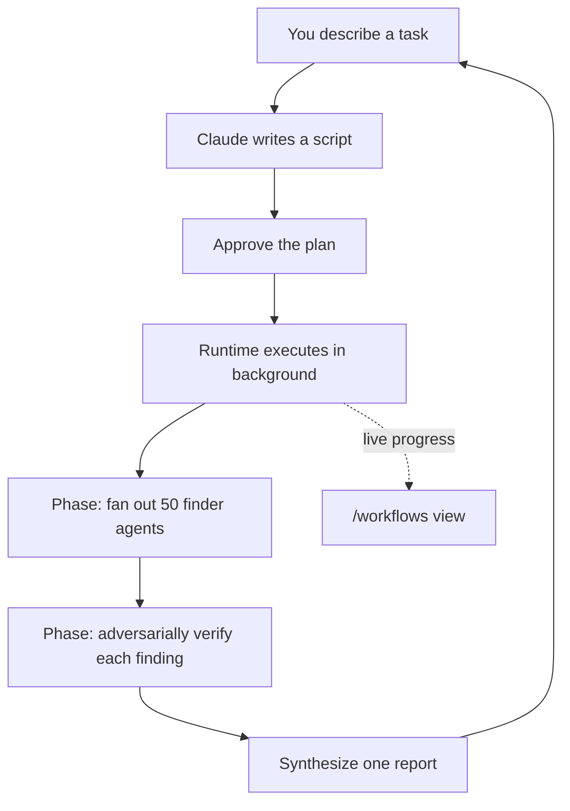

<LevelBadge level="advanced" />

<VerifyNote lastVerified="2026-06-28" source="https://code.claude.com/docs/en/workflows">
Dynamic workflows are a fast-moving feature: the trigger keyword, approval options, agent caps, and availability change between Claude Code releases — confirm specifics in the official docs. They require Claude Code v2.1.154+ and a paid plan.
</VerifyNote>

<Callout type="objectives" items={["Tell a workflow apart from subagents, skills, and agent teams by who holds the plan", "See one in 30 seconds with the bundled /deep-research command", "Start your own three ways: the ultracode keyword, /effort ultracode, or a saved command", "Know what the approval prompt is protecting you from before you press Yes", "Keep cost and unattended runs under control with slicing and the allowlist"]} />

A **dynamic workflow** is a JavaScript script that orchestrates [subagents](/docs/claude-code/subagents) at scale. You describe a task; Claude *writes the script*; a runtime executes it in the background while your session stays responsive. Where a normal multi-step task lives turn-by-turn in Claude's context window, a workflow moves the **plan into code** — the loop, the branching, and every intermediate result live in script variables, so your context holds only the final answer.

That single shift is what makes workflows scale to *dozens or hundreds* of agents in one run, where ordinary delegation tops out at a handful.

## When to reach for a workflow

Claude Code gives you four ways to run multi-step work. The real question is **who holds the plan**:

| | [Subagents](/docs/claude-code/subagents) | [Skills](/docs/claude-code/skills) | Agent teams | **Workflows** |
| :-- | :-- | :-- | :-- | :-- |
| What it is | A worker Claude spawns | Instructions Claude follows | A lead supervising peer sessions | A script the runtime executes |
| Who decides what runs next | Claude, turn by turn | Claude, per the prompt | The lead, turn by turn | **The script** |
| Where results live | Context window | Context window | A shared task list | **Script variables** |
| Scale | A few per turn | Same as subagents | A handful of peers | **Dozens to hundreds** |
| On interruption | Restarts the turn | Restarts the turn | Teammates keep running | **Resumable in-session** |

Use a workflow when a task needs **more agents than one conversation can coordinate**, or when you want the orchestration **codified as a script you can read and rerun**. Canonical cases:

- A **codebase-wide bug sweep** — fan a finder across every module, then have independent agents adversarially verify each finding before it's reported.
- A **500-file migration** — one agent per file, each in its own worktree, with a verification stage.
- A **research question** where sources must be **cross-checked against each other**, not just summarized.
- A **hard plan** worth drafting from several independent angles, then weighed against each other before you commit.

That last point is the underrated one: a workflow can apply a *repeatable quality pattern* (adversarial review, multi-angle drafting, majority-vote verification), so you get a more trustworthy result than a single pass — not just more agents.



## The fastest way to see one: /deep-research

Claude Code ships a built-in workflow so you don't have to write one to try the model. Run it on any question:

<PromptCard title="Try a workflow in one command">{`/deep-research What changed in the Node.js permission model between v20 and v22?`}</PromptCard>

It fans web searches across several angles, fetches and **cross-checks** the sources, votes on each claim, and returns a **cited report with claims that didn't survive cross-checking filtered out**. Approve when prompted, then watch it work with `/workflows`. (It needs the WebSearch tool available.)

## Three ways to start your own

**1. Ask in one prompt.** Include the keyword `ultracode`, or just ask in plain words ("use a workflow", "run a workflow"). Claude writes a script for that single task without changing your session's effort level:

<PromptCard title="Run one task as a workflow">{`ultracode: audit every API endpoint under src/routes/ for missing auth checks`}</PromptCard>

The keyword is highlighted in your input. Didn't mean it? Press `Option+W` (macOS) or `Alt+W` (Windows/Linux) to dismiss the highlight for that prompt.

:::note Keyword history
Before v2.1.160 the literal trigger word was `workflow`; it was renamed to `ultracode` so the common word "workflow" wouldn't fire a run. Natural-language requests ("run a workflow") work in **both** versions.
:::

**2. Let Claude decide — ultracode effort.** Set the session to ultracode and Claude plans a workflow for *every* substantive task, deciding on its own when one is warranted:

<PromptCard title="Turn on automatic orchestration for the session">{`/effort ultracode`}</PromptCard>

Ultracode combines `xhigh` [reasoning effort](/docs/api/thinking-and-effort) with automatic orchestration. A single request can become several workflows in a row — one to understand the code, one to make the change, one to verify it. Every task then uses more tokens and takes longer, so drop back with `/effort high` for routine work. It lasts only the current session.

**3. Run a saved or bundled command.** `/deep-research`, or any workflow you've saved (below), appears in `/` autocomplete like any slash command.

## Approve before it runs

Workflows can spawn a lot of agents, so the CLI shows you the planned phases and asks first:

- **Yes, run it** — start the run
- **Yes, and don't ask again for `[name]` in `[path]`** — start and skip the prompt for this workflow in this project
- **View raw script** (`Ctrl+G` opens it in your editor) — read before deciding
- **No** — cancel (`Tab` lets you tweak the prompt first)

Whether you're prompted depends on your [permission mode](/docs/claude-code/permissions): **Default / accept-edits** prompts every run (unless you opted out for that workflow); **Auto** prompts on first launch only; **bypass / `claude -p` / Agent SDK** never prompt — the run starts immediately.

:::warning The subagents don't inherit your session's mode
Whatever your session's permission mode, the agents a workflow spawns always run in **`acceptEdits`** and inherit your [tool allowlist](/docs/claude-code/permissions) — file edits are auto-approved. Shell commands, web fetches, and MCP tools *not* on your allowlist can still pause the run to prompt you. On a long unattended run, **add the commands the agents need to your allowlist before starting** so it doesn't stall waiting on you. See [Hardening Autonomous Runs](/docs/security/hardening-autonomous-runs).
:::

## How a run executes

The runtime runs the script in an **isolated environment**, separate from your conversation — intermediate results stay in script variables, never touching Claude's context. The script itself has **no direct filesystem or shell access**: the *agents* read, write, and run commands; the script only coordinates them.

Every run writes its script to a file under your session directory in `~/.claude/projects/`, and Claude gets the path. So you can ask Claude for the script, read the orchestration it wrote, diff it against a previous run, or edit it and ask Claude to relaunch from your edited version.

The runtime enforces a few caps so a bad script can't run away:

| Constraint | Why |
| :-- | :-- |
| No mid-run user input (only agent permission prompts pause it) | For sign-off between stages, run each stage as its own workflow |
| Script has no direct filesystem/shell access | Agents do the work; the script coordinates |
| Up to **16 concurrent** agents (fewer on low-core machines) | Bounds local resource use |
| **1,000 agents total** per run | Prevents runaway loops |

## Watch and manage runs

Run `/workflows` to list running and completed runs, then select one to open its progress view — each phase with its agent count, token total, and elapsed time. Drill into a phase, then an agent, to read its prompt, recent tool calls, and result. Key controls:

| Key | Action |
| :-- | :-- |
| `↑` / `↓` | Select a phase or agent |
| `Enter` / `→` | Drill in; `Esc` backs out |
| `f` | Filter agents by status (v2.1.186+) |
| `p` | Pause or resume the run |
| `x` | Stop the selected agent — or the whole run when focus is on it |
| `r` | Restart the selected running agent |
| `s` | **Save** this run's script as a command |

A one-line progress summary also appears in the task panel below your input box; press down-arrow to focus it, Enter to expand.

**Resume:** stop a run and resume it later (`p`) — agents that already finished return cached results, the rest run live. Resume works **within the same session**; exit Claude Code mid-run and the next session starts it fresh.

## Save a workflow for reuse

When Claude writes a good orchestration for something you'll repeat — a review you run on every branch — press `s` in `/workflows` to save that run's script. `Tab` toggles where:

- `.claude/workflows/` in your project — shared with everyone who clones the repo
- `~/.claude/workflows/` in your home — available everywhere, only you see it

It then runs as `/[name]` in future sessions. A saved workflow can take input via an `args` global, so you parameterize it at call time instead of editing the script:

```text
> Run /triage-issues on issues 1024, 1025, and 1030
```

Claude passes the list as structured data, so the script calls array/object methods on `args` directly.

## Mind the cost

A workflow spawns many agents, so one run can use **meaningfully more tokens** than doing the same task in conversation, and it counts toward your plan's usage and rate limits. Two habits keep this sane:

- **Slice first.** Run on one directory (not the whole repo) or a narrow question first to gauge spend; `/workflows` shows per-agent token usage live, and you can stop anytime without losing completed work.
- **Right-size the model.** Every agent uses your session's model unless the script routes a stage elsewhere. Check `/model` before a large run, and when you describe the task, ask Claude to use a **smaller model for stages that don't need the strongest one**. See [Cost & Latency](/docs/foundations/cost-and-latency) and [Choosing a Model](/docs/api/choosing-a-model).

## Common mistakes

- **Expecting a human-in-the-loop mid-run.** There's no mid-run input. If a task needs your sign-off between stages, split it into separate workflows.
- **Forgetting the allowlist on unattended runs.** A long workflow stalls the moment an agent hits a non-allowlisted shell command. Pre-authorize what the agents need.
- **Reaching for a workflow when a subagent would do.** A few delegated tasks per turn is what [subagents](/docs/claude-code/subagents) are for. Workflows earn their overhead at *fleet* scale or when you want the orchestration saved as a rerunnable script.
- **Running ultracode effort all session for routine edits.** It plans a workflow for everything — great for hard work, wasteful for a one-line fix. Drop to `/effort high`.

<Quiz title="Check yourself" questions={[{q: "What's the defining difference between a workflow and subagents, skills, or agent teams?", options: ["A workflow can spawn agents; the others cannot", "The plan lives in a script the runtime executes, not turn-by-turn in Claude's context", "Workflows are the only one that run in the background"], answer: 1, explain: "All four can run multi-step work. In a workflow the loop, branching, and intermediate results live in script variables — Claude's context holds only the final answer — which is what lets it scale to dozens or hundreds of agents."}, {q: "You run a long unattended workflow and the agents need a shell command that isn't on your allowlist. What happens?", options: ["The agents auto-approve it because they run in acceptEdits", "The run stalls waiting for your approval", "The run skips that command and continues"], answer: 1, explain: "Workflow agents run in acceptEdits so file edits are auto-approved, but shell commands, web fetches, and MCP tools not on your allowlist still pause the run to prompt you. Pre-authorize what the agents need before an unattended run."}, {q: "Which is the cheapest way to gauge what a large workflow will cost before committing?", options: ["Read the saved script first", "Run it on a narrow slice — one directory or one question — and watch per-agent tokens in /workflows", "Switch the whole session to a smaller model"], answer: 1, explain: "Slice first: run on one directory or a narrow question, watch live per-agent token usage in /workflows, and stop anytime without losing completed work."}]} />

<Callout type="takeaways" items={["A workflow moves the plan into code — the script holds the loop and intermediate results, so runs scale to dozens or hundreds of agents.", "Try one instantly with /deep-research; start your own with the ultracode keyword, /effort ultracode, or a saved /command.", "The approval prompt exists because a run can spawn many agents — Default and accept-edits prompt every run; Auto prompts once; bypass and headless never prompt.", "Spawned agents run in acceptEdits with your allowlist, so pre-authorize the commands they need before an unattended run.", "Workflows cost meaningfully more tokens — slice first, right-size the model per stage, and drop ultracode effort back to /effort high for routine edits."]} />

## Turn workflows off

Toggle **Dynamic workflows** off in `/config`, set `"disableWorkflows": true` in `~/.claude/settings.json`, or set the `CLAUDE_CODE_DISABLE_WORKFLOWS=1` environment variable. Organizations can disable them in [managed settings](/docs/claude-code/settings). When off, bundled workflow commands disappear and `ultracode` no longer triggers a run or appears in the `/effort` menu.

## Next

- [Subagents & Parallel Agents](/docs/claude-code/subagents) — the worker primitive workflows orchestrate
- [Design a Multi-Subagent Workflow (walkthrough)](/docs/walkthroughs/multi-subagent-workflow)
- [Long-Running Agent Harnesses](/docs/frontiers/long-running-agent-harnesses) — the design principles behind durable multi-agent runs
- [Hardening Autonomous Runs](/docs/security/hardening-autonomous-runs)
