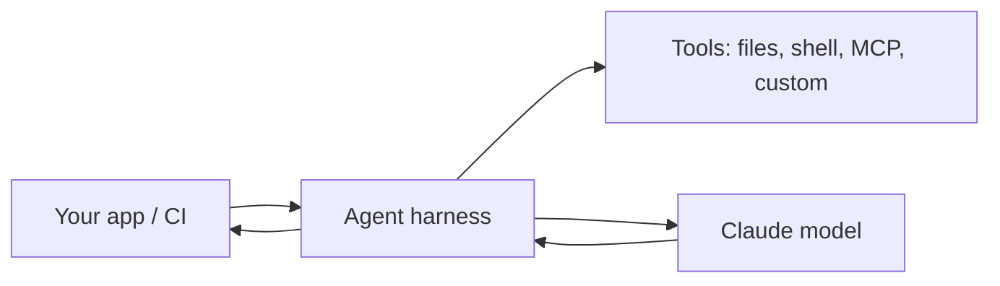

<LevelBadge level="advanced" />

<VerifyNote lastVerified="2026-06-20" source="https://code.claude.com/docs/en/sdk">
SDK names, package names, and headless flags evolve — confirm in the official Claude Agent SDK / Claude Code docs.
</VerifyNote>

Claude Code isn't only interactive. You can run it **headless** (non-interactive, scriptable) and you can build your **own agents** on the same underlying harness with the **Agent SDK**.

## Headless mode

Run a single prompt non-interactively and capture the output — perfect for scripts, pre-commit hooks, and CI:

```bash
claude -p "Review the staged diff and list any bugs as a Markdown checklist"
```

Pipe input in, get a result out. Combine with [permissions](/docs/claude-code/permissions) set to a safe, non-interactive posture so it never hangs waiting for approval — and **lock it down** so an automated run can't touch secrets (see [Hardening Autonomous Runs](/docs/security/hardening-autonomous-runs)).

A classic use: a CI job that has Claude review every pull request — see the [PR-review walkthrough](/docs/walkthroughs/pr-review-action).

## The Agent SDK

The **Claude Agent SDK** (Python and TypeScript) lets you build production agents on the same loop that powers Claude Code — tool use, file/shell access, permissions, context management — but wired into *your* application.



Reach for it when you've outgrown a single API call or a hand-rolled loop and want a batteries-included agent runtime. For the spectrum of options — single call → workflow → custom agent → managed — see [Building Agents on the API](/docs/api/building-agents).

## Headless/SDK vs interactive

| Mode | For |
|---|---|
| Interactive Claude Code | Day-to-day dev with a human in the loop |
| Headless (`claude -p`) | Scripts, pre-commit, CI one-offs |
| Agent SDK | Production agents embedded in your software |

## Next

- [GitHub Action that Reviews Every PR (walkthrough)](/docs/walkthroughs/pr-review-action)
- [Building Agents on the API](/docs/api/building-agents)
- [Hardening Autonomous Runs](/docs/security/hardening-autonomous-runs)
