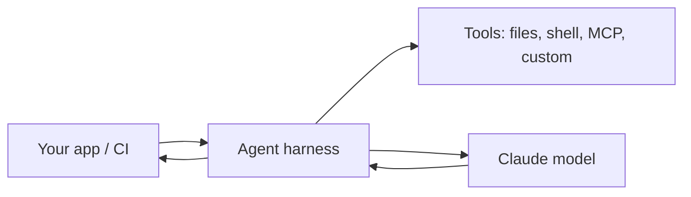

<LevelBadge level="advanced" />

<VerifyNote lastVerified="2026-07-17" source="https://code.claude.com/docs/en/agent-sdk/overview">
SDK names, package names, and headless flags evolve — confirm in the official Claude Agent SDK / Claude Code docs.
</VerifyNote>

Claude Code isn't only interactive. You can run it **headless** (non-interactive, scriptable) and you can build your **own agents** on the same underlying harness with the **Agent SDK**.

<Callout type="objectives" items={["How to run a single prompt non-interactively and capture its output","Why an unattended run needs a deliberate permission posture, not the interactive default","When you have outgrown a one-shot call and should reach for the Agent SDK instead","The three modes side by side, so you pick deliberately rather than by habit"]} />

## Headless mode

Run a single prompt non-interactively and capture the output — perfect for scripts, pre-commit hooks, and CI:

<PromptCard title="Review the staged diff from a script">
{`claude -p "Review the staged diff and list any bugs as a Markdown checklist"`}
</PromptCard>

Pipe input in, get a result out. Combine with [permissions](/docs/claude-code/permissions) set to a safe, non-interactive posture so it never hangs waiting for approval — and **lock it down** so an automated run can't touch secrets (see [Hardening Autonomous Runs](/docs/security/hardening-autonomous-runs)).

<Steps items={[
  {title: "Start with -p and a narrow prompt", body: "One prompt, one answer, exit. Everything a headless run needs is a flag, because there is no UI to ask you anything."},
  {title: "Decide the permission posture up front", body: "An interactive session asks you; a CI job has nobody to ask. Set explicit allow rules for the tools the task genuinely needs, and make sure an unanswerable prompt ends the run instead of stalling it."},
  {title: "Bound the run", body: "Cap the turns and the spend so a loop that goes wrong costs minutes and cents rather than hours and dollars."},
  {title: "Ask for structured output", body: "A script that parses prose is a script that breaks. Request JSON — or a schema — so the result is machine-readable by construction."},
  {title: "Harden what it can reach", body: "Secrets, network, and write access are the three things an unattended run should have least of. See Hardening Autonomous Runs."}
]} />

The exact flags for each step — and the traps in them — are in [The claude CLI: Flags That Change Outcomes](/docs/claude-code/cli-flags). A classic use of all of it together: a CI job that has Claude review every pull request — see the [PR-review walkthrough](/docs/walkthroughs/pr-review-action).

## The Agent SDK

The **Claude Agent SDK** (Python and TypeScript) lets you build production agents on the same loop that powers Claude Code — tool use, file/shell access, permissions, context management — but wired into *your* application.

```mermaid
flowchart LR
  A[Your app / CI] --> H[Agent harness]
  H --> T[Tools: files, shell, MCP, custom]
  H --> L[Claude model]
  L --> H --> A
```

Reach for it when you've outgrown a single API call or a hand-rolled loop and want a batteries-included agent runtime. For the spectrum of options — single call → workflow → custom agent → managed — see [Building Agents on the API](/docs/api/building-agents).

## Headless/SDK vs interactive

| Mode | For |
|---|---|
| Interactive Claude Code | Day-to-day dev with a human in the loop |
| Headless (`claude -p`) | Scripts, pre-commit, CI one-offs |
| Agent SDK | Production agents embedded in your software |

## Check yourself

<Quiz questions={[
  {
    q: "What is the defining difference between a headless run and an interactive session?",
    options: [
      "Headless uses a smaller model",
      "Headless cannot use tools",
      "There is nobody to answer a prompt, so the permission posture has to be decided in advance",
      "Headless runs skip CLAUDE.md"
    ],
    answer: 2,
    explain: "The harness is the same. What changes is that every decision an interactive session would hand to you has to be settled by configuration before the run starts — which is why an unattended run needs explicit permission, turn, and spend settings."
  },
  {
    q: "You have a one-shot `claude -p` call in CI, and now you want the same logic embedded in your own product with custom tools and your own permission handling. What do you reach for?",
    options: [
      "A longer -p prompt",
      "The Agent SDK, which exposes the same loop — tool use, file and shell access, permissions, context management — inside your application",
      "A second -p call that pipes into the first",
      "The Messages API with no agent loop"
    ],
    answer: 1,
    explain: "That is exactly the line between the two. A one-shot -p call is a script calling a CLI; the Agent SDK gives you the same harness as a runtime you embed and control. Building Agents on the API lays out the whole spectrum."
  }
]} />

<Callout type="takeaways" items={["Headless is the same harness with the human removed — so everything the human would have decided becomes configuration.","Narrow the permissions, bound the turns and spend, and ask for structured output. All four are flags, not conventions.","Graduate to the Agent SDK when you want the loop inside your own application rather than a CLI call from a script.","An unattended run is a security posture as much as a feature: harden what it can reach before you schedule it."]} />

## Next

- [The claude CLI: Flags That Change Outcomes](/docs/claude-code/cli-flags) — the five-flag contract for an unattended run
- [GitHub Action that Reviews Every PR (walkthrough)](/docs/walkthroughs/pr-review-action)
- [Building Agents on the API](/docs/api/building-agents)
- [Hardening Autonomous Runs](/docs/security/hardening-autonomous-runs)
