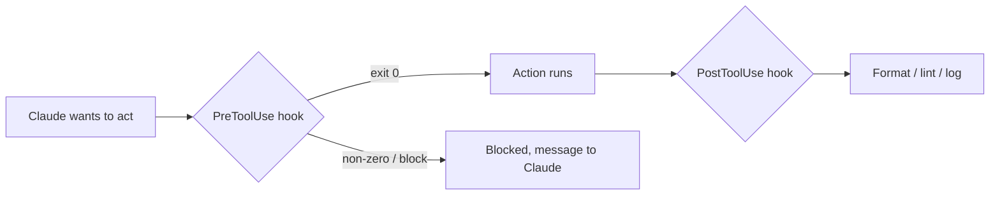

<LevelBadge level="advanced" />

<VerifyNote lastVerified="2026-06-23" source="https://code.claude.com/docs/en/hooks">
The exact hook event names, the stdin payload, and the blocking protocol evolve — confirm against the official hooks docs before relying on a specific event or field.
</VerifyNote>

Hooks are **shell commands Claude Code runs automatically** at defined points in its lifecycle. Where [permissions](/docs/claude-code/permissions) decide *whether* an action is allowed, hooks let *you* run deterministic logic around it — formatting, validation, logging, gates. They're how you make behaviour guaranteed instead of "please remember to."

## When to reach for a hook

- **Auto-format / lint** after every file edit (`PostToolUse`).
- **Block** an action that violates a rule before it runs (`PreToolUse`).
- **Notify or log** when a session ends or a task finishes (`Stop`).
- **Inject context** at session start.

## How they work

You register hooks in [`settings.json`](/docs/claude-code/settings), matching an **event** (and often a tool matcher). When the event fires, Claude runs your command, passing a **JSON payload on stdin** (the tool name, its inputs, the session). Your command's exit code and output decide what happens next.

```json
{
  "hooks": {
    "PostToolUse": [
      {
        "matcher": "Edit|Write",
        "hooks": [
          { "type": "command", "command": "jq -r '.tool_input.file_path' | xargs npx prettier --write" }
        ]
      }
    ]
  }
}
```

The hook above reads the edited file's path out of the stdin JSON (`.tool_input.file_path`) and formats it. Don't assume an env var holds the path — **read it from stdin.** Useful path placeholders like `${CLAUDE_PROJECT_DIR}` *are* available for locating scripts.

## How a hook blocks

Two ways, depending on the event:

- **Exit code 2** — the hook fails the action and whatever it wrote to **stderr** becomes the message Claude sees. Simple and works for command hooks.
- **JSON on stdout (exit 0)** — return a structured decision. For `PreToolUse`, that's a `permissionDecision` of `deny`; for `PostToolUse`/`Stop`/etc. it's `{"decision": "block", "reason": "…"}`.

```bash
#!/usr/bin/env bash
# PreToolUse hook on the Bash tool: refuse to delete things.
command=$(jq -r '.tool_input.command' < /dev/stdin)
if [[ "$command" == rm\ * || "$command" == *"rm -rf"* ]]; then
  echo "Blocked: destructive 'rm' is not allowed by policy." >&2
  exit 2
fi
exit 0
```

## The mental model



## Good practices

- **Keep hooks fast and idempotent** — they run a lot.
- **Fail loud on real problems**, but don't block on cosmetic issues.
- **Treat hook output as feedback to Claude** — a clear message helps it self-correct.
- Hooks run with your shell's privileges — review any hook you didn't write ([Reviewing Third-Party Code](/docs/security/reviewing-third-party-code)).

## Common mistakes

- **Reading the file path from an env var.** The path lives in the stdin JSON (`.tool_input.file_path`), not in `$CLAUDE_FILE_PATH`. Pipe stdin through `jq`.
- **Silent blocks.** If a `PreToolUse` hook exits 2 with nothing on stderr, Claude is blocked but doesn't know *why* and can't adapt. Always write a clear reason.
- **Slow hooks.** A `PostToolUse` hook runs after *every* matching edit. A 3-second linter makes the whole session feel sluggish — keep hooks fast and, ideally, only act on what changed.
- **Over-broad matchers.** `matcher: ".*"` fires on every tool. Narrow with an exact name, an `Edit|Write` list, or the per-handler `if` field (e.g. `"if": "Bash(git push *)"`).
- **Trusting hooks you didn't write.** A hook runs arbitrary shell with your privileges. Review any hook from a plugin or template first — see [Reviewing Third-Party Code](/docs/security/reviewing-third-party-code).

Copy-paste starters are in [Hooks & settings.json Recipes](/docs/templates/hooks-settings).

## Next

- [settings.json](/docs/claude-code/settings) · [Permissions](/docs/claude-code/permissions)
- [Skills](/docs/claude-code/skills) — expertise vs automation
- [Hardening Autonomous Runs](/docs/security/hardening-autonomous-runs)
