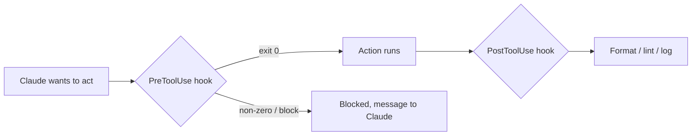

<LevelBadge level="advanced" />

<VerifyNote lastVerified="2026-06-20" source="https://code.claude.com/docs/en/hooks">
The exact hook event names and config schema evolve — confirm against the official hooks docs before relying on a specific event.
</VerifyNote>

Hooks are **shell commands Claude Code runs automatically** at defined points in its lifecycle. Where [permissions](/docs/claude-code/permissions) decide *whether* an action is allowed, hooks let *you* run deterministic logic around it — formatting, validation, logging, gates. They're how you make behaviour guaranteed instead of "please remember to."

## When to reach for a hook

- **Auto-format / lint** after every file edit (`PostToolUse`).
- **Block** an action that violates a rule before it runs (`PreToolUse`).
- **Notify or log** when a session ends or a task finishes (`Stop`).
- **Inject context** at session start.

## How they work

You register hooks in [`settings.json`](/docs/claude-code/settings), matching an **event** (and often a tool matcher). When the event fires, Claude runs your command and reads its result — a non-zero exit or specific output can **block** the action and feed a message back to Claude.

```json
{
  "hooks": {
    "PostToolUse": [
      {
        "matcher": "Edit|Write",
        "hooks": [
          { "type": "command", "command": "npx prettier --write \"$CLAUDE_FILE_PATH\"" }
        ]
      }
    ]
  }
}
```

The hook receives context (e.g. the file path, tool name) via environment/stdin — see the docs for the exact payload, which varies by event.

## The mental model



## Good practices

- **Keep hooks fast and idempotent** — they run a lot.
- **Fail loud on real problems**, but don't block on cosmetic issues.
- **Treat hook output as feedback to Claude** — a clear message helps it self-correct.
- Hooks run with your shell's privileges — review any hook you didn't write ([Reviewing Third-Party Code](/docs/security/reviewing-third-party-code)).

Copy-paste starters are in [Hooks & settings.json Recipes](/docs/templates/hooks-settings).

## Next

- [settings.json](/docs/claude-code/settings) · [Permissions](/docs/claude-code/permissions)
- [Skills](/docs/claude-code/skills) — expertise vs automation
- [Hardening Autonomous Runs](/docs/security/hardening-autonomous-runs)
