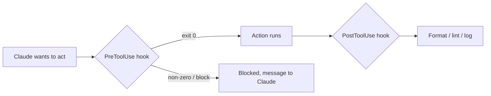

<LevelBadge level="advanced" />

<VerifyNote lastVerified="2026-08-22" source="https://code.claude.com/docs/en/hooks">
Claude Code documents 30+ hook events grouped by phase — the full list, per-event matcher grammar, and the universal JSON output fields are in the official hooks reference. Names and payload shapes evolve; confirm against the source before pinning a specific event or field.
</VerifyNote>

Hooks are **shell commands Claude Code runs automatically** at defined points in its lifecycle. Where [permissions](/docs/claude-code/permissions) decide *whether* an action is allowed, hooks let *you* run deterministic logic around it — formatting, validation, logging, gates, redaction. They're how you make behavior guaranteed instead of "please remember to."

<Callout type="objectives" items={["When to reach for a hook instead of an instruction, a permission, or a skill", "The full lifecycle: session, prompt, tool, subagent, task, compaction, and end-of-turn events", "How a hook is wired up: event, matcher, and the JSON payload on stdin", "The two ways a hook blocks an action — exit code 2 vs JSON on stdout", "The universal JSON output fields shared across events: continue, additionalContext, systemMessage, reloadSkills, sessionTitle, suppressOutput, updatedInput", "The good practices and common mistakes that separate fast, safe hooks from sluggish, silent ones"]} />

## When to reach for a hook

Reach for a hook when you want a behavior to be *guaranteed*, not merely requested. Each common job maps to a lifecycle event:

- **Auto-format / lint** after every file edit (`PostToolUse` on `Edit|Write`).
- **Block** an action that violates a rule before it runs (`PreToolUse`).
- **Redact** the assistant's message before it hits the terminal (`MessageDisplay`).
- **Reload skills** or set a **session title** after a `SessionStart`.
- **Notify or log** when a session ends, a task finishes, or a turn fails (`Stop`, `StopFailure`, `SessionEnd`).
- **Inject context** at session start or when instructions load.

## How they work

You register hooks in [`settings.json`](/docs/claude-code/settings), matching an **event** (and often a matcher — usually a tool name, sometimes a subagent type, a compaction trigger, or a notification kind). When the event fires, Claude runs your command, passing a **JSON payload on stdin** (the event name, the session, and event-specific fields like the tool name and inputs). Your command's exit code and stdout decide what happens next.

<Steps items={[{title: "Match an event", body: "Register the hook in settings.json under the lifecycle event you care about — for example PostToolUse for after-tool automation, or MessageDisplay for redaction."}, {title: "Narrow with a matcher", body: "Add a matcher so the hook only fires when relevant, e.g. matcher \"Edit|Write\" for file edits, or matcher \"startup|resume\" on SessionStart."}, {title: "Read the payload from stdin", body: "When the event fires, Claude runs your command and pipes a JSON payload on stdin — the event name, the session, and event-specific fields (tool_name, tool_input, notification, etc.)."}, {title: "Decide what happens next", body: "Your command's exit code and output determine the outcome: let the action proceed, run your logic, block it, or return structured JSON to change what Claude sees."}]} />

```json
{
  "hooks": {
    "PostToolUse": [
      {
        "matcher": "Edit|Write",
        "hooks": [
          { "type": "command", "command": "jq -r '.tool_input.file_path' | xargs npx prettier --write" }
        ]
      }
    ]
  }
}
```

The hook above reads the edited file's path out of the stdin JSON (`.tool_input.file_path`) and formats it. Don't assume an env var holds the path — **read it from stdin.** Useful path placeholders like `${CLAUDE_PROJECT_DIR}` *are* available for locating scripts.

## The lifecycle at a glance

Claude Code hooks span the whole session, not just tool calls. Group them by phase so you know where to hang your logic.

| Phase | Events | Typical use |
| --- | --- | --- |
| **Session** | `SessionStart`, `SessionEnd`, `Setup`, `InstructionsLoaded`, `ConfigChange`, `CwdChanged`, `DirectoryAdded`, `FileChanged` | Inject context on start, snapshot at end, react to a `CLAUDE.md` reload or a `.env` change on disk |
| **Prompt** | `UserPromptSubmit`, `UserPromptExpansion` | Gate or rewrite the prompt before Claude sees it |
| **Tool** | `PreToolUse`, `PermissionRequest`, `PermissionDenied`, `PostToolUse`, `PostToolUseFailure`, `PostToolBatch` | Allow/deny an action, escalate to a human, format after edits, retry after auto-mode denial |
| **Subagent** | `SubagentStart`, `SubagentStop` | Log spawn/stop, block a subagent from returning |
| **Task** | `TaskCreated`, `TaskCompleted` | Roll back an accidental task, gate completion |
| **Compaction** | `PreCompact`, `PostCompact` | Snapshot the transcript before compaction, verify after |
| **Turn** | `Stop`, `StopFailure`, `Notification`, `MessageDisplay` | Notify on completion, alert on API failure, redact displayed text |
| **Team + MCP** | `TeammateIdle`, `Elicitation`, `ElicitationResult`, `WorktreeCreate`, `WorktreeRemove` | Cross-session coordination, gate MCP elicitations, wrap worktree ops |

Each event's exact stdin fields, matcher grammar, and blocking rules are in the [official hooks reference](https://code.claude.com/docs/en/hooks). The catalog above is the map; the reference is the territory.

## How a hook blocks

Two ways, depending on the event:

- **Exit code 2** — the hook fails the action and whatever it wrote to **stderr** becomes the message Claude sees. Simple and works for command hooks on blocking events (`PreToolUse`, `UserPromptSubmit`, `PreCompact`, `SubagentStop`, `Stop`, `TaskCreated`, `TaskCompleted`, `TeammateIdle`, `Elicitation`).
- **JSON on stdout (exit 0)** — return a structured decision. For `PreToolUse`, that's a `permissionDecision` of `"allow"`, `"deny"`, or `"escalate"` with a `permissionDecisionReason`. Non-blocking events (`PostToolUse`, `Notification`, `MessageDisplay`, `StopFailure`, most session events) ignore blocking attempts — but their JSON output can still steer what Claude sees next.

The script below is a `PreToolUse` hook on the Bash tool. Read it top to bottom: it pulls the command out of stdin, and if it looks destructive, writes a reason to stderr and exits 2 to block.

```bash
#!/usr/bin/env bash
# PreToolUse hook on the Bash tool: refuse to delete things.
command=$(jq -r '.tool_input.command' < /dev/stdin)
if [[ "$command" == rm\ * || "$command" == *"rm -rf"* ]]; then
  echo "Blocked: destructive 'rm' is not allowed by policy." >&2
  exit 2
fi
exit 0
```

## Universal JSON output fields

Most events accept a structured JSON object on stdout that steers what happens next — separate from the event-specific decision fields like `permissionDecision`. The most useful ones:

| Field | What it does | Where it works |
| --- | --- | --- |
| **`continue`** | If `false`, Claude stops processing entirely — takes precedence over every event-specific decision | Most events |
| **`systemMessage`** | Adds a message to Claude's context / transcript so it sees why you acted | Most blocking events |
| **`additionalContext`** | Injects extra context Claude can read and act on next turn | `SessionStart`, `UserPromptSubmit`, others |
| **`reloadSkills`** | Re-scans skill directories so a session picks up a skill you just wrote | `SessionStart` (and other session events) |
| **`sessionTitle`** | Sets the session title in the UI — under `hookSpecificOutput` on `SessionStart` | `SessionStart` |
| **`suppressOutput`** | Hides the tool's output from Claude (useful for noisy commands) | Tool events |
| **`updatedInput`** | Rewrites the tool's input before it runs (e.g. add a `--dry-run` flag) | `PreToolUse` |
| **`terminalSequence`** | Emits terminal escape sequences — bell, window title, notification badge | `Notification`, `StopFailure`, others |

Event-specific decision fields — `permissionDecision` (`"allow" \| "deny" \| "escalate"` + `permissionDecisionReason`) on `PreToolUse` and `PermissionRequest`, and `retry: true` on `PermissionDenied` to let Claude try the denied call again — layer on top of these universal ones.

## The mental model

A `PreToolUse` hook runs *before* the action and can block it; a `PostToolUse` hook runs *after* it succeeds and reacts to the result.


```mermaid
flowchart LR
  A[Claude wants to act] --> B{PreToolUse hook}
  B -->|exit 0| C[Action runs]
  B -->|non-zero / block| X[Blocked, message to Claude]
  C --> D{PostToolUse hook}
  D --> E[Format / lint / log]
```

<Flashcards title="Hook events at a glance" cards={[{front: "PreToolUse", back: "Fires before an action runs. Use it to block or gate — e.g. refuse a destructive command before it executes. Decision field: permissionDecision."}, {front: "PostToolUse", back: "Fires after a matching action. Use it to format, lint, or log what just changed. Non-blocking."}, {front: "MessageDisplay", back: "Fires as assistant message text is displayed. Use it to redact secrets or PII from the terminal — display-only, cannot block."}, {front: "SessionStart", back: "Fires at the beginning (or resume) of a session. Use it to inject context via additionalContext, reloadSkills after a new skill lands, or set sessionTitle."}, {front: "Stop / StopFailure", back: "Stop fires when Claude finishes a turn cleanly; StopFailure fires when the turn ended on an API error (rate_limit, overloaded, auth, etc.). Notify or auto-retry on the failure variant."}, {front: "PreCompact / PostCompact", back: "Fire around context compaction. PreCompact can block (exit 2) or snapshot the transcript first; PostCompact reacts to the compacted state."}]} />

## Good practices

- **Keep hooks fast and idempotent** — they run a lot. `SessionEnd` hooks share a single 1.5-second budget across all of them, so keep end-of-session work minimal.
- **Fail loud on real problems**, but don't block on cosmetic issues.
- **Treat hook output as feedback to Claude** — a clear message on stderr (exit 2) or in `systemMessage` (JSON) helps it self-correct.
- **Prefer JSON output over exit codes** when you want to say more than "blocked" — `permissionDecision: "escalate"` on `PreToolUse` pushes to a human without slamming the door, and `additionalContext` lets you *steer* rather than only refuse.
- Hooks run with your shell's privileges — review any hook you didn't write ([Reviewing Third-Party Code](/docs/security/reviewing-third-party-code)).

## Common mistakes

- **Reading the file path from an env var.** The path lives in the stdin JSON (`.tool_input.file_path`), not in `$CLAUDE_FILE_PATH`. Pipe stdin through `jq`.
- **Silent blocks.** If a `PreToolUse` hook exits 2 with nothing on stderr, Claude is blocked but doesn't know *why* and can't adapt. Always write a clear reason (or use `permissionDecisionReason`).
- **Trying to block a non-blocking event.** `PostToolUse` fires *after* the tool ran — an exit 2 just puts a message in Claude's ear, it can't undo the action. If you need to gate, hook `PreToolUse`.
- **Slow hooks.** A `PostToolUse` hook runs after *every* matching edit. A 3-second linter makes the whole session feel sluggish — keep hooks fast and, ideally, only act on what changed.
- **Over-broad matchers.** `matcher: ".*"` fires on every tool. Narrow with an exact name, an `Edit|Write` list, or the per-handler `if` field (e.g. `"if": "Bash(git push *)"`).
- **Forgetting matchers exist for non-tool events too.** `SessionStart` matches `startup|resume|clear|compact|fork`; `Notification` matches kinds like `permission_prompt|idle_prompt|agent_completed`; `PreCompact` matches `manual|auto`. A single hook wired to the wrong subset fires either too often or never.
- **Trusting hooks you didn't write.** A hook runs arbitrary shell with your privileges. Review any hook from a plugin or template first — see [Reviewing Third-Party Code](/docs/security/reviewing-third-party-code).

<Callout type="warning" items={["A hook runs arbitrary shell with your privileges — never wire up a hook from a plugin or template without reading it first."]} />

## Recipes worth stealing

Copy-paste starters are in [Hooks & settings.json Recipes](/docs/templates/hooks-settings). A few high-leverage ones to see the shape of newer events:

<PromptCard title="Auto-format edited files (PostToolUse on Edit|Write)">{`{
  "hooks": {
    "PostToolUse": [
      {
        "matcher": "Edit|Write",
        "hooks": [
          { "type": "command", "command": "jq -r '.tool_input.file_path' | xargs npx prettier --write" }
        ]
      }
    ]
  }
}`}</PromptCard>

<PromptCard title="Set a per-project session title on start (SessionStart)">{`{
  "hooks": {
    "SessionStart": [
      {
        "matcher": "startup|resume",
        "hooks": [
          {
            "type": "command",
            "command": "jq -nc --arg t \\"$(basename \\"$PWD\\") — $(git rev-parse --abbrev-ref HEAD 2>/dev/null || echo detached)\\" '{hookSpecificOutput:{sessionTitle:$t}}'"
          }
        ]
      }
    ]
  }
}`}</PromptCard>

<PromptCard title="Reload skills after a SessionStart (picks up a skill you just wrote)">{`{
  "hooks": {
    "SessionStart": [
      {
        "matcher": "startup|resume",
        "hooks": [
          { "type": "command", "command": "printf '{\\"reloadSkills\\": true}\\n'" }
        ]
      }
    ]
  }
}`}</PromptCard>

<PromptCard title="Redact API keys from displayed assistant text (MessageDisplay)">{`{
  "hooks": {
    "MessageDisplay": [
      {
        "hooks": [
          {
            "type": "command",
            "command": "jq -r '.message.content' | sed -E 's/(sk-[A-Za-z0-9_-]{20,})/sk-***REDACTED***/g'"
          }
        ]
      }
    ]
  }
}`}</PromptCard>

<PromptCard title="Notify on turn failure (StopFailure — rate limits, overload, auth)">{`{
  "hooks": {
    "StopFailure": [
      {
        "matcher": "rate_limit|overloaded|authentication_failed|billing_error",
        "hooks": [
          { "type": "command", "command": "osascript -e 'display notification \\"Claude Code turn failed — check the terminal\\" with title \\"Claude Code\\"'" }
        ]
      }
    ]
  }
}`}</PromptCard>

<Quiz title="Check yourself" questions={[{q: "Where does a hook find the path of the file that was just edited?", options: ["In the $CLAUDE_FILE_PATH environment variable", "In the JSON payload on stdin, at .tool_input.file_path", "In a command-line argument passed by Claude"], answer: 1, explain: "The path lives in the stdin JSON (.tool_input.file_path), not in an env var. Pipe stdin through jq to read it."}, {q: "A PreToolUse hook exits with code 2. What happens?", options: ["The action is allowed and stdout is logged", "The action is blocked, and whatever the hook wrote to stderr becomes the message Claude sees", "Claude ignores the result because exit 2 is reserved"], answer: 1, explain: "Exit code 2 fails the action; stderr becomes the message Claude sees. Always write a clear reason so Claude can adapt."}, {q: "You want a session to pick up a skill you just added to .claude/skills/ without restarting. Which output field, on which event?", options: ["reloadSkills: true on SessionStart", "restart: true on Stop", "refresh: true on PostToolUse"], answer: 0, explain: "Emitting {\"reloadSkills\": true} from a SessionStart hook re-scans skill directories so the current session picks up new or edited skills."}, {q: "You want to redact secrets from Claude's text before it appears on the user's screen. Which event?", options: ["PreToolUse", "PostToolUse", "MessageDisplay"], answer: 2, explain: "MessageDisplay fires as assistant message text is displayed — the right place to transform or redact text on its way to the terminal. It cannot block."}]} />

<Callout type="takeaways" items={["Hooks make behavior guaranteed, not requested — deterministic logic around actions that permissions only allow or deny.", "The lifecycle spans 30+ events across session, prompt, tool, subagent, task, compaction, and turn phases — pick the right phase before writing the script.", "Register in settings.json against an event plus a matcher; Claude pipes a JSON payload on stdin and reads your exit code and output.", "Read the file path from stdin (.tool_input.file_path) — not from an env var.", "Block with exit code 2 (stderr becomes the message) or with structured JSON on stdout (permissionDecision on tool events, {continue: false} to stop everything).", "Universal output fields — additionalContext, systemMessage, reloadSkills, sessionTitle, suppressOutput, updatedInput — let you steer Claude rather than only allow or refuse.", "Keep hooks fast, idempotent, and narrowly matched — and review any hook you didn't write, since it runs with your shell's privileges."]} />

## Next

- [settings.json](/docs/claude-code/settings) · [Permissions](/docs/claude-code/permissions)
- [Skills](/docs/claude-code/skills) — expertise vs automation
- [Hardening Autonomous Runs](/docs/security/hardening-autonomous-runs)
