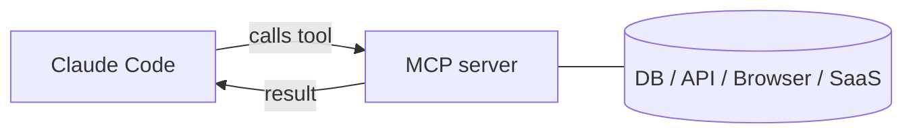

<LevelBadge level="advanced" />

<VerifyNote lastVerified="2026-06-20" source="https://code.claude.com/docs/en/mcp">
MCP configuration syntax, scopes, and transports evolve — confirm in the official Claude Code MCP docs and at modelcontextprotocol.io.
</VerifyNote>

The **Model Context Protocol (MCP)** is an open standard for connecting AI to external tools and data. An **MCP server** exposes capabilities (query a database, open a GitHub PR, drive a browser); Claude Code connects to it and can **call those tools** during a session. It's how you extend Claude beyond your filesystem and shell.

## The shape of it



You declare servers Claude may use; each server publishes a set of tools with schemas; Claude picks and calls them like any other tool.

## Transports

- **stdio** — a local process Claude launches (great for local tools/CLIs).
- **Remote (HTTP/SSE)** — a hosted server, often with OAuth.

## Configuring servers

Servers are configured (commonly in a `.mcp.json` and/or via settings) with a command/URL and any auth. Scopes control where a server is available (just you, or shared with the project). See [MCP Config & Server Scaffolds](/docs/templates/mcp-config) for copy-paste starters.

```json
{
  "mcpServers": {
    "github": { "command": "npx", "args": ["-y", "@modelcontextprotocol/server-github"] }
  }
}
```

## Trust & security

:::warning Treat MCP servers like installing software
An MCP server runs code and can read data and take actions. Only connect servers you trust, give them the **least privilege** needed, and remember that any external content they return can carry [prompt injection](/docs/security/prompt-injection). Review third-party servers first — see [Reviewing Third-Party Code](/docs/security/reviewing-third-party-code).
:::

## MCP in the apps too

MCP also powers **Connectors** in the Claude apps — same standard, different surface. See [Connectors (MCP) in the Apps](/docs/claude-app/connectors) and, for the API, [MCP & Connecting to Tools](/docs/api/mcp).

## Next

- [Build & Wire Your First MCP Server (walkthrough)](/docs/walkthroughs/first-mcp-server)
- [MCP Config & Server Scaffolds](/docs/templates/mcp-config)
- [Securing Agents & Tools](/docs/security/securing-agents)
