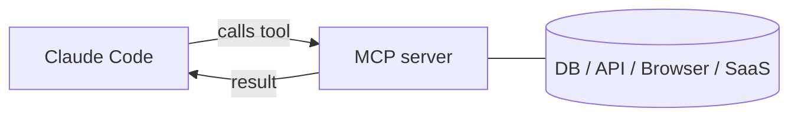

<LevelBadge level="advanced" />

<VerifyNote lastVerified="2026-06-23" source="https://code.claude.com/docs/en/mcp">
The `claude mcp` commands, configuration scopes, and transports evolve — confirm in the official Claude Code MCP docs and at modelcontextprotocol.io.
</VerifyNote>

The **Model Context Protocol (MCP)** is an open standard for connecting AI to external tools and data. An **MCP server** exposes capabilities (query a database, open a GitHub PR, drive a browser); Claude Code connects to it and can **call those tools** during a session. It's how you extend Claude beyond your filesystem and shell.

## The shape of it



You declare servers Claude may use; each server publishes a set of tools with schemas; Claude picks and calls them like any other tool.

## Transports

- **stdio** — a local process Claude launches (great for local tools/CLIs).
- **Remote (HTTP/SSE)** — a hosted server, often with OAuth.

## Configuring servers

The fastest path is the `claude mcp add` command — it writes the config for you:

```bash
# A local stdio server (everything after -- is the launch command)
claude mcp add github -- npx -y @modelcontextprotocol/server-github

# A remote HTTP server, shared with everyone on the project
claude mcp add --transport http --scope project linear https://mcp.linear.app/mcp
```

Under the hood that's just JSON. A **project**-scoped server lands in a `.mcp.json` at the repo root — check it in and your whole team gets the same tools:

```json
{
  "mcpServers": {
    "github": { "command": "npx", "args": ["-y", "@modelcontextprotocol/server-github"] }
  }
}
```

**Scope decides who sees the server:**

| Scope | Lives in | Use it for |
|---|---|---|
| `local` (default) | your user settings, this project only | personal experiments, secrets |
| `project` | `.mcp.json` in the repo (committed) | tools the whole team should share |
| `user` | your user settings, all projects | servers you want everywhere |

Run `claude mcp list` to see what's connected and `/mcp` inside a session to inspect tools and authenticate remote servers. See [MCP Config & Server Scaffolds](/docs/templates/mcp-config) for copy-paste starters.

## Worked example: give Claude your database

Say you want Claude to answer questions against a local Postgres instead of you pasting query results. Add the server (project scope, so teammates inherit it):

```bash
claude mcp add --scope project db -- npx -y @modelcontextprotocol/server-postgres "postgresql://localhost/app"
```

Now in a session you can ask: *"How many users signed up last week? Check the DB."* Claude calls the server's `query` tool, gets rows back, and answers — no copy-paste loop. Because it's project-scoped, a teammate who pulls the repo gets the same capability the moment they open Claude Code. Keep the connection string read-only if you only want reads.

## Trust & security

:::warning Treat MCP servers like installing software
An MCP server runs code and can read data and take actions. Only connect servers you trust, give them the **least privilege** needed, and remember that any external content they return can carry [prompt injection](/docs/security/prompt-injection). Review third-party servers first — see [Reviewing Third-Party Code](/docs/security/reviewing-third-party-code).
:::

## MCP in the apps too

MCP also powers **Connectors** in the Claude apps — same standard, different surface. See [Connectors (MCP) in the Apps](/docs/claude-app/connectors) and, for the API, [MCP & Connecting to Tools](/docs/api/mcp).

## Common mistakes

- **Wrong scope.** A server added at `local` scope won't appear for teammates; one you only wanted for yourself shouldn't be committed at `project` scope. Pick deliberately.
- **Too many servers, too many tools.** Each connected server adds its tool schemas to the context. Connect what the task needs, not your whole catalog.
- **Over-privileged connections.** Give a database server a read-only role unless Claude genuinely needs to write. MCP makes capabilities real — scope them down.
- **Forgetting the injection risk.** Anything a server returns (a web page, an issue body, a row) is untrusted text that can carry [prompt injection](/docs/security/prompt-injection). Don't wire a powerful write-capable server next to an untrusted read-capable one without thinking it through.

## Next

- [Build & Wire Your First MCP Server (walkthrough)](/docs/walkthroughs/first-mcp-server)
- [MCP Config & Server Scaffolds](/docs/templates/mcp-config)
- [Securing Agents & Tools](/docs/security/securing-agents)
