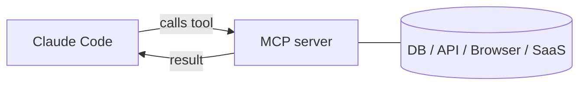

<LevelBadge level="advanced" />

<VerifyNote lastVerified="2026-06-23" source="https://code.claude.com/docs/en/mcp">
The `claude mcp` commands, configuration scopes, and transports evolve — confirm in the official Claude Code MCP docs and at modelcontextprotocol.io.
</VerifyNote>

The **Model Context Protocol (MCP)** is an open standard for connecting AI to external tools and data. An **MCP server** exposes capabilities (query a database, open a GitHub PR, drive a browser); Claude Code connects to it and can **call those tools** during a session. It's how you extend Claude beyond your filesystem and shell.

<Callout type="objectives" items={["Explain what an MCP server is and how Claude Code calls its tools", "Tell apart the two transports: local stdio vs remote HTTP/SSE", "Add a server with claude mcp add and read the JSON it writes", "Choose the right scope (local, project, user) for who sees a server", "Connect a real database to Claude end-to-end", "Avoid the security and configuration traps that bite most people"]} />

## The shape of it



You declare servers Claude may use; each server publishes a set of tools with schemas; Claude picks and calls them like any other tool.

<Flashcards title="MCP vocabulary" cards={[{front: "Model Context Protocol (MCP)", back: "An open standard for connecting AI to external tools and data."}, {front: "MCP server", back: "A program that exposes capabilities — query a database, open a GitHub PR, drive a browser — as callable tools."}, {front: "Tool", back: "A capability an MCP server publishes with a schema; Claude picks and calls it like any other tool."}, {front: "Transport", back: "How Claude reaches a server: stdio (local process) or remote HTTP/SSE (hosted, often with OAuth)."}, {front: "Scope", back: "Who sees a server: local (you, this project), project (the committed team), or user (you, everywhere)."}]} />

## Transports

There are two ways Claude reaches a server. Pick by where the server runs.

- **stdio** — a local process Claude launches (great for local tools/CLIs).
- **Remote (HTTP/SSE)** — a hosted server, often with OAuth.

## Configuring servers

The fastest path is the `claude mcp add` command — it writes the config for you. Follow this sequence to go from zero to a connected server.

<Steps items={[{title: "Add a local stdio server", body: "Run claude mcp add — everything after the -- is the launch command Claude runs for you."}, {title: "Or add a remote HTTP server", body: "Pass --transport http and a scope, then the server URL. Remote servers are often hosted and use OAuth."}, {title: "See what's connected", body: "Run claude mcp list to view configured servers and their connection status."}, {title: "Inspect and authenticate", body: "Use /mcp inside a session to inspect a server's tools and authenticate remote servers."}]} />

<PromptCard title="Add a local stdio server">{`# A local stdio server (everything after -- is the launch command)
claude mcp add github -- npx -y @modelcontextprotocol/server-github`}</PromptCard>

<PromptCard title="Add a remote HTTP server (shared with the project)">{`# A remote HTTP server, shared with everyone on the project
claude mcp add --transport http --scope project linear https://mcp.linear.app/mcp`}</PromptCard>

Under the hood that's just JSON. A **project**-scoped server lands in a `.mcp.json` at the repo root — check it in and your whole team gets the same tools:

```json
{
  "mcpServers": {
    "github": { "command": "npx", "args": ["-y", "@modelcontextprotocol/server-github"] }
  }
}
```

### Scope decides who sees the server

| Scope | Lives in | Use it for |
|---|---|---|
| `local` (default) | your user settings, this project only | personal experiments, secrets |
| `project` | `.mcp.json` in the repo (committed) | tools the whole team should share |
| `user` | your user settings, all projects | servers you want everywhere |

Run `claude mcp list` to see what's connected and `/mcp` inside a session to inspect tools and authenticate remote servers. See [MCP Config & Server Scaffolds](/docs/templates/mcp-config) for copy-paste starters.

## Worked example: give Claude your database

Say you want Claude to answer questions against a local Postgres instead of you pasting query results. Add the server (project scope, so teammates inherit it):

<PromptCard title="Add a Postgres server at project scope">{`claude mcp add --scope project db -- npx -y @modelcontextprotocol/server-postgres "postgresql://localhost/app"`}</PromptCard>

Now in a session you can ask the question in plain language and let Claude do the query loop for you:

<PromptCard title="Ask a question against the database">{`How many users signed up last week? Check the DB.`}</PromptCard>

Claude calls the server's `query` tool, gets rows back, and answers — no copy-paste loop. Because it's project-scoped, a teammate who pulls the repo gets the same capability the moment they open Claude Code. Keep the connection string read-only if you only want reads.

## Trust & security

<Callout type="warning" items={["An MCP server runs code and can read data and take actions — only connect servers you trust.", "Give each server the least privilege it needs.", "Any external content a server returns can carry prompt injection.", "Review third-party servers before connecting them."]} />

:::warning Treat MCP servers like installing software
An MCP server runs code and can read data and take actions. Only connect servers you trust, give them the **least privilege** needed, and remember that any external content they return can carry [prompt injection](/docs/security/prompt-injection). Review third-party servers first — see [Reviewing Third-Party Code](/docs/security/reviewing-third-party-code).
:::

## MCP in the apps too

MCP also powers **Connectors** in the Claude apps — same standard, different surface. See [Connectors (MCP) in the Apps](/docs/claude-app/connectors) and, for the API, [MCP & Connecting to Tools](/docs/api/mcp).

## Common mistakes

- **Wrong scope.** A server added at `local` scope won't appear for teammates; one you only wanted for yourself shouldn't be committed at `project` scope. Pick deliberately.
- **Too many servers, too many tools.** Each connected server adds its tool schemas to the context — a tax paid on every turn. Connect what the task needs, not your whole catalog. See [The MCP Token Tax](/docs/claude-code/mcp-token-cost) for the real numbers and how `defer_loading` and code execution cut them.
- **Over-privileged connections.** Give a database server a read-only role unless Claude genuinely needs to write. MCP makes capabilities real — scope them down.
- **Forgetting the injection risk.** Anything a server returns (a web page, an issue body, a row) is untrusted text that can carry [prompt injection](/docs/security/prompt-injection). Don't wire a powerful write-capable server next to an untrusted read-capable one without thinking it through.

<Quiz title="Check yourself" questions={[{q: "Which transport is a local process that Claude launches itself?", options: ["Remote HTTP/SSE", "stdio", "OAuth"], answer: 1, explain: "stdio is a local process Claude launches — ideal for local tools and CLIs. Remote HTTP/SSE is a hosted server, often with OAuth."}, {q: "Where does a project-scoped server get written, and what's the benefit?", options: ["Your user settings; only you see it", "A .mcp.json at the repo root; check it in and the whole team gets the same tools", "A hidden global cache; nobody can edit it"], answer: 1, explain: "Project scope lands in a committed .mcp.json at the repo root, so teammates who pull the repo inherit the same tools."}, {q: "Why keep a database connection read-only when Claude only needs to read?", options: ["It makes queries run faster", "Least privilege — MCP makes capabilities real, so don't grant write access unless it's genuinely needed", "Read-only is required by the protocol"], answer: 1, explain: "Give servers the least privilege they need. MCP makes capabilities real, so a read-only role avoids unintended writes."}]} />

<Callout type="takeaways" items={["MCP is an open standard; an MCP server exposes tools that Claude Code calls like any other tool.", "Two transports: local stdio (a process Claude launches) and remote HTTP/SSE (hosted, often OAuth).", "claude mcp add writes the config for you; under the hood it's JSON, and project scope lives in a committed .mcp.json.", "Scope controls visibility: local (you, this project), project (committed for the team), user (you, everywhere).", "Treat servers like installing software: trust, least privilege, and watch for prompt injection in anything they return."]} />

## Next

- [Build & Wire Your First MCP Server (walkthrough)](/docs/walkthroughs/first-mcp-server)
- [MCP Config & Server Scaffolds](/docs/templates/mcp-config)
- [Securing Agents & Tools](/docs/security/securing-agents)
