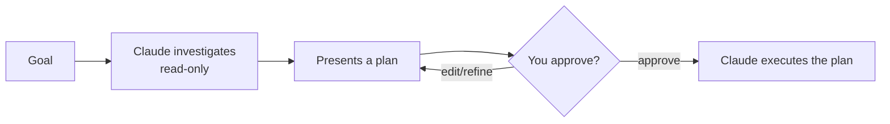

<LevelBadge level="beginner" />

<VerifyNote lastVerified="2026-06-20" source="https://code.claude.com/docs/en">
How you enter Plan Mode (shortcut/flag) can change between releases — check the official Claude Code docs.
</VerifyNote>

**Plan Mode** makes Claude Code **read-only**: it can explore your codebase, run searches, and reason — but it will **not edit files or run state-changing commands**. Instead it produces a plan and waits for your approval.

## Why it's the safest way to start

For anything big, risky, or unfamiliar, you want to see *what* Claude intends before it touches your repo. Plan Mode separates **thinking** from **doing**:

You catch wrong assumptions *before* they become wrong code.

## When to use it

- **Always** for large or multi-file changes, migrations, or refactors.
- When working in a codebase you don't fully know yet.
- When you want a reviewable plan to share with a teammate.

For tiny, obvious edits you can skip it — but when in doubt, plan first.

## How it works in practice

1. Enter Plan Mode and state your goal.
2. Claude reads relevant files and asks clarifying questions.
3. It returns a step-by-step plan: files to change, the approach, and how to verify.
4. You approve (or refine). Only then does it switch to making changes.

:::tip Pair it with CLAUDE.md
A good [CLAUDE.md](/docs/claude-code/claude-md) makes plans sharper — Claude plans with your conventions and guardrails already in mind.
:::

## Plan Mode vs Permissions

They solve different problems and work together:

- **Plan Mode** = "investigate and propose, don't act yet." (This page.)
- **[Permissions](/docs/claude-code/permissions)** = once acting, *which* actions are allowed without asking.

## Next

- [Permissions & Permission Modes](/docs/claude-code/permissions)
- [Context Management](/docs/claude-code/context-management) — keep long sessions effective
- [Walkthrough: Customize Claude Code for a real repo](/docs/walkthroughs/customize-claude-code)
