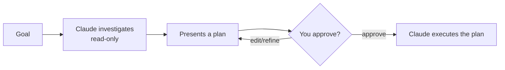

<LevelBadge level="beginner" />

<Callout type="objectives" items={["Explain what Plan Mode does and why it is read-only", "Decide when to plan first and when you can skip it", "Walk through the investigate-propose-approve-execute loop", "Tell Plan Mode and Permissions apart and use them together"]} />

<VerifyNote lastVerified="2026-06-20" source="https://code.claude.com/docs/en">
How you enter Plan Mode (shortcut/flag) can change between releases — check the official Claude Code docs.
</VerifyNote>

## The big idea

Imagine handing a contractor your house keys versus first asking them to walk through and write up *what* they'd change. Plan Mode is the walkthrough.

**Plan Mode** makes Claude Code **read-only**: it can explore your codebase, run searches, and reason — but it will **not edit files or run state-changing commands**. Instead it produces a plan and waits for your approval.

<Callout type="tip" items={["Read-only means Claude THINKS but does not ACT — no file edits, no state-changing commands, until you say go."]} />

## Why it's the safest way to start

For anything big, risky, or unfamiliar, you want to see *what* Claude intends before it touches your repo. Plan Mode separates **thinking** from **doing**:

The payoff: you catch wrong assumptions *before* they become wrong code.

## When to use it

<Callout type="tip" items={["ALWAYS for large or multi-file changes, migrations, or refactors", "When working in a codebase you don't fully know yet", "When you want a reviewable plan to share with a teammate"]} />

For tiny, obvious edits you can skip it — but when in doubt, plan first.

## How it works in practice

Follow the loop. Each step earns the next — Claude only switches to editing *after* you approve.

<Steps items={[{title: "Enter Plan Mode and state your goal", body: "Switch into read-only mode, then describe what you want to achieve."}, {title: "Claude investigates", body: "It reads the relevant files and asks clarifying questions."}, {title: "Claude returns a step-by-step plan", body: "Files to change, the approach, and how to verify the result."}, {title: "You approve or refine", body: "Only after approval does Claude switch to making changes."}]} />

### Try it yourself

Copy this into a real planning session and watch the loop play out:

<PromptCard title="Kick off a planning session">{`I want to migrate our auth from sessions to JWT. Stay in Plan Mode: investigate the current setup, ask anything you need, then propose a step-by-step plan with files to change and how to verify — don't edit anything yet.`}</PromptCard>

:::tip Pair it with CLAUDE.md
A good [CLAUDE.md](/docs/claude-code/claude-md) makes plans sharper — Claude plans with your conventions and guardrails already in mind.
:::

## Plan Mode vs Permissions

A classic mix-up. They solve different problems and work together:

- **Plan Mode** = "investigate and propose, don't act yet." (This page.)
- **[Permissions](/docs/claude-code/permissions)** = once acting, *which* actions are allowed without asking.

Think of it as **whether to act now** (Plan Mode) versus **which actions are allowed once acting** (Permissions).

<Flashcards cards={[{front: "What state does Plan Mode put Claude Code in?", back: "Read-only — it can explore, search, and reason, but will not edit files or run state-changing commands until you approve."}, {front: "What is the Plan Mode loop?", back: "Investigate (read-only) → present a plan → you approve or refine → Claude executes."}, {front: "When should you reach for Plan Mode?", back: "By default for big, risky, or unfamiliar work (multi-file changes, migrations, refactors, unknown codebases). Skip only tiny, obvious edits."}, {front: "Plan Mode vs Permissions?", back: "Plan Mode governs WHETHER to act now; Permissions govern WHICH actions are allowed once acting."}]} />

<Callout type="takeaways" items={["Plan Mode is read-only: Claude explores and proposes but never edits or runs state-changing commands until you approve", "Use it by default for big, risky, or unfamiliar work; skip only tiny obvious edits", "The loop is investigate to propose to approve/refine to execute", "Plan Mode governs WHETHER to act now; Permissions govern WHICH actions are allowed once acting"]} />

<Quiz title="Check yourself" questions={[{q: "What can Claude Code do while in Plan Mode?", options: ["Edit files and run any command", "Explore, search, and reason — but not edit files or run state-changing commands", "Only answer questions, with no file access at all"], answer: 1, explain: "Plan Mode is read-only: Claude can explore the codebase, run searches, and reason, but it will not edit files or run state-changing commands."}, {q: "When should you reach for Plan Mode?", options: ["Only for one-line typo fixes", "For large or multi-file changes, migrations, refactors, or unfamiliar codebases", "Never — it just slows you down"], answer: 1, explain: "Use it always for large or multi-file changes, migrations, or refactors, and when working in a codebase you don't fully know yet. Tiny obvious edits can skip it."}, {q: "What is the correct order of the Plan Mode loop?", options: ["Execute, then investigate, then approve", "Investigate (read-only), present a plan, you approve or refine, then Claude executes", "Approve first, then Claude investigates and edits"], answer: 1, explain: "Claude investigates read-only, presents a plan, you approve or refine, and only then does it switch to executing the plan."}, {q: "How do Plan Mode and Permissions differ?", options: ["They are two names for the same feature", "Plan Mode = investigate and propose, don't act yet; Permissions = once acting, which actions are allowed without asking", "Permissions decide whether to plan; Plan Mode decides which files to edit"], answer: 1, explain: "Plan Mode separates thinking from doing. Permissions control which actions are allowed without asking once Claude is acting. They work together."}]} />

## Next

- [Permissions & Permission Modes](/docs/claude-code/permissions)
- [Context Management](/docs/claude-code/context-management) — keep long sessions effective
- [Walkthrough: Customize Claude Code for a real repo](/docs/walkthroughs/customize-claude-code)
