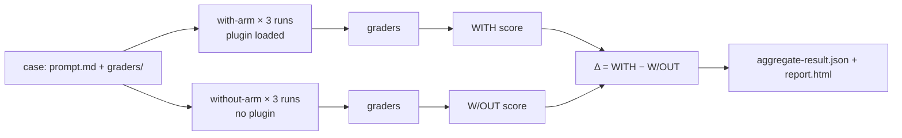

<LevelBadge level="advanced" />

<VerifyNote lastVerified="2026-09-14" source="https://code.claude.com/docs/en/plugin-evals">
`claude plugin eval` shipped in Claude Code **v2.1.269 (September 11, 2026)** and is documented as a young feature: the case schema is `1.1`, the JSON result is `schemaVersion: 1`, and Anthropic can switch the command off server-side ("plugin eval is currently unavailable"). Defaults, flags, and grader semantics below are from the official page on the date shown; re-check before wiring a hard CI gate.
</VerifyNote>

<Callout type="objectives" items={[
  "Understand what a plugin eval measures that `claude plugin validate` and a manual test cannot: does the skill *trigger*, and does it beat a bare model",
  "Read the three numbers in every result — WITH, W/OUT, and Δ — and know why some graders are deliberately excluded from the score",
  "Pick among the six grader types (four free, two judge-based) and write rubrics that give a stable signal",
  "Mock a plugin's MCP servers so a suite is repeatable and never touches the real service",
  "Wire a CI gate with pinned models, a cost ceiling, and the exit-code contract"
]} />

Until now a plugin author had two tools: `claude plugin validate`, which checks that manifests and frontmatter parse, and their own eyes. Neither answers the question that decides whether a plugin is worth installing: **when a user types a natural request, does Claude pick the skill, and is the result better than what Claude would have done anyway?** `claude plugin eval` answers exactly that. It runs each case in a throwaway session with only your plugin loaded, runs it again with no plugin at all, grades both, and reports the difference.

This page is for people who already have a working [plugin](/docs/claude-code/plugins-marketplaces) or [skill](/docs/claude-code/skills). If you only need to know the concept, read the first two sections and the quiz.

## The mental model: two arms and a delta

Every case is a **prompt** plus one or more **graders**. A grader is a pass/fail check on what Claude produced. For each case Claude Code runs:

- the **with-arm**: a fresh headless session with only your plugin loaded, the prompt sent, Claude allowed to work until it finishes or hits the turn/time cap, then graders applied;
- the **without-arm**: the same prompt, same number of runs, no plugin.

Each arm runs the case **three times by default**, because a single run of a non-deterministic agent tells you almost nothing. A run's score is the fraction of graders that passed (weighted, if you set weights). The case's score is the mean across runs. You get:

| Column | Meaning |
|---|---|
| `WITH` | Mean score with the plugin loaded |
| `W/OUT` | Mean score with no plugin |
| `Δ` | `WITH − W/OUT` — what the plugin actually contributed |

The non-obvious part: **a high `WITH` score alone proves nothing.** If a case scores 1.0 in both arms, Claude solved it without you, and your plugin is dead weight for that prompt. The Δ is the number that justifies a plugin's existence. Anthropic's own docs name the most common first finding: a Δ near zero *with* a failing skill-fired grader, which means Claude never chose your skill on natural phrasing. That is a `description` problem in `SKILL.md`, not a code problem, and no amount of manual testing where you invoke the skill by name would have caught it.



### Why some graders are excluded from the score

A check like "the `Skill` tool was invoked" can never pass in the without-arm. If it counted, it would drag `W/OUT` toward zero and inflate Δ for free. So in a two-arm run Claude Code **excludes from the score, in both arms**, every `tool_used` grader whose `tool` is `Skill`, plus anything you mark `arm: with-only`. They still appear in the report as pass/fail indicators (the report badges them as a "plugin-fired indicator"), and the JSON marks them `scored: false`. Two edge rules follow:

- If *every* grader in a case would be excluded, they are scored normally instead, otherwise there would be nothing left to score.
- `arm: both` forces a grader to count in both arms. That is what you want for a "must **not** invoke the skill" check on a decoy prompt, written as `tool_used` with `min: 0` and `max: 0`.

Consequence worth remembering: the same suite can report a **different absolute score** under `--ablation none` (single arm, nothing excluded) than under the default two-arm mode. Compare like with like when you chart trends.

## Anatomy of a case

A suite lives in `evals/` inside the plugin (or another directory you name). Each case is a folder holding a `prompt.md`, a `case.yaml`, or both, plus a `graders/` folder with one Markdown file per grader.

```text
my-plugin/
├── .claude-plugin/plugin.json
├── skills/...
└── evals/
    ├── drafts-commit-message/
    │   ├── prompt.md            # frontmatter: run limits; body: the user's request
    │   └── graders/
    │       ├── criteria.md      # type: llm — rubric in the body
    │       └── skill-fired.md   # type: tool_used, tool: Skill
    ├── ignores-unrelated-request/
    │   └── ...
    ├── mocks/                   # optional suite-wide MCP mocks
    └── results/                 # written by each run — add to .gitignore
```

The prompt body is sent to Claude **exactly as written**. Two things bite first-time authors:

- Each run starts in an **empty working directory** with a throwaway home, no user settings, no `CLAUDE.md`, no personal MCP servers, no other plugins, and only an allowlist of environment variables (basics like `PATH`, provider auth, most `ANTHROPIC_*`/`CLAUDE_CODE_*`, and anything named `EVAL_*`). If the task needs files, put them in the prompt, scaffold them, or ship them in the plugin.
- `@path` mentions in the prompt are **not** expanded into attachments. Grant `Read` in `allowed_tools` if Claude must open a file.

The `prompt.md` frontmatter fields that matter most:

| Field | Default | Note |
|---|---|---|
| `runs` | 3 | 1 to 50 per arm; `--runs` overrides |
| `max_turns` | 10 | Up to 200. Hitting it is logged as a run error and usually lowers the score, so be generous |
| `timeout_seconds` | 300 | Up to 3600 per run |
| `allowed_tools` | `[]` | Read-only tools are granted just by listing them; anything else needs a CLI grant |
| `model` | session default | `--model` overrides; pin it in CI |
| `env` | `{}` | Keys must match `EVAL_[A-Z0-9_]*` or the run fails |
| `plugins` | nearest enclosing plugin | Set `["../.."]` if auto-detection misses your plugin |

`case.yaml` carries the same fields (execution ones under `execution:`) plus the three that reference other files: `context.scaffold_script` (a Bash script that seeds the workspace, only run with `--scaffold`), `context.history_file` (a `.jsonl` transcript to resume, so your prompt becomes the next turn), and `context.add_dirs` (fixture directories Claude may read).

## The six grader types

Four are computed from the transcript and files and cost nothing. Two call a judge model and add to the bill.

| Type | Free? | Passes when |
|---|---|---|
| `regex` | yes | A JavaScript regex is found in the target (`last_message` by default, or `trace`, `files`, a specific file, or `mock_calls`). `match: not_contains` for absence, `match: "count:N"` for an exact count. Case-insensitivity goes in `flags: i`; inline `(?i)` is not supported |
| `tool_used` | yes | Calls to `tool` whose JSON-encoded input matches `input_match` number between `min` (default 1) and `max` (unlimited). `min: 0, max: 0` asserts a tool was never called |
| `tool_order` | yes | Both tools were called and the first `before` match precedes the first `after` match |
| `file_exists` | yes | A file **Claude created** matches the `path` glob (or none does, with `exists: false`). Files a scaffold created or Claude merely edited do not count |
| `llm` | no | A judge model votes PASS on your rubric in at least **two of three votes** |
| `baseline` | no | A judge finds the run satisfies the criteria at least as well as a reference transcript you saved as `baseline_file` |

There are **no custom-code graders**. If you need to check that a build or test passed, have the prompt tell Claude to run it and write the outcome to a file, grade that file with `regex`, and assert the command ran with a `tool_used` grader whose `input_match` names it.

The skill-fired grader that almost every case wants looks like this (replace the skill name; the pattern also matches the namespaced `plugin:skill` form):

<PromptCard title="graders/skill-fired.md — did my skill actually run?">{`---
type: tool_used
tool: Skill
input_match: '"skill"\\s*:\\s*"(?:[\\w-]+:)?your-skill-name"'
---`}</PromptCard>

And the judge rubric next to it, written as concrete PASS/FAIL conditions rather than adjectives:

<PromptCard title="graders/criteria.md — a rubric that gives a stable verdict">{`---
type: llm
weight: 2
---

PASS if the reply is a single conventional-commit subject line under 72 characters,
starts with "refactor:", and mentions both the rename (getUser -> fetchUser) and the
number of call sites updated.
FAIL if the reply contains more than one candidate message, asks a clarifying
question, or omits the rename.`}</PromptCard>

### Habits that keep scores stable

These are the practices the official docs recommend, and they match what anyone who has run LLM-as-judge pipelines learns the hard way:

- **Grade long output with `regex` over the file, not with an `llm` judge.** Judge variance grows with the length of what it reads. Keep `llm` graders for short final messages.
- **One grader on the result, one on the path.** A `regex`/`llm`/`file_exists` grader tells you the answer was right; a `tool_used`/`tool_order` grader tells you *your plugin* produced it. You need both to interpret Δ.
- **Suspect the judge before the plugin when Δ is negative but the skill fired.** The default judge is a small fast model; it can fail a correct answer for being formatted differently from the rubric. Re-run with `--judge-model sonnet` and tighten the rubric so formatting does not decide.
- **Iterate on one case with one arm**, then confirm at three runs: `--case <name> --runs 1 --ablation none`. With one arm the table shows `SCORE` and `PASS%` instead of `WITH`/`W/OUT`/`Δ`.

## Mock the MCP servers

If your plugin's skills call MCP tools, a run **never starts the real servers unless you ask**. Instead Claude Code registers a stand-in under each server's name and answers tool calls from Markdown files: `evals/mocks/<server>/<tool>.md` for the whole suite, or a case's own `mocks/` folder to override per case. The file body is the tool result, with `{{input.<field>}}` substitutions and `{{file:fixtures/...}}` inserts. A tool with no mock file simply is not available to Claude.

<PromptCard title="evals/mocks/tracker/create_issue.md — a mock that also asserts the input">{`---
expect:
  title: string
  priority: [low, medium, high]
---

Created issue #4821: {{input.title}}`}</PromptCard>

The `expect:` block turns a mock into an assertion: a call that violates it **aborts the run with score 0** and records the server, tool, and reason. Point a grader at `target: mock_calls` to grade what the plugin asked the server to do. For servers whose answers depend on conversation, `type: agent` lets a small model play the server; clean runs save its answers under `results/<timestamp>/mock-recordings/`, and once you copy a recording into `mocks/.replay/<server>/` later runs replay it with no model call. Commit `.replay/` so CI is deterministic. `_tools.json` (a saved `tools/list` response) gives mocked tools their real descriptions and schemas instead of a permissive placeholder.

To hit real servers instead: `--allow-real-servers` starts the ones without mocks; `--mocks off` ignores mocks entirely. Either way those processes run **as you, outside the sandbox**, and their tools still need an explicit grant such as `--allow-tools "mcp__plugin_my-plugin_github__*"`.

## Running it

<Steps items={[
  {title: "Generate the suite", body: "From the plugin root run `claude plugin eval init`. It opens an interactive session in which Claude reads the plugin, asks what a good result looks like, proposes prompts that should and should not trigger it, designs graders, pilots them once, and writes one case directory per prompt. `claude plugin eval init --bare <name>` writes a blank template instead (the only form that works without a terminal, e.g. in CI)."},
  {title: "Run the whole suite", body: "`claude plugin eval .` runs every case, both arms, three runs each. The first run asks `Trust this plugin directory?`; inside a git repo, saying yes trusts the whole repository, for interactive sessions too. A progress line prints per run with each grader's verdict; a summary table and a `Report:` path follow."},
  {title: "Grant only what cases need", body: "Runs never stop to ask for permission. Built-in tools that need a grant you did not give (`Bash`, `Write`, `Edit`, `WebFetch`, `WebSearch`) are removed from the session entirely. Grant them for the whole run: `--allow-tools Write Edit \"Bash(npm test *)\"`. Any Bash grant runs under Claude Code's OS-level sandbox; on a machine with no sandbox backend (native Windows) the run is refused rather than run unconfined."},
  {title: "Read the report", body: "`report.html` is one self-contained file with no external requests. Top: a verdict line (plugin effect in points vs baseline, cases improved/flat/regressed) and five tiles (suite score, ablation Δ, baseline score, cases passing, perfect runs). Each case card shows Δ and a score bar with a tick at the threshold; a negative Δ gets a red left edge. Failed graders come pre-expanded with the judge's votes and the excerpt it saw."},
  {title: "Decide where the report goes", body: "Signed in with a claude.ai subscription and artifacts enabled, the report is also published as a private artifact and a `Published:` URL is printed; `--no-publish` keeps it local. API-key auth never publishes. A run started from inside a Claude Code session stays local unless you add `--publish-report`."}
]} />

The full-suite command with the flags you will actually reach for:

<PromptCard title="Run the suite with a stronger judge and a cost ceiling">{`claude plugin eval . \\
  --judge-model sonnet \\
  --max-cost-usd 10 \\
  --allow-tools Read Write "Bash(npm test *)" \\
  -j 4`}</PromptCard>

Notes on the flags: `-j`/`--concurrency` goes from 1 to 8 and only shortens wall-clock time, because all runs share your account's rate limit. `--max-cost-usd` is a ceiling on the **list-price estimate**, checked before each run starts; runs already in flight finish, so spend can overshoot by those runs, and anything left unstarted makes the command exit 2 with `partial: true`. Put the target (`.`) **before** `--tag`, `--allow-tools`, and `--json`: each of those takes a list or optional value and would swallow a target that follows it (the error "`--json` output path must end in `.json`" is that mistake).

## What it costs

Every run and every judge vote is a real model call on your account, counted against your plan's usage or your API bill. The rough arithmetic: `cases × runs` agent runs for the with-arm, the same again for the without-arm, plus **three short judge calls per `llm` or `baseline` grader per run**. The official walkthrough's single case with two graders (one `llm`, one `tool_used`) ran six agent runs in 74 seconds at a list-price estimate of about $0.41. Three levers keep a suite affordable:

- `--ablation none` halves the agent runs when you are iterating on graders and do not need Δ.
- Free graders only (`regex`, `tool_used`, `tool_order`, `file_exists`) for the every-commit suite; judge graders for the nightly one.
- A usage-limit or rate-limit error mid-suite makes each later run **end with that error and usually score 0, and the suite is not marked `partial`**, so a throttled run can look exactly like a regression. Check the `NOTES` column or `cases[].arms.with[].error` before believing a sudden drop.

## Gate CI on it

<PromptCard title="CI job — pinned models, local report, exit code drives the build">{`claude plugin eval . \\
  --trust-plugin \\
  --json results.json \\
  --threshold 0.8 \\
  --model claude-sonnet-5 \\
  --judge-model claude-haiku-4-5 \\
  --no-publish \\
  --max-cost-usd 20`}</PromptCard>

Why each flag is there:

- `--trust-plugin` asserts the first-run trust decision. Without it a non-interactive job is refused with exit 1 (or hangs at the prompt if the runner allocates a TTY). Pass it only for plugins whose code and suite you would run on your own machine.
- `--model` and `--judge-model` are **pinned** so a model rollout is never mistaken for a plugin regression. This matters more than it sounds: the agent under test defaults to `ANTHROPIC_MODEL` or Claude Code's current default, which changes with releases.
- `--threshold 0.8` because the default is **1.0**, which makes the command exit 1 whenever any case is less than perfect. A 1.0 bar on a three-run mean of a non-deterministic agent is a flaky gate.
- `--json results.json` writes the versioned result document (`schemaVersion: 1`, camelCase, new fields added without renames) and silences progress output.

The exit-code contract:

| Exit | Meaning |
|---|---|
| 0 | Every case at or above the threshold and every case file loaded |
| 1 | A case below threshold, a case file failed to load, no cases found, a run could not start, untrusted directory without `--trust-plugin`, or an invalid option |
| 2 | Partial run: cost ceiling hit, or credential rejected at or before the first run. `results.json` still written with `partial: true` |
| 130 / 143 | Interrupted / terminated (e.g. CI timeout). Partial results written |

Report-writing or publishing problems **never** change the exit code. When charting trends, drop documents with `partial: true` and runs flagged `skippedPaidGraders`, since their scores are not comparable.

Fields a gating script reads from the JSON: `aggregates.overallScore`, `aggregates.casesPassed` / `casesTotal`, `aggregates.meanDelta`, and per case `cases[].aggregates.score` and `.delta` (omitted when arms are not comparable). A run with a non-null `cases[].arms.with[].error` (e.g. `timed out after 300s`) is still graded on what it produced, so an error does not imply score 0; an `aborted` run (a mock's `expect:` fired) scores 0 with `error` still `null`.

## What a run can and cannot reach

Read this before evaluating a plugin you did not write. Pointing `claude plugin eval` at a directory is the same trust decision as `claude --plugin-dir`: the plugin's skills **and hooks** load and run on your machine as you. The isolation limits what the *agent under test* can do; it is not a boundary against the plugin's own code, and a passing suite says nothing about whether the plugin is safe.

- **Isolated agent.** Each run gets a throwaway home, working directory, and Claude Code config, runs as a `claude -p` child, cannot read the eval directory (so it never sees the prompts or graders of the case or its siblings), and has the Artifact tool switched off.
- **Managed settings still apply.** Restrictions an administrator deployed to the machine apply inside a run, so results on a managed laptop can differ from an unmanaged CI runner.
- **Opt-in escape hatches.** A case's `scaffold_script` runs as you, outside the sandbox, and only with `--scaffold`. Real MCP servers only with `--allow-real-servers` or `--mocks off`. A case's `allowed_tools` or a skill's own `allowed-tools` frontmatter can never widen these.
- **Network.** Shell commands you grant follow the sandbox's network rules; a `WebFetch(domain:…)` grant reaches that domain directly; the plugin's hooks and any real MCP server you start can reach any host.

For a third-party plugin that ships hooks or needs its real servers, treat the scores as advisory unless you ran the suite in a container or on a CI runner. See [Reviewing Third-Party Code](/docs/security/reviewing-third-party-code) for the broader checklist.

## Quick reference: the gotchas

- Default `target` for `regex` is `last_message`. When you target `trace`, it is JSON per line, so quotes appear as `\"` and newlines are escaped.
- `files` is a **list of paths** Claude created, not their contents. To grade contents, use `{ source: file, path: <path> }` as `target`/`focus`. An `llm` judge sees PNG/JPEG/GIF/WebP as images and refuses other binaries (`.pptx`, PDF).
- An `llm` judge reading `trace` sees only the **first 12 and last 12 messages**.
- `file_exists` sees only files created during the run. A scaffolded or merely edited file is invisible to it; grade its contents or use `tool_used` on `Edit`.
- Unknown keys in `prompt.md` frontmatter are an error, and `env` keys must be `EVAL_*`.
- Evaluating an installed plugin by name (`name@marketplace`) writes results under `./evals/results/` in your current directory and skips the trust prompt.
- The plugin-eval case format is **separate** from the `evals/evals.json` file the skill-creator plugin uses for skill evals.

<Flashcards cards={[
  {front: "with-arm / without-arm", back: "The two sets of runs for a case: with only your plugin loaded, and with no plugin. Δ is with-arm score minus without-arm score."},
  {front: "Why is `tool_used: Skill` not scored?", back: "It can never pass without the plugin, so counting it would drag W/OUT to zero and inflate Δ. It is excluded in both arms and shown as a plugin-fired indicator."},
  {front: "Default threshold", back: "1.0 — any case below perfect makes the command exit 1. Set `--threshold` to your real bar in CI."},
  {front: "Judge vote rule", back: "An `llm` grader passes when the judge votes PASS in at least two of three votes; a `baseline` grader compares against a saved reference transcript."},
  {front: "Exit code 2", back: "Partial run: the --max-cost-usd ceiling was hit or the credential was rejected. results.json is still written with partial: true."},
  {front: "Mock `expect:` block", back: "Input guard on a mocked MCP tool. A violating call aborts the run with score 0 and records server, tool, and reason."},
  {front: "EVAL_* variables", back: "The only custom environment variables that reach a run. Everything else from your shell is withheld except a small allowlist."}
]} />

<Quiz title="Check yourself" questions={[
  {q: "A case scores 1.00 WITH and 1.00 W/OUT. What does that tell you?", options: ["The plugin works perfectly", "Claude solves this prompt without the plugin, so the plugin adds nothing here", "The graders are broken", "The judge model is too weak"], answer: 1, explain: "Δ is zero. A high with-arm score alone never proves the plugin helped; only the difference between arms does."},
  {q: "Your CI job runs `claude plugin eval . --json results.json` with no other flags and exits 1 although every case scored 0.9. Why?", options: ["JSON mode always exits 1", "The default --threshold is 1.0, so 0.9 is a failure", "The plugin directory was trusted", "--json disables scoring"], answer: 1, explain: "The default threshold is perfect (1.0). Pass --threshold 0.8 or whatever your bar is. Also pass --trust-plugin in CI, or the untrusted-directory check exits 1 too."},
  {q: "Which grader types cost nothing extra to run?", options: ["llm and baseline", "regex, tool_used, tool_order, file_exists", "Only regex", "All six are free"], answer: 1, explain: "Four graders are computed from the transcript and files. llm and baseline each add three short judge calls per run."},
  {q: "Δ is negative but the skill-fired grader passed on every with-arm run. What does the official guidance say to check first?", options: ["Delete the plugin", "Raise max_turns", "The judge: re-run with --judge-model sonnet and tighten the rubric so formatting does not decide", "Add more cases"], answer: 2, explain: "A small judge can fail a correct answer for being formatted differently from the rubric. Suspect the judge before the plugin."},
  {q: "A run's mocked MCP tool receives a call whose input violates the mock's `expect:` block. What happens?", options: ["The call returns an error string and the run continues", "The run aborts with score 0 and the reason is recorded", "The grader is skipped", "The real server is started as a fallback"], answer: 1, explain: "expect: is an assertion. A violating call aborts the run, scores 0, and appears as `aborted` with server, tool, and reason in the JSON."},
  {q: "Which of these does the agent under test have access to during a run?", options: ["Your ~/.claude settings and CLAUDE.md", "Your personal MCP servers", "The case's prompt and graders", "Read-only tools listed in the case's allowed_tools, plus whatever you granted with --allow-tools"], answer: 3, explain: "Runs are isolated: throwaway home and config, no personal settings, no other plugins, and the eval directory is hidden from the agent."}
]} />

## Sources & further reading

- [Test plugins with evals](https://code.claude.com/docs/en/plugin-evals) — the official reference this page is built on: case format, grader table, options, exit codes, isolation
- [Plugins reference: `plugin eval` and `experimental.evals`](https://code.claude.com/docs/en/plugins-reference#plugin-eval)
- [Claude Code changelog, v2.1.269 (Sept 11, 2026)](https://code.claude.com/docs/en/changelog) — the release entry
- [Skills: frontmatter and how the `description` decides triggering](https://code.claude.com/docs/en/skills)
- [Sandboxing](https://code.claude.com/docs/en/sandboxing) — the OS-level sandbox applied when you grant Bash to a run
- [Headless mode](https://code.claude.com/docs/en/headless) — the `claude -p` child each run is built on

## Next

- [Plugins & Marketplaces](/docs/claude-code/plugins-marketplaces) — package what you just tested, and publish it once the suite is green
- [Skills](/docs/claude-code/skills) — the `description` field is what a failing skill-fired grader is telling you to fix
- [Reviewing Third-Party Code](/docs/security/reviewing-third-party-code) — before you run someone else's plugin (and its hooks) through an eval on your machine
